[TOC]


# 概述

泛型算法: 这些算法是通用的, 可用于不同类型的容器和不同类型的元素

1.   **大多数算法定义在头文件algorithm**

2.   **头文件numberic定义了一组数值泛型算法**


-   ==算法并不直接操作容器, 而是遍历有**两个迭代器指定的一个元素范围**, 对其中每个元素进行一些处理==

-   这些步骤都不依赖容器所保存的元素类型, 只要有一个迭代器可用来访问元素, 这些算法就不完全依赖于容器类型(甚至无需理会保存元素的是不是容器, 只要有迭代器)
-   迭代器令算法不依赖于容器
-   但是算法依赖于元素类型的操作
-   算法永远不会执行容器的操作
    -   只执行迭代器的操作
    -   永远不会改变底层容器的大小


# 初识泛型算法

1.   比起死记硬背算法, 理解此结构更容易学习和使用这些算法
2.   多数标准库算法对一个范围内的元素进行操作
     1.   =="输入范围", 接受输入范围的算法总是使用前两个参数表示此范围, 分别是指向要处理的第一个元素和尾元素之后位置的迭代器==
3.   理解算法的最基本的方法就是了解它们是否读取元素、改变元素或是重排元素顺序
4.   对于只读取而不改变元素的算法, 最好使用cbegin()和cend(), 如果需要使用算法返回的迭代器改变元素的值, 就用begin(), end()
5.   只接受一个单一迭代器来表示第二个序列的算法, 都假定第二个序列至少和第一个序列一样长


## 只读算法

定义在**头文件numeric **

1.   希望知道vector中是否包含一个特定值, 使用**标准库算法find**

2.   **accumulate**算法对输入范围内的元素求和

     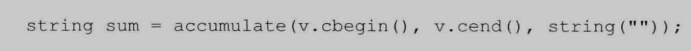

     >   如果第三个是字符串字面值而不是string对象就会报错,因为const char*没有+运算符

3.   **equal**算法:用于确定两个序列是否保存相同的值

     1.   可以用来比较两个不同类型容器中的元素, 元素类型也不必一样, 前提是能用==来比较, 例如int和double


## 写容器元素的算法


-   向目的位置迭代器写入数据的算法假定目的位置足够大, 能容纳要写入的元素


1.   **fill**算法向给定输入序列中写入数据

     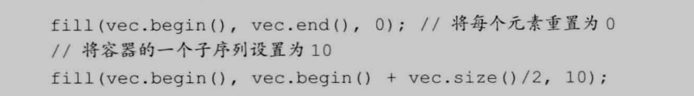

2.   **fill_n**函数将给定值赋予迭代器指向的元素开始的指定个元素

     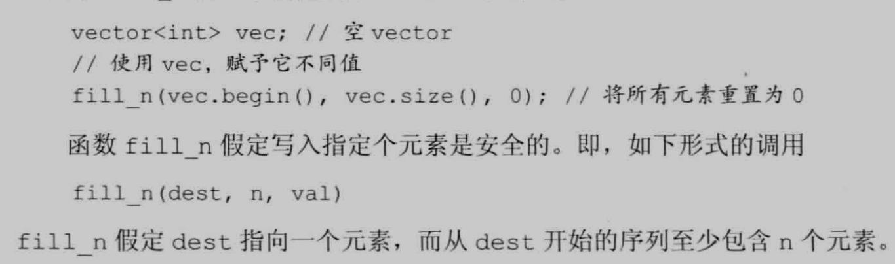

     >   不要在空容器调用该函数


### 介绍back_inserter

1.   插入迭代器是一种向容器中添加元素的迭代器
2.   定义在**头文件iterator**
3.   能保证算法有足够元素空间容纳输出数据
4.   **==通常情况, 通过插入迭代器赋值, 一个与赋值号右侧值相等的元素被添加到元素中==**


back_inserter接受一个指向容器的引用, 返回一个与该容器绑定的插入迭代器, 当我们通过插入迭代器赋值, 赋值运算符会调用push_back将一个给定值的元素添加到元素中:

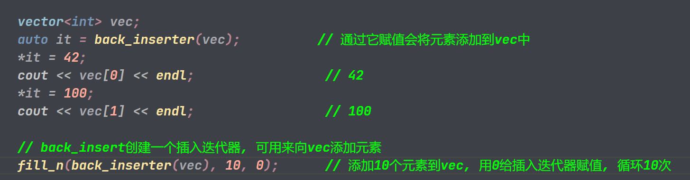

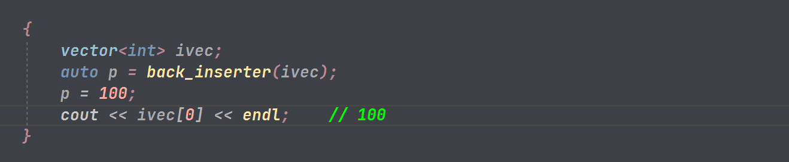


### 拷贝算法

1.   拷贝(copy) 算法是另一个向目的位置迭代器指向的输出序列中的元素写入数据的算法

     1.   传递给copy的目的序列至少要包含与输入序列一样多的元素

     2.   copy返回的是其目的位置迭代器(递增后)的值, 即, **ret恰好指向拷贝到a2的尾元素之后的位置**

          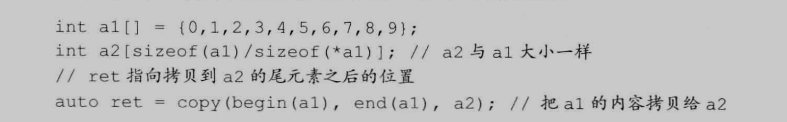

2.   **replace**算法: 读入一个序列, 并将其中所有等于给定值的元素都改为另一个值

     1.   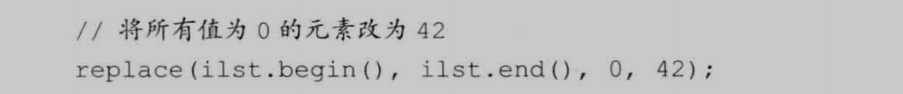

3.   如果希望保留原序列不变, 可以调用**replace_copy**, 接受第三个迭代器参数, 指出调整后序列的保存位置

     1.   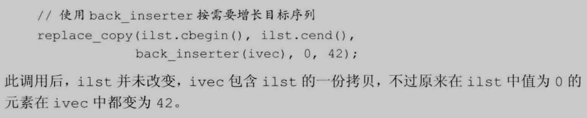


## 重排容器元素的算法

1.   **sort**: 利用元素类型的<运算符来实现重新排序

2.   排序完毕后, 可以用**unique**算法来重排vector, 使得不重复的元素出现在vector的开始部分, 而后可以利用**erase成员**删除重复元素

     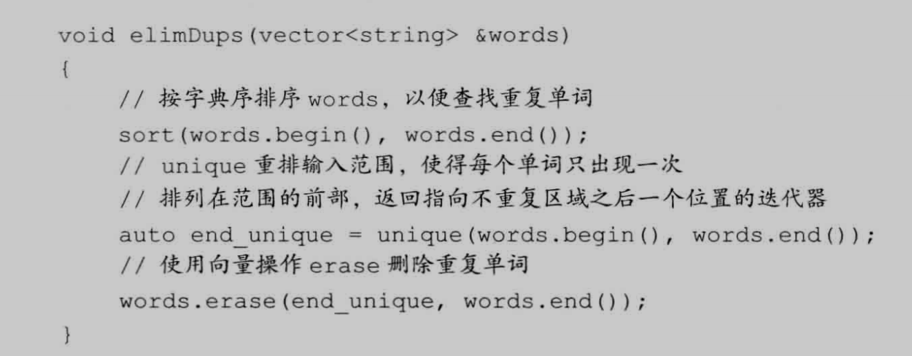

     >   即使words没有重复单词, 调用erase也是安全的,这种情况unique会返回words.end(), 删除words.end()到words.end()是一个空范围, 没有不良后果


# 定制操作


1.   很多算法都会比较输入序列(源序列, 向目的序列输出)中的元素, 默认情况下, 这类算法使用元素类型的< 或 == 运算符来完成比较
2.   允许我们提供自己定义的操作代替默认运算符
3.   ==**例如: sort算法默认用元素类型的<运算符, 但可能我们希望的排序顺序与 < 所定义的顺序不同, 或者是我们的序列可能保存的是未定义<运算符的元素类型, 就需要重载sort的默认行为**==


## 向算法传递函数

### 谓词

1.   谓词是一个可调用的表达式, 返回结果是一个能用做条件的值
2.   分类
     1.   一元谓词: 接受单一参数
     2.   二元谓词: 接受两个参数
3.   接受谓词参数的算法对输入序列中的元素调用谓词, 因此元素类型必须能转换为谓词的参数类型


例子: 接受一个二元谓词参数的sort版本用这个谓词代替<比较元素

```C++
// 比较函数, 用来按长度排序单词
bool isShorter(const string &s1, const string &s2) {
    return s1.size() < s2.size();
}

// 按长度由短至长排序words
sort(words.begin(), words.end(), isShorter);
```


### 排序算法

1.   使用stable_sort可以保持等长元素间的字典顺序:

     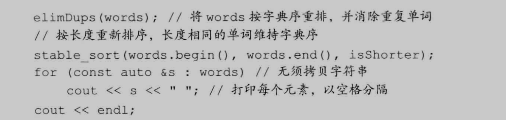


## lambda表达式

根据算法接受一元谓词还是二元谓词, 传递给算法的谓词必须严格接受一个或两个参数, 但是有时候希望进行的操作需要更多参数, 超出算法对谓词的限制


**find_if算法**: 查找一个具有特定大小的元素, find_if的第三个参数是一个谓词, find_if算法对输入序列中的每个元素调用给定的谓词, 它返回第一个使谓词返回非0值的元素, 如果不存在这样的元素, 则返回尾后迭代器

1.   这时候, 它需要的是一个一元谓词, 但是编写的函数有两个参数, 分别是string和一个长度, 就是二元谓词了, 不能传递给find_if, 这时候可能需要用到lambda表达式---


1.   我们可以向算法传递任何类别的**可调用对象**, 例如: 函数, 函数指针

     1.   另外的两种: 重载了函数调用运算符的类, 还有lambda表达式

2.   对于一个对象或一个表达式, 如果可以对其使用调用运算符, 则称它为可调用的

3.   一个lambda表示表示一个可调用的代码单元,可以理解为一个未命名的内联函数

4.   形式为:

     ```C++
     [捕获列表] (参数列表) -> 返回值类型 { 函数体 }
     ```

5.   捕获列表是一个lambda所在函数中定义的局部变量的列表, 通常为空

6.   lambda必须使用尾置返回类型

7.   **==可以忽略参数列表和返回类型, 但必须永远包含捕获列表和函数体==**

     1.   忽略括号和参数列表等价于指定一个空参数列表
     2.   如果忽略返回类型, lambda根据函数体重的代码推断出返回类型
     3.   如果函数体只是一个return语句, 则返回类型从返回的表达式的类型推断而来, 否则返回类型为void

     ```C++
     auto f = [] { return 42; };
     // auto f = [] { return 42; }; // lambda返回一个函数类型的对象, auto推断出函数类型, 所以f是一个函数
     ```

8.   使用调用运算符调用:

     ```C++
     cout << f() << endl; // 42
     ```

9.   lambda不能有默认参数


### 向lambda传递参数

1.   与普通函数一样, **==但是不能有默认实参==**


与isShorter功能一样的lambda


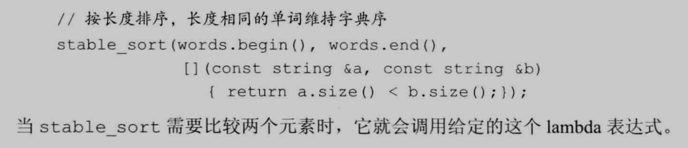


### 使用捕获列表

1.   lambda使用局部变量, 但是只能使用明确指明的变量
2.   一个lambda通过将局部变量包含在其捕获列表中来指出将来会使用这些变量
3.   一个lambda只有在其捕获列表中捕获一个它所在函数中的局部变量, 才能在函数体中使用该变量
4.   一个lambda可以直接使用定义在当前函数之外的名字, 例如:ostream::cout
5.   ==捕获列表只用于局部非static变量, lambda可以直接使用局部static变量和它所在函数之外声明的名字==


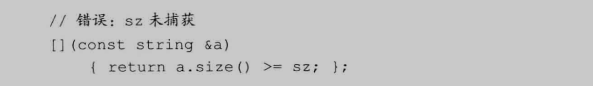


**用lambda调用find_if**

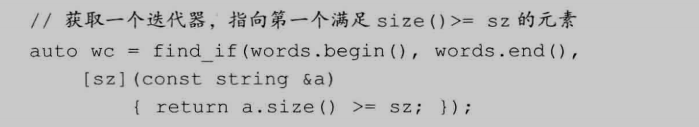

>   查找一个具有特定大小的元素, find_if的第三个参数是一个谓词, find_if算法对输入序列中的每个元素调用给定的谓词, 它返回第一个使谓词返回非0值的元素, 如果不存在这样的元素, 则返回尾后迭代器

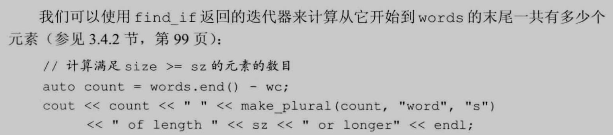


### for_each 算法

该算法接受一个可调用对象, 并对输入序列中每个元素调用此对象

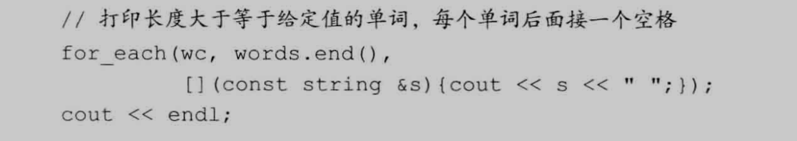


## lambda捕获和返回

1.   当定义一个lambda时, 编译器生成一个与Lambda对应的新的(未命名)类类型
2.   当向一个函数传递lambda, 同时定义了一个新类型和该类型的一个对象: 传递的参数就是此编译器生成的类类型的未命名对象
3.   **默认情况下, 从lambda生成的类都包含一个对应该lambda所捕获的变量的数据成员**
     1.   **lambda的数据成员也在lambda对象创建时被初始化**


### 值捕获

1.   采用值捕获的前提是变量可以拷贝

2.   **==与参数不同, 被捕获的变量的值是在lambda创建时( 定义lambda的代码执行时 )拷贝, 而不是调用时拷贝==**

     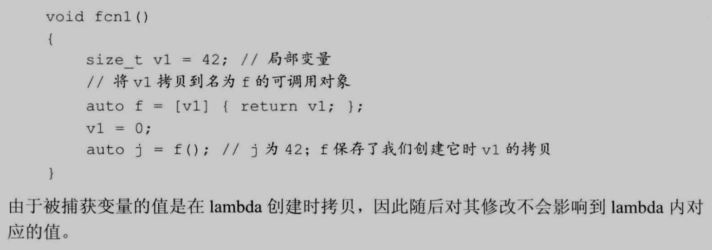


### 引用捕获

1.   采用引用捕获必须确保被引用的对象在lambda执行的时候是存在的
2.   lambda捕获局部变量, 函数结束后, 捕获的引用指向的局部变量消失

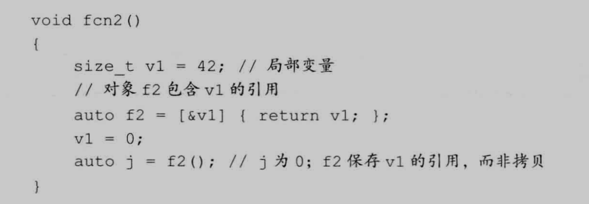


### 隐式捕获

1.   & 告诉编译器采用捕获引用方式
2.   = 则表示采用值捕获方式
3.   混合使用隐式捕获和显式捕获, **捕获列表中的第一个元素必须是一个& 或 =**, 此符号制定了默认捕获方式为引用或值
4.   当混合使用隐式捕获和显式捕获, 显式捕获的变量必须与隐式捕获不同的方式
     1.   **如果隐式捕获是引用方式(使用&), 则显式捕获命名变量必须采用值方式**
     2.   **如果隐式捕获采用值方式, 则显式捕获命名变量必须采用引用方式**

例子:

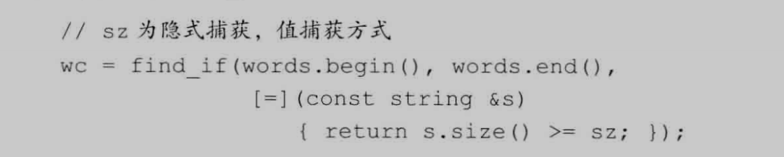

>   sz未显式捕获就使用了, 所以对应那一个隐式捕获 = 


**混合使用捕获**


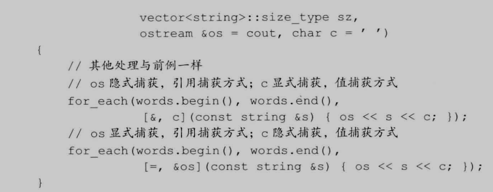


### 表10.1 : lambda捕获列表

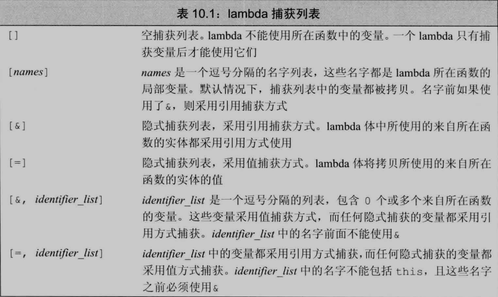


### 可变lambda

1.   **默认情况下, 对于一个值被拷贝的变量, lambda不会改变其值**
2.   **如果希望能改变一个被捕获的变量的值, 就必须在参数列表首前( 不是参数列表后? ) 加上关键字mutable,  因此可变lambda能省略参数列表**


例子:

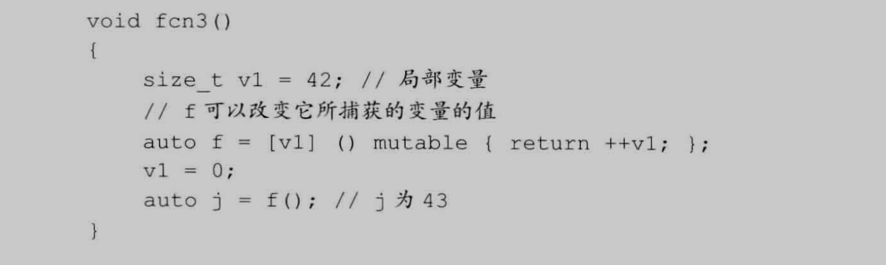

>   lambda的v1是size_t v1 的拷贝, 但是, lambda的v1是mutable, 一旦创建生命周期直到程序结束, 所以可以保留下来上次输入的值


一个引用捕获的变量是否可以修改依赖于此引用指向的是一个const类型还是一个非const类型:

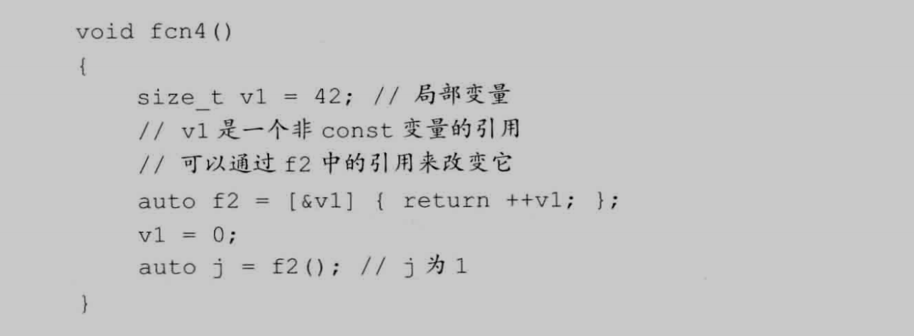


### 指定lambda返回类型

1.   默认情况下, ==**如果一个lambda体包含return之外的任何语句, 则编译器假定此lambda返回void**==, 与其他返回void的函数类似, 被推断返回void的lambda不能返回值

2.   **当需要为lambda定义返回类型, 必须使用尾置返回类型**

     1.   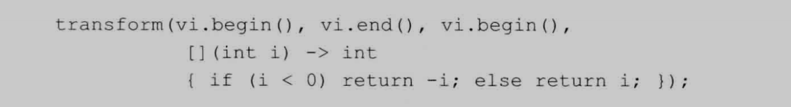

          >   如果没有定义返回类型, 编译器就会推断出类型为void, 因为包含了return语句之外的语句

     2.   疑问, 并没如上所说出现编译错误

          ```c++
          auto ef = []() {if (1 == 1) return -1; };
          cout << ef() << endl;   // -1
          ```

          


例子:

**transform**算法对输入序列中每个元素调用可调用对象, 并将结果写到目的位置

-   当输入迭代器和目的迭代器相同时, transform将输入序列中每个元素替换为可调用对象操作该元素得到的结果:

-   使用的是lambda, lambda体是单一的return语句, 返回一个条件表达式的结果, 无需指定返回类型, 因为可以根据条件运算符的类型推断出来

-   但是, 看起来等价的if语句会产生编译错误, 因为不是单一的return语句

    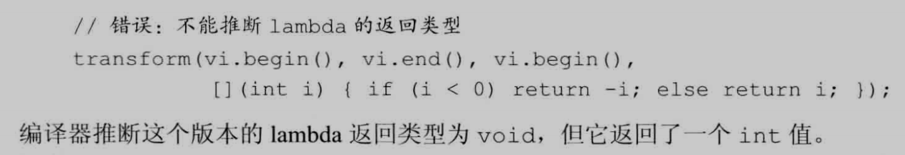


## 参数绑定

1.   只在一两个地方使用的简单操作, lambda表达式最有用
2.   如果在很多地方使用相同操作, 通常应该定义一个函数
3.   如果一个操作需要很多语句才能完成, 通常使用函数更好


问题1: 某些函数仅接受一元谓词, 例如find_if, 因此传递给find_if的可调用对象必须接受单一参数

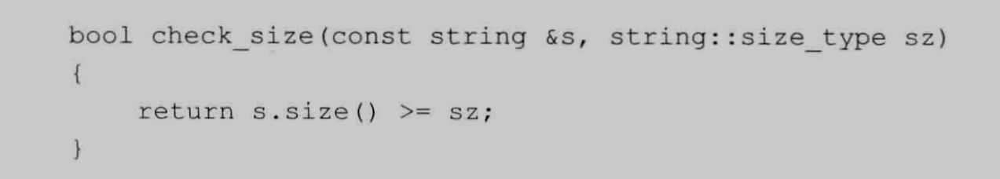

>   默认, 不能作为find_if的可调用对象
>
>   lambda可以, 因为可以把const string &s作为参数, 然后string::size_type sz用捕获列表捕获


可以用bind函数解决问题1

例如: 其他参数由bind自己传, 我们调用bind只用传递一个参数, 让接受一元谓词的算法也能适用二元谓词


### 标准库bind函数


1.   定义在**头文件functional**

2.   **将bind函数看做一个通用的函数适配器, 接受一个可调用对象, 生成一个新的可调用对象来"适应"原对象的参数列表**

     1.   让二元谓词可以像一元谓词一样使用

3.   调用bind的一般形式:

     ```C++
     auto 可调用对象1 = bind(可调用对象2, 参数列表);
     ```

     1.   参数列表对应给定的可调用对象2的参数
     2.   当我们调用可调用对象1, 可调用对象1就会 调用 可调用对象2, 并传递给它参数列表中的参数
     3.   参数列表中的参数可以包含形如 _n 的名字, n是一个整数, 这些参数是"占位符", 表示 可调用对象1 的参数, 它们占据了传递给可调用对象1的参数的位置
     4.   数值n表示生成的可调用对象中参数的位置: _1 为 可调用对象1 的第一个参数, _2为第二个参数, 依此类推


例子:使用bind生成一个调用check_size的对象

```C++
auto check6 = bind(check_size, _1, 6);
```

>   _1 占据了const string &s的位置, 因此调用check6必须传递一个string类型的参数, check6将此参数和 6 传递给check_size


```C++
string s = "hello";
bool b1 = check6(s);
```


使用bind, 可以将只有lambda调用的find_if用函数调用

```C++
auto wc = find_if(words.begin(), words.end(), [sz](const string &a) -> string { if(a.size() > sz) return a; })
```

替换为:

```C++
auto wc = find_if(words.begin(), words.end(), bind(check_size, _1, sz));
```

>   bind调用生成一个可调用对象, 将check_size的第二个参数绑定到sz的值
>
>   当find_if对words中的string调用这个对象, 这些对象调用check_size, 将给定的string和sz传递给它


完整例子:

```C++
vector<string> words;
string::size_type sz = 6;
auto wc = find_if(words.begin(), words.end(), bind(check_size, std::placeholders::_1, sz));
```


### 使用 placeholders 名字

-   名字 _n 都定义在一个名为placeholders的命名空间中, 这个命名空间定义在std命名空间

    ```C++
    using std::placeholders::_1;
    ```

-   每个名字需要单独声明, 可以直接声明命名空间

    ```c++
    using namespace namespace_name;
    ```

    ```C++
    using namespace std::placeholders;
    ```


### 占位符求值顺序

传递给函数的参数按位置绑定到占位符

-   调用bind返回的可调用对象, 传递给它的参数, 第一个参数绑定到 _1, 第二个参数绑定到 _2

```C++
auto g = bind(f, a, b, _2, c, _1);
// bind调用会将
g(_1, _2)
// 映射为
f(a, b, 2, c, 1)
// 对g调用会调用f, 用g的参数代替占位符, 调动g(X, Y)会调用
f(a, b, Y, c, X)
```


例子:

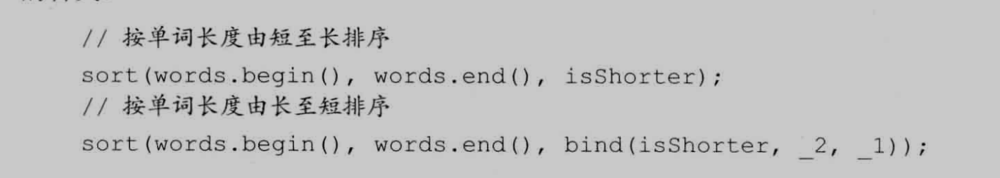

>   调用传递实参isShorter(A, B) 等价于 isShorter(B, A);


### 绑定引用参数

1.   **默认情况下, bind的那些不是占位符的参数被拷贝到bind返回的可调用对象中**
     1.   某些类不能被拷贝, 如: 流对象


错误, 不能拷贝os

```C++
ostream os;
for_each(words.begin(), words.end(), bind(print, os, _1, ' '));
```

如果希望传递给bind一个对象又不拷贝它, 就必须使用标准库**ref函数**

```C++
for_each(words.begin(), words.end(), bind(print, ref(os), _1, ' '));
```


定义在**头文件functional**

1.   **ref函数**: 返回一个对象, 包含给定对象的引用, 此对象是可以拷贝的
2.   **cref函数**: 生成一个保存const引用的类


### 自定义一个使用二元谓词的函数

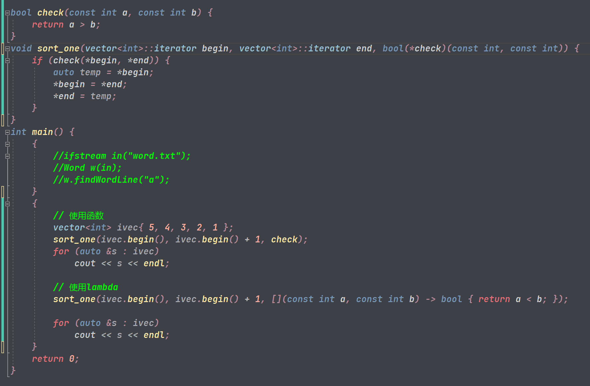


# 再探迭代器


**头文件iterator**包含:

1.   **插入迭代器**: 这些迭代器被绑定到一个容器上, 可用来向容器插入元素
2.   **流迭代器**: 这些迭代器被绑定到输入或输出流上, 可用来遍历所关联的IO流
3.   **反向迭代器**: 这些迭代器向后而不是向前移动, 出了forward_list之外的标准库容器都有反向迭代器
4.   **移动迭代器**: 这些专用的迭代器不是拷贝其中的元素, 而是移动它们


## 插入迭代器


插入迭代器是一种迭代器适配器, 接受一个容器, 生成一个迭代器, 能实现向给定容器添加元素

当通过插入迭代器进行赋值, 该迭代器调用容器操作来向给定容器指定的位置插入一个元素


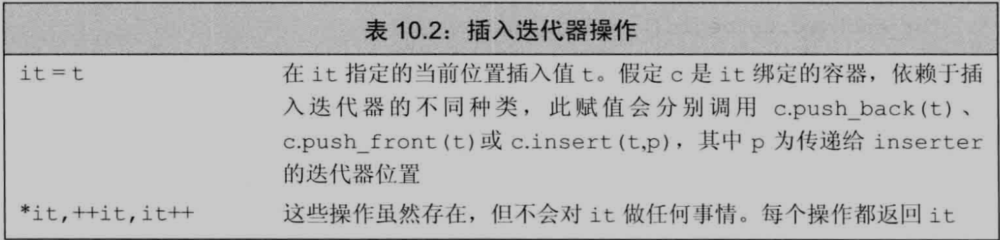


1.   **back_inserter**: 创建一个使用push_back的迭代器
2.   **front_inserter**: 创建一个使用push_front的迭代器
3.   **inserter**: 创建一个使用insert的迭代器, 该函数接受第二个参数, 这个参数必须是指向给定容器的迭代器, 元素将插入到给定迭代器所表示的元素之前, **inserter迭代器每次插入后都会返回指向被插入元素之后一个位置的迭代器, 也就是指向原来的元素的迭代器** ( C++ Primer 第358页上没讲加粗部分, 我草尼玛, 给劳资看懵了还在向为什么下面的copy得到的是顺序的而不是逆序的)


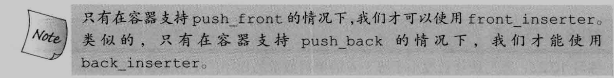


调用inserter(c, iter)

```C++
*it = val;	// it是back_inserter返回的迭代器
// 等价
it = c.insert(it, val);
++it;	// 递增使它指向原来的元素
```


当调用front_inserter, 元素总是插入到容器第一个元素之前

```C++
list<int> lst = {1, 2, 3, 4};
list<int> lst2, lst3;
// 拷贝完成后, lst2包含 4 3 2 1
copy(lst.cbegin(), lst.cend(), front_inserter(lst2));
// 拷贝完成后, lst1包含 1 2 3 4 
// inserter迭代器每次插入后都会返回指向被插入元素之后一个位置的迭代器, 也就是指向原来的元素的迭代器, 所以是顺序, 不是逆序
copy(lst.cbegin(), lst.cend(), inserter(lst3, lst3.begin()));
```


## iostream迭代器

1.   **istream_iterator**: 读取输入流
2.   **ostream_iterator**: 向一个输出流写数据

这些迭代器将它们对应的流当做一个特定类型的元素序列来处理


### istream_iterator操作

-   当创建一个流迭代器, 必须指定迭代器将要读写的对象类型(模板类)
-   **istream_iterator使用 >> 来读取流, 该迭代器读取的类型必须定义了输入运算符**
-   可以在创建时将istream_iterator绑定到一个流
-   还可以默认初始化迭代器, 创建一个可以当做尾后值使用的迭代器
-   对于一个绑定到流的迭代器, 一旦其关联的流遇到文件末尾或IO错误, 迭代器的值就与尾后迭代器相等
-   **istream_iterator从创建的时候就开始读取流了**

例子:

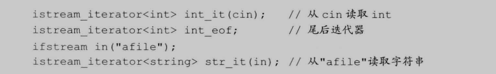


用istream_iterator从标准输入读取数据, 存入一个vector的例子:

-   ++运算符会让istream_iterator对象使用元素类型定义的>>运算符从输入流中读取下一个值

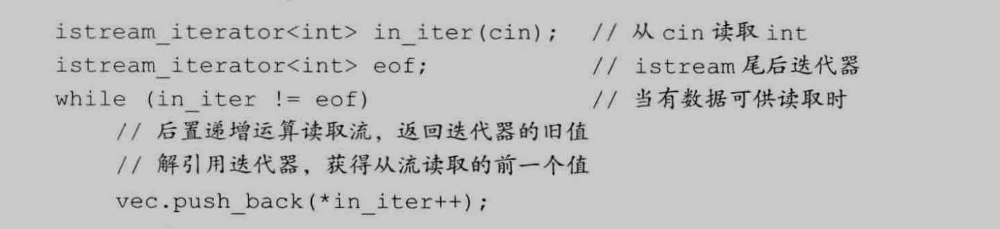

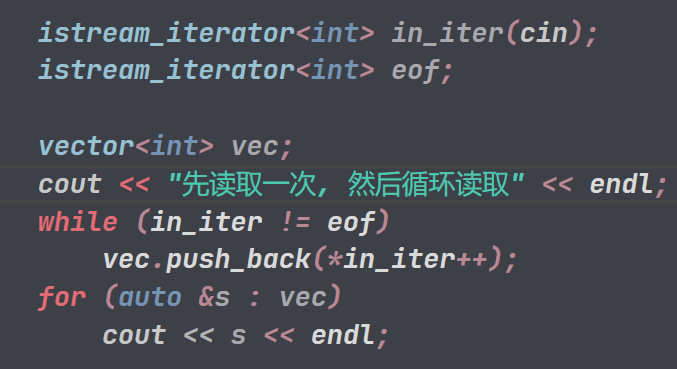


**上面例子可以重写为:**

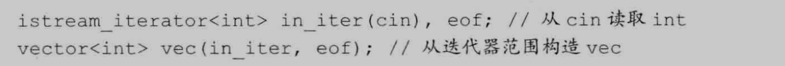


### 表10.3: istream_iterator操作

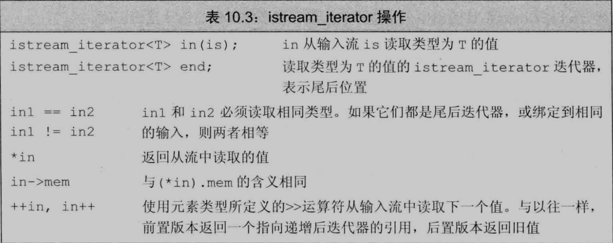


### 使用算法操作流迭代器


1.   **accumulate**算法对输入范围内的元素求和

     1.   用一对istream_iterator来调用它

     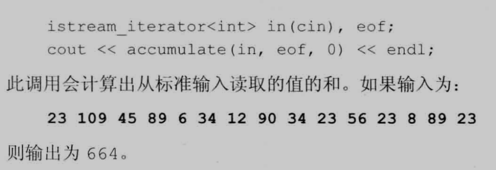

     


### ostream_iterator 操作

1.   对任何具有输出运算符 (<< 运算符) 的类型定义ostream_iterator
2.   **当创建一个ostream_iterator, 可以提供(可选的) 第二参数, 是一个C风格字符串 ( 字符串字面常量或者一个指向以空字符结尾的字符数组的指针 )**
3.   必须将ostream_iterator绑定到一个指定的流, 不允许空的, 或表示尾后位置的ostream_iterator


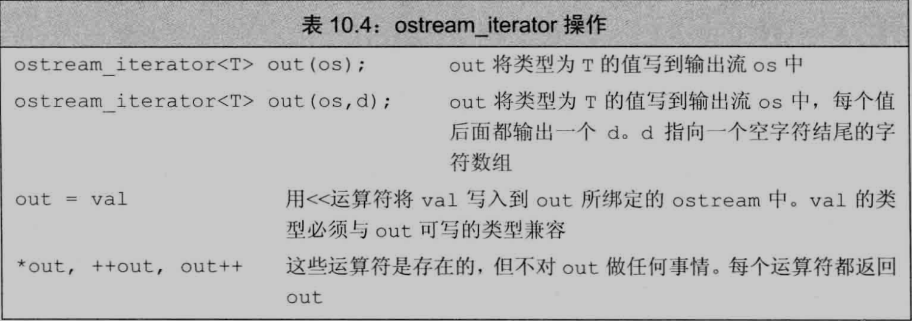


例子:

使用ostream_iterator输出值的序列:

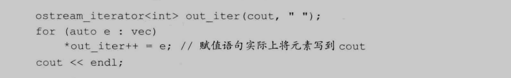

>   将vec中的每个元素写到cout, 每个元素后加一个空格, 然后输出到屏幕上
>
>   每次向out_iter赋值, 写操作就会被提交

当我们向out_iter赋值, 可以忽略解引用和递增运算:


>   因为运算符*和++实际上对ostream_iterator对象不做任何事情, 忽略没有任何影响
>
>   但是推荐第一种, 因为:
>
>   1.   在这种写法中, 流迭代器的使用与其他迭代器的使用保持一致
>   2.   如果想将次循环改为操作其他迭代器类型, 修改起来非常容易
>   3.   此循环的行为也更清晰
>
>   总之, 就是保证你的程序的扩展性, 还有可读性, 可维护性


综合例子:

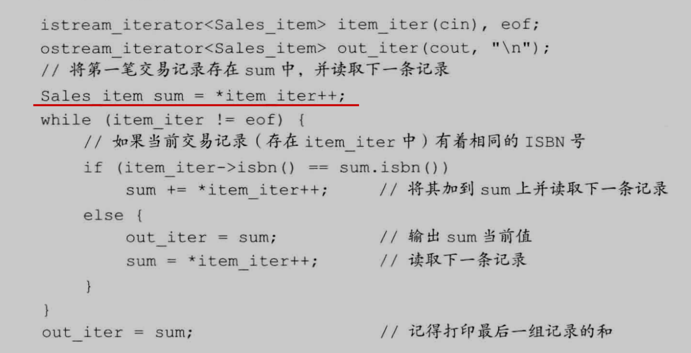

>   istream_iterator<Sales_item> item_iter(cin), 执行的时候用从窗口给定的值创建一个Sales_item对象, 然后返回一个指向该对象的istream_iterator, 解引用就得到该Sales_item对象, 可以进行->操作


## 反向迭代器


1.   反向迭代器就是在容器中从尾元素向首元素反向移动的迭代器
2.   递增一个反向迭代器(++it) 会移动到前一个元素
3.   递减一个迭代器(--it) 会移动到下一个元素
4.   出了forward_list, 其他容器都支持反向迭代器
5.   通过调用rbegin, rend, crbegin, crend 成员函数获得反向迭代器
     1.   rbegin指向尾元素
     2.   rend指向首元素的前一个位置


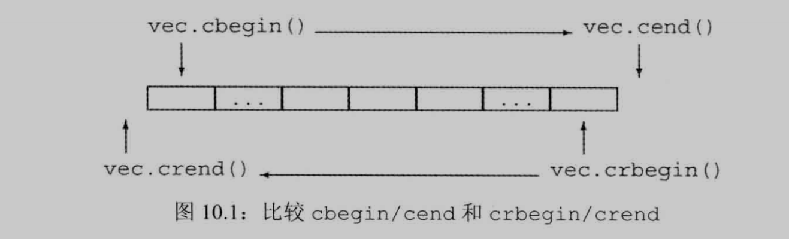


例子:

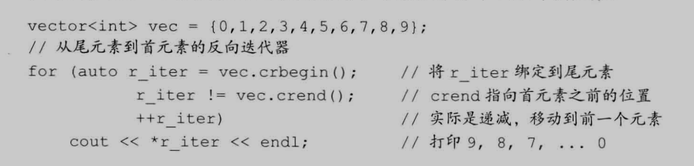


例子: 通过向sort传递一对反向迭代器来将vector整理为递减序

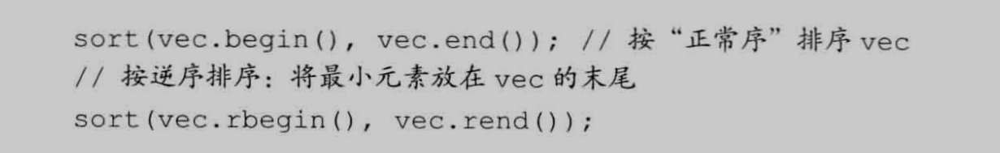

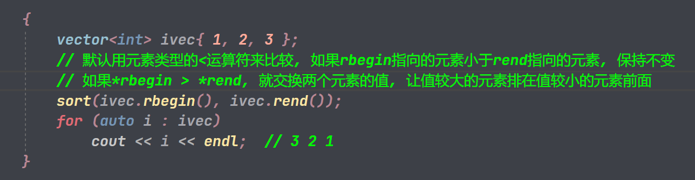


例子: 使用反向迭代器查找最后一个用逗号隔开的一个元素

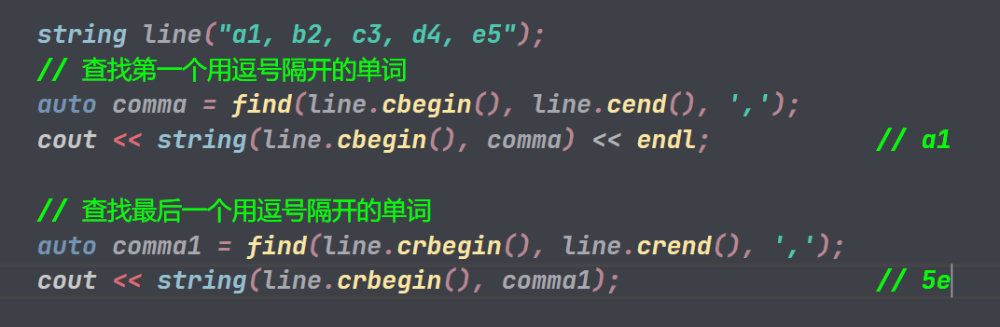

>   find从给定范围中查找第三个参数, 如果找到返回这个值的迭代器, 否则返回line.cend()
>
>   用line.crbegin() 开始, 到comma1之间的内容构造一个string对象, 然后输出, 打印到逗号为止的字符, 如果不含逗号, 打印整个string


使用的是反向迭代器, 会反向处理string

-   因此上面输出语句从crbegin开始反向打印line中的内容
-   不能直接使用comma1, 因为它是反向迭代器, 它会反向朝着string开始位置移动
-   需要将comma1转换成普通迭代器, 能在line中正向移动
-   通过调用reverse_iterator的base成员函数将comma1转换成对应的普通迭代器
    -   
    -   rcomma.base()返回的是rcomma指向的元素右边的第一个元素, 例如, rcoomma指向逗号, 那么base返回逗号右边的元素的迭代器

​	

完整例子:

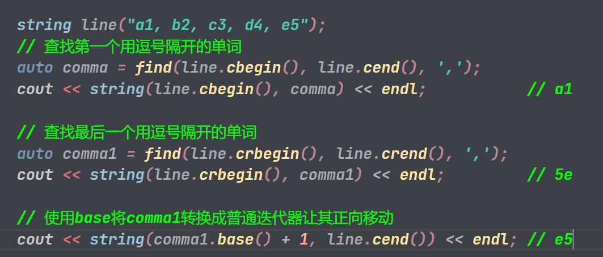


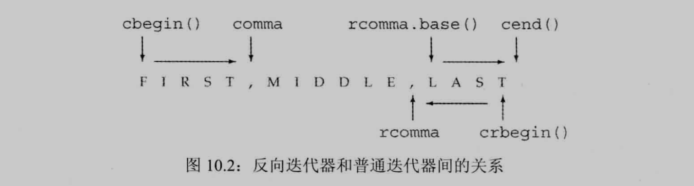


# 泛型算法结构


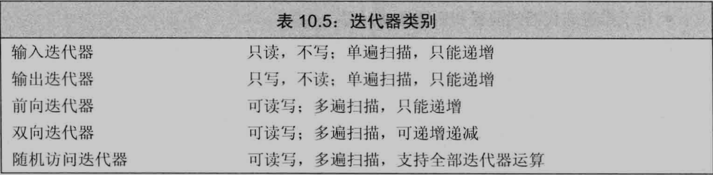


## 5类迭代器

1.   迭代器是按他们所提供的操作来分类的
2.   除了输出迭代器之外, 高层类别的迭代器支持低层类别迭代器的所有操作
3.   C++标准指明了泛型和数值算法的每个迭代器参数的最小类别
     1.   例如: find算法在一个序列上进行一遍扫描, 对元素进行只读操作, 因此至少需要输入迭代器
          1.   需要读取元素, 就需要知道这个元素从哪里来, 输入迭代器就是把这些元素输入(读取)到find算法, 给find操作
     2.   例如: replace函数需要一对迭代器, 至少是前向迭代器. 其第三个迭代器表示目的位置, 必须至少是输出迭代器
     3.   ==对每个迭代器参数来说, 其能力必须于规定的最小类别至少相当==
     4.   向算法传递一个能力更差的迭代器会产生错误
4.   对于向一个算法传递错误类别的迭代器的问题, 很多编译器不会给出任何警告或提示
5.   **读取对应输入**(从文件1读取进来, 可以说从文件1读取进来)
6.   **写入对应输出**(从源程序输入到文件2, 可以说从源程序写到文件2)


### 迭代器类别

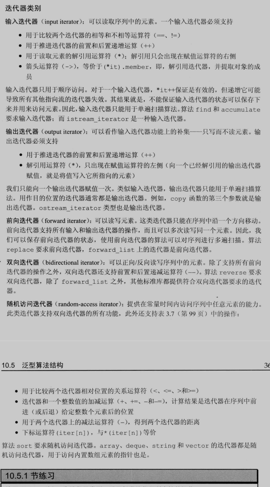

>   什么是单遍扫描? 什么是多遍扫描?
>
>   个人推测:
>
>   -   以下可能不准确, 需要百度
>   -   单遍扫描: 不可以读写同一个元素, 只能读取下一个元素
>       -   例如: 输入迭代器, istream_iterator(cin), 只能进行++, 不能 - -
>   -   多遍扫描: 可以多次读写同一个元素
>       -   例如: forward_list的迭代器, 可以保存下首元素的迭代器, 然后遍历多次


## 算法形参模式

-   通过理解参数的含义, 可以将注意力集中在算法所做的操作上

-   大多数算法具有如下形式:

    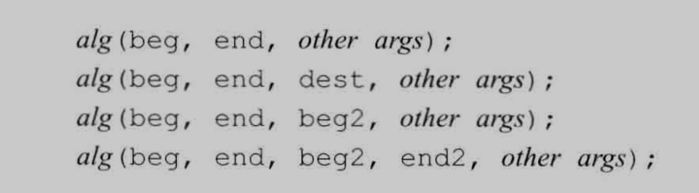

    >   1.   alg是算法的名字
    >   2.   beg和end表示算法所操作的输入范围
    >   3.   dest, beg2, end2都是迭代器参数, 如果用到这些, 分别承担指定目的位置和第二个范围的角色
    >   4.   还有些算法接受额外的, 非迭代器的特定参数


### 接受单个目标迭代器的算法

1.   dest参数是一个表示算法可以写入的目的位置的迭代器
     1.   输出迭代器
          1.   插入迭代器
          2.   ostream_iterator
          3.   ...
2.   向输出迭代器写入数据的算法都假定目标空间足够容纳写入的数据


### 接受第二个输入序列的算法

1.   接受单独的beg2或beg2和end2的算法用这些迭代器表示第二个输入范围
     1.   这些算法通常使用第二个范围中的元素和第一个输入范围结合进行一些运算
2.   只接受单独的beg2(不接受end2)的算法将beg2作为第二个输入范围中的首元素
     1.   此范围的结束位置未指定
     2.   **这些算法假定从beg2开始的范围与beg和end所表示的范围至少一样大, beg2开始的范围的大小或许更大, 但是绝对不能更小**


## 算法命名和重载规范


**一些算法使用重载形式传递一个谓词**

1.   接受谓词参数来代替<或==运算符的算法, 以及那些不接受额外参数的算法, 通常都是重载的函数

2.   函数一个版本用元素类型的运算符比较元素, 另一个版本接受一个额外谓词参数来代替<或==:

     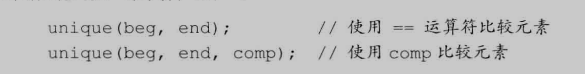


**_if 版本的算法**

1.   接受一个元素值的算法通常有另一个不同名(不是重载)的版本, 该版本接受一个谓词代替元素值, 接受谓词参数的算法都有附加的_if后缀

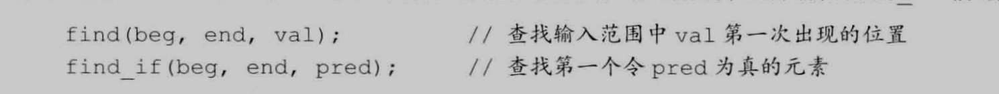

2.   上面两个函数都接受三个参数, **为了避免任何可能的歧义, 标准库选择提供不同名字的版本而不是重载**


**区分拷贝元素的版本和不拷贝的版本**

1.   默认情况下, 重排元素的算法将重排后的元素写入给定输入的序列中
2.   这些算法提供另一个版本, 将元素写到一个指定的输出目的的位置
3.   写到额外目的空间的算法都在名字后面附加一个 _copy

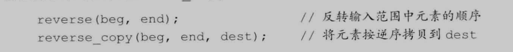

>   dest是迭代器参数

4.   一些算法同时提供_copy和 _if版本, 这些版本接受一个目的位置迭代器和一个谓词

     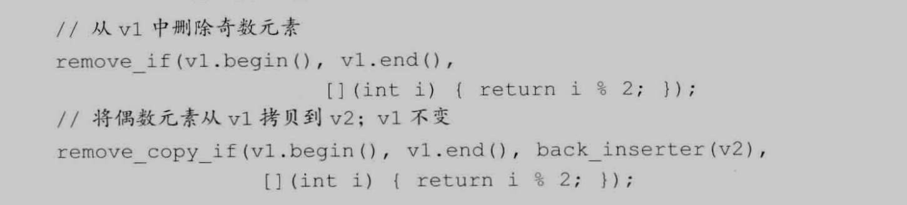


# 特定容器算法


1.   一个链表可以通过改变元素间的链接而不是真的交换它们的值来快速"交换"元素, 因此这些链表版本的算法性能比对应的通用版本好得多
2.   与其他容器类型不同, 链表类型list和forward_list定义了几个成员函数形式的算法
3.   对于list和forward_list, 应该优先使用成员函数版本的算法而不是通用算法

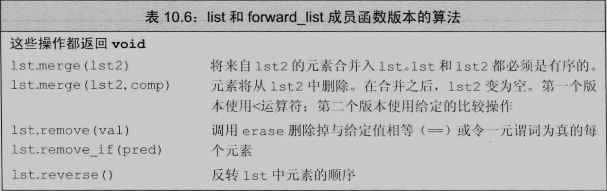

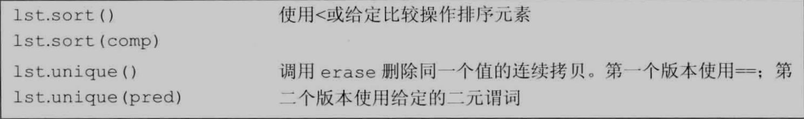


### splice成员

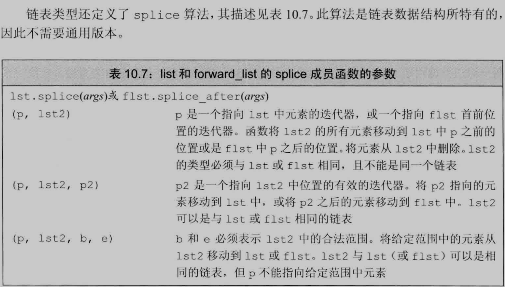


### 链表特有的操作会改变容器

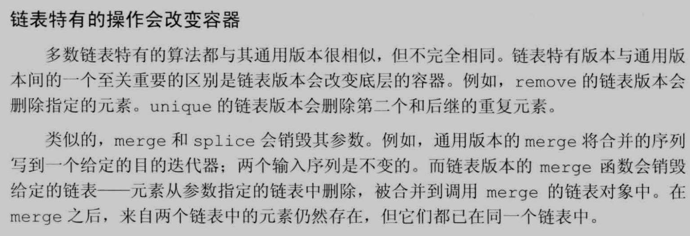