[TOC]

# 关联容器类型


1.   关联容器: 容器中的元素是按关键字来保存和访问的
     1.   支持高效的关键字查找和访问
     2.   两个主要的关联容器: 
          1.   **map**: map中的元素是一些关键字-值对, 关键字起索引作用, 值表示与索引相关联的数据
          2.   **set**: set中每个元素只包含一个关键字, set支持高效的关键字查询操作-检查一个给定关键字是否在set中
2.   顺序容器中的元素是按他们的<运算符定义的顺序排序的
3.   允许重复关键字的容器的名字中都包含单词**multi**
4.   不保持关键字按顺序存储的容器的名字都以单词**unordered**开头


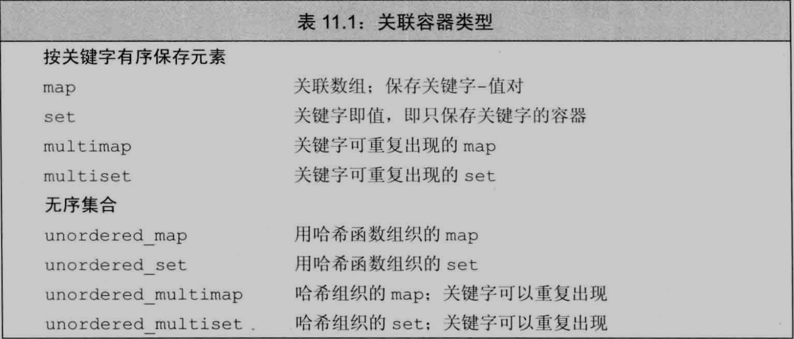


# 使用关联容器


1.   map是关键字-值对的集合
     1.   例如: 人的名字作为关键字, 电话号码作为值, 成这样的数据结构为: "将名字映射到电话号码"
     2.   map类型通常被称为关联数组, **使用关键字查找值**, 例如使用人名查找电话号码
2.   set是关键字的简单集合
     1.   当只想知道一个值是否存在, set最有用
     2.   例如: 一个企业定义名为bad_checks的set保存曾经开过空头支票的人的名字, 在接受一张支票之前, 可以查询bad_checks检查顾客名字是否在其中
     3.   简单来说, 仅用来查询最有用


### 使用map

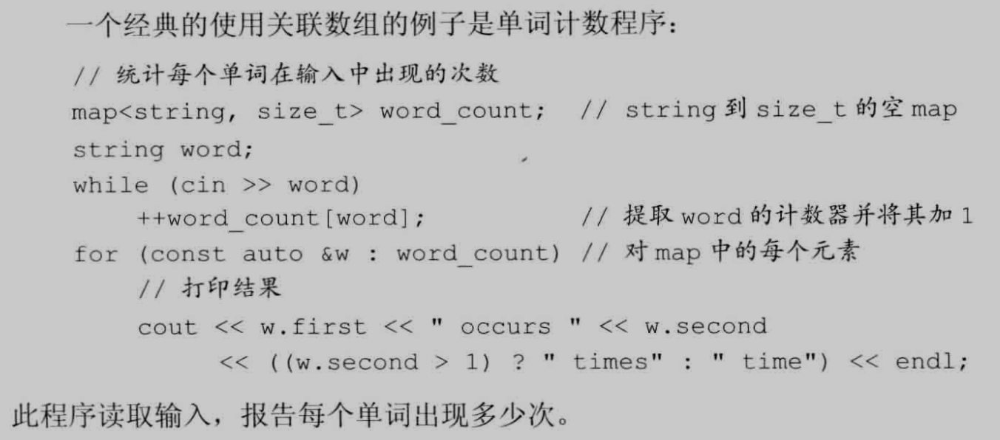

>   关键字是string, 值是size_t
>
>   ==对word_count进行下标操作, 使用string作为下标, 获得与此string相关联的size_t类型的计数器==
>
>   while循环每次从标准输入读取一个单词, 用每个单词对word_count进行下标操作
>
>   ==**如果word还未在map中, 下标运算符会创建一个新元素, 其关键字为word**==, 值为0, 不管元素是否是新创建的, 将其值加1
>
>   **在范围for中: 从map中提取一个元素, 得到一个pair类型的对象**
>
>   **pair是模板类型, 保存两个名为first和second的(公有)数据成员**
>
>   **map使用的Pair用first成员保存关键字, 用second成员保存对应的值**


### 使用set

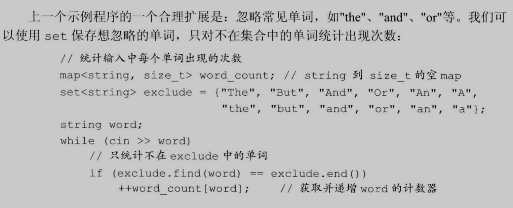

>   只统计不在exclude中的单词, 检查单词是否在忽略集合中
>   ==find调用返回一个迭代器, 如果给定关键字在set中, 迭代器指向该关键字, 否则, find返回尾后迭代器, 也就是说, 如果find返回尾后迭代器, 关键字就不在set中==


### 什么时候使用?

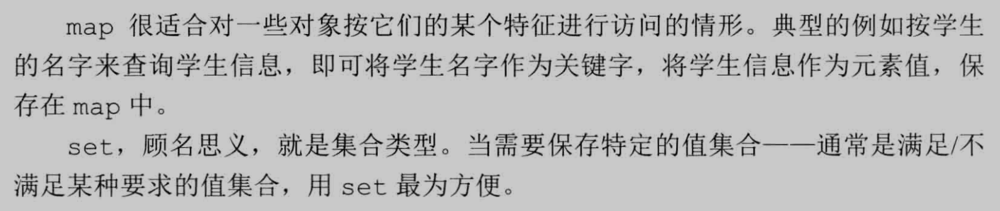


# 关联容器概述


1.   关联容器(有序, 无序) 都支持表9.2中介绍的普通容器操作
2.   关联容器不支持顺序容器的位置相关的操作, 例如push_front, push_back
3.   关联容器也不支持构造函数或插入操作这些接受一个元素值和一个数量值的操作


## 表9.2: 容器操作

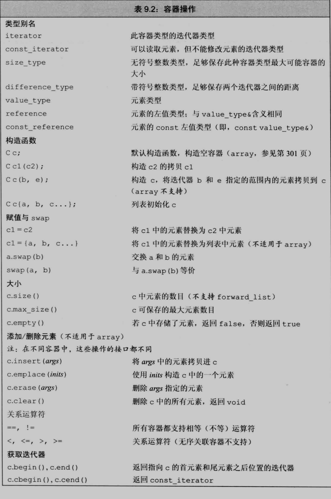

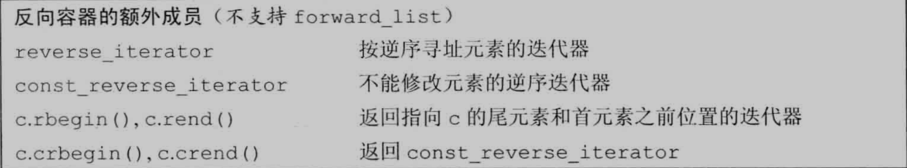


## 定义关联容器

1.   每个关联容器都定义一个默认构造函数, 它创建一个指定类型的空容器

2.   可以将关联容器初始化为另一个容类型容器的拷贝, 或是从一个值范围来初始化关联容器, 只要这些值可以转化为容器所需类型就可以

3.   可以对关联容器进行值初始化

4.   **对于set, 元素类型就是关键字类型**

5.   当初始化一个map, 必须提供关键字类型和值类型, 必须将每个关键字-值对包围在花括号中:

     ```C++
     {key, value}
     ```

     >   每个花括号中, 关键字是第一个元素, 值是第二个
     >
     >   将key映射到value


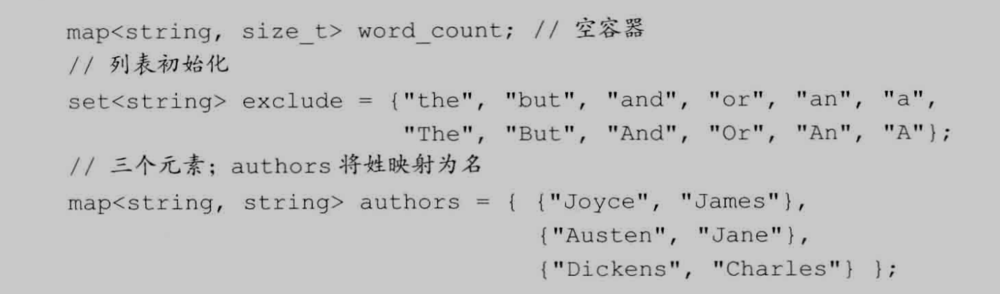

>   map包含三个元素, 三个元素的key对应"Joyce", "Austen", "Dickens"


### 初始化multimap 或  multiset

1.   ==**一个map或set中的关键字必须是唯一的, 即, 对于一个给定的关键字, 只能有一个元素的关键字等于它**==
2.   容器multimap 和 multiset没有上面的限制, **允许多个元素具有相同的关键字**


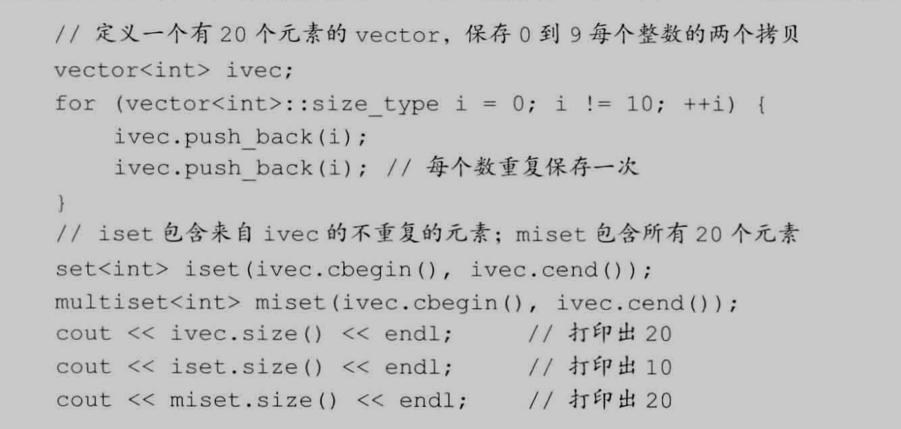

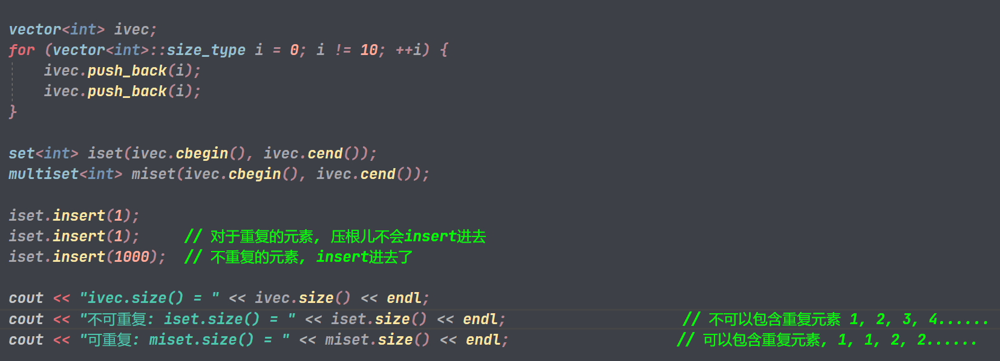


## 关键字类型的要求


-   ==对于有序容器: map, multimap, set, multiset, 关键字类型必须定义元素比较的方法==
-   ==默认情况下, 标准库使用关键字类型的<运算符来比较两个关键字==
-   在集合类型中, 关键字类型就是元素类型;
-   在映射类型中, 关键字类型是元素的第一部分的类型;
-   传递给排序算法的可调用对象, 必须满足与关联容器中关键字一样的类型要求


### 有序容器的关键字类型


### 使用关键字类型的比较函数(定制操作)

-   有序容器必须定义自己的严格弱序操作...

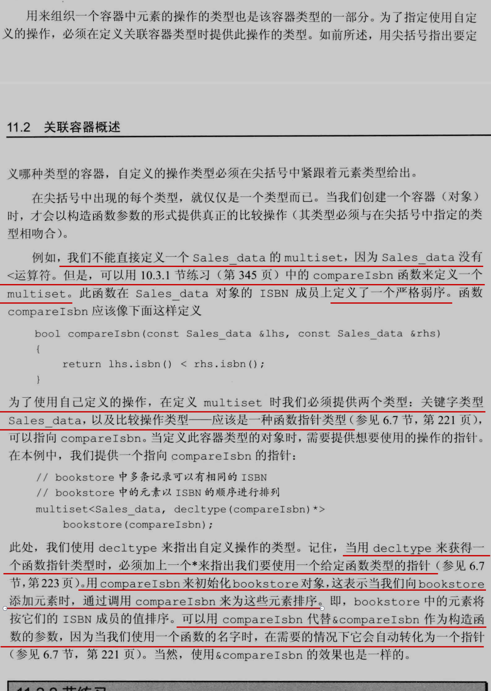

>   上面的容器类型中加入了可调用对象类型, 那么在初始化的时候就要给它传递一个相同类型的可调用对象


## pair类型

-   **pair**标准库类型, 定义在**头文件utility**
-   一个pair保存两个数据成员
-   创建一个pair, 必须提供两个类型名
    -   pair的数据成员具有对应的类型
-   **==pair的默认构造函数对数据成员进行值初始化==**
    -   类似shared_ptr, 对shared_ptr进行值初始化, 也就是shared_ptr的值为nullptr


也可以为每个成员提供初始化器


与其他标准库类型不同, pair的数据成员是public的

-   两个成员分别命名为**first**和**second**
-   使用普通的成员访问符号访问它们

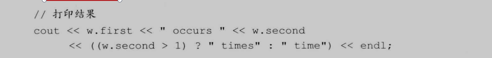


### 表11.2: pair上的操作

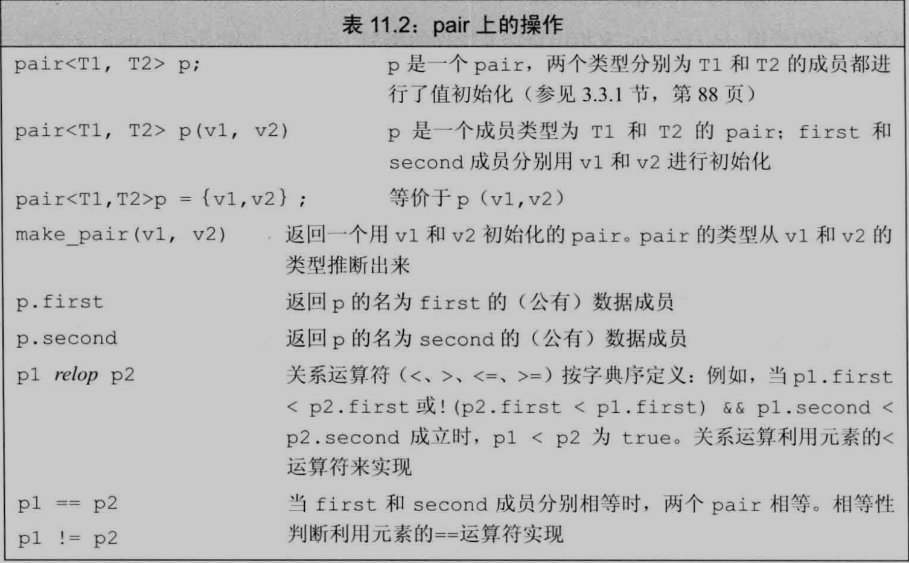


### 创建pair对象的函数


该函数需要返回一个pair, 我们可以对返回值进行列表初始化:

```C++
pair<string, int> process(vector<string> &v) {
    // 处理v
    if (!v.empty()) {
        return { v.back(), v.back().size() };   // 列表初始化
    }
    else {
        return pair<string, int>();             // 隐式构造返回值
    }

}

pair<string, string> author{ "James", "Joyce" };
vector<string> svec;
pair<string, int> temp_pair = process(svec);
```


还可以用mak_pair来生成pair对象, pair的两个类型来自于mak_pair的参数

```C++
if(!v.empty()) {
	return make_pair(v.back(), v.back().size())
}
```


创建pair的方法:

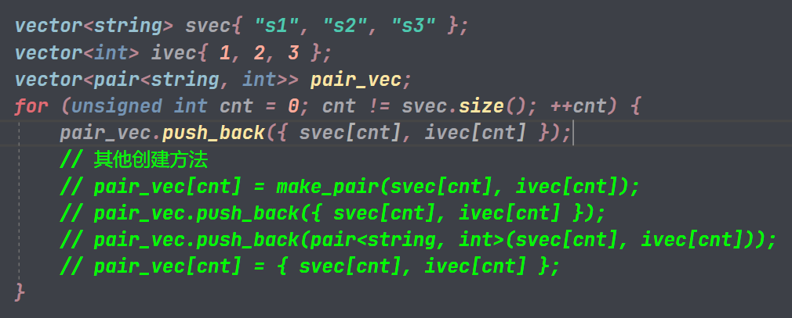

>   push_back用给定初始值列表构造一个pair对象, 然后压入容器末尾


# 关联容器操作

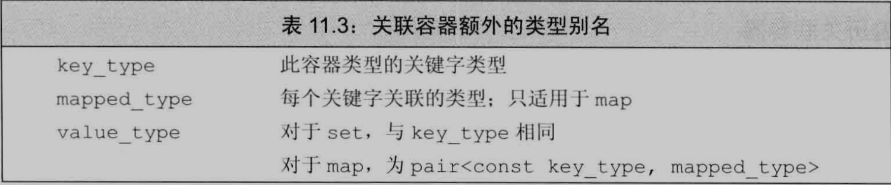


1.   对于set类型, **key_type**和**value_type**是一样的
2.   set中保存的值就是关键字
3.   map中,元素是关键字, 即, **每个元素都是一个pair对象, 包含一个关键字和一个关联的值**
4.   由于不能改变一个元素的关键字, ==**因此map里面这些pair的关键字部分是const的**(==value_type返回的是pair, 这个pair对象的key部分是const的)
5.   使用作用域运算符来提取一个类型的成员
6.   只有map类型(unordered_amp, unordered_multimap, multimap和map) 才定义了**mapped_type**


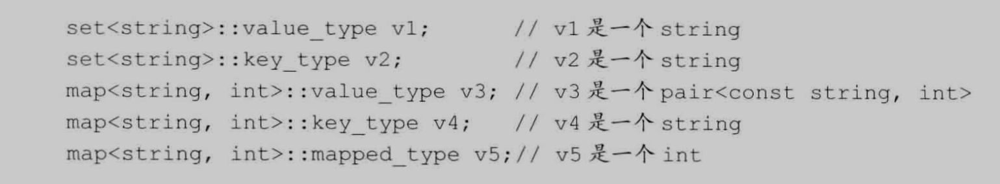


## 关联容器迭代器

-   解引用一个关联容器迭代器, 得到类型为容器的value_type值的引用
-   **对map而言, value_type是一个pair类型**
    -   其**first成员保存const的关键字**(所以不能对一个进行赋值等更改值的操作)
    -   second成员保存值

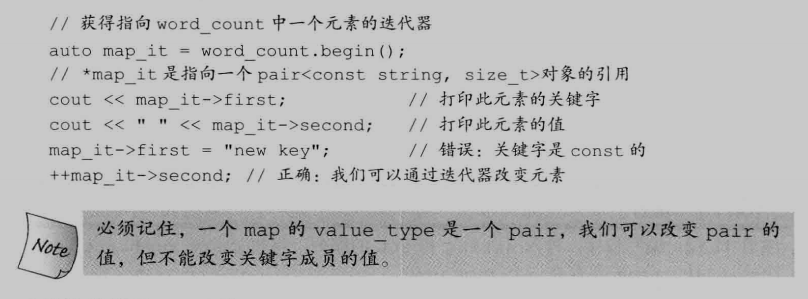

>   解引用一个map的迭代器得到一个pair, pair的first是const的, second是非const的


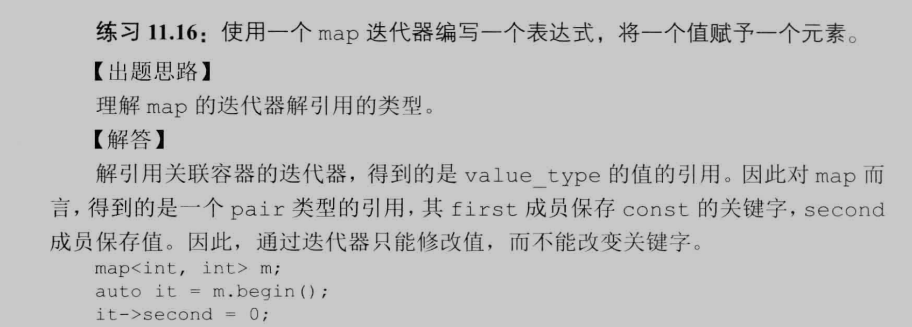

>   **因为m中没有任何元素, 所以解引用begin是错误的**


### set的迭代器是const的

1.   **set类型定义了iterator和const_iterator, 但是两种类型都只允许只读访问set中的元素, 也是const的**


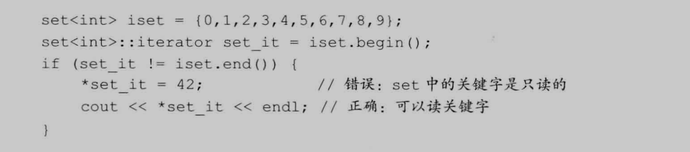


### 遍历关联容器

-   map和set类型都支持表9.2中的begin和end操作


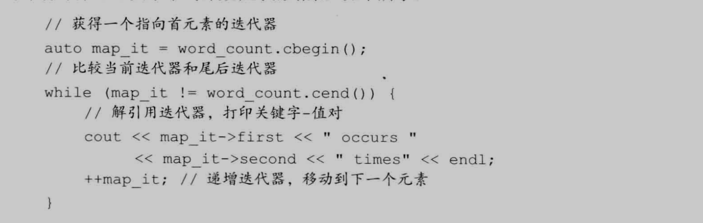

>   map的迭代器指向的是pair, 所以xx->first的xx是pair类型

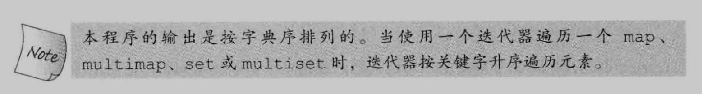


### 关联容器和算法

-   通常不对关联容器使用泛型算法,**因为关键字是const, 意味着不能将关联容器传递给修改或重排元素的算法**
-   **关联容器可用于只读取元素的泛型算法**, 但是是个坏主意
    -   关联容器定义了成员函数find, 使用这个比泛型find快


练习:

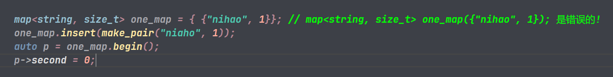


练习:

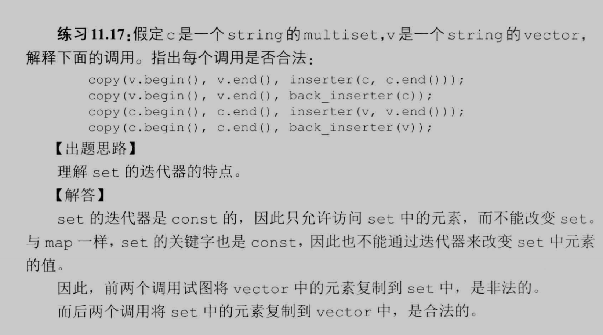

>   1.   **back_inserter**: 创建一个使用push_back的迭代器
>   2.   **front_inserter**: 创建一个使用push_front的迭代器
>   3.   **inserter**: 创建一个使用insert的迭代器, 该函数接受第二个参数, 这个参数必须是指向给定容器的迭代器, 元素将插入到给定迭代器所表示的元素之前, **inserter迭代器每次插入后都会返回指向被插入元素之后一个位置的迭代器, 也就是指向原来的元素的迭代器** ( C++ Primer 第358页上没讲加粗部分, 我草尼玛, 给劳资看懵了还在向为什么下面的copy得到的是顺序的而不是逆序的)

从上面来看, inserter返回的迭代器是const的, 然后copy想通过这个迭代器把值拷贝给const迭代器指向的元素, 所以就是错的了


## 添加元素

-   关联容器的**insert**成员向容器中添加一个元素或一个元素范围

-   ==由于map和set(以及对应的无序类型)仅包含不重复的关键字, 因此插入一个已经存在的元素对容器没有任何影响==

    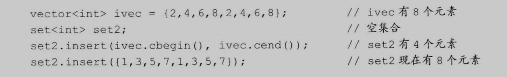


### 向map中添加元素

-   ==对一个map进行insert操作, 必须记住元素类型是pair==
-   ==通常对于插入的数据没有现成的pair对象, 可以再insert的参数列表创建一个pair==

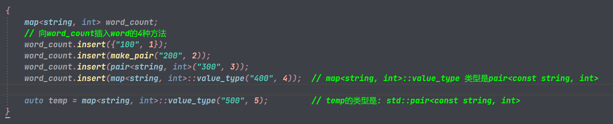

>   记住, map的元素的键是const的


### 表11.4: 关联容器insert操作

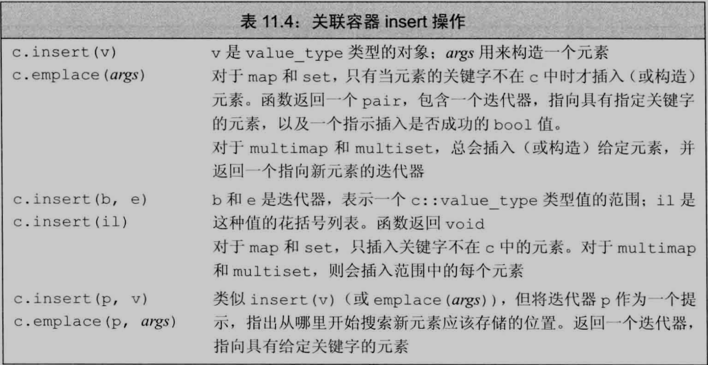


### 检测insert的返回值

-   insert或emplace返回的值依赖于容器类型和参数
-   ==对于不包含重复关键字的容器, 添加单一元素的insert和emplace版本返回一个pair==
    -   pair的first成员是一个迭代器, 指向具有给定关键字的元素
    -   second成员是一个bool值, 指出元素是插入成功还是已经存在容器中
        -   如果关键字已经在容器中, 则insert什么事情也不做, 且返回值中的bool部分为false
        -   如果关键字不在, 元素被插入容器中, 且bool值为true


例子:

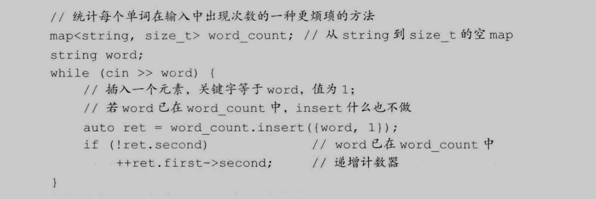


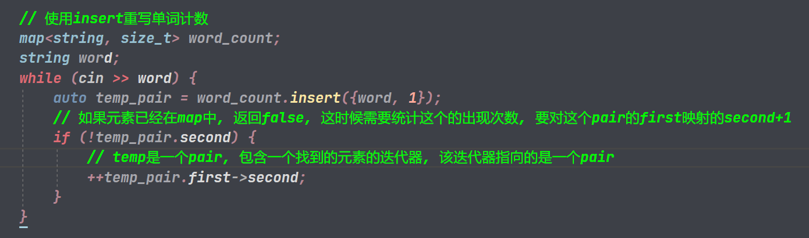


### 向multiset或multimap添加元素

-   如果希望添加具有相同关键字的多个元素, 使用multi开头的关联容器
    -   例如: 可能想建立作者到他所著书籍题目的映射, 此情况下作者可能有多个条目
-   由于multi容器中的关键字不必唯一, 在这些类型上调用insert总会插入一个元素


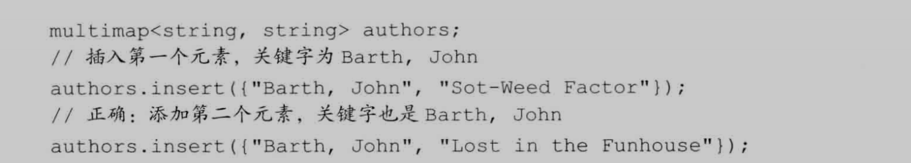

>   对于重复关键字的容器, 接受单个元素的insert操作返回一个指向新元素的迭代器, 这里无需返回一个bool值, 因为inset总是向这类容器中加入一个新元素


练习11.3.2

11.22

insert返回一个pair, pair包含一个指向被添加进容器的元素的迭代器, 还有一个确定是否插入的bool值

-   ==指向容器内元素的迭代器的是类型总是包含着用来创建该类型的类型:==
    -   ==例子1: map<string, vector< int>>::iterator==
    -   例子2: vector< int> ::iterator

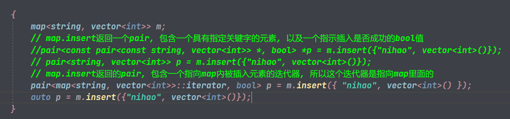


## 删除元素

-   删除成功, 返回大于0的值

-   没有删除成功, 说明map中没有这个元素, 返回0
-   对允许重复关键字的容器, 删除元素的数量可能大于1:


例子:

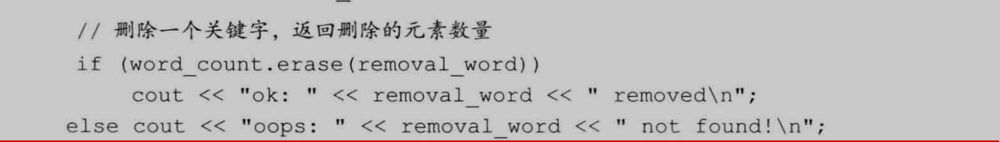


## 表11.5: 从关联容器删除元素

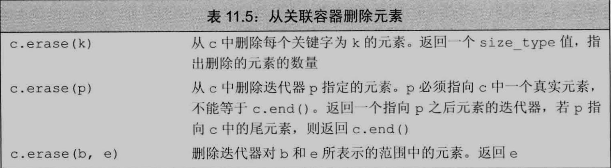


## map的下标操作

-   map和unordered_map容器提供了下标运算符和一个对应的at函数
-   set类型不支持下标, 因为set中没有与关键字相关的值
-   不能对一个multimap或一个unordered_multimap进行下标操作, 因为这些容器中可能有多个值与一个关键字相关联


**map下标运算符**

1.   map下标运算符接受一个索引(关键字)获取与此关键字相关联的值
2.   ==如果关键字不在map中, 会为它创建一个元素并插入到map中, **关联值将进行值初始化**==


例子:

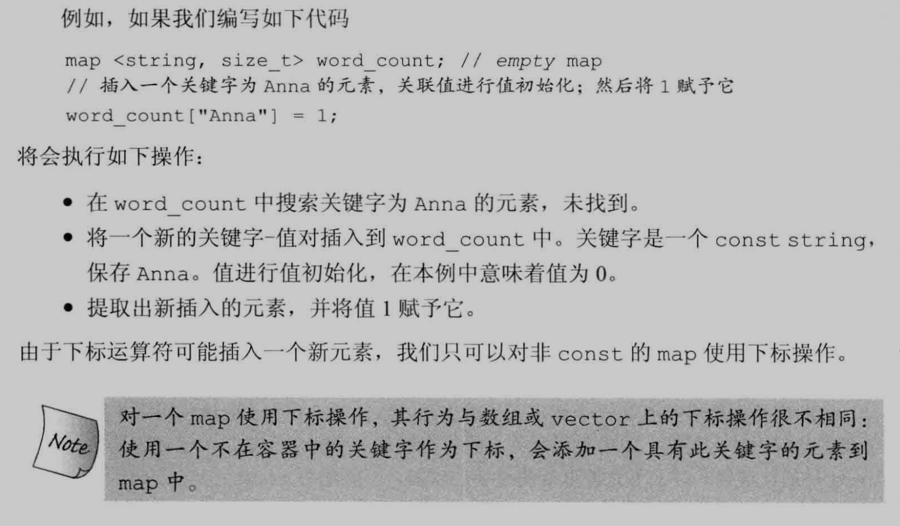


### 表11.6: map和unordered_map的下标操作

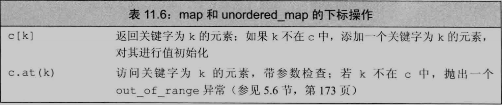


### 使用下标操作的返回值

-   对一个map进行下标操作, 得到一个**mapped_type对象**

-   解引用一个map迭代器, 会得到一个**value_type对象**(value_type是一个pair, pair的first是const的)

-   map的下标运算符返回一个左值

    -   所以可以进行读写元素

    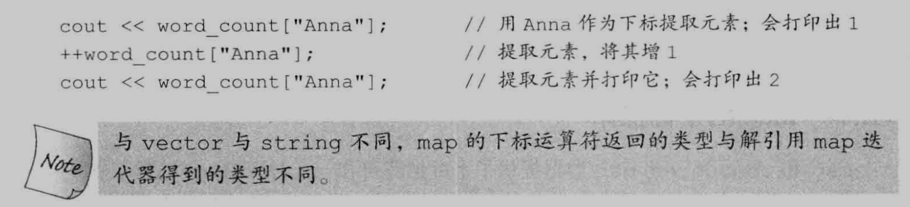


## 访问元素

-   如果只关心一个特定元素是否在容器中, find是最佳选择
-   对于不允许重复关键字的容器, 使用find或count没什么区别
-   对于允许重复关键字的容器, count还会做很多工作: 如果元素在容器中, 会统计还有多少元素有相同关键字
-   如果不需要计数, 最好使用find


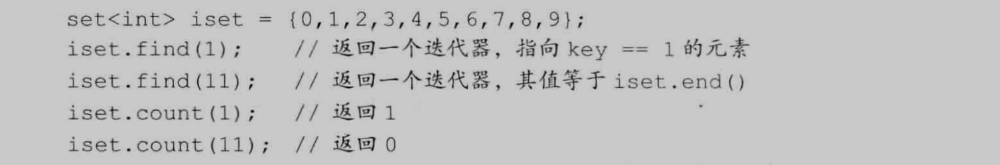


### 表11.7: 在一个关联容器中查找元素的操作

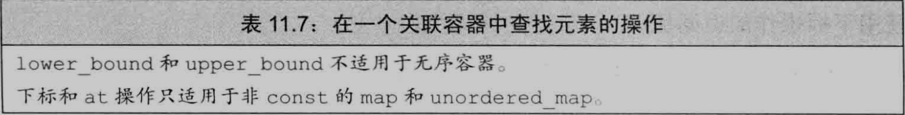

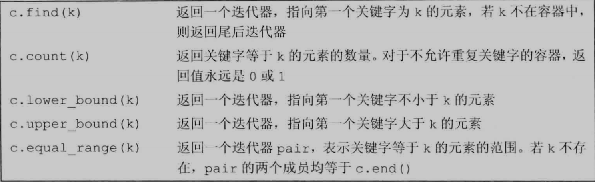


### 对map使用find代替下标操作

-   ==如果只想知道一个给定关键字是否在map中, 不想改变map, 应该使用find==
-   不能使用下标运算符来检查元素是否存在, 因为如果关键字不存在, 下表运算符会插入一个新元素


>   找不到指定关键字, 返回end
>
>   找到指定关键字, 返回对应关键字的迭代器


### 在multimap或multiset中查找元素

-   如果一个multimap或multiset中有多个元素值有给定关键字, 则这些元素在容器中会相邻存储


例子:

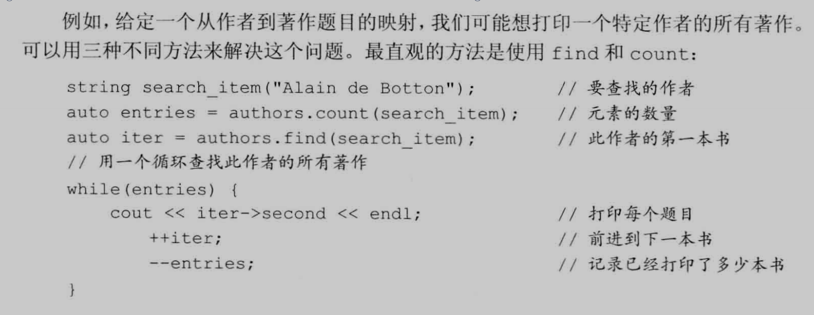

>   因为相同关键字的元素在相邻存储, 所以是成排的具有一定数量的一组相同关键字
>
>   count得到这组相同关键字的数量, 用来循环打印, 也决定了find返回的第一个元素的迭代器进行多少次迭代器, 保证指向的元素保存的
>
>   的first是要查找的关键字

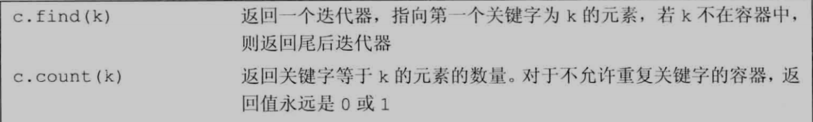


### 一种不同的, 面向迭代器的解决办法


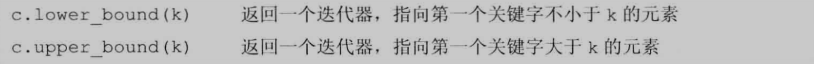


-   lower_bound返回的迭代器将指向第一个具有给定关键字的元素
-   upper_bound返回的迭代器指向最后一个匹配给定关键字的元素之后的位置
-   如果元素不在multimap中, lower_bound和upper_bound返回相等的迭代器, 指出关键字的正确插入位置-不影响关键字的排序
-   所以用相同关键字调用lower_bound和upper_bound会得到一个表示所有具有该关键字的元素的范围
    -   如果给定关键字比所有已经在容器内的关键字都大, 返回尾后迭代器


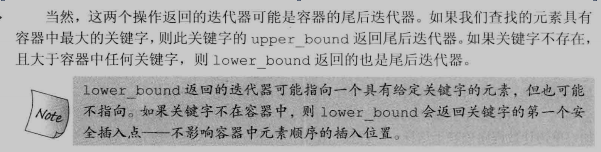

>   最大的关键字: 关键字是某种定义了<运算符的类型, 按照严格弱序排序(小于等于)


使用上面两个操作重写前面程序:

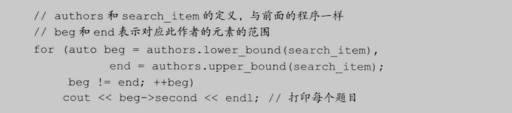

>   如果容器中没有要查找的关键字, beg将指向第一个关键字大于search_item的元素, 有可能是尾后迭代器


### equal_range函数

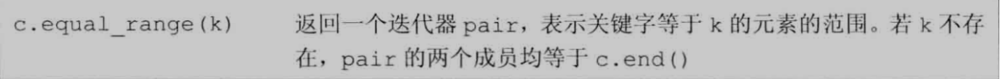


使用equel_range修改上面程序:


## 一个单词转换的map


管理整个过程的函数

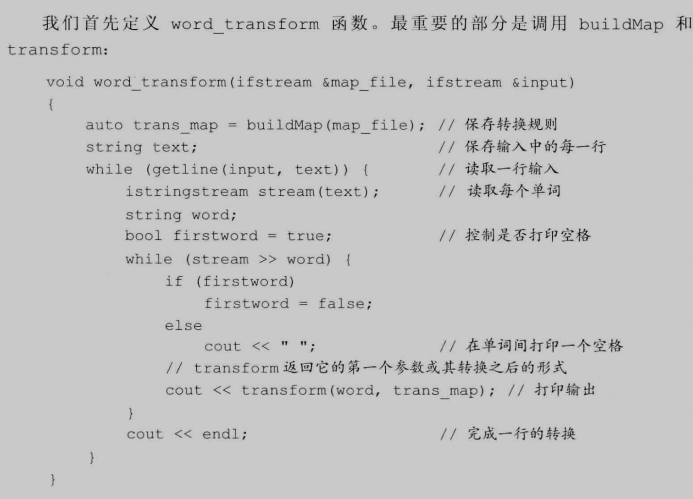


建立转换映射

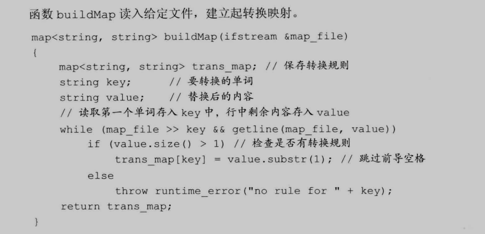

>   getline不会跳过空格


生成转换文本

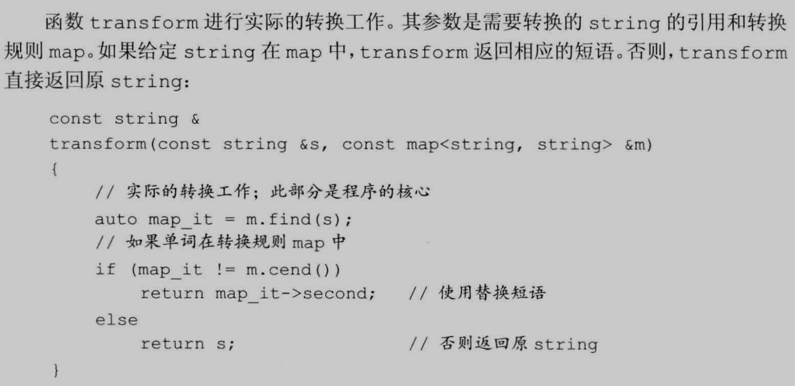


# 无序容器


## 无序容器什么时候使用?

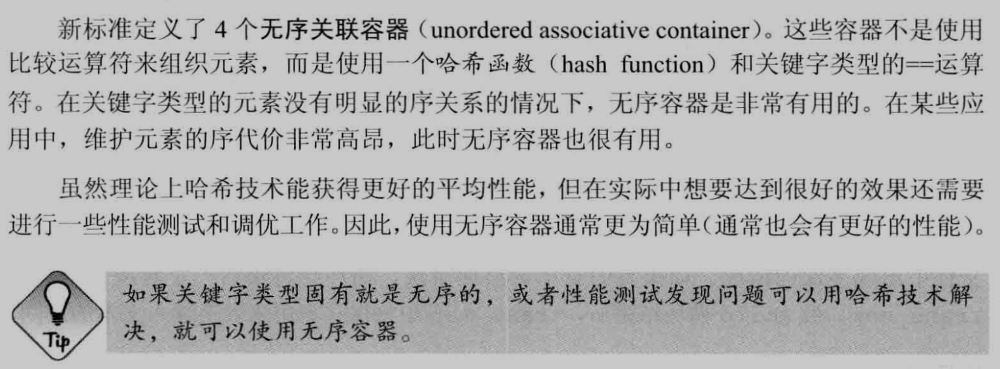


### 使用无序容器

-   unorddered_map
-   unordered_set
-   无序容器提供了与有序容器相同的操作(find, insert等)
-   无序容器有允许重复关键字的版本
-   ==通常可以用一个无序容器替换对应的有序容器==
    -   ==由于无序容器未按顺序存储, 一个使用无序容器的程序输出(通常)会使有序容器的版本不同==


例子: 使用unordered_map重写单词计数程序

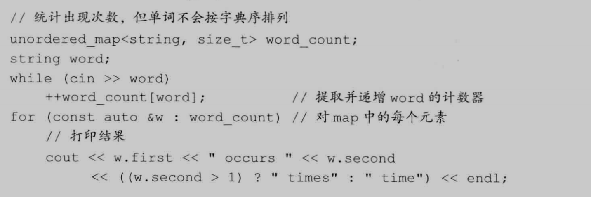


>   单词不太可能按字典序输出


### 管理桶

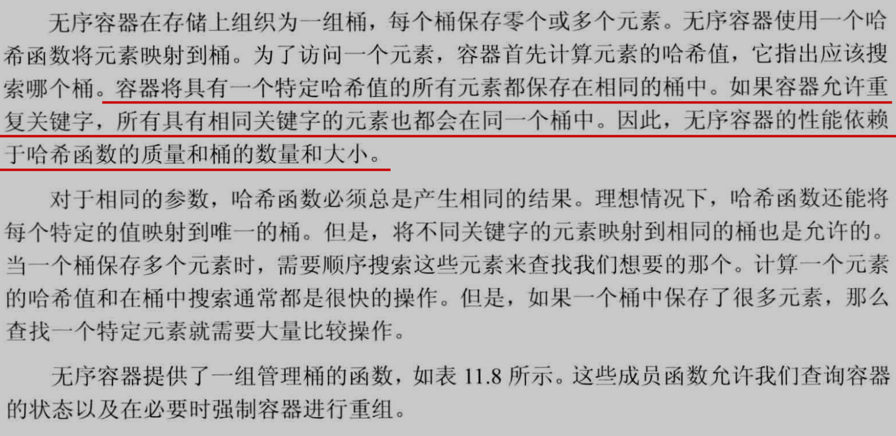


### 表11.8: 无序容器管理操作

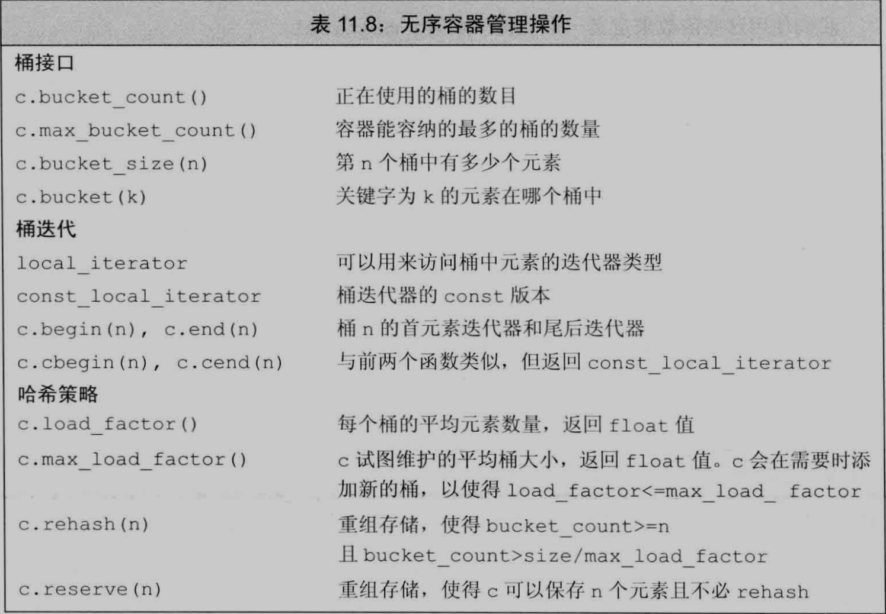


### 无序容器对关键的类型的要求

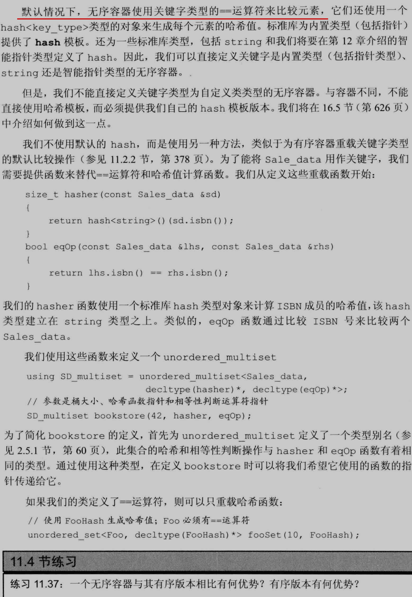

>   return hash<string>()  (sd.isbn()); 使用了运算符重载

