[TOC]


## 动态内存与智能指针


-   全局对象在程序启动时分配, 程序结束时销毁
-   局部自动对象, 进入其定义所在的程序块时创建, 离开块时销毁
-   局部static对象在第一次使用前分配, 程序结束时销毁


-   ==动态分配的对象的生存期与他们在哪创建无关, 只有当显式地被释放, 这些对象才会销毁==
-   可以用智能指针管理动态分配的对象; 当一个对象应该被释放时, 指向它的智能指针可以确保自动地释放它


-   静态内存用来保存局部static对象, 类static数据成员, 以及定义在任何函数之外的变量
-   栈内存用来保存定义在函数内的非static对象
-   分配在静态或栈内存中的对象由编译器自动创建和销毁
    -   对于栈对象: 仅在其定义的程序块运行时才存在
    -   对于static对象: 在使用之前分配, 程序结束时销毁
-   **自由空间(堆)**: 程序用堆来存储动态分配的对象, 即: 在程序运行时分配的对象
    -   动态对象的生存期由程序来控制, **当动态对象不再使用, 我们代码必须显式销毁它们**


-   **new**: 在动态内存中为对象分配空间并返回一个指向该对象的指针, 可以选择对对象进行初始化
-   **delete**:接受一个动态对象的指针, 销毁该对象, 并**释放**与之关联的内存
    -   会忘记释放内存, 产生**内存泄漏**
    -   尚有指针引用内存的情况下, delete就释放它指向的对象, 产生引用非法内存的指针
-   **智能指针: 负责自动释放所指向的对象**
    -   **shared_ptr**: 允许多个指针指向同一个对象;
    -   **unique_ptr**: "独占"所指向的对象
    -   **weak_ptr**: 伴随类, 是一种弱引用, 指向shared_ptr所管理的对象
    -   三种类型都定义在**头文件memory**


### shared_ptr类

-   智能指针也是模板, 需要提供额外信息说明指针可以指向的类型

    

    >   **上述默认初始化的智能指针保存着一个空指针(nullptr)**

-   智能指针使用方式与普通指针类似

    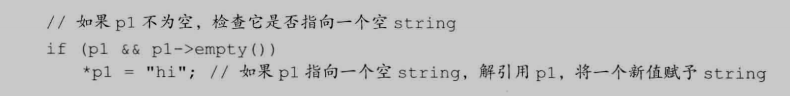


#### 表12.1: shared_ptr和unique_ptr都支持的操作

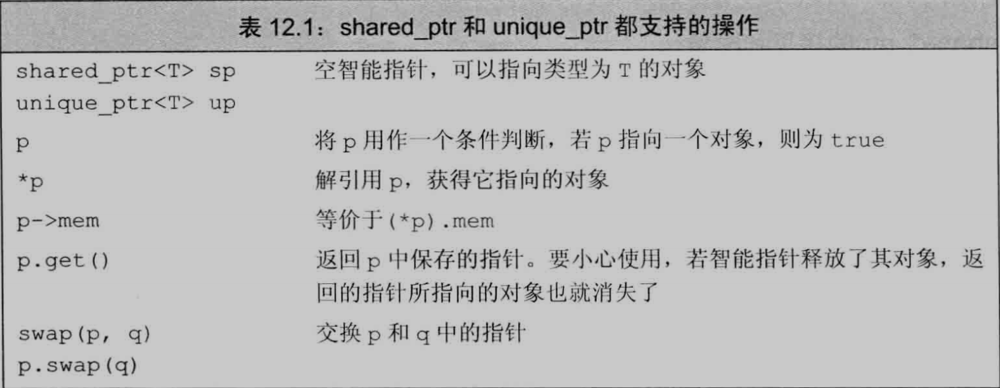


#### 表12.2: shared_ptr独有的操作

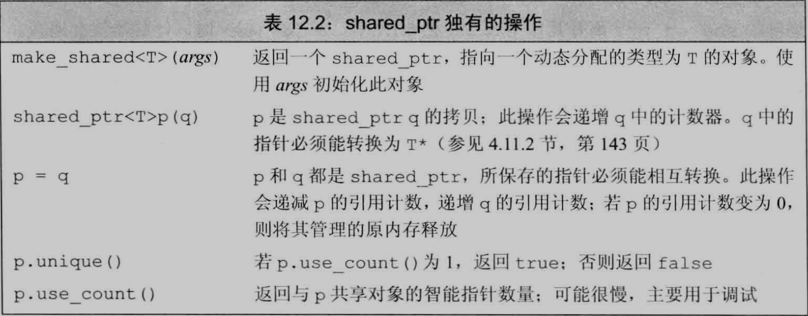


#### make_shared函数


-   **最安全**的分配和使用动态内存的方法是调用一个名为**make_shared**的标准库函数
    
    -   **==此函数在动态内存中分配一个对象并初始化它, 返回指向此对象的shared_ptr==**
    -   定义在**头文件memory**
    
-   必须指定想要创建的对象的类型, 定义方式和模板类相同

    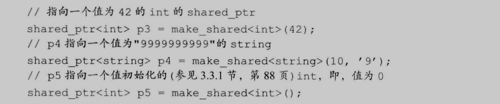

    >   make_shared用其参数来构造给定类型的对象
    >
    >   **如果我们不传递任何参数, 即仅使用(), 对象就会进行值初始化**

-   可以用auto定义一个对象来保存make_shared的结果:

    


#### shared_ptr的拷贝和赋值


-   **==当进行拷贝和赋值操作时, 每个shared_ptr都会记录有多少个shared_ptr指向相同的对象==**

    

    >   赋值的时候, 也就是 = 号右侧的用来赋值的临时shared_ptr对象的引用计数+1, 然后再真正赋值给p, 所以p的引用计数也是1

-   每个shared_ptr都有一个**关联**的计数器, 通常叫做**引用计数**

    -   ==**无论何时我们拷贝一个shared_ptr, 或将他作为参数传递给一个函数, 以及作为函数的返回值, 它所关联的计数器都会递增**==
    -   ==**给shared_ptr赋予一个新值或是一个shared_ptr被销毁(例如局部的shared_ptr离开其作用域), 计数器就会递减**==

-   ==**一旦一个shared_ptr的计数器变为0, 它就会自动释放自己所管理的对象**==

    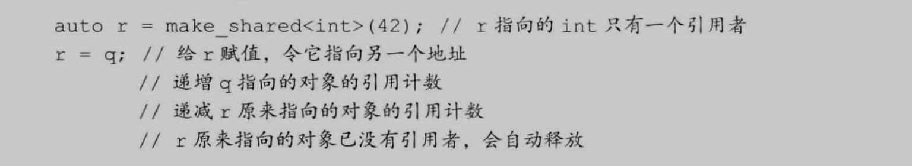


#### shared_ptr自动销毁所管理的对象


-   当指向一个对象的最后一个shared_ptr被销毁, shared_ptr类会自动销毁此对象
    -   通过**析构函数**完成销毁工作
    -   **析构函数**控制此类型的对象销毁时做什么操作
    -   析构函数一般用来释放对象所分配的资源
    -   shared_ptr的析构函数会递减它所指向的对象的引用计数, 也能用计数如果变为0, shared_ptr的析构函数就会销毁对象, 并释放所它占用的内存


#### shared_ptr还会自动释放相关联的内存


-   当动态对象不再被使用, shared_ptr类会自动释放动态对象

    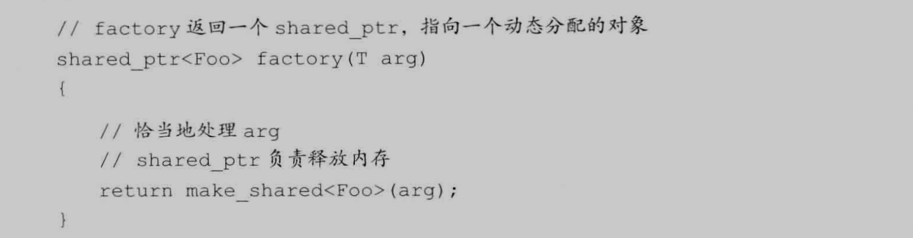

    >   由于factory返回一个shared_ptr, 所以可以确保它分配的对象会在恰当的时刻被释放

-   下面的函数将factory返回的shared_ptr保存在局部变量中:

    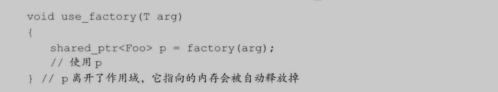

    >   p被销毁时, 将递减其引用计数并检查它是否为0, 由于p将要销毁, p指向的对象也会被销毁, 所占用的内存也会被释放

-   如果其他shared_ptr也指向这块内存, 它就不会被释放掉

    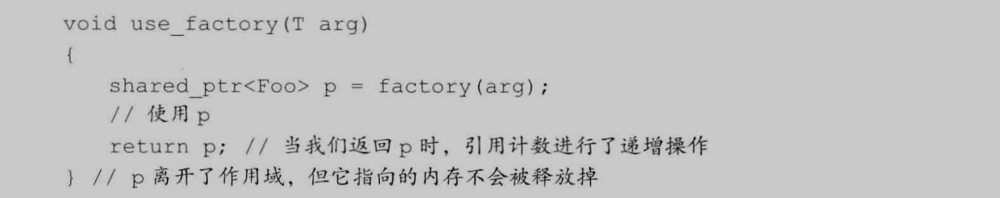

    >   return 语句返回一个p的拷贝, 拷贝一个shared_ptr会增加所管理对象的引用计数
    >
    >   当p被销毁, 引用计数减1, 但是还有其他使用者
    >
    >   对于一块内存, shared_ptr类保证只要有任何shared_ptr对象引用它, 它就不会被释放掉


-   需要保证shared_ptr在无用之后不再保留; ?

    


#### StrBlob类

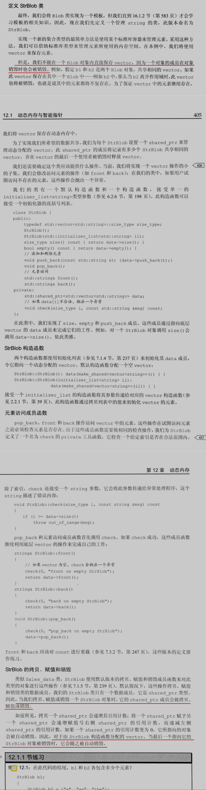


#### 使用了动态生存期的资源的类

-   程序使用动态内存出于以下三种原因之一:

    1.   程序不知道自己需要使用多少对象
    2.   程序不知道所需对象的准确类型
    3.   程序需在多个对象间共享数据

-   下面使用拷贝, vector"拥有"自己的元素, 当我们拷贝一个vector, 原vector和副本vector中的元素是相互分离的:

    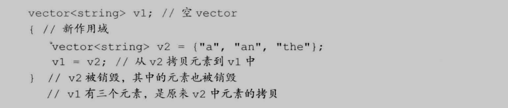

    >   这样的vector分配的元素, 只有在vector存在时才存在, 当一个vector被销毁, 这个vector的元素也被销毁

-   某些类分配的资源具有与原对象相互独立的生存期

    -   如果两个对象共享底层数据, 当某个对象被销毁, 不能单方面地销毁底层数据

        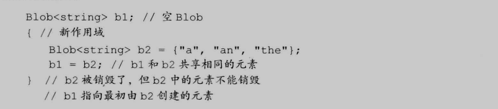

        >   当我们拷贝, 赋值或销毁一个Blob< string>对象, 它的shared_ptr成员会被拷贝, 赋值或销毁
        >
        >   -   **拷贝一个类的对象实际上是拷贝它的数据成员**
        >
        >   对于Blob< string>构造函数分配的vector, 当最后一个指向它的Blob< string> 对象被销毁, 它会随之被自动销毁


### 直接管理内存

-   **new**: 在动态内存中为对象分配空间并返回一个指向该对象的指针, 可以选择对对象进行初始化
-   **delete**:接受一个动态对象的指针, 销毁该对象, 并**释放**与之关联的内存
    -   会忘记释放内存, 产生**内存泄漏**
    -   尚有指针引用内存的情况下, delete就释放它指向的对象, 产生引用非法内存的指针


#### 使用new动态分配和初始化对象

-   在自由空间分配的内存是无名的, 因此**new**无法为其分配的对象命名, 而是返回一个指向该对象的指针

    

-   默认情况下, 动态分配的对象是默认初始化的, 对于内置类型或组合类型的对象的值将是**未定义**的, 而类类型对象将用默认构造函数进行初始化

    

-   可以使用**直接初始化方式**来初始化一个动态分配的对象, 也可以用传统的**构造方式**(使用圆括号), 或者使用**列表初始化**(使用花括号):

    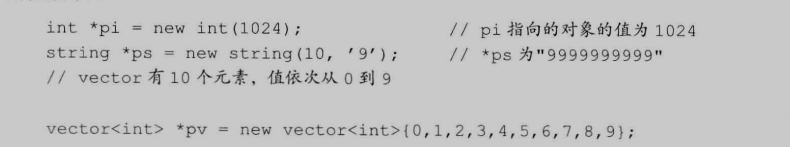

-   **也可以对动态分配的对象进行值初始化**, 在类型名后跟一对空括号:

    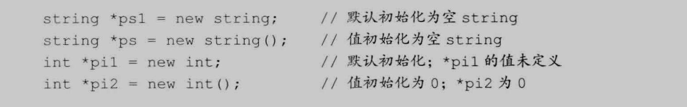

    >   对于定义了默认构造函数的类型,值初始化没什么意义, 因为都会通过默认构造函数来初始化
    >
    >   对于内置类型, 默认初始化的对象具有未定义的值, 所以要进行值初始化或显式传递一个值

-   如果提供**一个**括号包围的单个初始化器, 可以用auto

    

-   **用new分配const对象是合法的:**

    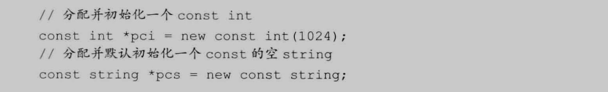

    >   和其他任何const对象一样, 一个动态分配的const对象必须进行初始化


#### 内存耗尽(含有: 定位new)

-   一旦一个程序用光了它所有可用的内存, new表达式就会失败

-   默认情况下, new不能分配所要求的空间, 它就会抛出一个类型为**bad_alloc**的异常

-   ==**可以使用定位new的方式阻止抛出异常**==

    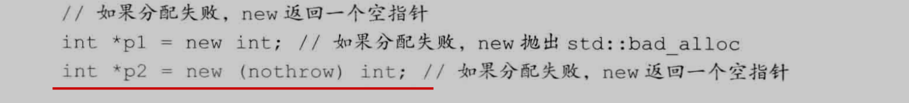

    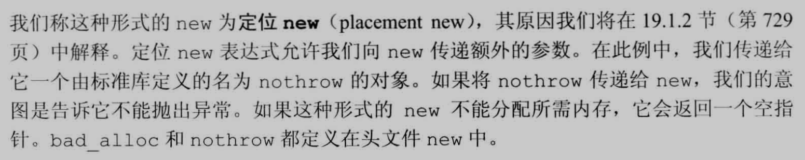


#### 释放动态内存( 含有: 使用delete )

-   为了防止内存耗尽, 在动态内存使用完毕后, 必须将其归还给系统

-   通过**delete表达式**将动态内存归还给系统

-   ==**delete**表达式接受一个指针, 指向我们想要释放的对象==

    

-   delete表达式执行两个动作: 

    1.   销毁给定的指针指向的对象
    2.   释放对应的内存
    
-   不能对智能指针使用delete


#### 指针值和delete

-   **==传递给delete的指针必须指向动态分配的内存, 或者是一个空指针==**

-   **==释放一块并非new分配的内存, 或者将相同的指针值释放多次, 其行为是未定义的==**

    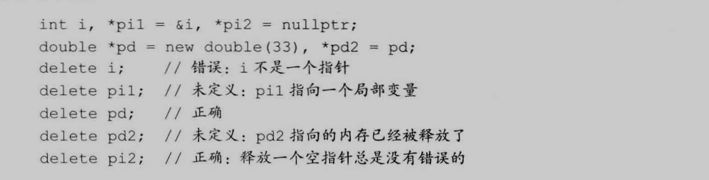

-   const对象的值不能被改变, 但是可以销毁const对象

    


#### 动态对象的生存期直到被释放时为止

-   对于一个内置指针管理的动态对象, 直到被显式释放之前它都是存在的

-   返回指向动态内存的指针(而不是智能指针)的函数给其调用者增加了一个额外负担, 让调用者必须记得释放内存

    

    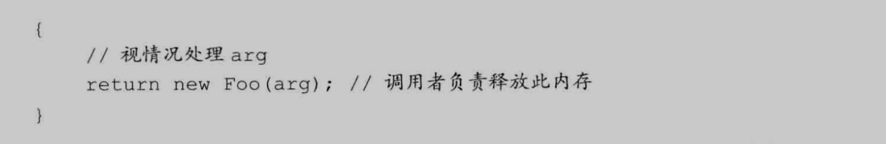

-   factory不会释放对象, 并且调用者也经常忘记释放对象:

    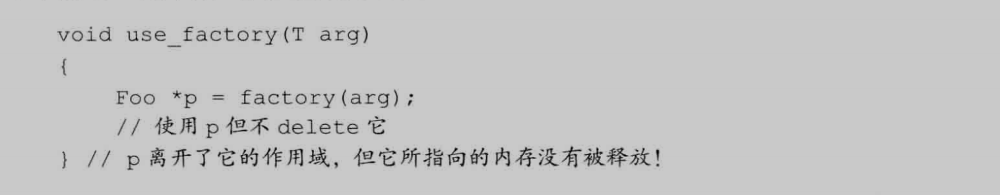

    >   内置类型的对象被销毁时什么也不会发生, 所以如果指向动态内存, 那么内存将不会被自动释放

-   修正错误的方法1: 在use_factory中记得释放内存

    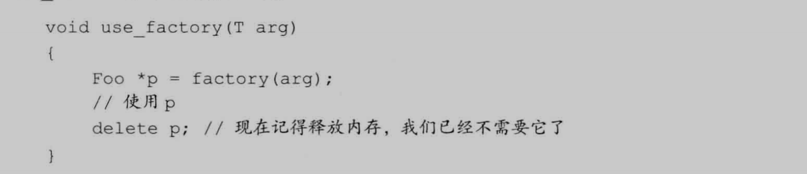

-   修正错误的方法2: 继续让use_factory返回该指针, 让其调用者释放内存

    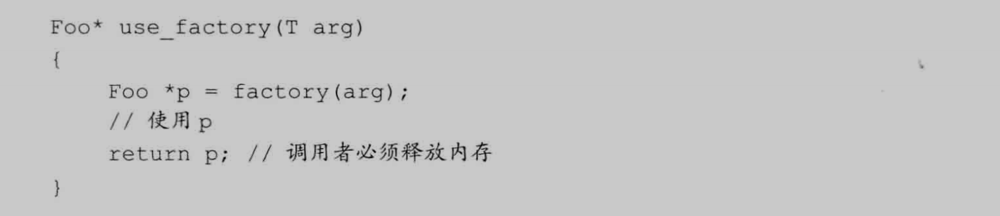


#### 使用new和delete管理动态内存存在三个常见问题


1.   **忘记delete内存: 忘记释放动态内存会导致"内存泄漏", 通常应用程序运行很长时间, 真正耗尽内存, 才能检测到这种错误**
2.   **使用已经释放掉的对象: 释放内存后应该把指向该内存区域的指针置为空(nullptr)**
3.   **同一块内存释放两次: 两个指针指向相同的动态对象, 对其中一个指针进行delete, 对象的内存归还自由空间, 随后又delete第二个指针, 自由空间可能被破坏**
4.   **坚持使用智能指针, 就可以避免所有这些问题**


#### delete之后应该重置指针值

-   当delete一个指针后, 指针值就无效了, 但是仍可能有指针保存着(已经释放的)动态内存的地址

-   delete之后, 指针就变成了**==空悬指针==**: 指向一块曾经保存数据对象但现在已经无效的内存的指针

-   避免空悬指针的方法1:  在指针即将离开其作用域的之前释放掉它所关联的内存

    -   如果需要保留指针, 可以再delete之后将nullptr赋予指针

-   方法1只对这个指针有效, 仍可能有其他指针指向相同内存, 对这些指向(已释放)内存的指针没用

    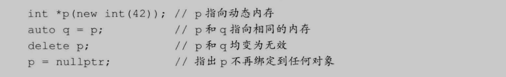

    >   此时q仍然保留着指向已经释放的内存的地址
    >
    >   多个指针指向同一个共享对象, 释放了动态内存之后, 应该把这些指针置位nullptr

-   另外, 智能指针不支持delete

    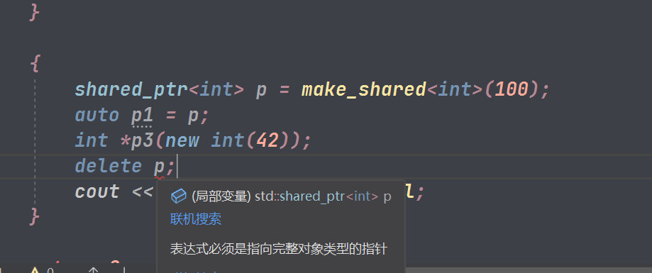


### shared_ptr和new结合使用

-   如果不显式初始化一个智能指针, 就会被初始化为一个空指针

-   可以用new返回的指针来初始化智能指针

    

-   ==接受指针参数的智能指针构造函数是explicit的==

    -   ==因此不能将一个内置指针隐式转换为一个智能指针, 必须使用直接初始化形式来初始化智能指针==

        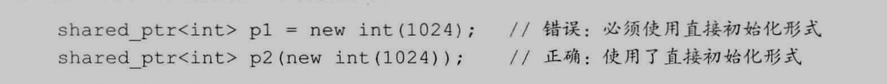

        >   p1 等号右边表达式企图用new返回的指针(int *)创建(隐式转换为)一个指向值为1024的int对象的临时的shared_ptr< int> 智能指针, 然后赋给它, 但是被explicit限制了这种转换
        >
        >   -   **使用 = 号是拷贝初始化, 会产生隐式转换, 将右侧的结果转换为左侧对象的类型**
        >
        >   p2的圆括号中的int*只是单纯地被用来构造shared_ptr< int>对象, 并没有任何转换

- 同上述原因, **一个返回shared_ptr的函数不能在其返回语句中隐式转换一个普通指针:**

    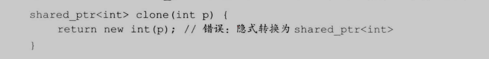

    >   因为会将要返回的值拷贝到调用点的临时量上
    >
    >   **==会隐式调用临时量的构造函数, 但是对应的构造函数是explicit的, 不能被隐式调用, 只能显式调用==**

    **必须将shared_ptr显式绑定到一个想要返回的指针上**

    

    >   拷贝要返回的shared_ptr的时候, 引用计数+1, 然后拷贝完毕, 返回函数的控制权给调用者, 引用计数-1

-   **默认情况下, ==一个用来初始化智能指针的普通指针必须指向动态内存, 因为智能指针默认使用delete释放它所关联的对象==**

    -   **可以将智能指针绑定到一个其他类型的资源的指针上, 但是这样必须提供自己的操作代替delete**


#### 表12.3: 定义和改变shared_ptr的其他方法

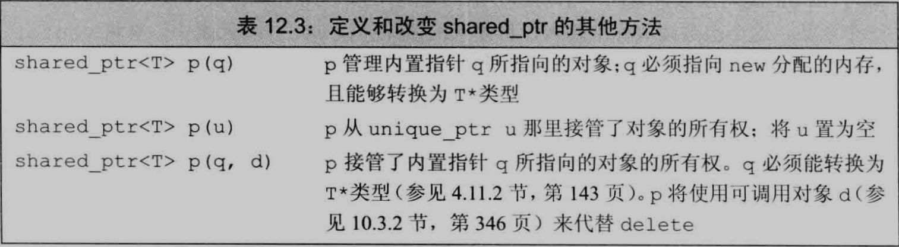

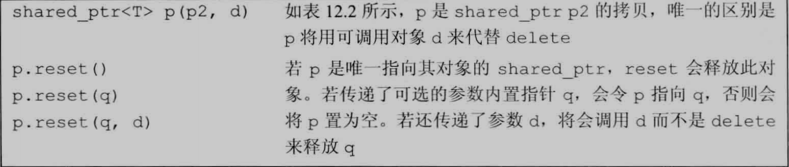


#### 不要混合使用普通指针和智能指针

1.   shared_ptr可以协调对象的析构, 但是仅限于其自身的拷贝(也是shared_ptr)之间

2.   所以使用推荐make_shared而不是new的原因; 这样就能在分配对象的同时就将shared_ptr与之绑定, 从而避免了无意中将同一块内存绑定到多个独立创建的shared_ptr上

     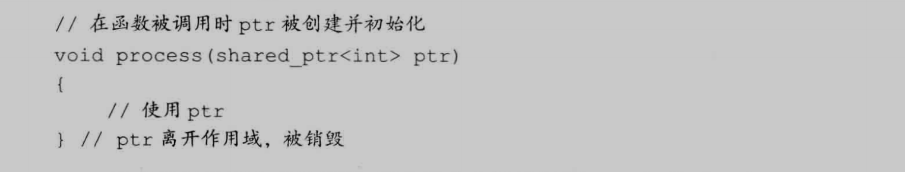

     >process的参数是传值方式传递的, 因此实参会被拷贝到ptr中
     >
     >**拷贝一个shared_ptr会递增其引用计数,** 在process运行过程中, 引用计数值至少为2; 因此当局部变量ptr被销毁, ptr指向的内存不会被释放
     >
     >-   书上说的是引用计数至少为2, 但是并不绝对:
     >
     >    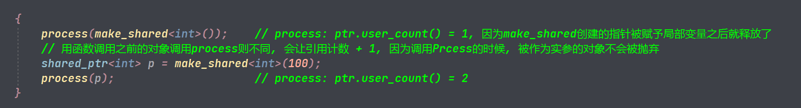
     >
     >    从上面可以看出, 在实参位置创建的临时shared_ptr< int> 对象在被拷贝的时候引用计数+1, 此时引用计数为1, 然后被拷贝初始化process的形参, 引用计数还是1, 因为临时shared_ptr< int>对象被销毁了

3.   使用process的正确方法是传递给它一个被命名的shared_ptr变量(**变量其实是具名的内存空间**)

     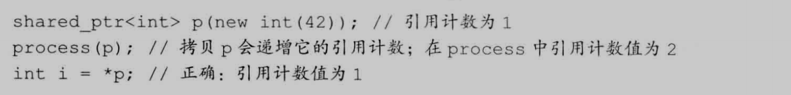

4.   虽然不能传递给process一个内置指针, 但可以传递给它一个(临时的)shared_ptr

     -   这个临时的shared_ptr是用一个内置指针显式构造的, 但是这样做可能导致错误

         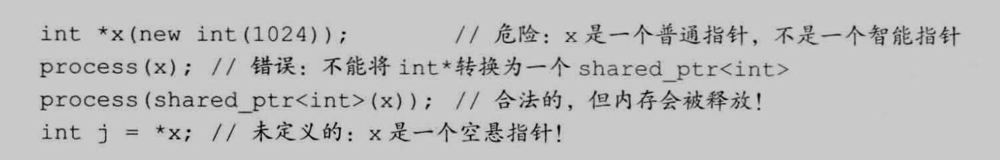

         >   x变成了空悬指针, 指向(已经释放的)内存
         >
         >   x指向的对象并不是因为临时的shared_ptr对象被销毁而释放, 而是因为process里作为形参的shared_ptr对象被销毁而释放 
         >
         >   -   书上说的是因为临时shared_ptr对象被销毁了,引用计数变为0, 所以才会被释放指向的内存, 并不是对的, 因为process里面作为形参的shared_ptr对象确实指向了这块内存!

     -   当把一个shared_ptr绑定到一个内置指针, 就由shared_ptr来管理指向的内存, 这时候不应该再使用内置指针来访问shared_ptr指向的内存, 因为我们无法知道对象何时会被销毁


##### 也不要用get初始化另一个智能指针或为智能指针赋值

-   智能指针定义了名为get的函数, 返回一个内置指针, 指向智能指针管理的对象

-   此函数为了这种情况而设计: 我们需要向不能使用智能指针的代码传递一个内置指针

-   **使用get返回的指针的代码不能delete此指针**

-   将另一个智能指针绑定到get返回的指针上是错误的, 编译器不会给出错误信息

    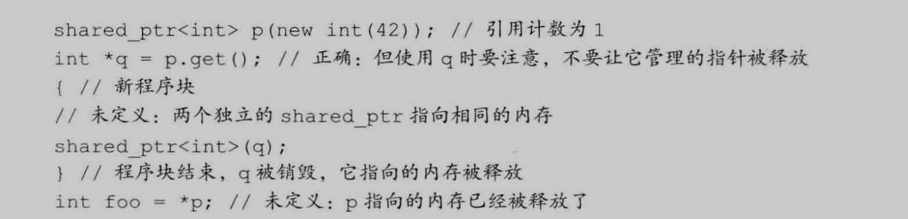

    >   拷贝或赋值会让一个shared_ptr的引用计数+1, 用get返回的指针也能让shared_ptr的引用计数+1可能是因为, 对应的构造函数里面进行了这个+1的操作

    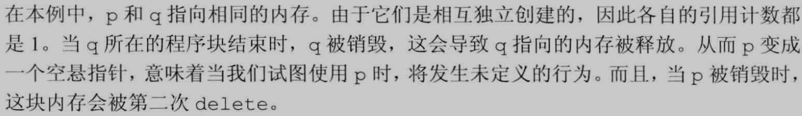

-   **只有确定代码不会delete指针的情况下, 才能使用get**

-   **==永远不要用get初始化另一个智能指针或者为另一个智能指针赋值==**


**重点**: 练习


>   注意点: 使用普通指针创建的shared_ptr的引用计数不是共享的, 是新的, 但因为确实指向了一个对象, 所以引用计数是1


例子:

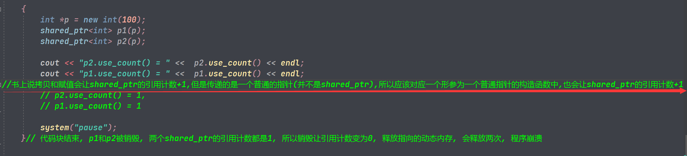


#### 其他shared_ptr操作

-   reset

    

-   可以用reset来将一个新的指针赋予一个shared_ptr

    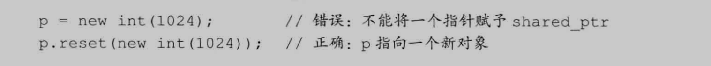

-   和赋值类似, reset会更新引用计数, 如果需要的话, 会释放掉p指向的对象

-   reset成员经常和unique一起使用, 来控制多个shared_ptr共享的对象


**例子: 在改变底层对象之前, 检查自己是否是当前对象仅有的用户; 如果不是, 在改变之前要制作一份新的拷贝:**

-   使用的函数

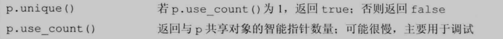

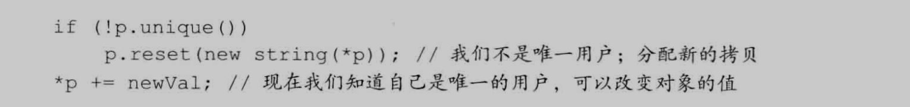

>   p.reset(new string(*p)), 指向一个新的动态对象, 该动态对象是 *p的拷贝
>
>   代码解释:
>
>   -   判断p是不是唯一指向该动态对象的
>   -   如果不是, 执行if分支, 分配新的动态对象(是一个原来指向的对象的拷贝), 然后让p指向新的动态对象, 执行*p += newVal;
>   -   如果是, 就不执行if分支, 因为是唯一指向其对象的shared_ptr, 然后执行*p += newVal


### 智能指针和异常

-   某些程序需要确保在异常发生后资源能被正确地释放

-   **==如果使用智能指针, 即使程序块过早结束, 智能指针类也能确保在内存不再需要时将其释放==**

    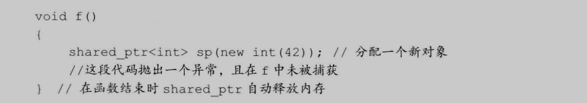

    函数的退出有两种可能, 正常处理或发生了异常

    **无论哪种情况, 局部对象都会被销毁, 所以sp被销毁时检查引用计数(将引用计数减1), 这个例子中sp是指向这块内存的唯一shared_ptr, 因此内存会被释放掉**


-   **当发生异常时, 直接管理的内存是不会自动释放的**

-   ==**如果使用内置指针管理内存, 且在new之后在对应的delete之前发生了异常, 则内存不会被释放:**==

    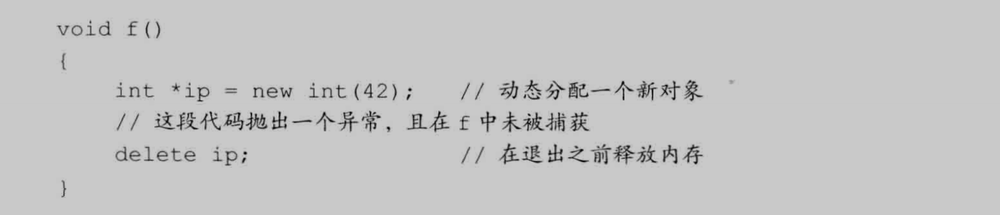

    >   因为抛出异常, 剩下的函数体就不会执行了, 所以永远不会执行到delete ip; 也就永远不会释放ip指向的动态内存


#### 智能指针和哑类


>   connection用来连接
>
>   当不再使用connection的时候应该关闭连接
>
>   connection应该定义自己的析构函数: 当connection销毁的时候执行关闭连接操作


#### 使用自己的释放操作( 用可调用对象代替delete )

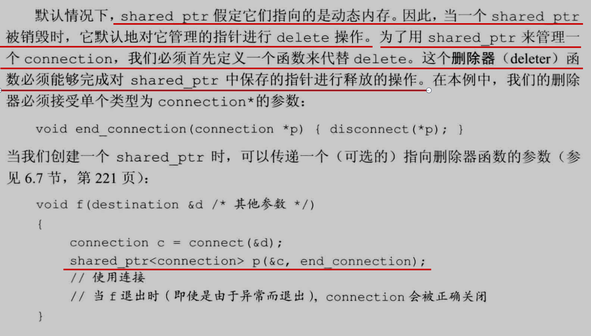

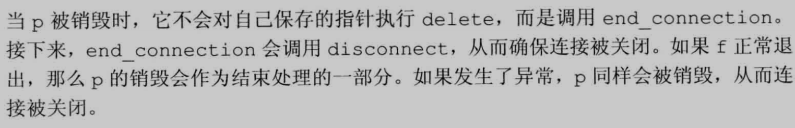


==**综上所述, 当一个类没定义析构函数, 或者不良好的析构函数, 还可以使用智能指针管理他们, 在不使用他们的时候用给定的可调用对象(操作)代替delete**==


==**如果shared_ptr管理的资源不是动态对象, 记得传递一个删除器(可调用对象: 函数或lambda), 不能使用默认的delete**==,


#### 表12.3: 定义和改变shared_ptr的其他方法


## 智能指针使用规范


### unique_ptr

-   一个unique"拥有"它所指向的对象
-   和shared_ptr不同, **某个时刻==只能有一个unique_ptr指向一个给定对象==**
-   当unique_ptr销毁时, 它所指向的对象也被销毁


#### 表12.4: unique_ptr操作

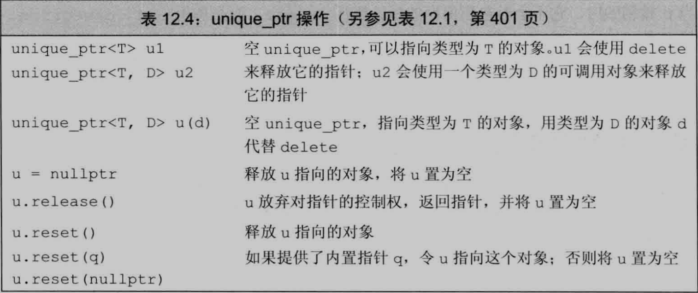


#### 表12.1: shared_ptr和unique_ptr都支持的操作


-   ==定义一个unique_ptr, 需要将其绑定到一个new返回的指针上==

-   ==初始化unique_ptr必须采用直接初始化形式==

    

-   ==由于一个unique_ptr拥有它所指向的对象, 因此**unique_ptr不支持普通的拷贝或赋值操作**==

    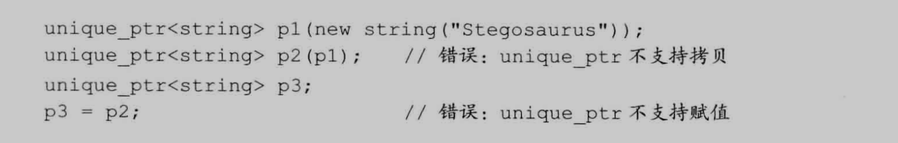

    >   p2的确实是直接初始化(直接调用对应构造函数, 没有进行转换), 但是是值传递给构造函数的形参

-   **但是可以通过调用 release或reset将指针的所有权从一个(非const)unique_ptr转移给另一个unique**

    

-   调用release会切断unique_ptr和它原来管理的对象间的联系; release返回的指针通常被用来初始化另一个智能指针或给另一个智能指针赋值

    -   如果不用另一个智能指针来保存release返回的指针, 我们的程序就要负责资源的释放

        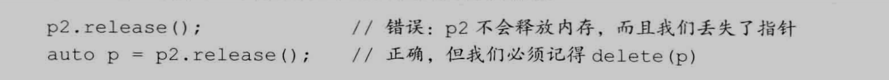


#### 传递unique_ptr参数和返回unique_ptr

-   **==不能拷贝unique_ptr的规则有一个例外: 可以拷贝或赋值一个将要销毁的unique_ptr:==**

    -   例子: 从函数返回一个unique_ptr

        

    -   还可以返回一个局部unique_ptr的拷贝:

        

        >   上面两段代码, 编译器都知道要返回的对象将要被销毁;
        >
        >   这种情况下, **编译器执行一种特殊的拷贝,** 在C++ Primer (473页)中介绍


-   还有个名为auto_ptr的类, 具有unique_ptr的部分特性, 不建议使用


#### 向unique_ptr传递删除器

-   unique_ptr默认情况下也用delete释放它指向的对象

-   重载一个unique_ptr的删除器必须在尖括号中unique_ptr指向类型之后提供删除器类型

-   在创建或reset一个这种unique_ptr类型的对象时, 必须提供一个指定类型的可调用对象(删除器):

    

    >   用objT的指针的类型来调用可调用对象, 所以fcn的形参是objT *
    >
    >   智能指针保存的数据成员是指向动态对象的指针, 也就是说==可调用的形参的类型必须和该动态对象的指针类型一样==

    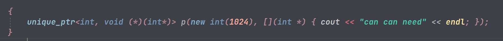


例子: 重写连接程序, 用unique_ptr来代替shared_ptr

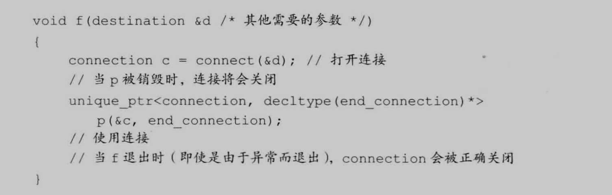


### weak_ptr


-   weak_ptr是一种不控制所指对象生存期的智能指针, 指向由一个shared_ptr管理的对象
-   将一个weak_ptr绑定到一个shared_ptr不会改变shared_ptr的引用计数
-   一旦最后一个指向对象的shared_ptr被销毁, 对象就被释放, 即使有weak_ptr指向对象, 对象也会被释放


#### 表12.5: weak_ptr

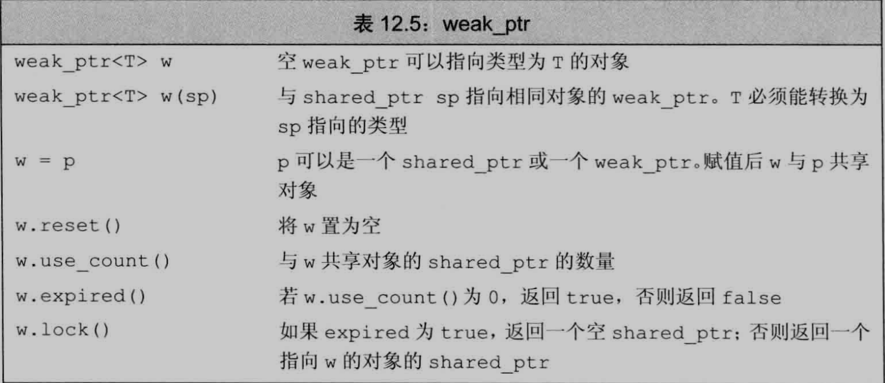

```C++
shared_ptr<int> p1 = make_shared<int>(12);
weak_ptr<char> p2(p1);	// char能提升成int啊, 还是不行
```


创建一个weak_ptr, 要用shared_ptr来初始化它:


>   wp和p指向相同的对象, 由于是弱共享, 创建wp不会改变p的引用计数
>
>   wp指向的对象可能被释放掉


**==由于对象可能不存在, 不能直接使用weak_ptr访问对象, 必须调用lock==**

-   lock: 检查weak_ptr指向的对象是否存在, 如果存在, lock返回一个指向共享对象shared_ptr, 如果不存在, 返回一个空shared_ptr

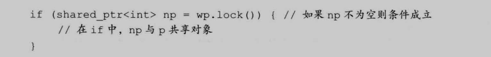

>   如果np的值不为nullptr则条件成立


#### 核查指针类

-   要让StrBlob操作起来像操作vector一样, 但是StrBlob可以自动释放内存
-   要让StrBlobPtr操作起来像操作StrBlob一样, 但是不负责释放内存, 仅当StrBlob释放内存, 否则一直指向StrBlob的vector

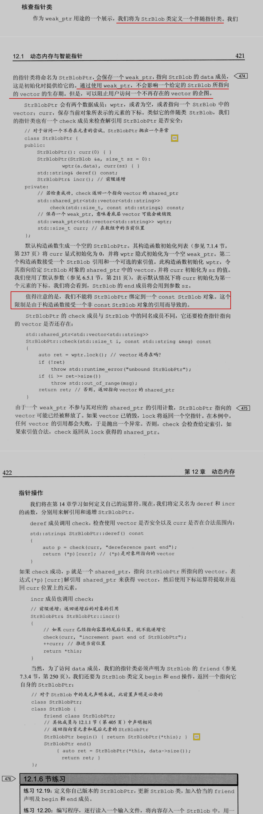


#### 完整的StrBlob

```C++
// StrBlob.h
#pragma once
#ifndef STRBLOB
#define STRBLOB

#include <vector>
#include <memory>
#include <string>
#include <initializer_list>

class StrBlob {
    friend class StrBlobPtr;
public:
    typedef std::vector<std::string>::size_type size_type;
    // 空vector的构造函数
    StrBlob();

    // 传入一个初始值列表的构造函数
    StrBlob(std::initializer_list<std::string> il);

    // 返回data指向的vector的大小
    size_type size() const;

    // 重载版本, 常量对象不能调用
    void push_back(const std::string &);
    void pop_back();

    // 元素访问, front首元素和back尾元素
    std::string& front();
    std::string& back();

    // 常量版本
    const std::string& front() const;
    const std::string& back() const;

    // 返回一个StrBlobPtr, 该对象指针当前StrBlob对象
    // 返回首元素
    StrBlobPtr begin();
    // 返回尾元素
    StrBlobPtr end();

private:
    void check(size_t, const std::string &) const;

    std::shared_ptr<std::vector<std::string>> data;
};

#endif 
```

```C++
// StrBlob.cpp
#include <vector>
#include <memory>
#include <string>
#include <stdexcept>
#include "StrBlob.h"
#include "StrBlobPtr.h"

using namespace std;

// 空vector的构造函数
StrBlob::StrBlob() : data(make_shared<vector<string>>()) {}


// 传入一个初始值列表的构造函数
StrBlob::StrBlob(std::initializer_list<std::string> il) : data(make_shared <vector<string>>(il)) {}


// 返回data指向的vector的大小
StrBlob::size_type StrBlob::size() const {
    return data->size();
}


// 重载版本, 常量对象不能调用
void StrBlob::push_back(const std::string &str) {
    data->push_back(str);
}


// 弹出尾元素
void StrBlob::pop_back() {
    check(0, "就这还pop_back? 大傻逼?");
    data->pop_back();
}


// 元素访问, front首元素和back尾元素
std::string& StrBlob::front() {
    check(0, "就这还front? 大傻逼?");
    return data->front();
}


// 弹出尾元素
std::string& StrBlob::back() {
    check(0, "就这还back? 大傻逼?");
    return data->back();
}


// 常量版本
const std::string& StrBlob::front() const {
    check(0, "就这还fron? 大傻逼?");
    return data->front();
}


const std::string& StrBlob::back() const {
    check(0, "就这还back? 大傻逼?");
    return data->back();
}


// 判断是否有元素或下标是否合法
void StrBlob::check(size_t curr, const std::string &msg) const {
    if (curr >= data->size()) {
        throw out_of_range(msg);
    }
}

// 返回一个StrBlobPtr, 该对象指针指向StrBlob对象(实际上是StrBlobPtr的weak_ptr指向StrBlob对象的shared_ptr指向的对象)
// 返回首元素
StrBlobPtr StrBlob::begin() {
    check(0, "就这还想begin? 大傻逼?");
    return StrBlobPtr(*this);
}

// 返回尾元素
StrBlobPtr StrBlob::end() { auto ret = StrBlobPtr(*this, data->size()); return ret; }
```


#### 完整的StrBlobPtr

```C++
// StrBlobPtr.h
#pragma once
#ifndef STRBLOBPTR
#define STRBLOBPTR

#include <vector>
#include <memory>
#include <string>
#include <stdexcept>
#include "StrBlob.h"

class StrBlobPtr {
public:
    // 仅仅值初始化一个curr
    StrBlobPtr();

    // 初始化wptr, 初始化curr
    StrBlobPtr(StrBlob& a, std::size_t sz = 0);

    // 获取当前对象指向的vector的当前对象的curr个位置上的元素
    std::string &deref() const;

    // 前缀递增, 模仿内置的前缀底层, 返回当前的对象的
    StrBlobPtr& incr();

private:
    // 检查weak_ptr指向的对象存不存在, 如果存在, 返回指向该对象的shared_ptr
    std::shared_ptr<std::vector<std::string>> check(std::size_t, const std::string &) const;

    // 指向某个共享对象指向的对象
    std::weak_ptr<std::vector<std::string>> wptr;

    // 下标
    std::size_t curr;
};

#endif  
```

```C++
// StrBlobPtr.cpp
#include <vector>
#include <memory>
#include <string>
#include <stdexcept>
#include "StrBlobPtr.h"
#include "StrBlob.h"

using namespace std;

// 仅仅值初始化一个curr
StrBlobPtr::StrBlobPtr() : curr(0) {}

// 初始化wptr, 初始化curr
StrBlobPtr::StrBlobPtr(StrBlob& a, std::size_t sz) : wptr(a.data), curr(sz){}


// 获取当前对象指向的vector的当前对象的curr个位置上的元素
std::string &StrBlobPtr::deref() const {
    // 先判断当前是否指向一个对象, 需要调用check
    auto p = check(curr, "越界");
    return (*p)[curr];
}


// 前缀递增, 模仿内置的前缀底层, 返回当前的对象
StrBlobPtr& StrBlobPtr::incr() {
    check(curr, "越界");
    ++curr;
    return *this;
}


// 检查weak_ptr指向的对象存不存在, 如果存在, 返回指向该对象的shared_ptr
std::shared_ptr<std::vector<std::string>> StrBlobPtr::check(std::size_t, const std::string &) const {
    auto ret = wptr.lock();
    if (!ret) {
        throw runtime_error("weak_ptr指向的对象被释放");
    }
    if (curr >= ret->size()) {
        throw out_of_range("下标越界");
    }

    return ret;
}   
```


## 动态数组

1.   大多数应该应该使用标准库容器而不是动态分配的数组, 使用容器更简单并且不容易出现内存管理错误, 并且有更好的性能
2.   使用容器的类可以使用默认版本的拷贝, 赋值和析构操作
3.   分配动态数组的类必须定义自己版本的操作, 在拷贝,复制,以及销毁对象时管理所关联的内存


### new和数组

-   形式:

```C++
type * variable_name = new type[size];
```

>   例子:
>
>   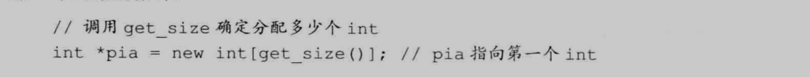


-   方括号中的大小必须是整型, 但不必是常量

-   也可以用一个表示数组类型的类型别名来分配一个数组, 这样new表达式中就不需要括号了

    >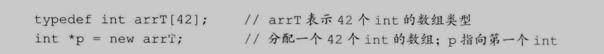
    >
    >因为数组的类型总是包括维度

-   **==动态数组并不是数组类型==**

-   new 返回的是一个元素类型的指针

    -   ==所以当用new分配一个数组, 并未得到一个数组类型的对象, 而是得到一个数组元素类型的指针==
    -   即使我们使用类型别名定义了一个数组类型, new也不会分配一个数组类型的对象

-   由于分配的内存并不是一个数组类型, **因此不能对动态数组调用标准库begin或end**

    -   这些函数使用数组维度来返回指向首元素和尾后元素的指针
    -   ==维度也是数组类型的一部分==

-   出于上述原因(不能调用begin和end), 也==不能用范围for语句来处理所谓动态数组中的元素==


#### 初始化动态分配的数组

-   默认情况下, new分配的对象, 不管是单个分配还是数组中的, 都是默认初始化的

-   可以对数组中的元素进行值初始化, 在大小之后跟一堆空括号, 但不能在括号中给出初始化器

    >   

-   可以提供一个元素初始化器的花括号列表

    >   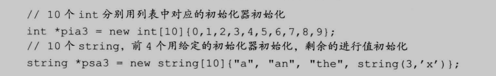
    >
    >   和内置数组对象一样, 如果初始化器数目小于元素数目, 剩余元素进行值初始化
    >
    >   如果初始化器大于元素数目, 则new表达式失败, 不分配任何内存

-   **不能用auto分配数组**

    -   因为括号里面不能有值
    -   而花括号又有多个值
    -   所以auto就不能通过值来推断类型了


#### 动态分配一个空数组是合法的

-   ==可以用任意表达式来确定要分配的对象的数目, 就算数目是0==

    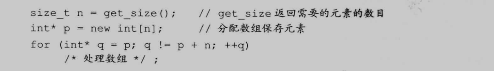

    >   如果get_size返回0, 代码可以正常运行
    >
    >   不能创建大小为0的静态数组对象(之前用的内置数组), 但当n等于0时, 调用new[n]是合法的, 但是不能解引用
    >
    >   
    >
    >   **用new分配大小为0的数组, new返回一个合法的非空指针**
    >
    >   此指针保证与new返回的其他任何指针都不同
    >
    >   对于0长度的数组来说, 此指针就像尾后指针一样, 可以像使用尾后迭代器一样使用这个指针, 进行比较操作等
    >
    >   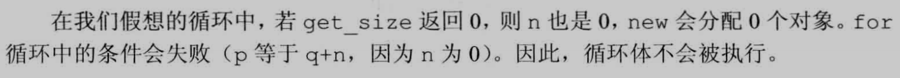


#### 释放动态数组


1.   **==为了释放动态数组, 需要在delete 后, 指针前加上一个空方括号对:==**


>   第二条语句销毁pa指向的数组中的元素数组中的元素按逆序销毁, 最后一个元素先被销毁, 然后是倒数第二个, 以此类推


2.   使用类型别名定义一个数组类型是, 在new表达式中不使用[], 但是释放一个数组指针时必须使用方括号

     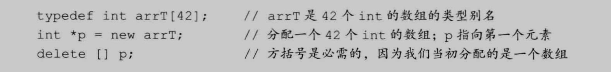


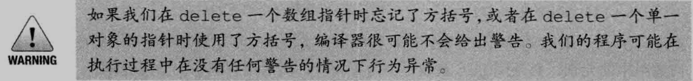


#### 智能指针和动态数组

-   ==为了用一个unique_ptr管理动态数组, 必须在对象类型后面跟一对空方括号:==

    

    >   类型说明符中的方括号( int[] ) 指出up指向一个int数组而不是一个int
    >
    >   由于up指向一个数组, 当up销毁它所管理的指针, 会自动调用delete [ ]
    >
    >   
    >
    >   release: 调用release 会切断unique_ptr 和它原来管理的对象的联系。release 返回的指针通常被用来初始化另一个智能指针或给另一个智能指针赋值。如果不用另一个智能指针来保存release返回的指针，程序就要负责资源的释放
    >
    >   
    >
    >   .
    >
    >   .
    >
    >   疑问:
    >
    >   

    

-   **==当一个unique_ptr指向一个数组, 不能使用点和箭头成员运算符==**

    -   unique_ptr指向的是一个数组而不是单个对象, 因此这些运算符无意义

-   ==当unique_ptr指向一个数组时, 可以用下标运算符来访问数组中的元素==

    

    >   因为up是指向数组首元素的指针, 下标运算符就是对该指针进行加减操作
    >
    >   等价于*(up + i)  **实际上并不能对一个指向动态数组的智能指针进行解引用, 除非用该指针的get函数或release获取指向该动态数组首元素的指针**
    >
    >   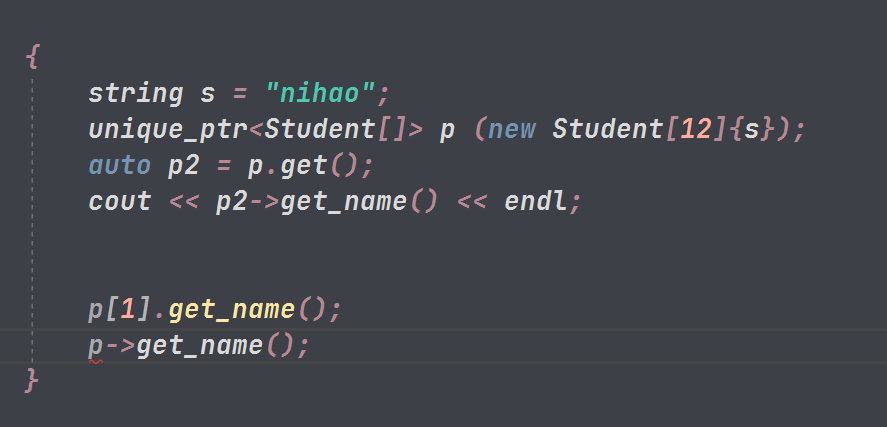


#### 表12.6: 指向数组的unique_ptr

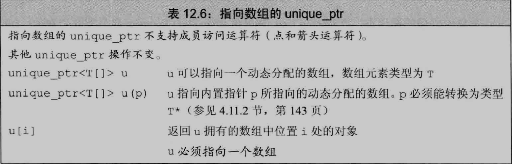


#### shared_ptr和动态数组

-   shared_ptr不直接支持管理动态数组, **==如果希望shared_ptr管理一个动态数组, 必须提供自己定义的删除器==**

    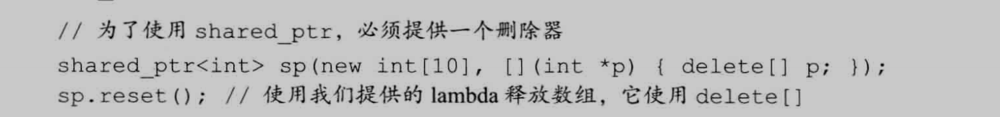

    >   // 当sp销毁的时候, 对指向的动态数组调用lambda表达式, 用delete[ ]释放数组
    >
    >   因为shared_ptr只是用delete, 不是用delete[ ]


-   shared_ptr不直接支持动态数组管理的特性影响如何访问数组中的元素, **==shared_ptr未定义下标运算, 并且不支持指针的算术运算, 必须用get获取一个内置指针用来访问数组元素==**

    

    

    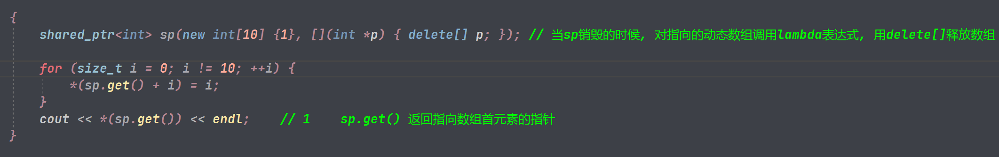

    >   sp.get()  + i 获得指向数组元素的指针
    >
    >   然后解引用得到指向的对象, 给该对象赋值


#### 动态数组和普通数组:

​	C++中一般是不能使用变量作为一个数组的长度的，必须使用常量。 这是因为数组作为C++的内置数据类型，其空间分配在 栈内存 中，这部分空间的大小在 编译时就要确定 ，不能等到运行时再分配。

​	而动态数组的分配是在程序运行期间分配的所以可以使用变量作为数组


### allocator类

-   new 将内存分配和对象构造组合在一起
-   delete将对象析构和内存释放组合在一起
-   分配一大块内存时, 在这块内存按需构造对象
    -   我们希望将内存分配和对象构造分离
    -   ==这样可以分配大块内存, 但是**只在真正需要时才执行对象创建操作(同时付出一定开销)**==
-   直接一次性分配N大的内存, 仍然是占用了内存, 然后按需要在这块内存构造对象, 对不必每次都重新一下空间, 并且, 也不用分配空间的同时必须构造对象必须初始化了
-   **==分配的内存虽然是原始的, 但是拥有类型, 所以对于原始的, 未构造的内存还是可以调用类型含有的操作==**


-   一般情况下, 将内存分配和对象构造组合在一起可能会导致不必要的浪费

    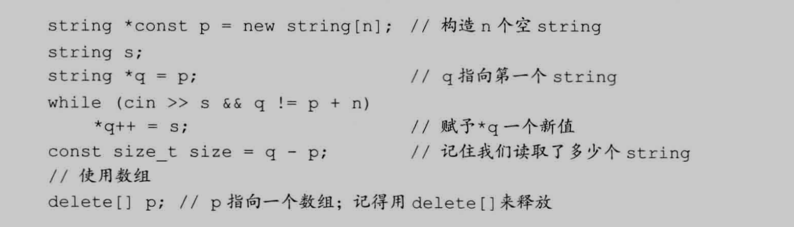

    **new表达式分配并初始化了n个string, 但是可能不需要n个string, 少量string可能就足够了, 这样, 我们就可能创建了一些永远也用不到的对象**

    而且, 对于确实要用的对象, 也在初始化后立即赋予了新值, 每个使用到的元素都被赋值了两次, 第一次是在默认初始化时, 随后是赋值时

    **==更重要的是, 那些没有默认构造函数的类就不能动态分配数组了==**


#### allocator类

1.   定义在**头文件memory**

2.   allocator 帮助我们将内存分配和对象构造分离开

3.   allocator提供一种类型感知的分配方法, **它分配的内存是原始的, 未构造的**

4.   allocator是一个模板, 定义allocator对象必须指明allocator可以分配的对象的类型

     1.   **==当一个allocator对象分配内存时, 它会根据给定的对象类型来确定恰当的内存大小和对齐位置==**

     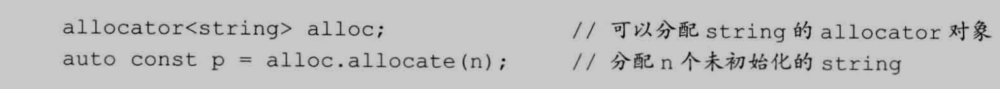

     这个allocate调用为n个string分配了内存(**==分配了n个string加起来的大小的空间, 这块空间是没有类型的, 只有用construct构造对象才有类型==**)


#### 表12.7: 标准库allocator类及其算法

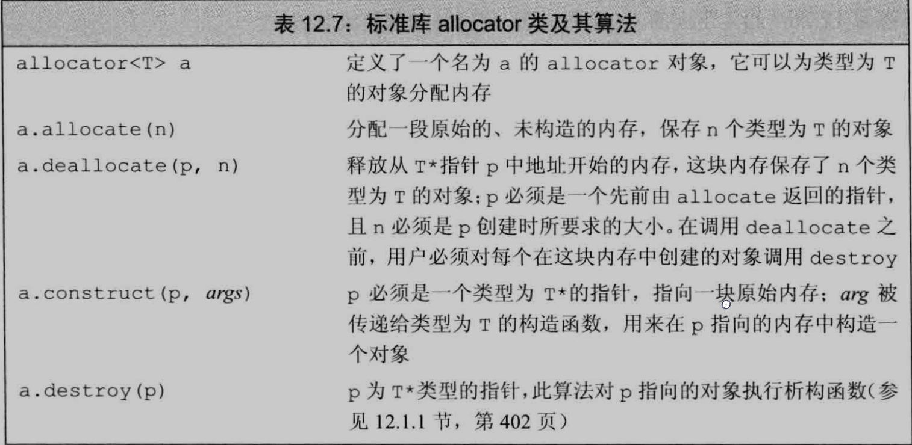


1.   allocator分配的内存是未构造的, 我们按需要在此内存中构造对象

2.   construct成员函数接受一个指针和零个或多个额外参数, 在给定的位置构造一个元素, 额外参数用来初始化构造的对象, 这些额外参数必须是与构造的对象的类型相匹配的合法的初始化器

     

3.   allocator先是分配内存, 然后用construct构造对象才能进行解引用

     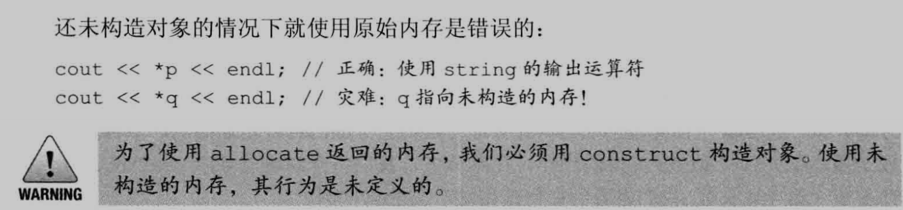

4.   **==当我们用完对象后, 必须对每个构造元素调用destroy来销毁他们==**

     1.   函数destroy接受一个指针,对指向的对象执行析构函数
     2.   只能对真正构造了的元素进行destroy操作

     

5.   ==一旦元素被销毁, 就可以重新使用这部分内存来保存其他string, 也可以将其归还给系统==

     1.   释放内存通过调用deallocate来完成

     

     传递给deallocate的指针不能为空, 必须指向由allocate分配的内存

     传递给deallocate的大小参数必须与调用allocated分配内存时提供的大小参数具有一样的值


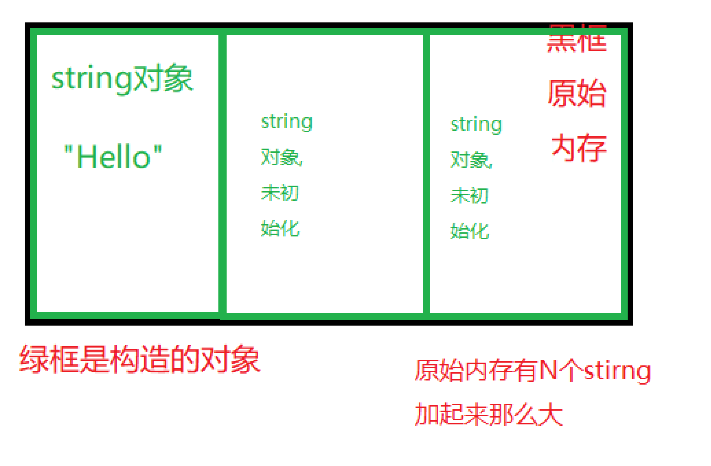


完整例子:

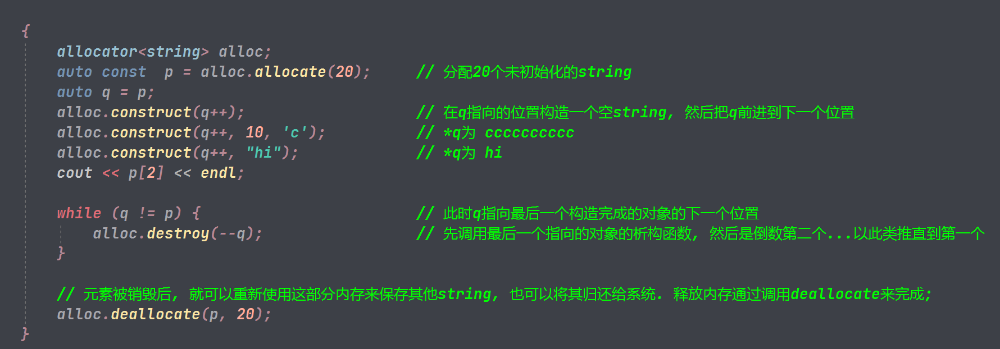


#### 拷贝和填充未初始化内存的算法

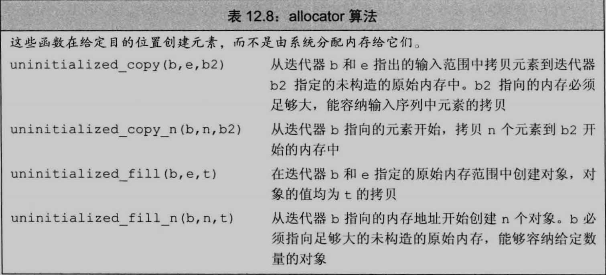


例子:

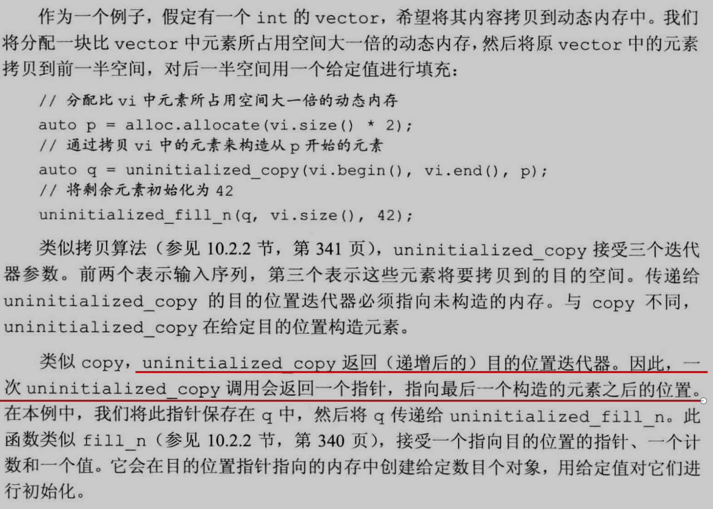


## 使用标准库: 文本查询程序


TextQuery.h

```C++
#ifndef TEXTQUERY
#define TEXTQUERY

#include <map>
#include <set>
#include <vector>
#include <string>
#include <memory>

class QueryResult;

// TextQuery 把文件中的每一行的每个单词都建立一个映射, 从单词映射到一个set, set保存该单词出现的行号
class TextQuery {
public:
    using line_no = std::vector<std::string>::size_type;

    // 读入一个文件, 建立映射
    TextQuery(std::ifstream &);

    // 查询单词
    QueryResult query(const std::string &) const;
private:
    
    // 保存一行字符串, 并不是多次一句, 而是利用vector的增长性来计行号
    std::shared_ptr<std::vector<std::string>> file;

    // 保存行号, file指向的vector的每个元素(每一行)的每个单词都有一个对应的set, set用来统计每个出现的行号
    std::map<std::string, std::shared_ptr<std::set<line_no>>> wm;
};

#endif  
```


TextQuery.cpp

```C++
#include "TextQuery.h"
#include "QueryResult.h"
#include <fstream>
#include <string>
#include <sstream>

using namespace std;

// 读入文件, 建立map映射, 每个key对应一个value, value是一个set
TextQuery::TextQuery(ifstream &is) : file(new vector<string>) {
    string text;
    while (getline(is, text)) {
        file->push_back(text);
        int n = file->size() - 1;               // 行号从0开始
        istringstream line(text);
        string word;
        while (line >> word) {                  // 如果word不在map中, 就添加到map, 然后创建对应的value, value进行值初始化
            auto &lines = wm[word];
            if (!lines){                        // lines是一个shared_ptr, 如果值为nullptr, 说明是第一次遇见这个word
                lines.reset(new set<line_no>);  // 如果lindes是空shared_ptr, 就让lines指向一个set
            }
            lines->insert(n);                   // 把行号插入set进去
        }
    }
}

// 查询单词
QueryResult TextQuery::query(const std::string &sought) const {
    static shared_ptr<set<line_no>> nodata(new set<line_no>);   // 不是很明白, 为什么是static的?
    auto loc = wm.find(sought);                                 // wm是一个map, key是sought, value是一个指向set的shared_ptr
    // 查找sought的key, 返回一个指向set的shared_ptr
    if (loc == wm.end()) {
        return QueryResult(sought, nodata, file);               // 没找到就传递一个指向空set的shared_ptr, 这里是nodata
    }
    else {
        return QueryResult(sought, loc->second, file);          // 找到就把要找的单词和出现的行号还有保存了文件中的每一行的vector构造一个QueryResult
    }
}
```


QueryResult.h

```C++
#ifndef QUERYRESULT
#define QUERYRESULT

#include <iostream>
#include <set>
#include <vector>

// QueryResult 保存结果
class QueryResult {
    friend std::ostream& print(std::ostream&, const QueryResult&);

public:
    using line_no = std::vector<std::string>::size_type;

    // 参数: 要查询的单词, 保存了该单词行号的set, 保存了文件中每一个行的vector, 可以用set中的行号获取vector中的每个元素
    QueryResult(std::string s, std::shared_ptr<std::set<line_no>> p, std::shared_ptr<std::vector<std::string>> f) 
        : sought(s), lines(p), file(f) {}

private:
    std::string sought;                                 // 查询单词
    std::shared_ptr<std::set<line_no>> lines;           // 出现的行号
    std::shared_ptr<std::vector<std::string>> file;     // 输入文件
};

#endif
```


QueryResult.cpp

```C++
#include "QueryResult.h"
#include <iostream>

using namespace std;

string make_plural(size_t ctr, const string& word, const string& ending)
{
    return (ctr > 1) ? word + ending : word;
}

ostream &print(ostream &os, const QueryResult &qr) {
    os << qr.sought << " occurs " << qr.lines->size() << " " << make_plural(qr.lines->size(), "time", "s") << endl;
    for (auto num : *qr.lines) {
        os << "\t(line" << num + 1 << ") " << *(qr.file->begin() + num) << endl;
    }
    return os;
}

```


main.cpp

```C++
#include <iostream>
#include <string>
#include <stdexcept>
#include <vector>
#include <memory>
#include <fstream>
#include <sstream>
#include "QueryResult.h"
#include "TextQuery.h"

using namespace std;

void runQueries(ifstream &infile) {
    TextQuery tq(infile);

    while (true) {
        cout << "enter word to look for, or q to quit: ";
        string s;
        if (!(cin >> s) || s == "q") break;
        print(cout, tq.query(s)) << endl;
    }
}

int main() {

    ifstream infile("没有文件.txt");
    runQueries(infile);

    return 0;
}
```


## 拷贝初始化和直接初始化(shared_ptr的引用计数涉及拷贝知识)

​	“当用于类类型对象时，初始化的复制形式和直接形式有所不同：==直接初始化直接调用与实参匹配的构造函数，复制初始化总是调用复制构造函数。复制初始化首先使用指定构造函数创建一个临时对象，然后用复制构造函数将那个临时对象复制到正在创建的对象==”
还有一段这样说，
​	“通常直接初始化和复制初始化仅在低级别优化上存在差异，然而，对于不支持复制的类型，或者使用非explicit构造函数的时候，它们有本质区别：

```C++
ifstream file1("filename")://ok:direct initialization
ifstream file2 = "filename";//error:copy constructor is private
```


————————————————
版权声明：本文为CSDN博主「ljianhui」的原创文章，遵循CC 4.0 BY-SA版权协议，转载请附上原文出处链接及本声明。
原文链接：https://blog.csdn.net/ljianhui/article/details/9245661


# ==贯穿全文的重点 ( 临时对象 )==

原贴地址: [C++ 提高性能手段 —— 临时对象的产生与避免 - 简书 (jianshu.com)](https://www.jianshu.com/p/bd4666577180)

##### 一、临时对象的概念

> 临时对象是 在源码中**不可见**的，是**栈**上的、没有名字的对象。与函数内定义的临时对象有根本差别。

- 临时对象在源码中不可见，函数内定义的临时对象并不是这里讨论的临时对象：
     非临时对象情况：


```go
int func()
{
    int tmp = 1;    // 这里的 tmp 并不是临时对象，其生命周期在退出函数后结束 
    return tmp; 
}
```

产生临时对象的情况：


```cpp
int main()
{
    int i = 1;
    int j = i++;    // 这里的 i++ 会产生临时对象，这里的临时对象是在系统中产生，代码中看不见的
                    // 首先将 i 的值赋给临时对象，再把临时对象的值作为返回结果赋给 j，再对 i 进行自增操作。 
    
    return 0;   
} 
```

- 临时对象存放在 栈 上，产生与销毁都不需要在代码中操作。
- 临时对象的产生与销毁会产生额外的系统开销，所以在代码书写时，应该尽量避免临时对象的产生。

------

##### 二、临时对象的产生与避免

**（以下程序在 C++ 11 环境下编译，并且关闭了编译器的构造优化  -fno-elide-constructors，以分析临时对象的产生）**

> C++标准允许一种（编译器）实现省略创建一个只是为了初始化另一个同类型对象的临时对象。指定这个参数（-fno-elide-constructors）将关闭这种优化，强制G++在所有情况下调用拷贝构造函数。

**并且从C++ 11 起，C++ 14 和 C++ 17 都有不同程度上的复制优化，具体可参考：**
 [https://zh.cppreference.com/w/cpp/language/copy_elision](https://links.jianshu.com/go?to=https%3A%2F%2Fzh.cppreference.com%2Fw%2Fcpp%2Flanguage%2Fcopy_elision)

###### 1、类型转换生成临时对象

例一：


```cpp
class A
{
public:
    int val;

public:
    A(int v = 0) : val(v)
    {
        cout << "A()\t" << val << endl;
    }
    
    ~A()
    {
        cout << "~A()\t" << val << endl;
    }
    
    A(const A& t) : val(t.val)
    {
        cout << "A(const A& t)" << val << endl;
    }
    
    A& operator=(const A& t)
    {
        val = t.val;
        cout << "A& operator=(const A& t)" << endl;
    } 
    
}; 

int main()
{   
    A a;
    a = 10; // 1. 将 10为参数调用了 A 的构造函数创建了一个 A 类型的临时对象
            // 2. 通过拷贝赋值运算符，将临时对象的成员值赋给了 a
            // 3. 临时对象被销毁，调用 A 的析构函数 
    
    return 0;
}
```

执行结果：


```cpp
A()     0   // A a 调用构造函数 
A()     10  // 临时对象调用构造函数，val = 10 
A& operator=(const A& t)    // 调用 拷贝赋值运算符，将临时对象的 tmp.val 赋值给 a.val 
~A()    10  // 销毁临时对象 
~A()    10  // 销毁 a 
```


 优化方法：将 A 的定义与初始化在一行代码中完成：


```cpp
int main()
{
    A a = 10;
    return 0;
}
```

C++ 11 环境下执行结果：


```cpp
A()     10      // 临时对象调用构造函数，val = 10 
A(const A& t)10 // 调用拷贝构造函数，构造对象 a 
~A()    10      // 销毁临时对象 
~A()    10      // 销毁对象 a 
```

在 C++ 11 的环境下，可以看到，系统通过将对象 a 通过临时对象调用拷贝构造函数，后置构造，省略了一步拷贝赋值的过程。


 C++ 17 环境下执行结果：


```cpp
A()     10      // 系统为 a 预留了空间，直接在预留空间中用 10 构造了对象 a 
~A()    10      // 销毁对象 a 
```


 例二：
 **隐式类型转换**时，产生临时对象


```cpp
void PrintStr(const string& src)
{
    cout << src << endl;
}

int main()
{
    char mystr[100] = "hello world";
    
    PrintStr(mystr);    // char[] 类型隐式转换成 string 类型，产生临时对象 
                        // src 绑定到了临时对象上 
    
    return 0;
}
```

将 char[] 类型强制转换成 string 类型，产生 string 类型的临时对象，并通过 mystr 进行赋值。此时调用 PrintStr，传入的实际上是这个 临时对象。也就是说，src 绑定到了临时对象上。

临时对象是**右值**，可以通过 const 左值引用绑定，但是不允许修改。

如果将 PrintStr 修改成：


```cpp
void PrintStr(string& src)
{
    cout << src << endl;
}
```

那么将会编译报错，因为左值引用是不能够绑定右值的。

如果将 PrintStr 修改成：


```cpp
void PrintStr(string&& src)
{
    cout << src << endl;
}
```

那么对于本 case，是可以编译通过的，因为可以通过右值引用绑定右值。但是如果此时未经过隐式类型转换，直接传入 string 类型左值，就会编译报错，因为不能通过右值引用绑定左值。

这里要避免产生临时对象，实际上将传入的实参和函数的形参类型保持一致即可：


```cpp
void PrintStr(const string& src)
{
    cout << src << endl;
}

int main()
{
    string mystr("hello world") ;
    PrintStr(mystr);
    
    return 0;
}
```


###### 2、类型转换生成临时对象

例一：


```cpp
A Double(A& src)
{
    A tmp(src.val * 2);
    return tmp;
}

int main()
{
    A a1(10);
    
    A a2 = Double(a1);
    
    return 0;
}
```

执行结果：


```cpp
A()     10      // 产生对象 a1，调用构造函数 
A()     20      // 产生对象 tmp，调用构造函数 
A(const A& t)20 // 产生临时对象，调用拷贝构造函数，拷贝对象 tmp 
~A()    20      // 对象 tmp 被销毁 
A(const A& t)20 // 产生对象 a2，调用 拷贝构造函数，拷贝临时对象 
~A()    20      // 临时对象被销毁 
~A()    20      // 对象 a2 被销毁 
~A()    10      // 对象 a1 被销毁 
```

通过执行结果，可以看出，函数返回对象，会导致临时对象的产生，多了一次**拷贝构造函数**的产生和一次**析构函数**的产生。
 同时，在此编译环境下，会产生 “从临时对象到对象 a2 的拷贝”，我看了其他人的操作，都没有多出来的这一步，可能是C++版本不同导致（本环境为 Windows C++ 11），待更多尝试验证。

例二：
 通过右值引用绑定函数返回的临时对象：


```cpp
A Double(A& src)
{
    A tmp(src.val * 2);
    return tmp;
}

int main()
{
    A a1(10);
    
    A&& a2 = Double(a1);
    
    return 0;
}
```

执行结果：


```cpp
A()     10 
A()     20
A(const A& t)20
~A()    20
~A()    20
~A()    10
```

通过右值引用绑定 函数返回对象 产生的 临时对象，不会产生从 临时对象到 a2 的拷贝。因为此时是通过 引用 去绑定，不会产生新的对象。

例三：
 函数返回对象的引用：


```cpp
A& Double(A& src)
{
    A tmp(src.val * 2);
    A& tmplr = tmp; 
    return tmplr;
}

int main()
{
    A a1(10);
    
    A& a2 = Double(a1);
    
    cout << "a2.val\t" << a2.val << endl;
    
    A& a3 = Double(a1);
    
    cout << "a3.val\t" << a3.val << endl;
    cout << "a3.val\t" << a3.val << endl;
    cout << "a2.val\t" << a2.val << endl;
    
    return 0;
}
```

执行结果：


```css
A()     10
A()     20
~A()    20
a2.val  20
A()     20
~A()    20
&a2     0x71fdd0
&a3     0x71fdd0
a3.val  632089152
a3.val  632089152
a2.val  632089152
~A()    10
```

在这种情况下，函数返回对象的引用，在 Double 函数中，tmplr 所绑定的 tmp 退出函数时已被销毁，但是引用仍然保持可访问的状态。这种引用被称为 **悬垂引用**。
 从执行结果可以看出， 引用 a2 和 a3 的地址相同，都是 Double(a1) 返回的引用。但是当访问这个引用的数据时，会发现返回的数据是 **不稳定** 的，因为实际上此时它们所绑定的对象已经被销毁。
 这种 **悬垂引用** 在代码的书写中，应该尽量避免。

**优化方法：**
 不建议使用 【引用】来减少 构造和析构的开销。建议使用 返回值优化 （RVO）


```kotlin
A Double(A& src)
{
    return A(src.val * 2);
}

int main()
{
    A a1(10);
    
    A a2 = Double(a1);
    
    return 0;
}
```

**理想执行结果：**


```undefined
A()     10
A()     20
~A()    20
~A()    10
```

但是。。 可能因为编译环境的问题…… 本人实操时的执行结果却是：


```cpp
A()     10
A()     20
A(const A& t)20
~A()    20
A(const A& t)20
~A()    20
~A()    20
~A()    10
```

待验证……待验证……

不过幸运的是，现在编译器已经对 **消除复制** 有了很好的优化，当编译时去掉参数 **-fno-elide-constructors**，就能够得到最优的优化效果：


```undefined
A()     10
A()     20
~A()    20
~A()    10
```


作者：从不中二的忧伤
链接：https://www.jianshu.com/p/bd4666577180
来源：简书
著作权归作者所有。商业转载请联系作者获得授权，非商业转载请注明出处。


# ==临时对象的引用==

原贴: [C++中的临时对象，对临时对象的引用，和临时对象的指针 - Xiao_bird - 博客园 (cnblogs.com)](https://www.cnblogs.com/Xiao_bird/archive/2008/03/03/1514472.html#:~:text=C%2B%2B中的临时对象，对临时对象的引用，和临时对象的指针. 假设有这样一个类：. class TestClass%3B 现在，如下的表达式，将产生一个临时对象，并在表达式之后立即被销毁%3A TestClass ()%3B,当然，这看上去有点像调用类TestClass的构造函数。. 下面的表达式，定义一了个TestClass的引用，使其指向临时对象：. TestClass%26 tc%3DTestClass ()%3B 而这时，由TestClass ()调用而生成的临时对象却并不会在该表达式结束之后立即被销毁，这个临时对象将会被引用到tc上，在tc的生命周期结束时，这个临时对象才被销毁。.)

假设有这样一个类：

```C++
class TestClass;
```

现在，如下的表达式，将产生一个临时对象，并在表达式之后立即被销毁:

```C++
TestClass();
```

当然，这看上去有点像调用类TestClass的构造函数。
下面的表达式，定义一了个TestClass的引用，使其指向临时对象：

```C++
TestClass& tc=TestClass();
```

而这时，由TestClass()调用而生成的临时对象却并不会在该表达式结束之后立即被销毁，这个临时对象将会被引用到tc上，在tc的生命周期结束时，这个临时对象才被销毁。
这个特性，常被应用在函数的形参中，如：

```C++
void test(const TestClass& tc);
test(TestClass());
```

...

...

这个参数列表中的临时对象在函数调用时生成，而在函数调用结束时被销毁。

但是，如果不是保留临时对象的引用，而是保存了临时对象的地址，则不会有如上的这些特性，临时对象依然会在表达式结束后，马上自动销毁：

```C++
TestClass* ptc=&TestClass();
```

可是，在这种情况下，如果在如上的表达式之后，使用ptc调用TestClass类的成员函数，依然能够成功，这给人的假象就是对象依然存在，真的是这样吗？
答案是否定的。之所以会有这样的现象发生，是因为系统生成的临时对象在被销毁后，虽然该对象在系统的注册中已经不存在，但是系统并没有因此而改变其原来所占内存空间的数据，这时，在临时对象的指针所指的内存区域中，数据并没有被改变，因此，对其成员的调用依然能够显示出正确的结果，而且在当前有可能相当长的作用域范围之内，这种调用看上去都是正确的，而一旦逃离这个作用域后，这些数据就将不复存在了，这时再使用ptc进行对非静态成员的操作，将不再是我们希望看到的结果。注意，是[非静态成员]，如果是静态成员，操作依然有效。

另外，在我的VC6+WinXP系统下，生成的临时对象在栈中总是占据着比其它局部变量更低的内存地址空间，即更接近于栈顶。

