[TOC]


## 拷贝, 赋值与销毁

拷贝控制操作

1. **拷贝构造函数和移动构造函数**
    - ==**定义了当用同类型的另一个对象初始化本对象时做什么**==
2. **拷贝赋值运算符和移动赋值运算符**
    - ==**定义了将一个对象赋予同类型的另一个对象时做什么**==
3. **析构函数**
    - **定义了当此类型对象销毁时做什么**


**==注意初始化和赋值的区别!==**


如果一个类没有定义所有这些拷贝控制成员, 编译器会为它定义缺失的操作

**==在定义任何C++类时, 拷贝控制操作都是必要部分==**


### 拷贝构造函数

- ==**如果一个构造函数的第一个参数是自身类类型的引用, 且任何额外参数都有默认值, 则此构造函数是拷贝构造函数**==

    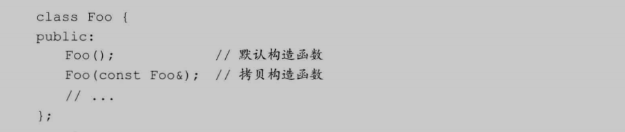

    1. 拷贝构造函数的第一个参数必须是一个引用类型
    2. 可以是非const引用, 但此参数几乎总是const的引用
    3. **拷贝构造函数在几种情况下都会被引用, 因此拷贝构造函数不应该是explicit的**
        1. explicit的函数不能被隐式调用( 拷贝初始化会被隐式调用 ), 只能显式调用( 直接初始化 ) 


#### 合成拷贝构造函数

- 如果我们没有为一个类定义拷贝构造函数, 编译器会为我们定义一个, 即使我们定义了其他构造函数
- 对于某些类( 例如: 不能被拷贝的类 )来说, 合成默认构造函数被用来阻止我们拷贝该类类型的对象
- ==**一般情况, 合成的拷贝构造函数会将其参数的成员逐个拷贝到正在创建的对象中, 编译器从给定对象中依次将每个非static成员拷贝到正在创建的对象中**==
- 每个成员的类型决定了它如何拷贝:
    - ==**对类类型的成员, 会使用其拷贝构造函数拷贝**==
    - ==**内置类型的成员则直接拷贝**==
    - 不能直接拷贝数组, 合成拷贝构造函数会逐元素地拷贝一个数组类型的成员
    - 如果数组元素是类类型, 则使用元素的拷贝构造函数来进行拷贝


例子: Sales_data的合成拷贝构造函数等价于

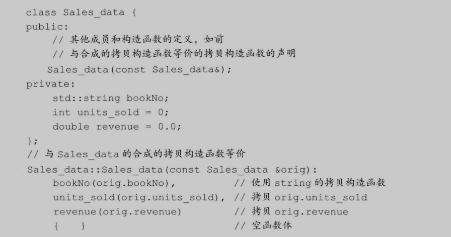


#### 拷贝初始化和直接初始化

理解了直接初始化和拷贝初始化之间的差异:

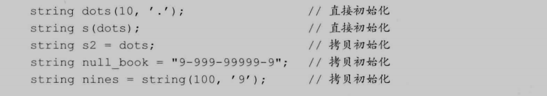


1. 当使用直接初始化, 实际上是要求编译器使用普通的函数匹配, 来选择与我们提供的参数最匹配的构造函数
    - 即: 显式想要调用那个函数
2. **当使用拷贝初始化, 我们要求编译器将右侧运算对象拷贝到正在创建的对象中, 如果需要的话还要进行类型转换**
    - ==**当用一个其他类型的对象初始化或赋值左侧运算对象, 将隐式调用对应的构造函数构造一个临时的对象, 然后再调用左侧运算对象的拷贝构造函数来进行拷贝**==
3. 拷贝初始化通常使用拷贝构造函数来完成
    - 如果一个类还有一个移动构造函数, 则拷贝初始化有时候也会使用移动构造函数而非拷贝构造函数来完成
4. ==**拷贝初始化不仅在我们用 = 定义变量时会发生, 下列情况也会发生**==
    1. **将一个对象作为实参传递给一个非引用类型的形参**
    2. **从一个返回类型为非引用类型的函数返回一个对象**
    3. **用花括号列表初始化一个数组中的元素或一个聚合类中的成员**


**记住隐式调用拷贝构造函数和显式调用拷贝构造函数**

1. **用 = 号隐式调用**
2. **用 () 号显式调用**


#### 参数和返回值

1. 函数调用过程中, 具有非引用类型的参数要进行拷贝初始化
2. 类似的, 当一个函数具有非引用的返回类型时, 返回值会被用来初始化调用方的结果( 调用点的一个临时量, 该临时量是被调用函数的返回值的类型 )
3. 拷贝构造函数的参数如果不是引用类型, 则会造成递归
    - 假设拷贝构造函数的形参是非引用类型, 则会:
        - 为了初始化形参, 调用形参的拷贝构造函数
        - 为了初始化该形参的值, 又要调用该形参的拷贝构造函数
        - 上述进行循环....


#### 拷贝初始化的限制

如果我们使用的初始化值要求通过一个explicit的构造函数来进行类型转换, 那么使用拷贝初始化还是直接初始化就不是无关紧要的了:

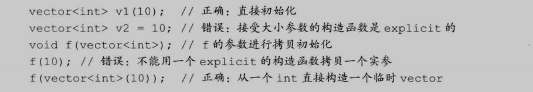


- ==**当用一个其他类型的对象初始化或赋值左侧运算对象, 将隐式调用对应的构造函数构造一个临时的对象, 然后再调用左侧运算对象的拷贝构造函数来进行拷贝**==
- **==然而如果用explicit限制构造函数, 则该构造函数不能被隐式调用, 只能被显式调用==**


#### 编译器可以绕过拷贝构造函数

**这个可能是编译器优化, 我觉得正常情况是:**

1. 对非左侧类类型的对象, 调用对应的构造函数来构造一个与左侧对象相同类型的临时的对象, 然后再隐式调用拷贝构造函数进行拷贝


拷贝初始化过程中, 编译器可以( 但不是必须 )跳过拷贝/移动构造函数, 直接创建对象


即, 编译器被允许将下面的代码

```C++
string null_book = "99999";	// 拷贝初始化
```

改写为:

```C++
string null_book("99999");	// 编译器略过了拷贝构造函数
```


```C++
struct Test {
    Test(const char *) { cout << "Test(const char *) 执行" << endl; }
    // 拷贝构造函数
    Test(const Test &t) { cout << "Test(const Test&) 执行" << endl; }
};
int main() {
	// vs2022测试中, 编译器确实跳过了拷贝构造函数,  仅仅执行了Test(const char *)
	Test1 = "99999";
    return 0;
}
```


### 拷贝赋值运算符

类可以控制其对象如何赋值;


如果类为定义自己的拷贝赋值运算符, 编译器会合成一个


#### 重载赋值运算符

1. 重载运算符本质上是函数
2. **==名字由operator关键字后接表示要定义的运算符的符号组成==**
3. 赋值运算符是名为operator=的函数, 也有返回类型和参数列表
4. 重载运算符的参数表示运算符的运算对象
5. **==赋值运算符必须定义为成员函数==**
6. 如果一个运算符是成员函数, 其左侧运算对象就绑定到隐式的this参数
7. 对于一个二元运算符, 例如赋值运算符, 其右侧运算对象作为显式参数传递
8. **==为了与内置类型的赋值保持一致, 赋值运算符通常返回一个指向其左侧运算对象的引用==**


拷贝赋值运算符接受一个与其所在类相同类型的参数:

```C++
class Foo {
public:
    Foo& operator=(const Foo&);	// 赋值运算符
    // ...
};
```


#### 合成拷贝赋值运算符

1. 如果一个类未定义自己的拷贝赋值运算符, 编译器会为它生成一个**合成拷贝赋值运算符**
2. 对于某些类( 不能被赋值的类 ), 合成拷贝赋值运算符用来禁止该类型对象的赋值
3. 如果拷贝赋值运算符不是delete的, 它会将右侧运算对象的每个非static成员赋予左侧运算对象的对应成员
    1. 对于数组类型成员, 逐个赋值数组元素
    2. 合成版本返回一个指向其左侧运算对象的引用


例子: 为Saels_data合成拷贝赋值运算符

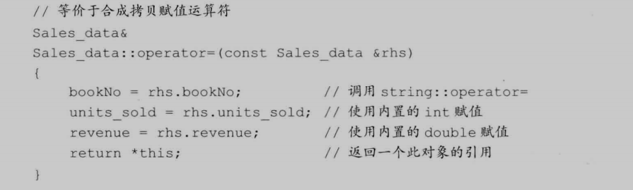


### 析构函数

- **==析构函数释放对象的资源, 并销毁对象的非static数据成员==**
- 析构函数不能被重载
- 对一个给定类, 只会有唯一一个析构函数

- **==析构函数是类的一个成员函数, 名字由波浪号接类名组成, 没有返回值, 不接受参数==**

    ```C++
    class Foo {
    public:
    	~Foo(); // 析构函数
        // ...
    };
    ```

    


#### 析构函数完成什么工作

- 在一个析构函数中, **首先执行函数体, 然后销毁成员**

- 成员按初始化顺序的逆序销毁
- 在对象最后一次使用之后, 析构函数的函数体可执行类设计者希望执行的任何收尾工作
- **==通常, 析构函数释放对象在生存期分配的所有资源( 例如: 动态资源 )==**
- 析构部分是隐式的, 析构函数不需要控制成员怎么销毁
- 成员销毁时发生什么完全依赖于成员的类型
- **==销毁类类型的成员需要执行成员自己的析构函数==**
- 内置类型没有析构函数, 因此销毁内置类型成员什么都不需要做
- **==隐式销毁一个内置指针类型的成员不会delete它所指向的对象==**
    - 智能指针是类类型, 所以有析构函数
    - 智能指针成员在**析构阶段**会被自动销毁
- 非static数据成员的销毁是在析构函数执行完之后隐含的**析构阶段**调用其自身的析构函数执行的


#### 什么时候会调用析构函数

**==无论何时一个对象被销毁, 就会自动调用其析构函数:==**

- 变量在离开其作用域时被销毁
- 当一个对象被销毁时, 其成员被销毁
- 容器(无论是标准库容器还是数组)被销毁时, 其元素被销毁
- **对于动态分配的对象, 当对指向它的指针应用delete运算符时被销毁** （ 我们的析构函数手动编写delete操作销毁动态分配的对象 ）
- **对于临时对象, 当创建它的完整表达式结束时被销毁**
- ==**当指向一个对象的引用或指针离开作用域时, 析构函数不会执行**==


析构函数自动运行, 我们程序可以按需要分配资源, 而(通常)无需担心何时释放这些资源

例子:

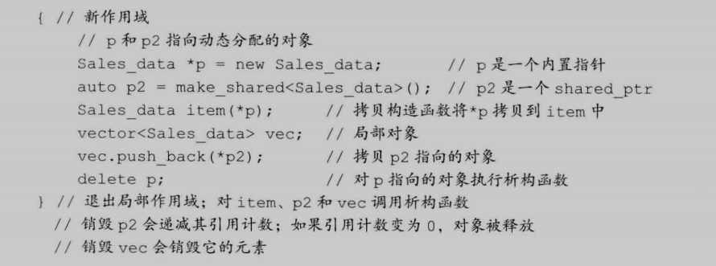


#### 合成析构函数

- 当一个类未定义自己的析构函数, 编译器会为它定义一个**合成析构函数**
- 对于某些类, 合成析构函数被用来禁止该类型的对象被销毁
    - 如果不是这种情况, 合成析构函数的函数体就为空


例子:

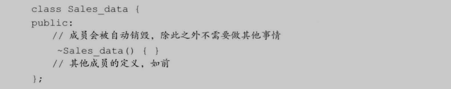


**==重点:==**

1. ==**在析构函数执行完毕后, 成员会被自动销毁**==
2. **析构函数并不直接销毁成员**
3. ==**成员是在析构函数体之后隐含的析构阶段中被销毁的**==
4. **整个对象销毁过程中, 析构函数体是作为成员销毁步骤之外的另一部分而进行的**


#### 三/五法则

1. 决定一个类是否要定义自己的拷贝控制成员, 首先确定是否需要析构函数
2. **==如果需要析构函数, 几乎肯定也需要拷贝构造函数和拷贝赋值运算符==**


用HasPtr类做例子:

1. 合成析构函数不会delete一个指针数据成员
2. 因此需要定义一个析构函数来释放构造函数分配的内存


为HasPtr定义一个析构函数, 但是使用合成版本的拷贝构造函数和拷贝赋值运算符:

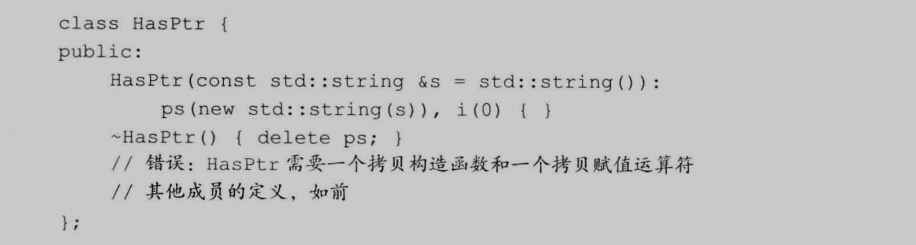


==合成版本的拷贝构造函数和赋值运算符简单拷贝指针成员, **意味着多个HasPtr对象可能指向相同的内存**==

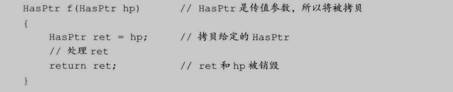

当f返回时, hp和ret都被销毁, 这两个对象上都会调用HasPtr的析构函数

**此析构函数会delete ret和hp中的指针成员, 但两个指针包含相同的指针值**

**此代码会导致此指针被delete两次**


**另外, 也可能会导致另一个HasPtr指向无效内存**

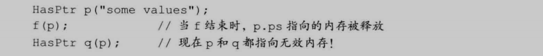


#### 需要拷贝操作的类也需要赋值操作, 反之亦然

然而, 无论是需要拷贝构造函数还是拷贝赋值运算符都不必然意味着也需要析构函数

例子:

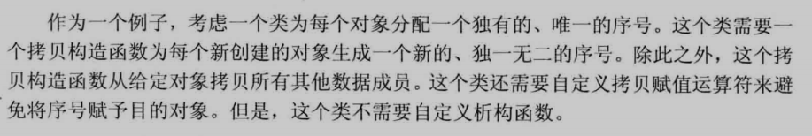


### 使用 = default

- **==可以通过将拷贝控制成员定义为 = default 来显式地要求编译器生成合成的版本==**

    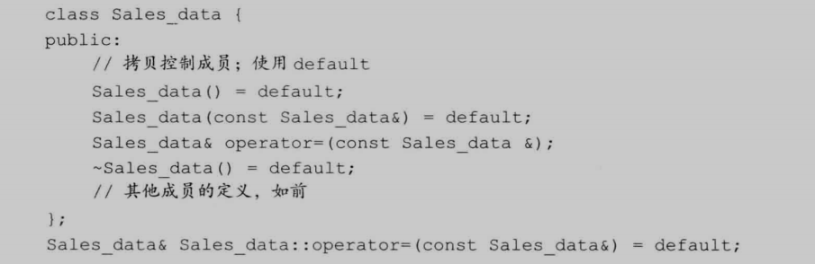

- 当在类内使用 = default 修饰成员的声明时, 合成的函数将隐式地声明为内联的

    - 任何其他类内声明的成员函数都是inline的

- 如果我们不希望合成的成员是内联函数, 应该只对成员的类外定义使用 = default

- 我们只能对具有合成版本的成员函数使用 = default

    - 即: 默认构造函数或拷贝构造函数


### 阻止拷贝 ( delete 删除函数 )

- 对某些类来说, 拷贝构造函数和拷贝赋值运算符没有合理的意义
    - 这种情况下, 定义类时必须采用某种机制阻止拷贝或赋值
    - 例如: iostream类阻止拷贝
    - unique_ptr阻止拷贝
- 看起来可能应该不定义拷贝控制成员, 但是类未定义这些操作, 编译器会合成对应的函数


#### 定义删除的函数

- ==通过将拷贝构造函数和拷贝赋值运算符定义为**删除的函数**来阻止拷贝==
- ==删除的函数虽然被声明, 但**不能以任何方式使用**它们==
- 在函数的参数列表后面加上 = delete 来指出我们希望将它定义为删除的
- 与= default不同,  **=== delete必须出现在函数第一次声明的时候==**
- **==可以对任何函数指定 = delete==**, 这与 = default不同
- 虽然删除函数的主要用途是禁止拷贝控制成员, 但当我们希望引导函数匹配过程时, 删除函数有时也是有用的


例子:

```C++
struct NoCopy {
    NoCopy() = default;							// 使用合成的默认构造函数
    NoCopy() = delete;							// 阻止拷贝
    NoCopy& operator=(const NoCopy&) = delete;	// 阻止赋值
    ~NoCopy() = default;						// 使用合成的析构函数
    // 其他成员
};
```


#### 析构函数不能是删除的成员

- ==**不能删除析构函数**==

- ==**如果析构函数被删除, 就无法销毁此类型的对象了**==

- ==**对于删除了析构函数的类型, 编译器将不允许定义该类型的变量或创建该类型的临时对象**==

- 而且如果类有个成员删除了析构函数, 我们也不能定义该类的变量或临时对象

- 因为如果成员的析构函数是删除的, 则该成员无法被销毁, 则对象整体也就无法被销毁了

- **==对于删除析构函数的类型, 不能定义这种类型的变量或成员, 但可以动态分配这些类型的对象, 但是不能释放这些对象==**

    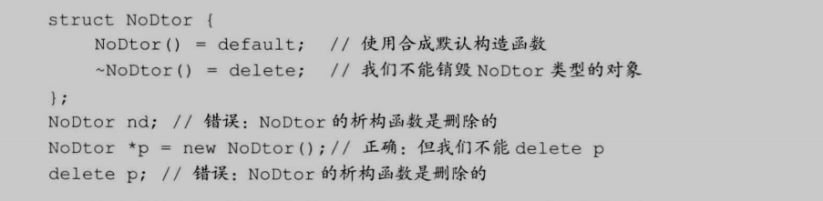


#### 合成的拷贝控制成员可能是删除的

对某些类来说, 编译器将这些合成的成员定义为删除的函数:

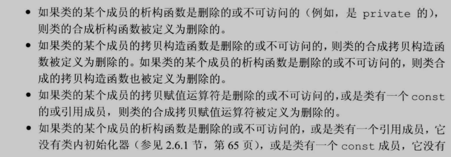

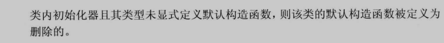


**==本质上, 这些规则的含义是: 如果一个类有数据成员不能默认构造, 拷贝, 复制或销毁, 则对应的成员函数被定义为删除的==**

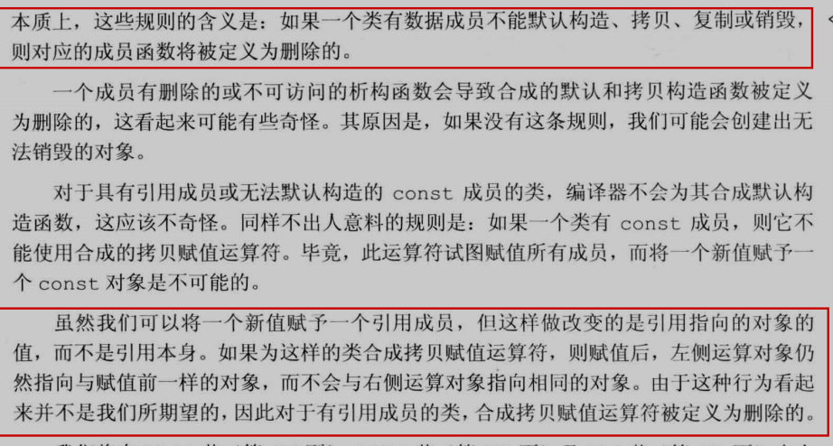


#### private拷贝控制

新标准发布之前, 类是通过将其拷贝构造函数和拷贝赋值运算符声明为private来阻止拷贝的:

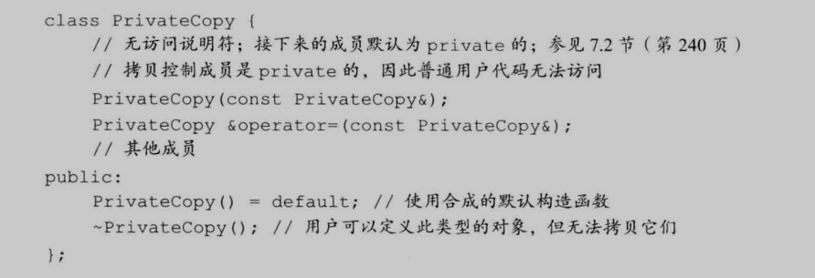


## 拷贝控制和资源管理

- 通常, 管理类外资源的类必须定义拷贝控制成员, 如 动态资源
    - 这种类需要通过析构函数来释放对象所分配的资源
    - 一旦一个类需要析构函数, 那么它几乎肯定也需要一个拷贝构造函数和一个拷贝赋值运算符
- **==两种拷贝语义: 可以定义拷贝操作, 使类的行为看起来像一个值或者像一个指针==**
    - 当我们拷贝一个像值的对象时, 副本和原对象时完全独立的, 改变副本不会对原对象有任何影响, 反之亦然
    - 行为像指针的类则共享状态, 当我们拷贝这种类的对象, 副本和原对象使用相同的底层数据, 改变副本也会改变原对象, 反之亦然
    - string类的行为像一个值; shared_ptr的提供类似指针的行为


### 行为像值的类

- **==我们如何拷贝指针成员决定了像HasPtr这样的类是具有类值行为还是类指针行为==**
- 为了提供类值的行为, 对于类管理的资源, 每个对象都应该拥有一份自己的拷贝


例子:

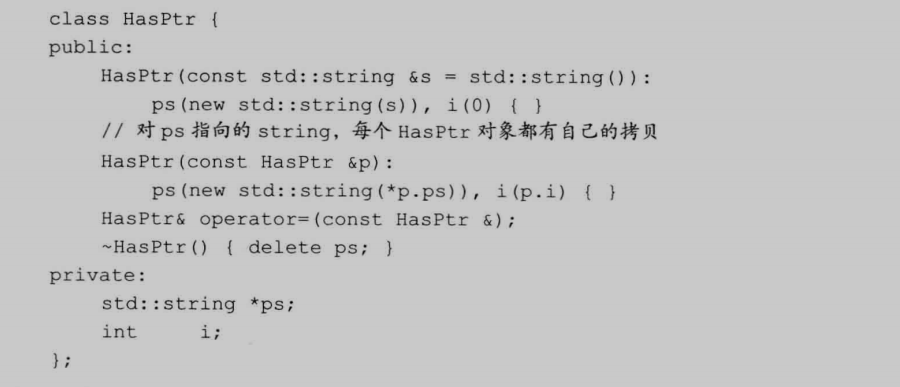


#### 类值拷贝赋值运算符

- ==**类似析构函数, 赋值操作会销毁左侧运算对象的资源**==
- 类似拷贝构造函数, 赋值操作从右侧运算对象拷贝数据
- 这些操作是以正确的顺序执行的, 即使将一个对象赋予它自身
- 当异常发生, 能将左侧运算对象置于一个有意义的状态


例子: 先拷贝右侧运算对象, 处理自赋值情况, 完成拷贝, 释放左侧运算对象资源, 更新指针指向新分配的string:

```C++
HasPtr& HasPtr::operator=(const HasPtr &rhs) {
    auto newp = new string(*rhs.ps);	// 拷贝底层string
    delete ps;							// 释放旧内存
    ps = newp;							// 从右侧运算对象拷贝数据到本对象
    i = rhs.i;
    return *this;						// 返回本对象
}
```


#### 编写赋值运算符, 要记住

- 如果将一个对象赋予它自身, 赋值运算符必须能正确工作
- 大多数赋值运算符组合了析构函数和拷贝构造函数的工作
- ==**编写赋值运算符, 好的模式是先将右侧运算对象拷贝到一个局部临时对象中**==
    - **当拷贝完成后, 销毁左侧运算对象现有成员就是安全的**


#### 防范自赋值的重要性

**==如果rhs和*this是同一个对象, 就将从已经释放的内存中拷贝数据!==**

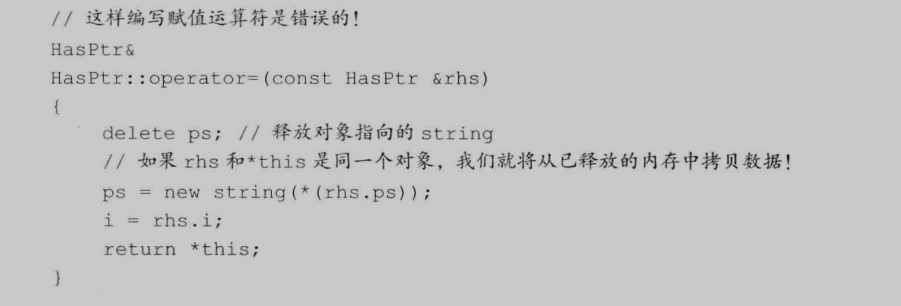


### 定义行为像指针的类

- 行为类似指针的类, 需要定义拷贝构造函数和拷贝赋值运算符
- 还需要定义析构函数释放接受string参数的构造函数分配的内存
- **本例中, 析构函数不能单方面地释放关联的string**
    - 只有当最后一个指向string的HasPtr销毁时, 它才可以释放string
- 另一个类展现类似指针的行为最好的方法是使用shared_ptr来管理类中的资源
- **如果希望直接管理资源, 需要使用引用计数**


#### 引用计数

引用计数的工作方式:

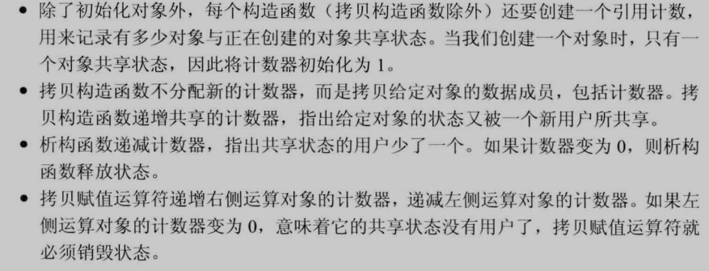


- ==**将引用计数保存在动态内存中**==


#### 定义一个使用引用计数的类

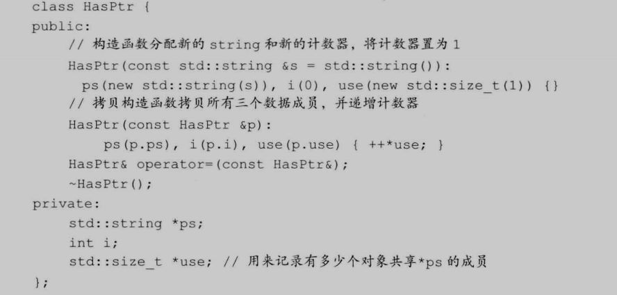


拷贝赋值运算符

```C++
HasPtr& operator=(HasPtr& rhs) { 
    ++*rhs.use;				// 递增右侧运算对象的引用计数
    if (-- * use == 0) {	// 然后递减本对象的引用计数
        delete ps;			// 如果没有其他用户
        delete use;			// 释放本对象分配的成员
    }
    ps = rhs.ps;			// 将数据从rhs拷贝到本对象
    i = rhs.i;				
    use = rhs.use;			
    return *this;			// 返回本对象
}
```


1. 拷贝或赋值一个HasPtr对象, 副本和原对象都指向相同的string

    1. 拷贝的是ps本身, 不是ps指向的string
    2. 进行拷贝会递增该stirng关联的引用计数

2. 析构函数不能无条件delete ps, 可能还有其他对象指向这块内存

3. 赋值运算符必须处理自赋值

    1. 通过先递增rhs中的技术然后递减左侧运算对象中的技术实现
    2. 当左侧, 右侧运算对象相同, 我们检查ps(及use)是否应该释放之前, 计数器就已经被递增过了

    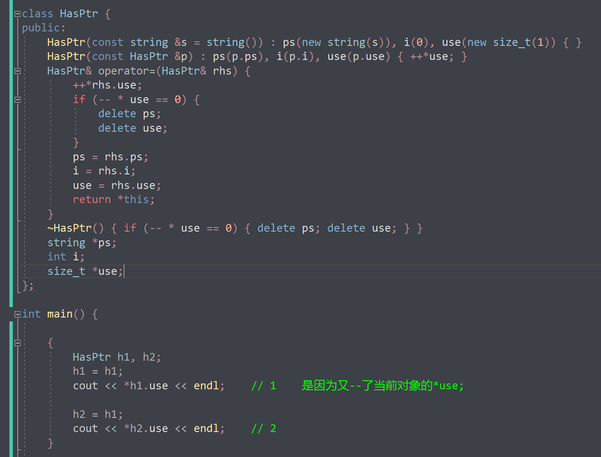

    


## 交换操作

- 管理资源的类通常还定义一个名为swap的函数
- 定能够以swap非常重要, 算法在需要交换两个元素时会调用swap
- **如果一个类定义了自己的swap, 那么算法将使用类自定义版本**, 否则算法使用标准库定义的swap


- 先分配新副本再交换,  错误的

    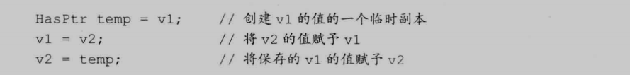

    

- **==swap应该交换指针, 正确的==**

    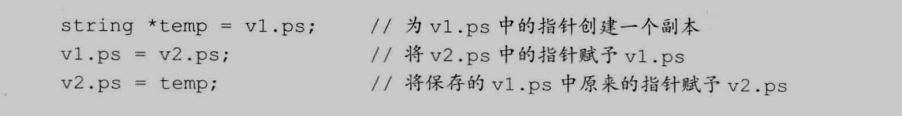


#### 编写我们自己的swap函数

- **==由于swap的存在就是为了优化代码, 将其声明为inline函数==**
- 将swap定义为friend的


例子: swap的典型实现如下

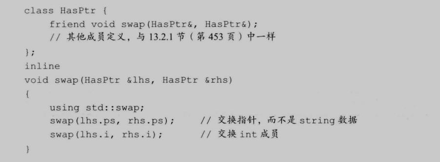


#### swap函数应该调用swap, 而不是std::swap

- 例子中, 数据成员是内置类型的, 内置类型没有特定版本的swap, 所以对swap的调用会调用标准库std::swap
- **如果一个类的成员有自己类型特定的swap函数, 调用std::swap就是错误的**
- std::swap会对HasPtr管理的string进行不必要的拷贝
- **每个调用都应该是swap, 而不是std::move**
- **==如果存在类型特定的swap版本, 其匹配程度会优先与std中定义的版本==**
    - 如果不存在类型特定的版本, 则会使用std中的版本( 假定作用域中有using声明 )
- 为什么swap函数中的using声明没有隐藏HasPtr版本swap的声明?
    - C++ Primer 706页有解释


例子:

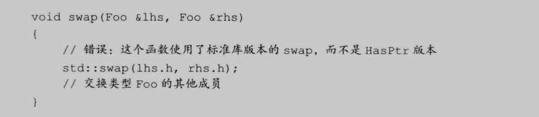


- 为类写一个swap函数避免这些拷贝, 我们希望调用HasPtr对象定义的版本

    ```C++
    void swap(Foo &lhs, Foo &rhs) {
        using std::swap;
        swap(lhs.h, rhs.h);	// 使用HasPtr版本的swap
        // 交换类型Foo的其他成员
    }
    ```

    


#### 在赋值运算符中使用swap

- 定义swap的类通常使用swap来定义他们的赋值运算符

    - 使用了名为**拷贝交换的技术**
    - 这种技术将左侧运算对象与右侧运算对象的一个副本进行交换
    - **==这个例子适用于类值版本的HasPtr, 对于类指针版本的不适用, 会造成内存泄漏==**
    
    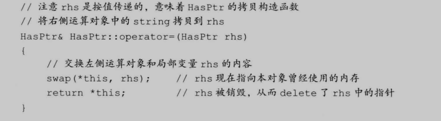
    
    > 当赋值运算符结束时, rhs被销毁, HasPtr的析构函数执行
    >
    > 此析构函数delete rhs现在指向的内存, 即: 释放掉左侧运算对象中原来的内存
    >
    > 注意, 会调用rhs的拷贝构造函数


类指针版本的HasPtr会造成内存泄漏

完整例子如下:

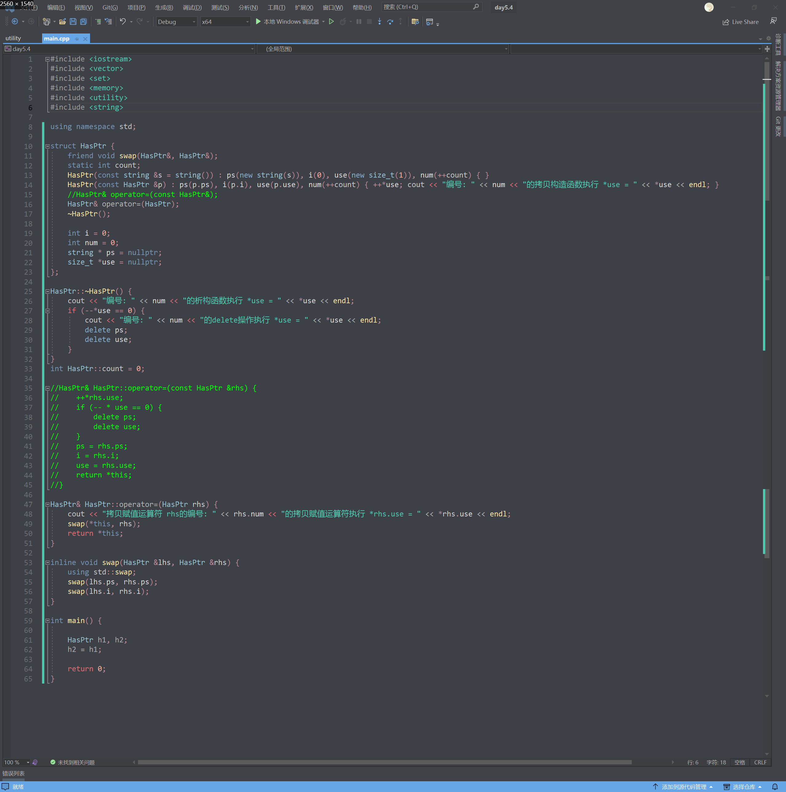

> 赋值运算符的形参是非引用类型, 调用的时候会调用该形参(rhs)的拷贝构造函数, 所以会让引用计数+1, 此时赋值运算符左侧运算对象和右侧运算对象(rhs)的引用计数都是同一个, 引用计数等于2, 在赋值运算符结束的时候, rhs被销毁, 调用rhs的析构函数, rhs的引用计数减1, 但是没有等于0, 也就是说, rhs的析构函数调用的时候, if分支不会执行, 也就不会delete ps和use


测试结果:

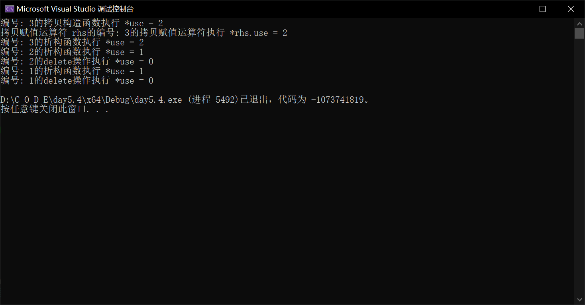

从结果上看到, rhs的析构函数并没有进行delete操作


## 拷贝控制示例

**要实现的:**

1. 每个Message对象可以出现在多个Folder中
2. 任意给定的Message的内容只有一个副本
    1. 如果一条Message的内容被改变, 则从它所在的任何Folder来浏览此Message, 都会看到改变后的内容


**设计思路:**

1. 为了记录Message位于哪些Folder中, 每个Message都会保存一个它所在Folder的指针的set
2. 每个Folder都保存一个它包含的Message的指针的set


**设计思路图:**

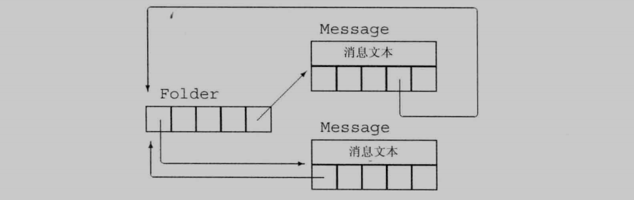


**拷贝:**

- 副本和原对象是不同的Message对象
- 但两个Message都出现在相同的Folder中
- 拷贝Message的操作包括消息内容和Folder指针set的拷贝
- 必须在每个包含此消息的Folder中添加一个新创建的Message的指针


**析构:**

- 销毁一个Message, 必须从包含此消息的所有Folder中删除指向此Message的指针


**赋值:**

- 将Message对象赋予另一个Message对象, 左侧Message的内容会被右侧Message内容替代
- 必须更新Folder集合, 从原来包含左侧Message的Folder中将它删除, 并将它添加到包含右侧Message的Folder中


**公共操作:**

- 公共操作是private的
- 析构函数和拷贝赋值运算符要使用的公共操作
- 从所有Folder中删除Message的操作
- 将一个Message添加到一组给定的Folder中的操作


**swap函数:**

- 交换之前将左侧运算对象和右侧运算对象从他们的Folders中将保存他们的Folder的set中将他们的指针删除
    - 不然交换后每个保存当前Message的Folder还保存着之前对象的指针
- 交换完成后, 将左侧运算对象和右侧运算对象的指针加入他们各自的Folders中


**Folder类也需要类似的拷贝控制成员, 来添加或删除它保存的Message**


## 动态内存管理类


1. 某些类需要在运行时分配可变大小的空间,通过标准库容器保存他们的内存, 例如使用vector
2. 某些类需要自己进行内存分配, 这些类一般来说必须定义自己的拷贝控制成员管理分配的内存


模拟vector< string >, ***这个动态内存管理类最主要还是对allocator的使用***

- **==依靠allocator实现==**


**策略: **

- 使用allocator获得**原始内存**, 在头文件memory

- **==allocator分配的内存是未构造的==**, 添加元素需要用allocator的construct成员在**原始内存**中创建对象
- 删除元素, 使用allocator的destroy成员销毁元素( 回归原始内存 )
    - destroy函数会运行分配的内存的类型的对象的析构函数
- 对象被销毁, 使用allocator的deallocate释放内存
    - 传递给deallocate的指针必须是之前某次allocate调用返回的指针


**三个指针成员指向其元素使用的内存:**

- elements: 指向分配的内存中的首元素
- first_free: 指向最后一个实际元素之后的位置
- cap: 指向分配的内存末尾之后的位置


**工具函数:**

- 分配内存, 并拷贝一个给定范围中的元素的函数
    - 返回一个pair对象, first和second分别是指向分配内存的首元素的指针和最后一个实际元素的指针
    - 拷贝给定范围的元素使用uninitialized_copy, 它返回一个的指针指向最后一个构造元素之后的位置
- 会销毁构造的元素并释放内存的函数
- 保证类至少有一个容纳新元素的空间, 如果没有空间添加新元素, 会调用重新分配内存空间的函数
- 在内存用完时为类分配新内存的函数


#### 重新分配内存过程中移动而不是拷贝元素

- 为动态内存管理类重新分配空间会引起从旧内存到新空间逐个拷贝string( 会生成一个新的string )

- **拷贝会产生新的副本, 重新分配空间后旧的元素不要了, 还要销毁**

- 因此拷贝这些string是多余的, 在重新分配内存空间的时候, **==避免分配和释放string的额外开销==**, 性能会更好


#### ==移动构造函数和std::move==

**移动构造函数:**

- 移动构造函数通常是将资源从给定对象"移动"而不是拷贝到正在创建的对象
- **==标准库保证"移后源对象"仍然保持有效, 可析构的状态==**
- 对于string, 可以想象每个string都有一个指向char数组的指针
    - 假定string的移动构造函数进行了指针的拷贝, 而不是为字符分配内存空间然后拷贝字符


**std::move:**

- 定义在**头文件utility**

- 为了移动string, 必须调用std::move表示希望使用string的移动构造函数

- 如果漏掉了std::move, 会使用string的拷贝构造函数

- 通常不为move提供using声明

- **==当使用move, 直接调用std::move==**

    ```C++
    alloc.construct(dest++, std::move(*elem++));
    ```

    > std::move将elem指向的对象转换成右值引用并返回, 然后用std::move的返回值对dest指向的对象调用移动构造函数

- 我们构造的每个string都会从elem指向的string那里**==接管==**内存的所有权


## 对象移动

- **某些情况下, 对象拷贝之后就立即被销毁了:**
    - 需要创建一个新的副本
    - 需要执行被拷贝对象的析构函数
- 这些情况下, **移动而非拷贝对象会大幅度提升性能**
- 前面动态内存管理类的例子中
    - 重新分配内存过程中, 从旧内存将元素拷贝到新内存是不必要的, 更好的方式是移动元素
- 适用移动而不是拷贝的另一个原因:
    - IO类或unique_ptr这些包含不能被共享的资源(如指针或IO缓冲), 因此这类型对象不能被拷贝但是能被移动
- 我们可以用容器保存不可拷贝的类型, 只要他们能被移动即可


### ==右值引用==


- ==**右值引用**: 必须绑定到右值的引用==

- 使用&&获得右值引用

- ==右值引用性质: 只能绑定到一个将要销毁的对象==

- 也是某个对象的另一个名字

- 常规引用: 称之为左值引用

    - 不能将其绑定到要求转换的表达式, 字面常量或是返回右值的表达式
    - 右值引用有着完全相反的这类特性: 可以将右值引用绑定到这类表达式上

- ==右值引用不能直接绑定到一个左值上:==

    

- **右值引用也能修改绑定的对象**


- 左值和右值是表达式的属性
    - 一个对象可能同时有这两种属性
- 一些表达式生成或要求左值, 另一些则生成或要求右值
- 一般, 一个左值表达式表示的是对象的身份, 一个右值表达式表示的是对象的值


- ==返回左值引用的函数, 连同赋值, 下标, 解引用和前置递增/递减运算符都是返回左值的表达式的例子==
    - 可以将一个左值引用绑定到这类表达式的结果上
- ==**返回非引用类型的函数**, 连同算术, 关系, 位以及后置递增/递减运算符, 都生成右值==
    - 不能将左值引用绑定到这类表达式上
    - 但是可以将一个const的左值引用或右值引用绑定到这类表达式上


#### 左值持久;右值短暂

1. 左值有持久的状态
2. **==右值要么是字面常量, 要么是在表达式过程中创建的临时对象==**


右值引用只能绑定到临时对象, 得知:

- 所引用的对象即将销毁
- 该对象没有其他用户

两个特性意味着: 使用右值引用的代码可以自由地接管所引用的对象的资源


==右值引用指向将要销毁的对象, 因此我们可以从绑定到右值引用的对象**"窃取"**状态==

- 本人更喜欢用**"接管"**


#### 变量是左值

1. 变量可以看做只有一个运算对象而没有运算符的表达式

2. 类似其他任何表达式, 变量表达式也有左值/右值属性

3. 变量表达式都是左值

    1. **==结果是: 不能将一个右值引用绑定到一个右值引用类型的变量上==**

    


#### 标准库move函数

- 右值引用不能直接绑定到左值上

    - 但可以显示将一个左值转换为对应的右值引用类型

- ==调用**std::move**来获得绑定到左值上的右值引用==

    - 定义在**头文件utility**
    - **==std::move返回给定对象的右值引用==**

    ```C++
    int &&rr3 = std::move(rr1);	// ok
    ```

- **==调用move意味着承诺: 除了对rr1赋值或销毁它之, 我们将不再使用它==**

- **==我们可以销毁一个移后源对象, 也可以赋予它新之, 但不能使用一个移后源对象的值==**

- 对move不提供using声明

- 直接调用std::move而不是move, 可以避免潜在的名字冲突


### 移动构造函数和移动赋值运算符

1. 这两个成员类似对应的拷贝操作, 但他们从给定对象"窃取" (接管) 资源而不是拷贝资源


==**移动构造函数**==

1. 移动构造函数的第一个参数是该类类型的一个右值引用
2. 任何额外的参数都必须有默认实参
3. 除了完成资源移动, 移动构造函数还必须确保移后源对象被销毁是无害的
4. 一旦资源完成移动, 源对象必须不再指向被移动的资源, 这些资源的所有权已经归属新创建的对象
5. 移动构造函数不分配任何新内存; 接管给定对象中的内存
6. 接管内存后, 将给定对象中的指针置位nullptr, 这样就完成了从给定对象的移动操作, 此对象继续存在.
7. 最终, 移后源对象会被销毁, 调用其析构函数
    - 如果忘记将指针成员置位nullptr, 则销毁移后源对象就会释放我们刚刚移动的内存


例子:

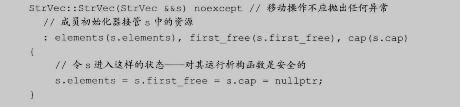


#### 移动操作, 标准库容器和异常 （noexcept）

- 移动操作"窃取"资源, 通常不分配任何资源
- 因此移动操作不会抛出任何异常
- ==**对于不应该 (也有可能) 抛出异常的移动构造函数和移动赋值运算符必须标记为noexcept, 否则标准库可能做额外工作**==
    - 也是允许抛出异常的, 所以如果移动操作可能会抛出异常, 就不标记为noexcept


例子:

```c++
class StrVec {
public:
    StrVec(StrVec &&) noexcept;
};
StrVec::StrVec(StrVec &&s) noexcept : /*成员初始化器*/ { /*构造函数体*/ }
```


#### 为什么要noexcept?


以vector作为例子:

1. 如果是用拷贝: 有两个容器, 第二个是第一个的副本, 如果拷贝过程中发生了异常, 可以很容器的把副本删掉, 保留原来的容器, 原来的容器还是原来的样子


2. 如果是用移动: 将第一个容器的元素移动到第二个容器中, 如果移动过程中发生了一场, 那么第一个容器无法回到原来的样子, 元素是缺失的, 所以如果标准库认为如果不是noexcept的, 就认为可能会发生这种异常, 那么就会使用拷贝构造函数而不是移动构造函数


#### 移动赋值运算符

- 移动赋值运算符执行与析构函数和移动构造函数相同的工作
- **==如果我们的移动赋值运算符不抛出任何异常, 就应该标记为noexcept==**
- ==类似拷贝赋值运算符, 必须正确处理自赋值==
- 接管资源后将移后源对象置位可析构状态


例子:

```C++
StrVec &StrVec::operator=(StrVec &&rhs) noexcept {
    if (this != &rhs) {
        free();			// 释放已有元素
        elements = rhs.elements;	// 从rhs接管资源
        first_free = rhs.first_free;
        cap = rhs.cap;
        // 将rhs置位可析构状态
        rhs.elements = rhs.first_free = rhs.cap = nullptr;
    }
    return *this;
}
```

我们直接 if (this != &rhs)检查是不是自赋值, **==关键点是我们不能再使用右侧运算对象的资源之前就释放左侧运算对象的资源( 可能是相同的资源 )==**


**在移动操作之后, 移后源对象必须保持有效的, 可析构的状态, 但是用户不能对其值进行任何假设**

- 例如移动了string, 移后源对象还可以进行诸如empry和size这些操作, 但是不知道有什么结果


#### 合成的移动操作

- 如果一个类定义了自己的拷贝构造函数, 拷贝赋值运算符和析构函数, 编译器就不会为它合成移动构造函数和移动赋值运算符
- 如果一个类没有移动操作, 通过正常的函数匹配, 类会使用对应的拷贝操作来代替移动操作
- 只有当一个类没有定义任何自己版本的拷贝控制成员, 且类的每个非static数据成员都可以移动, 编译器才会合成移动构造函数和移动赋值运算符
- 编译器可以移动内置类型成员
- 如果一个成员是类类型, 且该类有对应的移动操作, 编译器也能移动这个成员


例子:

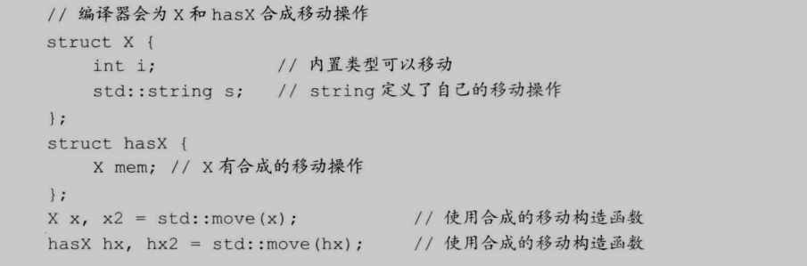


1. 和拷贝操作不同, 移动操作永远不会隐式定义为删除的函数

2. 但是如果我们显式地要求编译器生成 = default的移动操作, 且编译器不能移动所有成员, 则编译器将移动操作定义为删除的函数


原则:

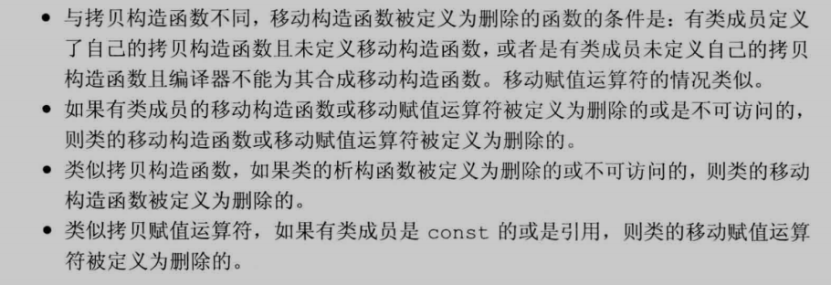


例子: 假定Y 定义了自己的拷贝构造函数但未定义自己的移动构造函数

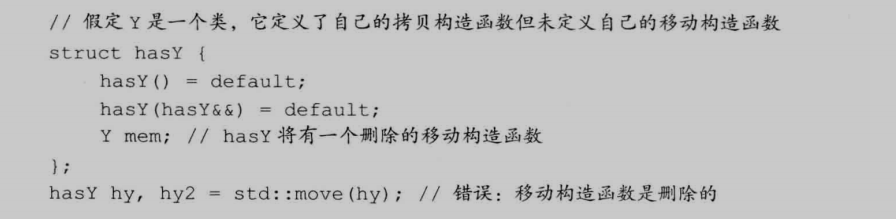

> Y类型的mem没有移动构造函数, hasY 显式合成 移动构造函数, 成员不能被移动, 所以hasY的移动构造函数被定义为删除的


#### 移动右值, 拷贝左值......

- 如果一个类既有移动构造函数也有拷贝构造函数, 编译器使用普通的函数匹配规则来确定使用哪个构造函数
    - 赋值操作情况类似


例子: 

- ==**StrVec类中, 拷贝构造函数接受const StrVec的引用, 因此可以用于任何可以转换为StrVec的类型**==
- ==**而移动构造函数接受一个StrVec&&, 因此只能用于实参是( 非static ) 右值的情形**==


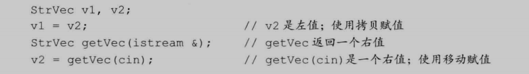

第二条赋值语句中, 两个赋值运算符都是可以的, 但是:

- 调用拷贝赋值运算符需要进行一次到const的转换
- 而StrVec&&则是精确匹配, 所以会使用移动赋值运算符


#### ...... 但如果没有移动构造函数, 右值也被拷贝

- ==如果没有移动构造函数, 根据函数匹配规则, 会使用拷贝构造函数来进行拷贝初始化, 即使我们通过调用move来移动他们也是如此:==


例子:

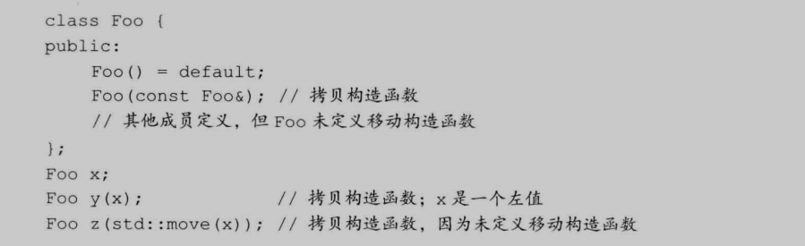


1. **==std::move(x)返回一个绑定到x的Foo&&==**

2. **==Foo的拷贝构造函数是可行的, 因为我们可以将一个Foo&&转换为一个const Foo&, 因此z的初始化将使用Foo的拷贝构造函数==**
3. 用拷贝构造函数代替移动构造函数几乎肯定是安全的(赋值运算符的情况类似)
4. 一般情况下, 拷贝构造函数满足对应的移动构造函数的要求:它会拷贝给定对象, 并将源对象置于有效状态
5. 实际上, 拷贝构造函数甚至不会改变原对象的值


为什么拷贝构造可以代替移动构造呢?

- 因为拷贝构造是拷贝给定对象的值, 对原对象没有任何影响, 和原对象是相对独立的, 原对象发生什么都不关执行拷贝构造的对象的事
- 但是对于没有定义引用计数的类指针行为的类就不一定了


#### 拷贝并交换赋值运算符和移动操作

例子:

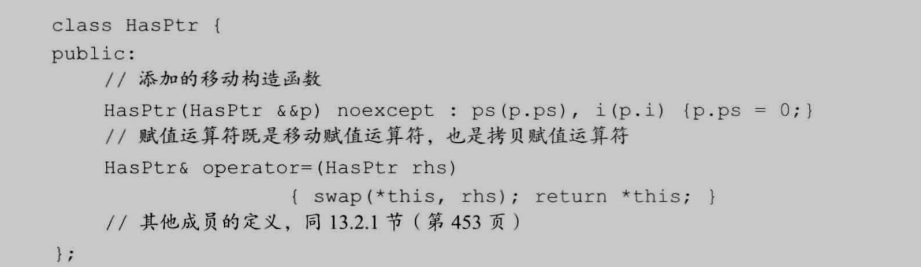


==**赋值运算符有一个非引用参数, 说明此参数要进行拷贝初始化:**== 

- **拷贝初始化要么使用拷贝构造函数, 要么使用移动构造函数**

    - **左值被拷贝: 拷贝右侧运算对象的资源**
    - **右值被移动: 接管右侧运算对象的资源**

    ==**因此单一的赋值运算符就实现了拷贝赋值运算符和移动赋值运算符两种功能**==


例子: 假定hp和hp2都是HasPtr对象:

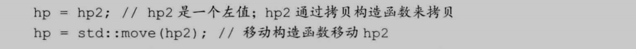

> std::move的返回值可以调用拷贝构造函数和移动构造函数, 但是是右值引用, 和移动构造函数是精确匹配, 所以调用移动构造函数


#### 更新三/五法则

1. **如果一个类定义了任何一个拷贝操作, 它就应该定义所有五个操作**
2. 某些类必须定义拷贝构造函数, 赋值运算符, 析构函数才能正确工作
3. **这些类通常有一个资源, 而拷贝成员必须拷贝此资源**
4. **一般来说, 拷贝一个资源会导致一些额外开销**
5. 这种拷贝非必要的情况下, 定义了移动构造函数和移动赋值运算符的类就可以避免此问题


#### 移动迭代器

uninitialized_copy可以构造新分配的内存

- 但是它对元素进行拷贝操作, 不是移动
- 标准库中没有类似的函数将对象"移动"到未构造的内存中


**移动迭代器**适配器:

- 一般, 一个迭代器的解引用运算符返回一个指向元素的左值

- **==然后移动迭代器的解引用运算符生成一个右值引用==**

- 调用标准库的**make_move_iterator**函数将一个普通迭代器转换为一个移动迭代器

    - 此函数接受一个迭代器参数, 返回一个移动迭代器

- 原迭代器的所有其他操作在移动迭代器中照常工作

- 可以将一对移动迭代器传递给算法

    - 例如: 将移动迭代器传递给uninitialized_copy:
    - construct将使用移动构造函数来构造元素
    
    ```C++
    void StrVec::reallocate() {
        // 分配大小两倍于当前规模的内存空间
        auto newcapacity = size() ? 2 * size() : 1;
        auto first = alloc.allocate(newcapacity);
        // 移动元素
       	auto last = unitialized_copy(make_move_iterator(begin()), make_move_iterator(end()), first);
    }
    ```
    
    > 分配的原始内存需要调用这块内存类型的构造函数才能构造对象
    >
    > - 不只是构造函数, 就算是原始内存也能调用类型定义的函数
    
- 由于移动一个对象可能销毁原对象, 所以只有在确信算法在为一个元素赋值或将其传递给一个用户自定义的函数后**不再访问它**, 才能将移动迭代器传递给算法

- **==一个移后源对象有不确定的状态, 对其调用std::move是危险的, 当我们调用move时, 必须绝对确认移后源对象没有其他用户==**

- 在移动构造函数和移动赋值运算符这类实现代码之外的地方, 只有确信需要进行移动操作且移动操作时安全的, 才可以使用std::move


### 右值引用和成员函数

1. 如果一个成员函数同时提供拷贝和移动版本, 也能受益
    - 一个版本接受一个指向const的左值引用
    - 另一个版本接受一个指向非const的右值引用


例子:

push_back的标准库容器就提供了两个版本:


1. 能将转换为类型X的任何对象传递给第一个版本, 此版本从其参数拷贝数据
2. 只可以传递非const的右值给第二个版本, 此版本对于非const的右值是精确匹配, 当我们传递一个**可修改的右值**, 编译器会选择运行这个版本, 此版本从其参数接管数据


具体例子:

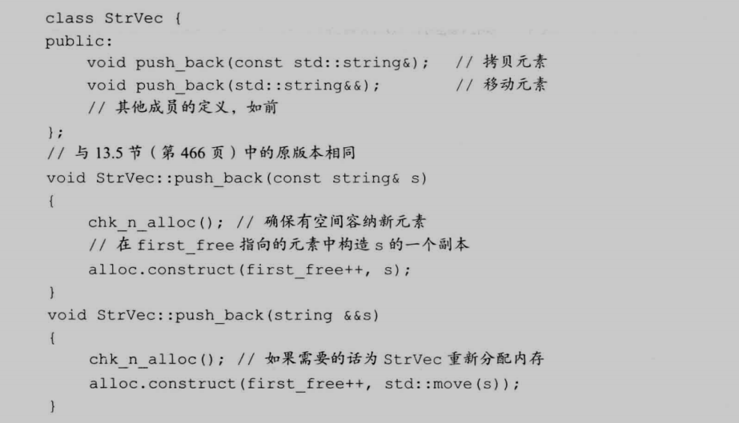


当我们调用push_back, 实参类型决定了新元素是拷贝还是移动到容器中:

```C++
StrVec vec;	// 空StrVec
string s = "some string or another";
vec.push_back(s);		// 调用push_back(const string&)
vec.push_back("done");	// 调用push_back(string&&)
```

差别在于实参一个是左值还是一个右值**==( 从"done"创建的临时string )==**


#### 右值和左值引用成员函数 ( 引用限定符 )


==**某些表达式返回右值( 生成临时对象 )**==


通常, 我们在一个对象上调用成员函数, 而不管该对象是一个左值还是右值


> s1 是左值
>
> n是右值( 临时对象 )
>
> **(s1 + s2)的结果是临时对象, 是一个右值**, 但是发现还能调用函数


两个string对象相加生成临时string对象(右值):


**==此处我们对两个string的连接结果: 一个右值进行了赋值==**


可以在类中阻止这种用法:

- 我们可能希望左侧运算对象(即, this指向的对象)是一个左值/右值
- 可以再参数列表后面防止一个**引用限定符**
- 引用限定符可以是&或&&
    - **==分别指出this可以指向一个左值或右值==**
    - 类似const限定符, 引用限定符只能出现于(非static) 成员函数, 且必须同时出现在函数的声明和定义中


例子:

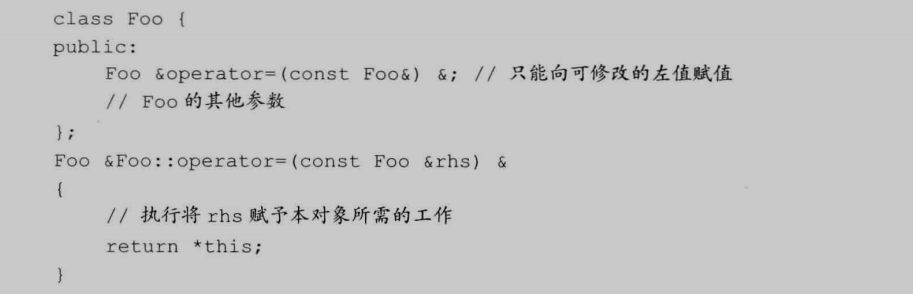


**==对于&限定的函数, 只能将它用于左值; 对于&&限定的函数, 只能用于右值:==**


**==一个函数可以同时用const和引用限定, 这种情况下引用限定符必须跟随在const限定符之后:==**

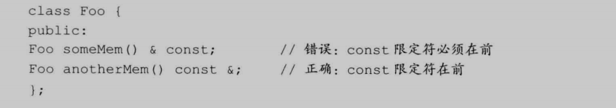


#### 重载和引用函数

- 就像const, 引用限定符也可以区分重载版本
- 可以综合引用限定符和const来区分一个成员函数的重载版本
    - sorted() const &版本的&加上只是为了区分重载版本, 毕竟const的指针可以指向左值 / 右值
    - 右值引用会优先使用 &&限定符版本的, 因为右值版本要调用const &版本要经过const转化


例子:

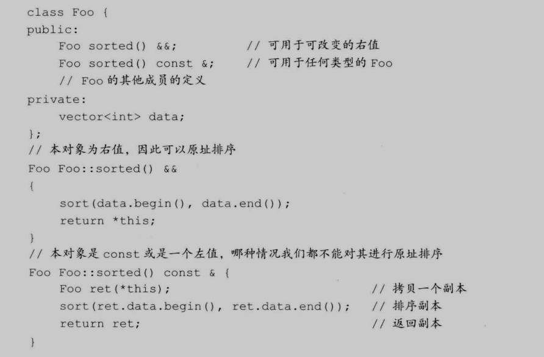

对象是一个右值, 意味着没有其他用户, 因此我们可以改变对象

当对一个const右值或一个左值执行sorted, 不能改变对象, 因此就需要再排序前拷贝data


编译器会根据调用sorted的对象的左值 / 右值 属性来确定使用哪个sorted版本:

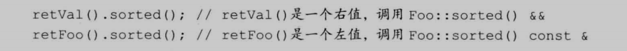


**==如果我们定义两个或两个以上具有相同名字和相同参数列表的成员函数, 就必须对所有这些函数都加上引用限定符, 或者所有都不加==**

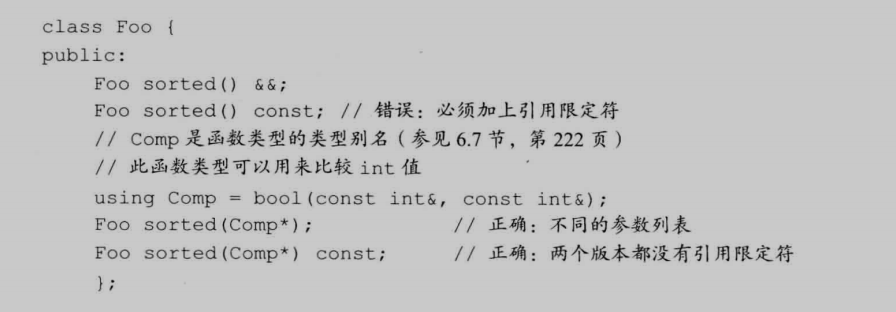


**==const 的指针 / 引用 都可以指向左值 / 右值:==**

```C++
Foo f1;
Foo().sorted();

Foo *p = &Foo();
const Foo *p1 = &Foo();
const Foo *p2 = &f1;

const Foo &r = Foo();
const Foo &r1 = f1;
```

指针可以指向临时对象


**==需要注意的是==**

- **==当 const && 修饰类的成员函数时，调用它的对象只能是右值对象；==**
- **==当 const & 修饰类的成员函数时，调用它的对象既可以是左值对象，也可以是右值对象。==**
- **==无论是 const && 还是 const & 限定的成员函数，内部都不允许对当前对象做修改操作。==**


例子:  来自*C语言中文网*, 网址: [C++11引用限定符的用法 (biancheng.net)](http://c.biancheng.net/view/8598.html#:~:text=const 和引用限定符修饰类的成员函数时，都位于函数的末尾。 C%2B%2B11,标准规定，当引用限定符和 const 修饰同一个类的成员函数时，const 必须位于引用限定符前面。)

```C++
#include <iostream>
using namespace std;

class demo {
public:
    demo(int num,int num2) :num(num),num2(num2) {}
    //左值和右值对象都可以调用
    int get_num() const &{
        return this->num;
    }
    //仅供右值对象调用
    int get_num2() const && {
        return this->num2;
    }
private:
    int num;
    int num2;
};

int main() {
    demo a(10,20);
    cout << a.get_num() << endl;        // 正确
    cout << move(a).get_num() << endl;  // 正确
   
    //cout << a.get_num2() << endl;     // 错误 
    cout << move(a).get_num2() << endl; // 正确
    return 0;
}
```


# ==贯穿全文的重点 ( 临时对象 )==

原贴地址: [C++ 提高性能手段 —— 临时对象的产生与避免 - 简书 (jianshu.com)](https://www.jianshu.com/p/bd4666577180)

##### 一、临时对象的概念

> 临时对象是 在源码中**不可见**的，是**栈**上的、没有名字的对象。与函数内定义的临时对象有根本差别。

- 临时对象在源码中不可见，函数内定义的临时对象并不是这里讨论的临时对象：
     非临时对象情况：


```go
int func()
{
    int tmp = 1;    // 这里的 tmp 并不是临时对象，其生命周期在退出函数后结束 
    return tmp; 
}
```

产生临时对象的情况：


```cpp
int main()
{
    int i = 1;
    int j = i++;    // 这里的 i++ 会产生临时对象，这里的临时对象是在系统中产生，代码中看不见的
                    // 首先将 i 的值赋给临时对象，再把临时对象的值作为返回结果赋给 j，再对 i 进行自增操作。 
    
    return 0;   
} 
```

- 临时对象存放在 栈 上，产生与销毁都不需要在代码中操作。
- 临时对象的产生与销毁会产生额外的系统开销，所以在代码书写时，应该尽量避免临时对象的产生。

------

##### 二、临时对象的产生与避免

**（以下程序在 C++ 11 环境下编译，并且关闭了编译器的构造优化  -fno-elide-constructors，以分析临时对象的产生）**

> C++标准允许一种（编译器）实现省略创建一个只是为了初始化另一个同类型对象的临时对象。指定这个参数（-fno-elide-constructors）将关闭这种优化，强制G++在所有情况下调用拷贝构造函数。

**并且从C++ 11 起，C++ 14 和 C++ 17 都有不同程度上的复制优化，具体可参考：**
 [https://zh.cppreference.com/w/cpp/language/copy_elision](https://links.jianshu.com/go?to=https%3A%2F%2Fzh.cppreference.com%2Fw%2Fcpp%2Flanguage%2Fcopy_elision)

###### 1、类型转换生成临时对象

例一：


```cpp
class A
{
public:
    int val;

public:
    A(int v = 0) : val(v)
    {
        cout << "A()\t" << val << endl;
    }
    
    ~A()
    {
        cout << "~A()\t" << val << endl;
    }
    
    A(const A& t) : val(t.val)
    {
        cout << "A(const A& t)" << val << endl;
    }
    
    A& operator=(const A& t)
    {
        val = t.val;
        cout << "A& operator=(const A& t)" << endl;
    } 
    
}; 

int main()
{   
    A a;
    a = 10; // 1. 将 10为参数调用了 A 的构造函数创建了一个 A 类型的临时对象
            // 2. 通过拷贝赋值运算符，将临时对象的成员值赋给了 a
            // 3. 临时对象被销毁，调用 A 的析构函数 
    
    return 0;
}
```

执行结果：


```cpp
A()     0   // A a 调用构造函数 
A()     10  // 临时对象调用构造函数，val = 10 
A& operator=(const A& t)    // 调用 拷贝赋值运算符，将临时对象的 tmp.val 赋值给 a.val 
~A()    10  // 销毁临时对象 
~A()    10  // 销毁 a 
```


 优化方法：将 A 的定义与初始化在一行代码中完成：


```cpp
int main()
{
    A a = 10;
    return 0;
}
```

C++ 11 环境下执行结果：


```cpp
A()     10      // 临时对象调用构造函数，val = 10 
A(const A& t)10 // 调用拷贝构造函数，构造对象 a 
~A()    10      // 销毁临时对象 
~A()    10      // 销毁对象 a 
```

在 C++ 11 的环境下，可以看到，系统通过将对象 a 通过临时对象调用拷贝构造函数，后置构造，省略了一步拷贝赋值的过程。


 C++ 17 环境下执行结果：


```cpp
A()     10      // 系统为 a 预留了空间，直接在预留空间中用 10 构造了对象 a 
~A()    10      // 销毁对象 a 
```


 例二：
 **隐式类型转换**时，产生临时对象


```cpp
void PrintStr(const string& src)
{
    cout << src << endl;
}

int main()
{
    char mystr[100] = "hello world";
    
    PrintStr(mystr);    // char[] 类型隐式转换成 string 类型，产生临时对象 
                        // src 绑定到了临时对象上 
    
    return 0;
}
```

将 char[] 类型强制转换成 string 类型，产生 string 类型的临时对象，并通过 mystr 进行赋值。此时调用 PrintStr，传入的实际上是这个 临时对象。也就是说，src 绑定到了临时对象上。

临时对象是**右值**，可以通过 const 左值引用绑定，但是不允许修改。

如果将 PrintStr 修改成：


```cpp
void PrintStr(string& src)
{
    cout << src << endl;
}
```

那么将会编译报错，因为左值引用是不能够绑定右值的。

如果将 PrintStr 修改成：


```cpp
void PrintStr(string&& src)
{
    cout << src << endl;
}
```

那么对于本 case，是可以编译通过的，因为可以通过右值引用绑定右值。但是如果此时未经过隐式类型转换，直接传入 string 类型左值，就会编译报错，因为不能通过右值引用绑定左值。

这里要避免产生临时对象，实际上将传入的实参和函数的形参类型保持一致即可：


```cpp
void PrintStr(const string& src)
{
    cout << src << endl;
}

int main()
{
    string mystr("hello world") ;
    PrintStr(mystr);
    
    return 0;
}
```


###### 2、类型转换生成临时对象

例一：


```cpp
A Double(A& src)
{
    A tmp(src.val * 2);
    return tmp;
}

int main()
{
    A a1(10);
    
    A a2 = Double(a1);
    
    return 0;
}
```

执行结果：


```cpp
A()     10      // 产生对象 a1，调用构造函数 
A()     20      // 产生对象 tmp，调用构造函数 
A(const A& t)20 // 产生临时对象，调用拷贝构造函数，拷贝对象 tmp 
~A()    20      // 对象 tmp 被销毁 
A(const A& t)20 // 产生对象 a2，调用 拷贝构造函数，拷贝临时对象 
~A()    20      // 临时对象被销毁 
~A()    20      // 对象 a2 被销毁 
~A()    10      // 对象 a1 被销毁 
```

通过执行结果，可以看出，函数返回对象，会导致临时对象的产生，多了一次**拷贝构造函数**的产生和一次**析构函数**的产生。
 同时，在此编译环境下，会产生 “从临时对象到对象 a2 的拷贝”，我看了其他人的操作，都没有多出来的这一步，可能是C++版本不同导致（本环境为 Windows C++ 11），待更多尝试验证。

例二：
 通过右值引用绑定函数返回的临时对象：


```cpp
A Double(A& src)
{
    A tmp(src.val * 2);
    return tmp;
}

int main()
{
    A a1(10);
    
    A&& a2 = Double(a1);
    
    return 0;
}
```

执行结果：


```cpp
A()     10 
A()     20
A(const A& t)20
~A()    20
~A()    20
~A()    10
```

通过右值引用绑定 函数返回对象 产生的 临时对象，不会产生从 临时对象到 a2 的拷贝。因为此时是通过 引用 去绑定，不会产生新的对象。

例三：
 函数返回对象的引用：


```cpp
A& Double(A& src)
{
    A tmp(src.val * 2);
    A& tmplr = tmp; 
    return tmplr;
}

int main()
{
    A a1(10);
    
    A& a2 = Double(a1);
    
    cout << "a2.val\t" << a2.val << endl;
    
    A& a3 = Double(a1);
    
    cout << "a3.val\t" << a3.val << endl;
    cout << "a3.val\t" << a3.val << endl;
    cout << "a2.val\t" << a2.val << endl;
    
    return 0;
}
```

执行结果：


```css
A()     10
A()     20
~A()    20
a2.val  20
A()     20
~A()    20
&a2     0x71fdd0
&a3     0x71fdd0
a3.val  632089152
a3.val  632089152
a2.val  632089152
~A()    10
```

在这种情况下，函数返回对象的引用，在 Double 函数中，tmplr 所绑定的 tmp 退出函数时已被销毁，但是引用仍然保持可访问的状态。这种引用被称为 **悬垂引用**。
 从执行结果可以看出， 引用 a2 和 a3 的地址相同，都是 Double(a1) 返回的引用。但是当访问这个引用的数据时，会发现返回的数据是 **不稳定** 的，因为实际上此时它们所绑定的对象已经被销毁。
 这种 **悬垂引用** 在代码的书写中，应该尽量避免。

**优化方法：**
 不建议使用 【引用】来减少 构造和析构的开销。建议使用 返回值优化 （RVO）


```kotlin
A Double(A& src)
{
    return A(src.val * 2);
}

int main()
{
    A a1(10);
    
    A a2 = Double(a1);
    
    return 0;
}
```

**理想执行结果：**


```undefined
A()     10
A()     20
~A()    20
~A()    10
```

但是。。 可能因为编译环境的问题…… 本人实操时的执行结果却是：


```cpp
A()     10
A()     20
A(const A& t)20
~A()    20
A(const A& t)20
~A()    20
~A()    20
~A()    10
```

待验证……待验证……

不过幸运的是，现在编译器已经对 **消除复制** 有了很好的优化，当编译时去掉参数 **-fno-elide-constructors**，就能够得到最优的优化效果：


```undefined
A()     10
A()     20
~A()    20
~A()    10
```


作者：从不中二的忧伤
链接：https://www.jianshu.com/p/bd4666577180
来源：简书
著作权归作者所有。商业转载请联系作者获得授权，非商业转载请注明出处。


# 临时对象的引用

原贴: [C++中的临时对象，对临时对象的引用，和临时对象的指针 - Xiao_bird - 博客园 (cnblogs.com)](https://www.cnblogs.com/Xiao_bird/archive/2008/03/03/1514472.html#:~:text=C%2B%2B中的临时对象，对临时对象的引用，和临时对象的指针. 假设有这样一个类：. class TestClass%3B 现在，如下的表达式，将产生一个临时对象，并在表达式之后立即被销毁%3A TestClass ()%3B,当然，这看上去有点像调用类TestClass的构造函数。. 下面的表达式，定义一了个TestClass的引用，使其指向临时对象：. TestClass%26 tc%3DTestClass ()%3B 而这时，由TestClass ()调用而生成的临时对象却并不会在该表达式结束之后立即被销毁，这个临时对象将会被引用到tc上，在tc的生命周期结束时，这个临时对象才被销毁。.)

假设有这样一个类：

```C++
class TestClass;
```

现在，如下的表达式，将产生一个临时对象，并在表达式之后立即被销毁:

```C++
TestClass();
```

当然，这看上去有点像调用类TestClass的构造函数。
下面的表达式，定义一了个TestClass的引用，使其指向临时对象：

```C++
TestClass& tc=TestClass();
```

而这时，由TestClass()调用而生成的临时对象却并不会在该表达式结束之后立即被销毁，这个临时对象将会被引用到tc上，在tc的生命周期结束时，这个临时对象才被销毁。
这个特性，常被应用在函数的形参中，如：

```C++
void test(const TestClass& tc);
test(TestClass());
```

...

...

这个参数列表中的临时对象在函数调用时生成，而在函数调用结束时被销毁。

但是，如果不是保留临时对象的引用，而是保存了临时对象的地址，则不会有如上的这些特性，临时对象依然会在表达式结束后，马上自动销毁：

```C++
TestClass* ptc=&TestClass();
```

可是，在这种情况下，如果在如上的表达式之后，使用ptc调用TestClass类的成员函数，依然能够成功，这给人的假象就是对象依然存在，真的是这样吗？
答案是否定的。之所以会有这样的现象发生，是因为系统生成的临时对象在被销毁后，虽然该对象在系统的注册中已经不存在，但是系统并没有因此而改变其原来所占内存空间的数据，这时，在临时对象的指针所指的内存区域中，数据并没有被改变，因此，对其成员的调用依然能够显示出正确的结果，而且在当前有可能相当长的作用域范围之内，这种调用看上去都是正确的，而一旦逃离这个作用域后，这些数据就将不复存在了，这时再使用ptc进行对非静态成员的操作，将不再是我们希望看到的结果。注意，是[非静态成员]，如果是静态成员，操作依然有效。

另外，在我的VC6+WinXP系统下，生成的临时对象在栈中总是占据着比其它局部变量更低的内存地址空间，即更接近于栈顶。
