[TOC]


## 拷贝, 赋值与销毁


-   一个类通过定义五种特殊的成员函数控制拷贝, 移动, 赋值和销毁时做什么, 称为**拷贝控制操作**
    1.   **拷贝构造函数**: 定义了当用同类型的另一个对象初始化本对象时做什么
    2.   **拷贝赋值运算符**: 定义了将一个对象赋予同类型的另一个对象时做什么
    3.   **移动构造函数**: 定义了当用同类型的另一个对象初始化本对象时做什么
    4.   **移动赋值运算符**: 定义了将一个对象赋予同类型的另一个对象时做什么
    5.   **析构函数**: 定义了当此类型对象销毁时做什么
-   如果一个类没有定义所有这些拷贝控制成员, 编译器会自动为它定义缺失的操作
    -   编译器定义的版本可能不是我们想要的, 可能导致灾难
-   在定义任何C++类的时候, 拷贝控制操作时必要的


### 拷贝构造函数


==**拷贝构造函数**: 定义了当用同类型的另一个对象初始化本对象时做什么==


-   **==如果一个构造函数的第一个参数是自身类类型的引用, 且任何额外参数都要默认值, 则此构造函数是拷贝构造函数:==**

    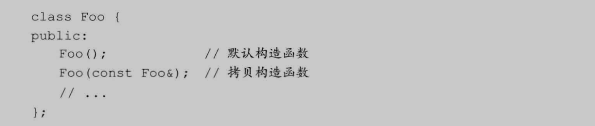

    >   ==**第一个参数必须是引用类型, 且通常为const的引用**==
    >
    >   ==**拷贝构造函数在几种情况下通常都会被隐式地使用, 因此不应该是explicit的（explicit构造函数不能被隐式调用）**==


#### 合成拷贝构造函数


-   如果我们没有为一个类定义拷贝构造函数，  即使定义了其他构造函数，编译器会自定义一个。
-   对某些类来说， **合成拷贝构造函数**用来阻止我们拷贝该类类型的对象
-   **==合成拷贝构造函数会将其参数的成员逐个拷贝到正在创建的对象中， 编译器从给定对象中依次将每个非static成员拷贝到正在创建的对象中==**


-   每个成员的类型决定了它如何拷贝：
    -   类类型成员用其拷贝构造函数来拷贝
    -   内置类型成员则直接拷贝
    -   不能直接拷贝数组， 但合成拷贝构造函数会逐元素地拷贝一个数组类型的成员
    -   如果数组元素类型是类类型， 则使用元素的拷贝构造函数来进行拷贝


例子：Sales_data类的合成拷贝构造函数等价于

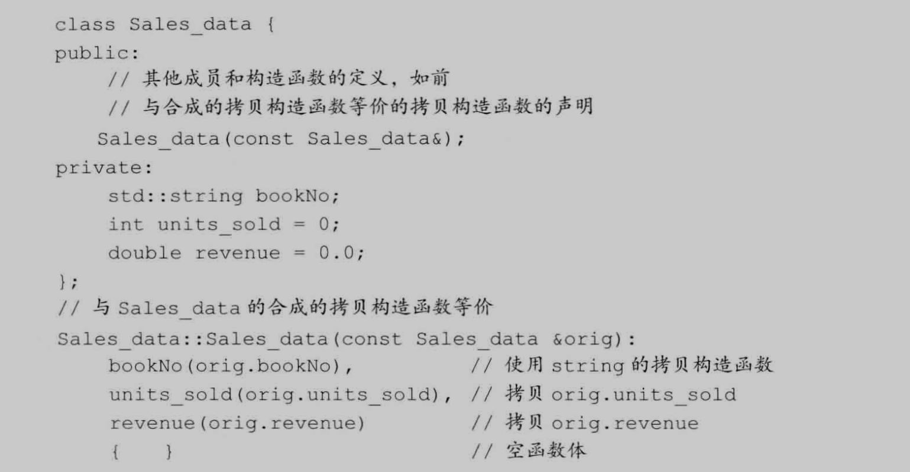


#### 拷贝初始化


拷贝初始化和直接初始化之间的差异：

-   ==当使用直接初始化 ( 基本上算是显式调用 )， 实际上是要求编译器使用普通的函数匹配来选择与我们提供的参数最匹配的构造函数==
-   当使用**拷贝初始化** (基本上算是隐式调用) 时， 要求编译器将右侧运算对象拷贝到正在创建的对象中， 如果需要的话还要进行类型转换（Sales_data s = string("shuai bi")）（对于类类型来说, 拷贝初始化会隐式调用拷贝构造函数）
-   **==拷贝初始化通常使用拷贝构造函数来完成, 但是如果一个类有一个移动构造函数, 则有时候会使用移动构造函数来完成==**


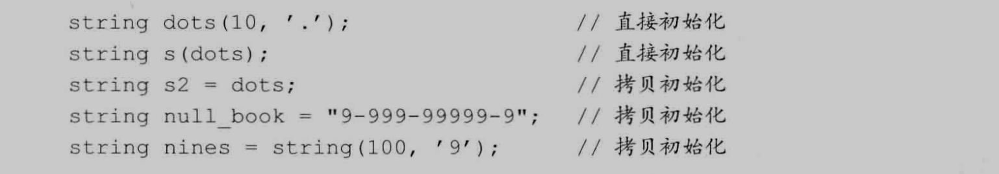

>   理解了显式调用和隐式调用就明白了
>
>   拷贝初始化的时候是隐式调用拷贝构造函数或移动构造函数
>
>   直接初始化是显式调用拷贝构造函数或移动构造函数


==拷贝初始化不仅在我们用 = 定义变量时发生, 还有下列情况:==

-   将一个对象作为实参传递给一个非引用类型的形参
-   从一个返回类型为费引用类型的函数返回一个对象
-   用花括号列表初始化一个数组中的元素或一个聚合类中的成员
-   某些类类型还会对他们所分配的对象使用拷贝初始化

    -   初始化标准库容器或是调用其insert或push成员时, 容器会对其元素进行拷贝初始化, 与之相对, 用emplace创元创建的元素都进行直接初始化

    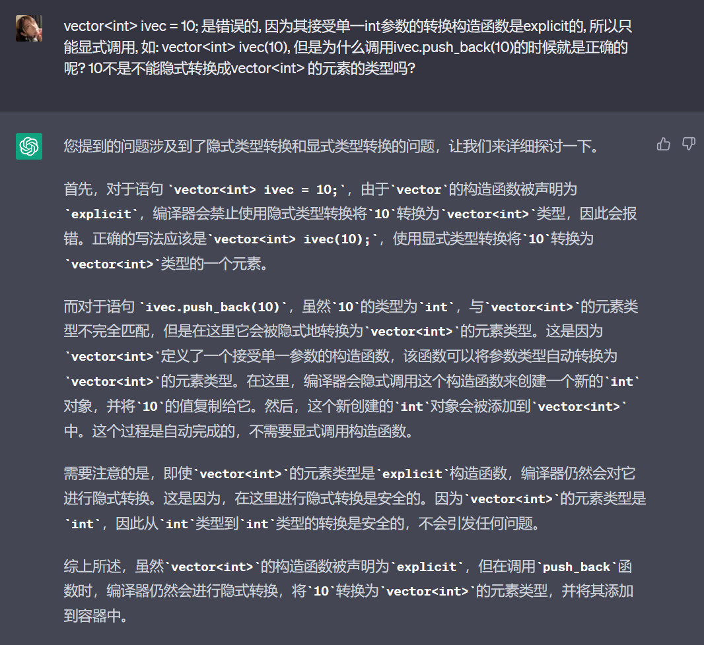


#### 参数和返回值

-   函数调用过程中, 具有非引用类型的参数要进行拷贝初始化
-   当一个函数具有非引用的返回类型, 返回值会被用来初始化调用方的结果（拷贝初始化调用点的一个临时量, 临时量的类型是返回值的类型）
-   如果拷贝构造函数参数不是引用类型, 则调用永远也不会成功——为了调用拷贝构造函数, 我们必须拷贝它的实参, 为了拷贝实参, 有需要调用拷贝构造函数, 如此无限循环


#### 拷贝初始化的限制

-   **==如果我们使用的初始化值要求通过一个explicit的构造函数来进行类型转换, 那么使用拷贝初始化还是直接初始化就不是无关紧要的了==**

    -   ==如果希望使用一个explicit构造函数, 就必须显式地使用（也就是直接初始化）==
    -   ==使用拷贝初始化（例如使用 = 号）会产生隐式调用, 而explicit构造函数不能被隐式使用, 所以是错的==

    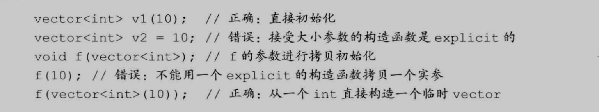


#### 编译器可以绕过拷贝构造函数

-   在拷贝初始化过程中, 编译器可以（但不是必须）跳过拷贝/移动构造函数, 直接创建对象, 编译器允许将下面的代码:

    ```C++
    string null_book = "111";	// 拷贝初始化
    ```

    改写为:

    ```C++
    string null_book("111");	// 编译器略过了拷贝构造函数, 直接初始化
    ```

-   即使编译器略过了拷贝/移动构造函数, 但在这个程序点上, ==**拷贝/移动构造函数必须是存在且可访问的（例如, 不能是private的）**==


### 拷贝赋值运算符


==**拷贝赋值运算符**: 定义了将一个对象赋予同类型的另一个对象时做什么==


-   上面是控制对象如何初始化, 这里是讲类也可以控制对象如何赋值:

    

    >   两个Sales_data已经创建, 所以下面的是赋值, 并不是初始化

-   如果类未定义自己的拷贝赋值运算符, 编译器会为它合成一个


#### 重载赋值运算符

-   重载运算符本质上是函数, 其名字由**operator**关键字后接表示要定义的运算符的符号组成
-   因此, 赋值运算符就是一个名为**operator=**的函数, 运算符函数也有返回类型和参数列表
-   重载运算符的参数表示运算符的运算对象
-   ==某些运算符, 包括赋值运算符, 必须定义为成员函数==
-   如果一个运算符是一个成员函数, 其左侧对象就绑定到隐式的this参数
-   对于一个二元运算符, 例如赋值运算符, 其右侧运算对象作为显式参数传递


拷贝赋值运算符接受一个与其所在类相同类型的参数:

```c++
class Foo {
public:
    Foo& operator=(const Foo&); // 赋值运算符
    // ...
};
```

==为了与内置类型的赋值保持一致, 赋值运算符通常返回一个指向其左侧运算对象的引用==

==标准库通常要求保存在容器中的类型要具有赋值运算符, 其返回值是左侧运算对象的引用==


#### 合成拷贝赋值运算符

1.   如果一个类未定义自己的拷贝赋值运算符, 编译器会生成一个**合成拷贝赋值运算符**: 被用来禁止该类型对象的赋值
2.   ==如果拷贝赋值运算符并非出于此目的, 它会将右侧运算对象的每个非static成员赋予左侧运算对象的对应成员, 这工作通过成员类型的拷贝赋值运算符来完成==
3.   对于数组类型成员, 逐个赋值数组元素
4.   合成拷贝赋值运算符返回一个指向其左侧运算对象的引用


例子: 下面的代码等价于Sales_data的合成拷贝赋值运算符

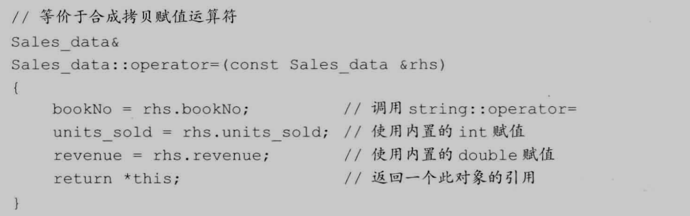

>   不是构造函数, 不用初始值列表, 因为是赋值, 所以在函数体赋值


```C++
Sales_data s1, s2;
s1 = s2;
// 等价于伪代码
s1.operator=(s2);
// 又或者等价于伪代码
Sales_data::operator(&s1, s2);
```


### 析构函数


==**析构函数**: 定义了当此类型对象销毁时做什么==


1.   ==析构函数释放对象使用的资源, 并销毁对象的非static数据成员==

2.   ==析构函数是类的一个成员函数, 名字由波浪号接类名构成, 没有返回值, 也不接受参数, 不能被重载, 对一个给定类, 只有唯一一个析构函数==

3.   如果成员直接管理动态内存, 则需要在析构函数中delete该成员


例子:

```C++
class Foo {
public:
    ~Foo();	// 析构函数
	// ...
};
```


#### 析构函数完成什么工作

1.   析构函数有一个函数体和一个析构部分
2.   在一个析构函数中, **首先执行函数体, 然后销毁对象**. 成员按初始化的顺序逆序销毁 ( 构造函数按他们在类中的顺序初始化他们 )
3.   ==当对象最后一次使用之后, 析构函数的函数体可执行类设计者希望执行的收尾工作, 通常析构函数释放对象在生存期分配的所有资源==
4.   析构函数中, 不存在类似构造函数中初始化列表的东西来控制成员如何销毁, **析构部分**是隐式的
5.   ==成员销毁时发生什么完全依赖于成员的类型==
6.   ==销毁类类型的成员需要执行成员自己的析构函数==
7.   **内置类型没有析构函数, 因此销毁内置类型成员什么也不需要做**
     -   **隐式销毁一个内置指针类型的成员不会delete它所指向的对象**
     -   智能指针是类类型, 具有析构函数, 智能指针成员会在析构阶段自动销毁


#### 什么时候会调用析构函数

无论何时一个==对象被销毁, 就会自动调用其析构函数==:

1.   变量在离开作用域时销毁
2.   ==当一个对象被销毁时, 其成员被销毁==
3.   **容器(无论是标准库容器还是数组)被销毁时, 其元素也被销毁**
4.   对于动态分配的对象, 当对指向它的指针应用delete运算符时被销毁
5.   **==对于临时对象, 当创建它的完整表达式结束时被销毁==**
6.   当指向一个对象的引用或指针离开作用域, 不会调用指向的对象的析构函数

由于析构函数自动运行, 我们的程序可以按需要分配资源, 而(通常)无需担心何时释放这些资源


例子: 下面代码片断定义了四个Sales_data对象

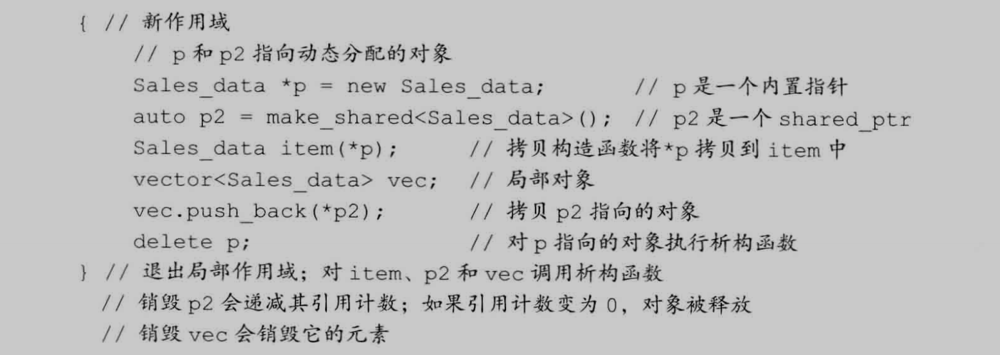

>   局部变量离开作用域, 分别会执行各自的析构函数
>
>   如果局部变量时shared_ptr, 销毁时递减引用它的引用计数, 如果引用计数为0, 因此shared_ptr的析构函数会delete p2分配的Sales_data对象
>
>   在所有情况下, Sales_data的析构函数都会隐式地销毁bookNo成员, 销毁bookNo会调用string的析构函数, 它会释放用来保存ISBN的内存


#### 合成析构函数

1.   当一个类未定义自己的析构函数, 编译器为它定义一个**合成析构函数**

2.   ==**对于某些类,合成析构函数被用来阻止该类型的对象被销毁**==
3.   ==**如果不是这种情况, 合成析构函数的函数体就为空**==
4.   在(空)析构函数体执行完之后, 成员会被自动销毁
5.   析构函数体自身并不直接销毁成员
6.   **==成员是在析构函数体之后隐含的析构阶段中被销毁的, 在整个对象销毁过程中, 析构函数体是作为成员销毁步骤之外的另一部分进行的==**


例子: 下面的代码片断等价于Sales_data的合成析构函数


>   **在(空)析构函数体执行完之后, 成员会被自动销毁**
>
>   string的析构函数会被调用, 释放bookNo成员所用的内存


#### 如果类的成员是一个普通指针并且直接管理动态内存, 需要在析构函数中delete

```C++
class HasPtr {
public:
    ~HasPtr() {
        delete ps;  // 因为使用普通指针管理动态内存, 所以在HasPtr对象销毁后并不会自动释放其指向的内存, 所以我们要在析构函数中释放内存
    }

    HasPtr(const string &s = string()) : ps(new string(s)), i(0) {}

    HasPtr(const HasPtr &h) {
        ps = new string(*h.ps);
        i = h.i;
    }

    HasPtr& operator=(const HasPtr& rhs){
        // *ps = *h.ps;
        // i = h.i;
        auto newps = new string(*rhs.ps);   // 拷贝指针指向的对象
        delete ps;                          // 销毁原string
        ps = newps;                         // 指向新string
        i = rhs.i;                          // 使用内置的int赋值
        return *this;                       // 返回一个此对象的引用
    }

private:
    string *ps;
    int i;
};
```


练习: 理解拷贝控制成员和构造函数的一个号方法是定义一个简单的类, 为该类定义这些成员, 每个成员打印出自己的名字

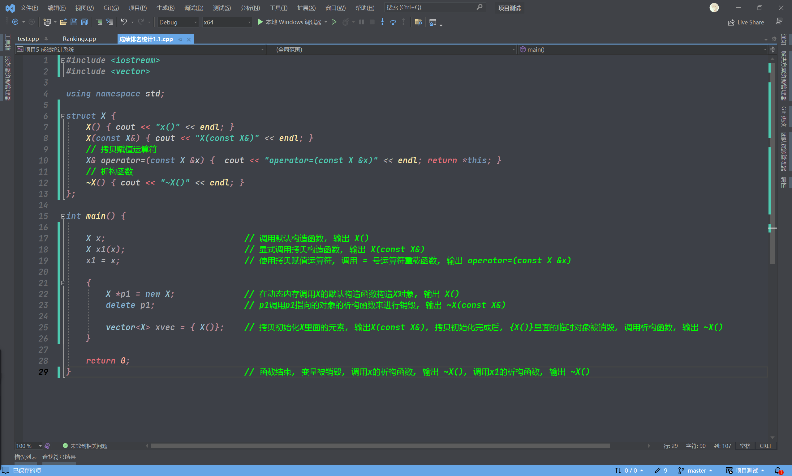


#### 三/五法则

1.   有三个基本操作可以控制类的拷贝操作: 拷贝构造函数, 拷贝赋值运算符, 析构函数

2.   还可以定义一个移动构造函数和一个移动赋值运算符

3.   C++并不要求我们定义所有这些操作: 可以只定义其中一个或两个, 不必定义所有
4.   通常, 只需要其中一个操作, 而不需要定义所有操作的情况很少见的
5.   两条基本原则:
     1.   需要析构函数的类也需要拷贝和赋值操作
     2.   需要拷贝操作的类也需要赋值操作, 反之亦然


#### 需要析构函数的类也需要拷贝和赋值操作

-   决定一个类是否要定义自己版本的拷贝控制成员, 基本原则是首先确定这个类是否需要一个析构函数
-   ==如果这个类需要一个析构函数, 几乎肯定也需要一个拷贝构造函数和一个拷贝赋值运算符==


**==如果一个类在构造函数中分配动态内存, 合成析构函数不会delete一个指针数据成员, 因此, 此类需要定义一个析构函数来释放构造函数分配的内存==**


例子: 如果HasPtr定义析构函数, 但是使用合成版本的拷贝构造函数和拷贝赋值运算符, 考虑会发生什么:

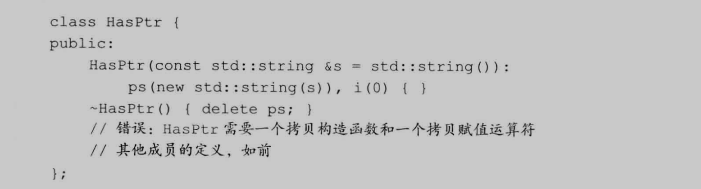

这个版本的类定义中, 构造函数中分配的内存将在HasPtr对象销毁时被释放

但是有一个**严重错误**, ==**使用了合成的拷贝构造函数和拷贝赋值运算符, 这些函数简单拷贝指针成员, 这意味着多个HasPtr对象可能指向相同的内存:**==

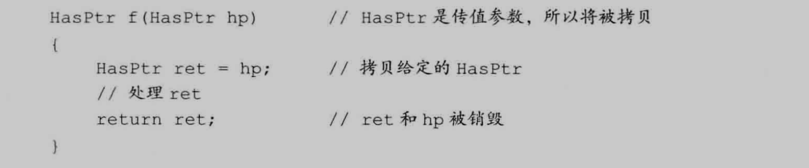

当f返回时, hp和ret都被销毁, 在两个对象上都会调用HasPtr的析构函数, 此析构函数会delete ret和hp中的指针成员

但这两个对象包含相同的指针值, 此代码导致指针被delete两次, 释放同一个地址两次, 显然是错误的


此外, f的调用者还会使用传递给f的对象

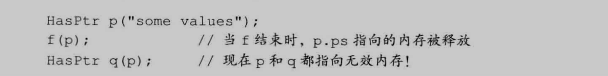

p(以及q)指向的内存不再有效, 在hp(ret!)销毁时它就被归还给系统了

**综上所述, 不能拿仅靠浅拷贝, 也要考虑深拷贝**


#### 需要拷贝操作的类也需要赋值操作, 反之亦然

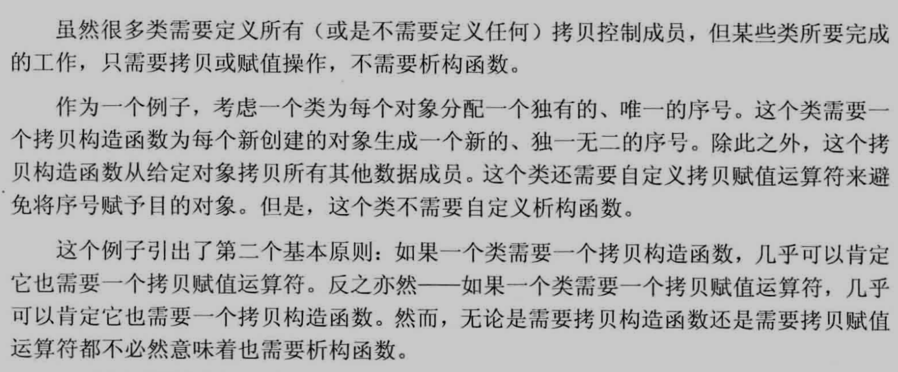

>   **因为都是拷贝, 所以合成版本的会让执行拷贝操作的对象相当于对方的副本, 所以要不相同的数据成员就需要控制拷贝**


#### 使用 = default


==可以通过将拷贝控制成员定义为 = default来显式要求编译器生成合成的版本==

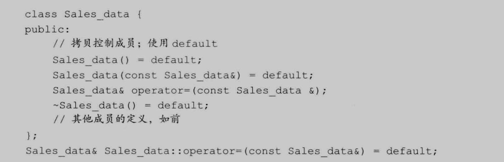

**当我们在类内用 = default修饰成员的声明时, 合成的函数将隐式地声明为内联的**(就像任何其他类内声明的成员函数一样)

**==如果不希望合成的成员是内联函数, 应该只对成员的类外定义使用 = default==, 就像上面例子中对拷贝赋值运算符所做的那样**

==只能对具有合成版本的成员函数使用= default( 默认构造函数或拷贝控制成员 )==


#### 阻止拷贝

1.   大多数类应该定义默认构造函数, 拷贝构造函数和拷贝赋值运算符, 无论是显式还是隐式地
2.   对于某些类来说这些操作没意义, 这种情况定义类时必须阻止拷贝和赋值
     1.   iostream类阻止拷贝, 看起来不应该定义拷贝控制成员, 实际上还是有编译器合成


#### 定义删除的函数

1.   ==通过将拷贝构造函数和拷贝赋值运算符定义为**删除的函数**来阻止拷贝==
2.   **==删除的函数虽然声明了它们, 但不能以任何方式使用它们==**
3.   **==在函数的参数列表后面加上= delete来指出我们希望将它定义为删除的==**
4.     **=== delete 必须出现在函数第一次声明的时候==**
5.   可以对任何函数指定 = delete, 虽然删除函数的主要用途是禁止拷贝控制成员, 但当我们希望引导函数匹配过程中, 删除函数有时也是有用的: **删除的函数虽然声明了它们, 但不能以任何方式使用它们**
     1.   


例子:

```C++
struct NoCopy {
    NoCopy() = default;
    ~NoCopy() = default;                        // 调用合成的析构函数
    NoCopy(const NoCopy&) = delete;             // 阻止拷贝
    NoCopy& operator=(const NoCopy&) = delete;  // 阻止赋值
};
```


#### 析构函数不能是删除的成员

1.   ==**不能删除析构函数, 如果析构函数被删除, 就无法销毁此类型的对象了**==

2.   ==**对于一个删除了析构函数的类型, 编译器将不允许定义该类型的变量或创建该类型的临时对象**==

3.   **类的某个成员删除了析构函数, 则该成员不能销毁导致整体对象不能销毁**

4.   ==**删除了析构函数的类型, 不能定义这种类型的变量或成员, 但可以动态分配这种类型的对象, 但是不能释放这些对象**==

     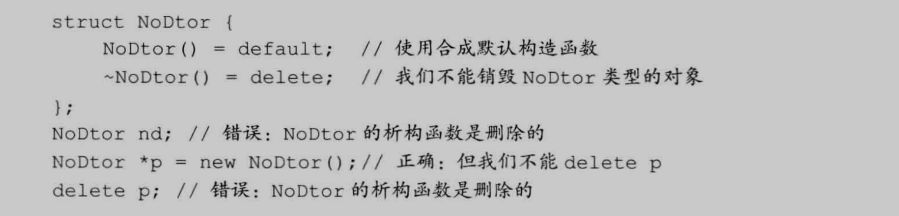


#### 合成的拷贝控制成员可能是删除的


1.   如果类的某个成员的析构函数是删除的或不可访问的( 例如, 是private的 ), 则类的合成析构函数被定义为删除的

     1.   成员都不能被释放, 使用合成版本的析构函数的对象不能释放这个占用的内存

          

2.   如果类的某个成员的拷贝构造函数是删除的或不可访问的则类的合成拷贝构造函数被定义为删除的

     1.   成员不能被拷贝, 使用合成拷贝构造函数的当前对象也不能被拷贝啊

          

3.   如果类的某个成员的析构函数是删除的或不可访问的, 则类合成的拷贝构造函数也被定义为删除的

     1.   如果没有这条规则, 我们可能会创建出无法销毁的对象

     

4.   如果类的某个成员的拷贝赋值运算符是删除的或不可访问的, 或是类有一个const的或引用成员, 则类的合成拷贝赋值运算符被定义为删除的

     1.   const成员不能被赋值, 那么当前对象肯定也不能被赋值啊
     1.   如果为这样的类合成拷贝赋值运算符, 则赋值后, 左侧运算对象扔然指向与赋值前一样的对象, 而不会与右侧运算对象指向相同的对象
     1.   将一个新值赋予一个引用成员, 改变的是引用指向的对象的值, 而不是引用本身
     1.   如果为这样的类合成拷贝赋值运算符, 则赋值后, 左侧运算对象仍然指向与赋值前一样的对象, 而不会与右侧运算对象指向相同的对象, 这种行为看起来不是我们希望的, 因此有引用成员的类, 合成拷贝赋值运算符被定义为删除的
          1.   简单说就是赋值改变指向的对象的内容, 并不是初始化, 初始化一个引用是另其绑定对象, 成为该对象的别名


​     

5.   如果类的某个成员的析构函数是删除的或不可访问的, 或是类有一个引用成员, 他没有类内初始化器, 或是类有一个const成员, 它没有类内初始化器且其类型未显式定义默认构造函数, 则该类的默认构造函数被定义为删除的

     1.   如果没有这条规则, 我们可能会创建出无法销毁的对象
     
     2.   上面提到的引用和const成员没有类内初始化器则只能显式地在构造函数初始值列表中初始化
     
          
     
     ```C++
     struct NoDtor {
         NoDtor() {
             i = 100;	// 错误, const不能被赋值
         }
         const int i;
     };
     
     struct NoDtor {
         NoDtor() : i(100) {}	// 正确, 在初始值列表初始化
         const int i;
     };
     ```


本质上, 这些规则的含义是: 如果一个类有数据成员是不能默认构造, 拷贝, 复制或销毁的, 则对应的成员函数将被定义为删除的


#### private拷贝控制( 作为了解即可 )


## 拷贝控制和资源管理


析构函数需要释放类直接管理的动态内存

通常, 类直接拷贝内置类型( 不包括指针 )成员, 这些成员本身就是值, 因此通常让他们的行为像值一样

我们如何拷贝指针成员决定了想HasPtr这样的类具有类值行为还是类指针行为


#### 行为像值的类

1.   **为了提供类值的行为, 对于类管理的资源, 每个对象都应该拥有自己的一份拷贝**
2.   **意味着指针成员指向的对象是被拷贝的对象的指针成员的对象的拷贝, 是完全独立的, 是不同的对象, 但是内容相同**


类值版本的HasPtr如下所示:

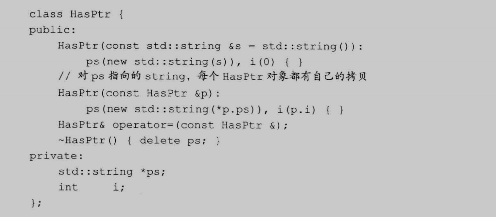


#### 类值拷贝赋值运算符

1.   赋值运算符通常组合了析构函数和构造函数的操作
2.   赋值操作需要销毁左侧运算对象的资源


接着上面的例子:在完成拷贝后, 我们释放左侧运算对象的资源, 并更新指针指向新分配的string

```C++
HasPtr& HasPtr::operator=(const HasPtr &rhs) {
    auto newp = new string(*rhs.ps);	// 拷贝底层string, 动态分配一个新的string对象, stirng的值是*rhs.ps的副本
    delete ps;							// 释放旧内存, 因为是赋值, 说明对象之前有值, 所以需要释放旧的内存
    ps = newp;							// 从右侧运算对象拷贝数据到本对象
    i = rhs.i;						
    return *this;						// 返回本对象
}
```

**重点: 需要处理自赋值情况**


**说明防范自赋值操作的重要性:**

==**在销毁左侧运算对象资源之前拷贝右侧运算对象**==

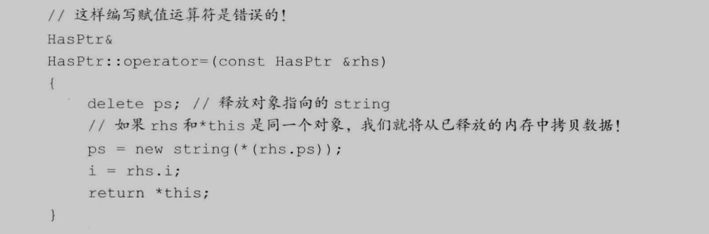


#### 定义行为像指针的类

1.   该类的对象可能指向同一个对象
2.   析构函数不能单方面地释放关联的内存, 只有当最后一个指向共享对象的对象被销毁, 才释放指向的动态内存
3.   令类展现类似指针的行为最好的方法是使用shared_ptr来管理类中的资源
4.   如果希望直接管理资源, 需要使用**引用计数**


#### 引用计数

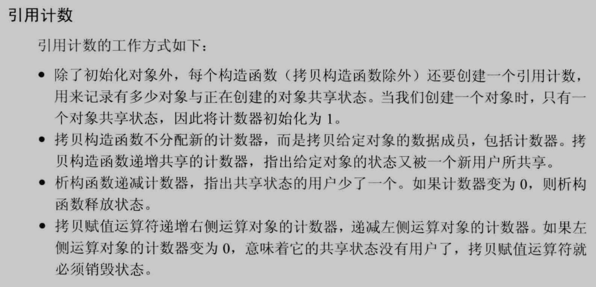


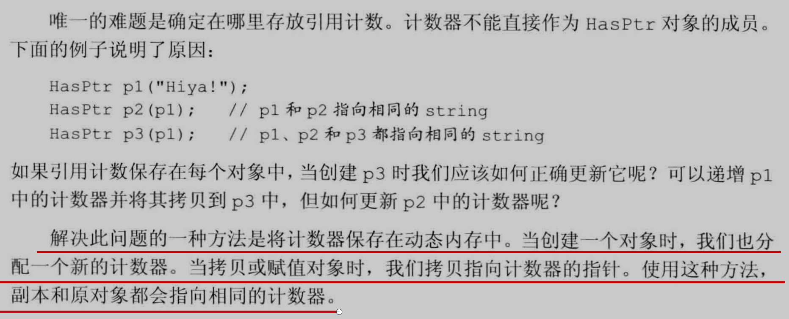


#### 定义一个使用引用计数的类

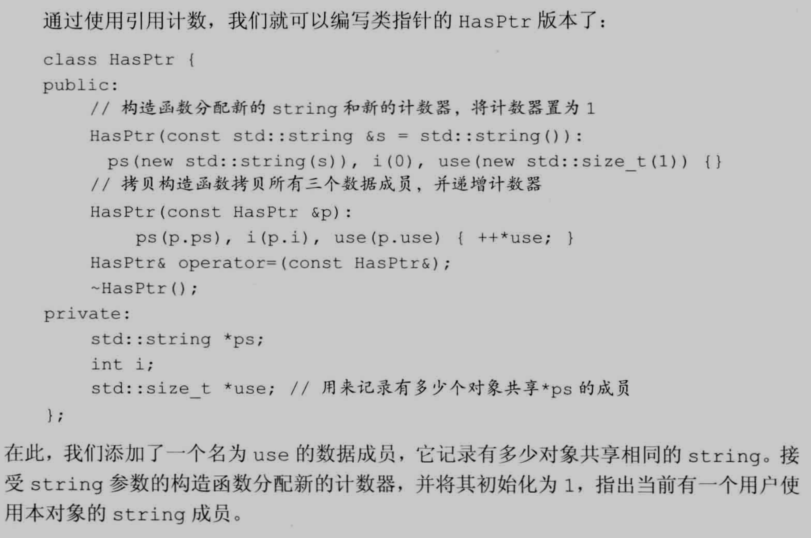


#### 类指针的拷贝成员"篡改"引用计数

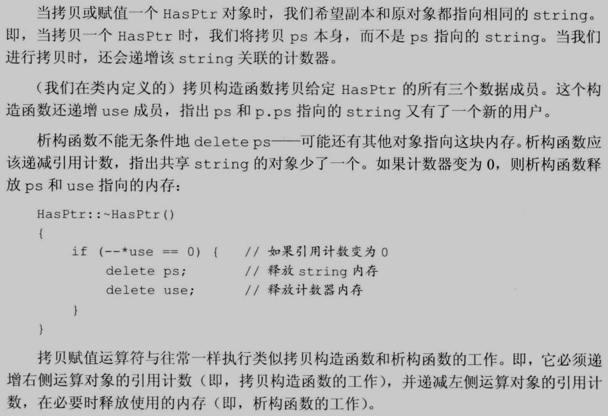

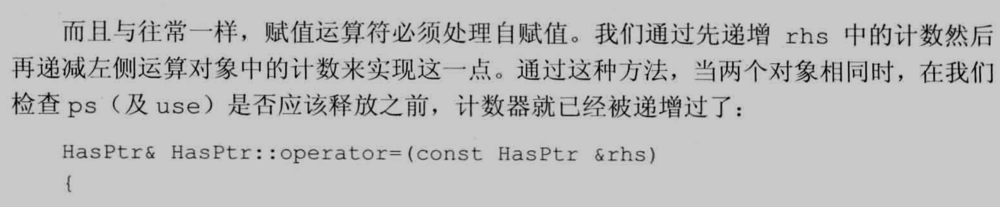


> 引用计数为0的时候也要被释放, 这代表最后一个使用该引用计数的对象销毁后, 所有资源都销毁


## 交换操作

1. ==管理资源的类通常要定义swap函数, swap是很重要的有优化手段==
2. 定义swap非常重要, 这类算法需要交换两个元素时会调用swap
3. ==**如果一个类定义了自己的swap, 那么算法将使用类自定义版本**==


swap实现的理论: 为了交换两个对象我们需要进行一次拷贝和两次赋值

例子: 交换两个类值的HasPtr

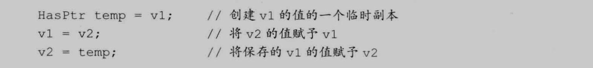

> 第一次是拷贝初始化的时候隐式调用拷贝构造函数进行初始化, 并且HasPtr的拷贝构造函数会在动态内存分配新的string对象
>
> 第二次是调用v1的赋值运算符进行赋值, 也是一种拷贝
>
> 第三次是调用v2的赋值运算符进行赋值, 也是一种拷贝


**==如果仅仅希望swap交换两个对象的指针, 则上面有很多多余的操作==**, 即, 我们希望像下面这样交换

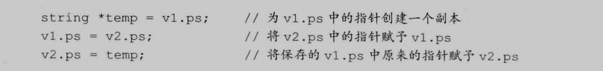


#### ==编写我们自己的swap函数==


可以在我们的类上定义一个自己版本的swap来重载swap的默认行为, swap典型实现如下

1. 为了访问方便访问HasPtr (private的) 数据成员, 将swap定义为friend
2. ==swap就是为了优化代码, 所以声明为inline函数 ( 编译过程中内联地展开 )==

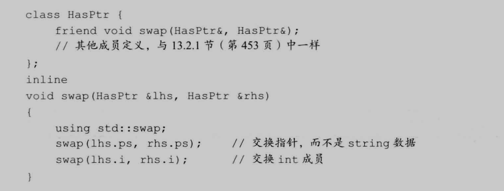


#### swap函数应该调用swap, 而不是std::swap

1. 标题意思应该是: 重载的swap内, 应该调用类型特定的swap, 而不是标准库的swap(std::swap)


==**这段代码中, 数据成员是内置类型的,  而内置类型没有特定版本的swap, 所以会调用标准库std::swap**==

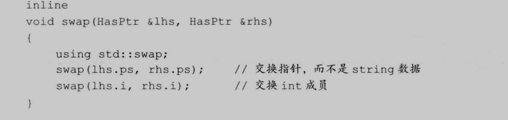


==**但是, 如果有一个类的成员有自己类型特定的swap函数, 调用std::swap是不合理的**==

例子: Foo类有类型为HasPtr的成员h, 如果未定义Foo版本的swap, 就会使用标准库版本的swap, 会对HasPtr管理的string进行不必要的拷贝, 应该为Foo编写一个swap函数避免这些拷贝

- 不应该这样写:

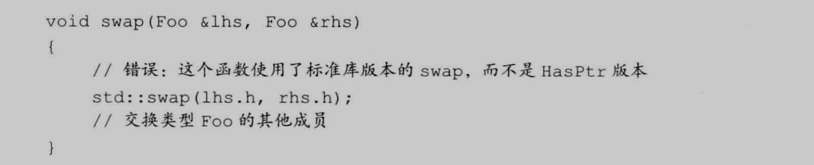

> 问题在于我们显式调用了标准库版本的swap, 但是我们不希望使用std中的版本, 希望调用HasPtr对象定义的版本


- 正确的写法:

```c++
void swap(Foo &lhs, Foo &rhs) {
    using std::swap;
    swap(lhs.h, rhs.h);	// 使用HasPtr版本的swap
    // 交换类型Foo的其他成员
}
```

1. ==**每个swap调用应该都是未加限定的, 即, 每个调用都应该是swap, 而不是std::swap**==

2. ==**如果存在类型特定的swap版本, 其匹配程度优先于std中定义的版本**==

    - ```C++
        // 例如:
        void swap(HasPtr &lhs, HasPtr &rhs);
        ```

3. ==**因此, 如果存在类型特定的swap, swap调用会与之匹配, 如果不存在类型特定的版本, 则会使用std中的版本( 假定作用域中有using 声明 )**==


疑问: 为什么swap函数中的using声明没有隐藏HasPtr版本的声明? 

- 书中第706页有解答


#### 在赋值运算符中使用swap


使用拷贝和交换的赋值运算符自动就是异常安全的, 切能正确处理自赋值

==**定义swap的类通常使用swap来定义他们赋值运算符**==

- 使用名为**拷贝交换**的技术, 将左侧运算对象与右侧运算对象的一个副本进行交换

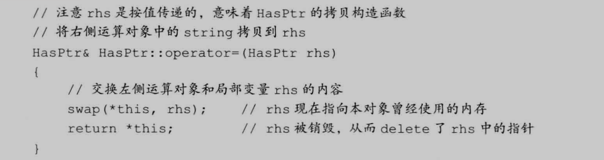

>参数是非引用类型, 会调用rhs的拷贝构造函数, 该拷贝构造函数会在动态内存分配一个新的string对象, 该string对象的值是实参的string*指向的对象的值的拷贝
>
>然后交换两个对象的string*的值
>
>返回当前对象的引用, 并且调用rhs的析构函数,该析构函数delete 了string*指向的对象, 是安全的, 并没有其他指针指向这个对象

所以在上面的例子中, 用赋值运算符进行拷贝, 并不会让两个指针指向同一个对象, 而是执行赋值操作的指向了作为实参的备份的局部变量的拷贝构造函数new出来的动态对象, 并且, 交换完成后, 局部对象指向*this原来指向的对象, 然后函数结束后, 局部对象被销毁, 调用析构函数释放指向的内存


## 拷贝控制示例

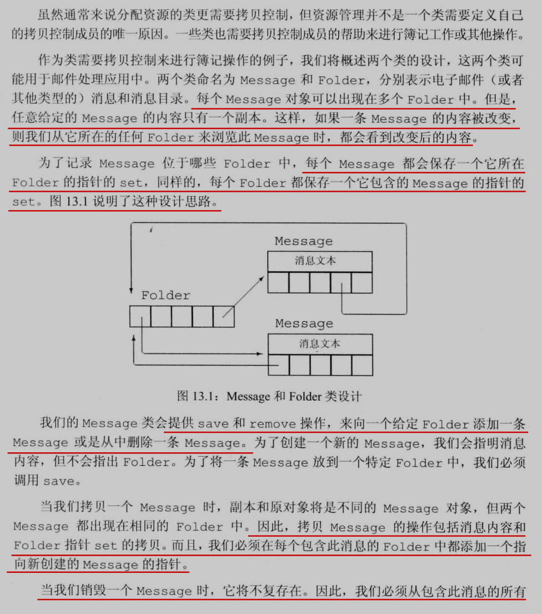

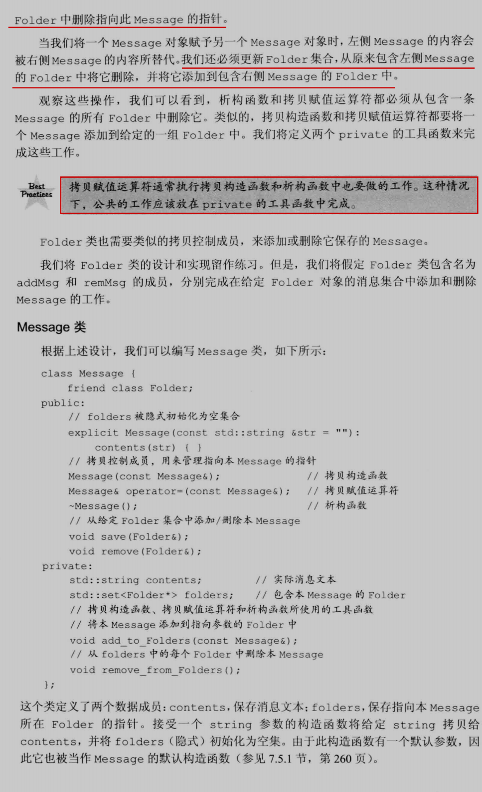

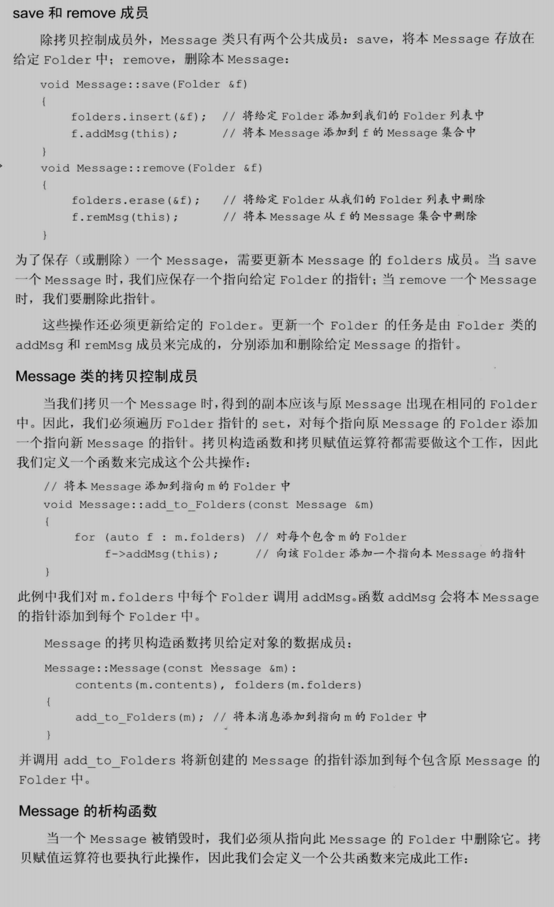

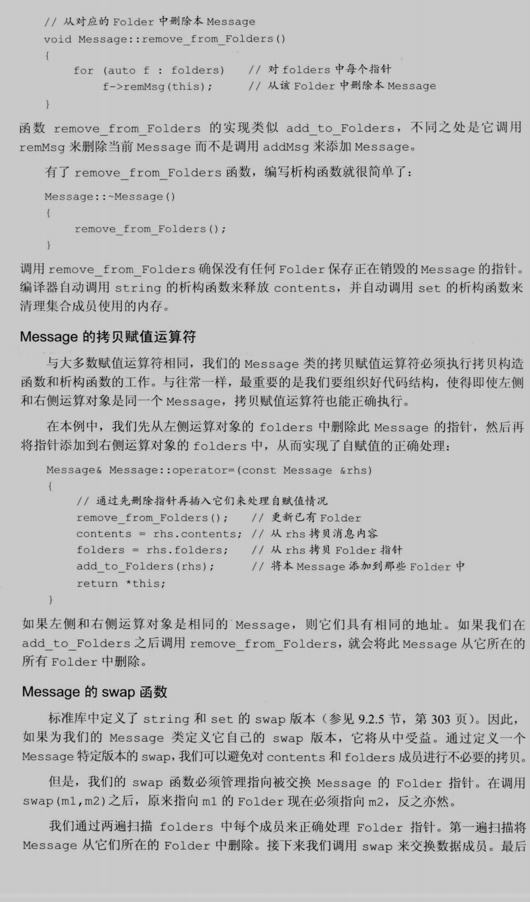

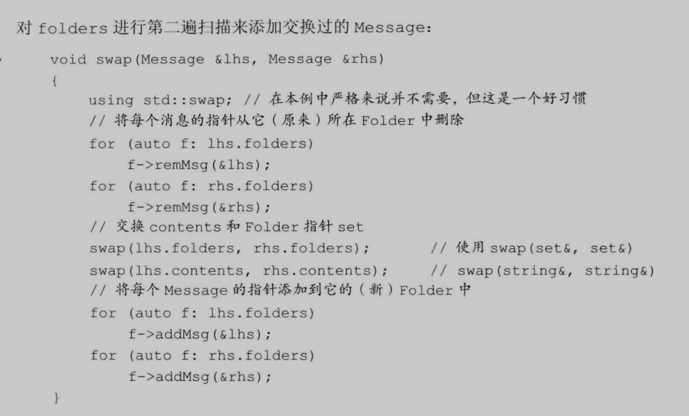


## 动态内存管理类

1. 使用allocator获得**原始内存**
2. 添加元素使用allocator的construct成员在原始内存中构造对象
3. 当删除一个元素, 使用allocator的destory成员来销毁元素


设计的类有三个指针成员指向其元素所使用的内存:

1. elements 指向分配的内存中的首元素
2. first_free 指向最后一个实际元素之后的位置
3. cap 指向分配的内存末尾之后的位置


==**当我们使用allocator分配内存时, 必须记住内存时未构造的**==

==**为了使用该原始内存, 必须调用construct在此内存中构造一个对象**==


类值行为: 当我们拷贝后赋值StrVec的时候, 必须分配独立的内存, 并从元StrVec对象拷贝元素至新对象

**可以用尾后指针减去首元素指针, 计算需要多少空间 ( 这个空间的大小也是他们之间的距离 )**


==**当原来的内存不用之后, 必须释放, 例如在赋值的时候, 释放原来的内存, 需要对分配的内存构造的元素调用destroy回归原始内存, 然后用deallocate释放原始内存**==

- destroy会调用元素的析构函数, 元素的析构函数会释放元素自己分配的内存空间


#### 在重新分配内存的过程中移动而不是拷贝元素

为一个StrVec重新分配内存会引起旧内存空间到新内存空间逐个拷贝元素

元素有类值行为, 当拷贝一个元素, 新元素和旧元素是相互独立的, 改变原元素不会影响到副本, 反之亦然


所以拷贝一个该元素会有两个用户, 但是某些情况(例如该对象重新分配一个新的空间, 将旧的空间内的元素拷贝到新的空间, 然后又将旧的元素销毁, 这个拷贝是不必要的, 而是将元素直接移动到新空间内), 拷贝之后每个元素只有一个唯一的用户, 一旦将元素从旧空间拷贝到新空间, 我们就会立即销毁原string

**因此拷贝这些元素中的数据是多余的, 在重新分配空间时, 如果我们能避免分配和释放元素的额外开销, StrVec的性能会好很多**


#### 移动构造函数和std::move

避免元素的拷贝:

​	第一种机制:

- 一些标准库类, 包括string, 定义了所谓的"移动构造函数"
- 移动构造函数通常是将资源从给定对象"移动"而不是拷贝到正在创建的对象
- 并且标准库保证"移后源"string仍然保持一个有效的, 可析构的状态
- 对于string, 想象每个string都有一个指向char数组的指针, 可以假定string的移动构造函数进行了指针的拷贝, 而不是为每个字符分配内存空间然后拷贝字符


​	第二种机制:

- 使用名为**move**的标准库函数, 定义在**头文件utility**
- 在新内存构造元素( 例如string )时, 必须调用move来表示希望使用string的移动构造函数
- 如果漏掉了move调用, 将会使用string的拷贝构造函数
- 通常不为move提供一个using声明
- 使用move, 直接调用std::move而不是move


例子:

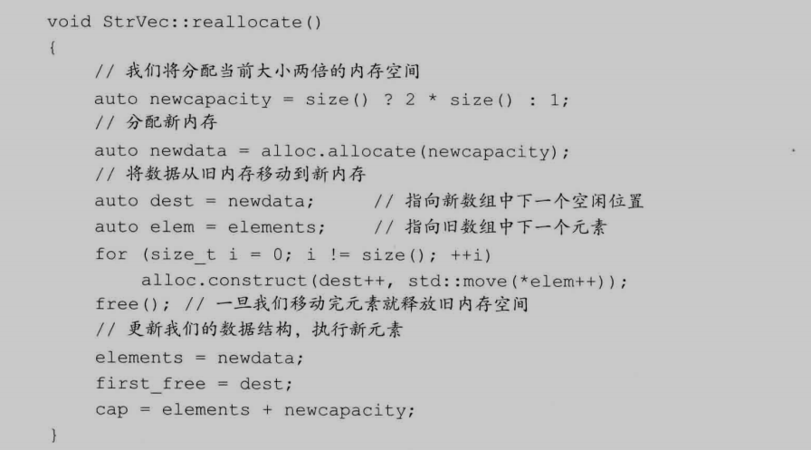

construct的第二个参数(即: 确定使用哪个构造函数的参数) 是move返回的值

调用move返回的结果会令construct使用string的移动构造函数

由于使用了移动构造函数, 这些string管理的内存将不会被拷贝, 相反, 构造的每个string都会从elem指向的string那里接管内存的所有权

元素移动之后, 调用free销毁旧元素并释放StrVec原来使用的内存

string成员不在管理他们曾经指向的内存; 其数据的管理指责已经转移给信StrVec内存中的元素了

不知道旧StrVec内存中的string包含什么值, 但我们保证对他们执行string的析构函数是安全的.


## 对象移动


**某些情况下, 对象拷贝之后就立即被销毁了, 在这种情况下, 移动而非拷贝对象会大幅度提升性能**

StrVec的例子: 在重新分配内存的过程中, 从旧内存将元素拷贝到新内存是不必要的, 更好的方式是移动元素.

==**使用移动而不是拷贝的另一个原因源于IO类或unique_ptr这样的类, 这些类都包含不能被共享的资源(如指针或IO缓冲), 因此这些类型的对象不能拷贝但可以移动**==


**新标准中, 可以用容器保存不可拷贝的类型, 只要他们能被移动即可**


标准库容器, string, shared_ptr类既支持移动也支持拷贝. IO类和unique_ptr可以移动但不能拷贝


#### ==右值引用==

1. **==所谓右值引用就是必须绑定到右值的引用==**
2. 通过**&&**来获得右值引用
3. **==右值引用重要性质: 只能绑定到一个将要销毁的对象==**
    - 因此我们可以自由地将一个右值引用的资源"移动"到另外一个对象
4. 右值和左值是表达式的属性
5. 一些表达式生成或要求左值, 而另一些则生成或要求右值
6. 一个左值表达式表示的是一个对象的身份
7. 一个右值表达式表示的是对象的值
8. 右值引用可以修改, 并不是const
9. ```C++
    int a = 0;
    int &&r = std::move(a);
    r = 100;	// 正确
    ```


8. 右值引用也是某个对象的别名
9. **const引用**: 
    1. ==初始化常量引用允许用任意表达式作为初始值, 只要表达式结果能转换成引用的类型==
    2. **==允许一个常量引用绑定非常量对象, 字面值, 表达式==**

10. **左值引用**: 不能将其绑定到要求转换的表达式, 字面常量或是返回右值的表达式
11. **右值引用**: ==和左值引用完全相反的特性, 可以将右值引用绑定到这类表达式上, 但不能将一个右值引用绑定到一个左值上==


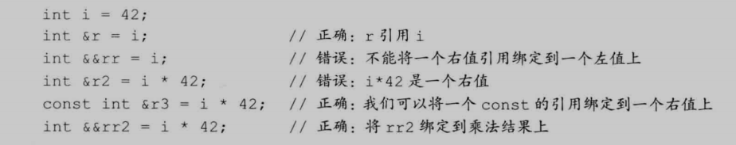


返回左值引用的例子:

- 函数
- 赋值
- 下标
- 解引用
- 前置递增/递减运算符

可以将左值引用绑定到这类表达式的结果上


==**返回非引用类型的函数, 连同算术, 关系, 位以及后置递增/递减运算符, 都生成右值, 不能将左值引用绑定到这类表达式上, 但是我们可以将一个const的左值引用或者一个右值引用绑定到这类表达式上**==


#### 左值持久, 右值短暂

1. 左值有持久的状态
2. ==**右值要么是字面常量, 要么是表达式求值过程中创建的临时对象**==


**右值引用只能绑定到临时对象, 得知:**

- **所引用的对象将要被销毁**
- **该对象没有其他用户**

**两个特性意味着: 使用右值引用的代码可以自由地接管所引用的对象的资源**


==右值引用指向将要被销毁的对象, 因此我们可以从绑定到右值引用的对象 **"窃取"** 状态==


#### 变量是左值

- 变量可以看做只有一个运算对象而没有运算符的表达式

- 变量表达式也有左值/右值属性

- ==变量表达式都是左值, 结果就是不能将一个右值引用绑定到一个右值引用类型的变量上==

    

- **==右值表示临时对象==**

- 变量是左值, 毕竟变量是持久的, 直至离开作用域时才被销毁

- **==变量是左值, 因此我们不能将一个右值引用直接绑定到一个变量上, 即使这个变量是右值引用类型也不行==**


#### 标准库move函数

1. 不能将右值引用绑定到一个左值上, **但是可以显式将一个左值转换为对应的右值引用类型**

2. ==通过调用**move**的标准库函数来获得绑定到左值上的右值引用== ( **头文件utility** )

    

    move告诉编译器: 我们有一个左值, 但我们希望像一个右值一样处理它

    **必须认识到, 调用move就意味着承诺: 除了对rr1赋值或销毁它外, 将不再使用rr1**

    在调用move之后, 我们不能对移后源对象的值做任何假设

3. ==我们可以销毁一个移后源对象, 也可以赋予它新值, 但不能使用一个移后源对象的值==

4. ==对move不提供using声明, 使用move的代码应该使用std::move而不是move, 这样做可以避免潜在的名字冲突==


​		

#### 移动构造函数和移动赋值运算符

- 移动构造函数和移动赋值运算符 有类似对应的拷贝操作, 但他们从给定对象**窃取**资源而不是拷贝资源
    - "抢夺"更合适, 在这之后资源不属于移后源对象了
- **移动构造函数的第一个参数是该类类型的一个右值引用, 与拷贝构造函数一样, 任何额外的参数都必须有默认实参**
- **移动构造函数必须确保移后源对象处于销毁它是无害的状态**
- **一旦资源完成移动, 源对象不再指向被移动的资源, 这些资源的==所有权==已经归属新创建的对象**


例子: 为StrVec定义移动构造函数, 实现从一个StrVec到另一个StrVec的元素移动而非拷贝

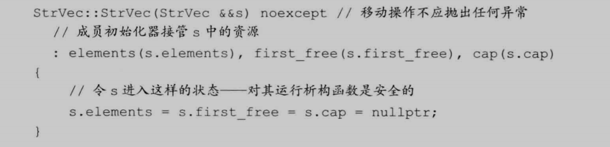


1. ==**noexcept** : 通知标准库我们的构造函数不抛出任何异常== ( 注意, 是通知标准库, 自己写的代码抛出异常就算加了noexcept也还是会抛出异常 )
2. 移动构造函数不分配任何内存
3. 它接管给定的StrVec中的内存
4. 接管内存之后将给定对象中的指针都置为nullptr
5. 上述完成就完成了对象的移动操作, 此对象将继续存在
6. **==最终, 移后源对象会被销毁, 意味着将在其上运行析构函数==**(因为被用来调用移动构造函数的实参在函数执行完毕后都要被销毁)
7. StrVec的析构函数在first_free上调用deallocate
8. ==**如果忘记了改变s.first_free,则销毁移后源对象就会释放掉我们刚刚移动的内存**==


#### 移动操作, 标准库容器和异常

1. 因为移动操作"窃取"资源, 它通常不分配任何资源

2. 因此移动操作通常不会抛出任何异常

3. 一种通知标准库的方法是在我们的构造函数中指明noexcept

    - ==noexcept是我们承诺一个函数不抛出异常的一种方法==
    - 在一个函数的参数列表后指定noexcept
    - 在构造函数中, noexcept出现在参数列表和初始化列表开始的冒号之间

    ```C++
    class StrVec {
    public:  
        StrVec(StrVec&&) noexcept;	// 移动构造函数
        // 其他成员的定义, 如前
    };
    StrVec::StrVec(StrVec &&s) noexcept : /* 成员初始化器 */ { /* 构造函数体 */ }
    ```

4. ==**不抛出异常的移动构造函数和移动赋值运算符必须标记为noexcept**==

5. ==**我们必须在类头文件的声明中和定义中(如果定义在类外的话) 指定noexcept**==

6. 如果希望在vector重新分配内存情况下对我们自定义类型的对象进行移动而不是拷贝, 就必须显式告诉**标准库**我们的移动构造函数可以安全使用, 通过将移动构造函数以及移动赋值运算符标记为noexcept来做到这一点


#### 移动赋值运算符

- 移动赋值运算符执行与析构函数和移动构造函数相同的工作
- 移动赋值运算符不抛出任何异常, 标记为noexcept
- 类似拷贝赋值运算符, 移动赋值运算符必须正确处理自赋值


例子:

```C++
StrVec &StrVec::operator=(StrVec &&rhs) noexcept {
    // 直接检测自赋值
    if (this != &rhs) {
        free();                         // 释放已有元素
        elements = rhs.elements;        // 从rhs接管资源
        first_free = rhs.first_free;
        cap = rhs.cap;
        // 将rhs置于可析构的状态
        rhs.elements = rhs.first_free = rhs.cap = nullptr;
    }
    return *this;
}
```

检查自赋值情况:

- 移动赋值运算符需要右侧运算对象的一个右值
- 进行检查的原因是此右值可能是move调用的返回结果
- **==与其他任何赋值运算符一样, 关键点是我们不能在使用右侧运算对象的资源之前就释放了左侧运算对象的资源( 可能是相同的资源 )==**


#### 移后源对象必须可析构

1. 从一个对象移动数据并不会销毁此对象, 但有时在移动操作完成后, 源对象就会被销毁
2. ==必须确保移后源对象进入一个可析构的状态==
3. StrVec的移动操作通过将移后源对象的指针置位nullptr来满足这个要求
4. ==移动操作还必须保证移动源对象仍然是有效的==
5. 一般来说, 对象有效就是指可以安全地为其赋予新值或者可以安全地使用而不依赖其当前值
6. 另一方面, 移动操作对移后源对象中留下的值没有任何要求
7. 因此我们的程序不应该依赖于移后源对象中的数据
8. **==在移动操作之后, 移后源对象必须保持有效的, 可析构的状态, 但是用户不能对其值进行任何假设==**


#### 合成的移动操作

1. 与拷贝操作不同, 编译器根本不会为某些类合成移动操作
2. 特别是, 如果一个类定义了自己的拷贝构造函数, 拷贝赋值运算符或者析构函数, 编译器就不会为它合成移动构造函数和移动赋值运算符
3. ==如果一个类没有移动操作, 通过正常的函数匹配, 类会使用对应的拷贝操作来代替移动操作==
4. **==只有当一个类没有定义任何自己版本的拷贝控制成员, 且类的每个非static数据成员可以移动时, 编译器才会为它合成移动构造函数或移动赋值运算符==**
5. 编译器可以移动内置类型的成员
6. 如果一个成员是类类型, 且该类有对应的移动操作, 编译器也能移动这个成员
7. **==只有当一个类没有定义任何自己版本的拷贝控制成员, 且它的所有数据成员都能移动或移动赋值时, 编译器才会为它合成 移动构造函数和移动赋值运算符==**
8. 移动操作永远不会隐式定义为删除的函数
9. 如果我们显式地要求编译器生成=default的移动操作, 且编译器不能移动所有成员, 编译器会将移动操作定义为删除的函数
10. **如果一个类定义了移动构造函数/移动赋值运算符, 则该类的合成拷贝构造函数和拷贝赋值运算符会被定义为删除的**
11. ==定义了一个移动构造函数或移动赋值运算符的类也必须定义自己的拷贝操作, 否则, 这些拷贝操作成员默认地定义为删除的==


例子:

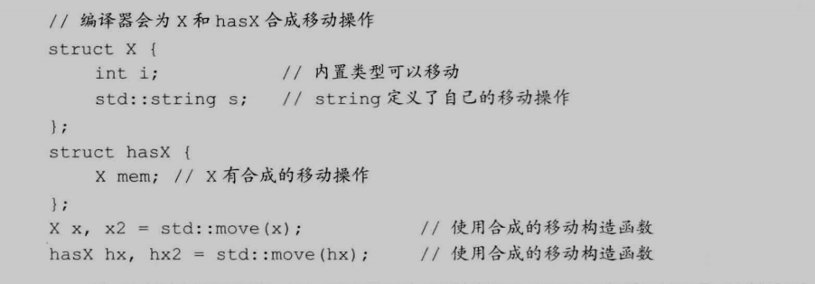


什么时候将合成的移动操作定义为删除的函数遵循与定义删除的合成拷贝操作类似的规则:

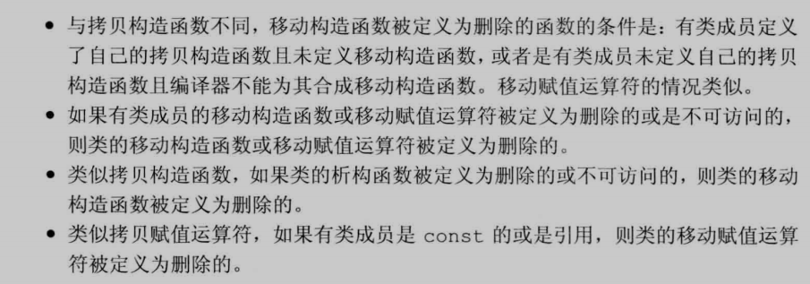

例子:

 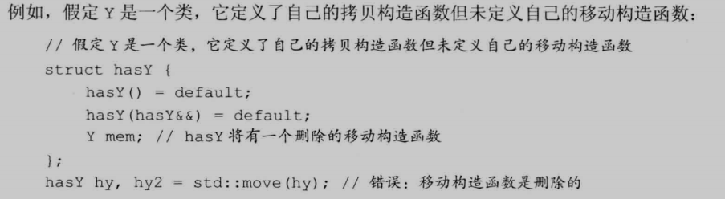

==类hasY显式地要求一个移动构造函数, 但是因为Y类型的数据成员没有不能移动, 编译器无法为hasY生成, 因此hasY会有一个删除的移动构造函数==

如果hasY忽略了移动构造函数的声明, 则编译器根本不可能为它合成一个

如果移动操作可能被定义为删除的, 编译器就不会合成他们


#### 移动右值, 拷贝左值

1. **==如果一个类既有移动构造函数, 也有拷贝构造函数, 编译器使用普通的函数匹配规则来确定使用哪个构造函数, 赋值操作情况类似==**
2. 如果一个类有一个可用的拷贝构造函数而没有移动构造函数, 则其对象是通过拷贝构造函数来"移动"的, 拷贝赋值运算符和移动赋值运算符的情况类似


例子: StrVec类中, 拷贝构造函数接受一个const StrVec&, 可以用于任何可以转换为StrVec的类型

==而移动构造函数接受一个StrVec&&, 因此只能用于实参是(非static)右值的情形==

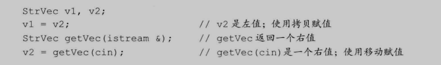

第一个赋值中: v2传递给赋值运算符, v2的类型是StrVec, 表达式v2是一个左值, 因此移动赋值运算符是不可行的, 因为我们不能隐式将一个右值引用绑定到一个左值, 所以这个赋值语句使用的事拷贝赋值运算符

**==第二个赋值中:函数调用的结果是右值( 任何返回非引用类型的函数返回的都是右值 ), 在这种情况下, 两个赋值运算符都是可行的, 调用拷贝赋值运算符需要进行一次到const的转换( const StrVec& ), 而StrVec&&则是精确匹配, 因此第二个赋值会使用移动赋值运算符.==**


#### 但如果没有移动构造函数, 右值也被拷贝

如果一个类有一个拷贝构造函数但未定义移动构造函数, 编译器不会合成移动构造函数, 意味着此类将有拷贝构造函数而没有移动构造函数

==如果一个类没有移动构造函数, 函数匹配规则保证该类型的对象会被拷贝, 即使我们试图通过调用move来移动他们时也是如此==


例子:

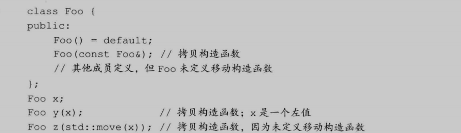

==对z进行初始化时, 返回一个绑定到x的Foo&&, Foo的拷贝构造函数是可行的, 因为我们可以将一个Foo&&转换为一个const Foo&, 因此, z的初始化将调用Foo的拷贝构造函数==


#### 拷贝并交换赋值运算符和移动操作

HasPtr版本定义了一个拷贝并交换赋值运算符, 是函数匹配和移动操作间相互关系的一个很好的示例

**==如果我们为此类添加一个移动构造函数, 它实际上也会获得一个移动赋值运算符==**

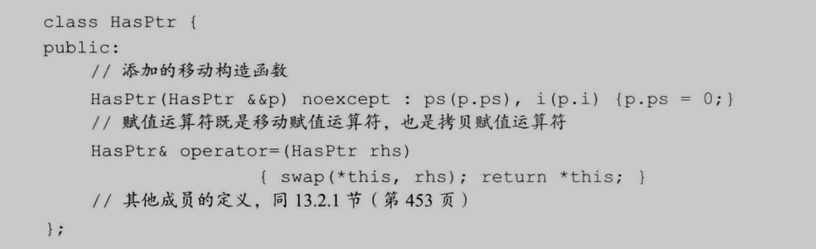

赋值运算符有一个非引用参数, 意味着此参数要进行**拷贝初始化**

==依赖于实参的类型, 拷贝初始化要么使用拷贝构造函数, 要么使用移动构造函数==

- 左值被拷贝
- 右值被移动

因此单一的赋值运算符就实现了拷贝赋值运算符和移动赋值运算符两种功能

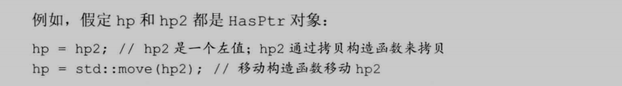

==**第二个赋值中, std::move将一个右值引用绑定到hp2上**==

==**这种情况拷贝构造函数和移动构造函数都是可行的, 由于实参是一个右值引用, 和移动构造函数精确匹配, 移动构造函数从hp2拷贝指针, 而不会分配任何内存**==

不管使用的事拷贝构造函数还是移动构造函数,  赋值运算符的函数体都swap两个运算对象的状态

交换HasPtr会交换两个对象的指针(及int)成员, 在swap之后, rhs中的指针将指向原来左侧运算对象所拥有的string, 当rhs离开其作用域, 这个string将被销毁


#### 建议: 更新三/五法则

**==所有五个拷贝控制操作应该看做一个整体: 一般来说, 如果一个类定义了任何一个拷贝操作, 它就应该定义所有五个操作==**

某些类必须定义拷贝构造函数, 拷贝赋值运算符和析构函数才能正确工作

这些类通常只有一个资源, 而拷贝成员必须拷贝此资源

一般来说, 拷贝一个资源会导致一些额外开销, 在这种拷贝并非必要的情况下, 定义了移动构造函数和移动赋值运算符的类就可以避免此问题


#### Message类的移动操作

Message类可以使用string和set的移动操作来避免拷贝contents和folders成员的额外开销

除了移动folders成员, 还必须更新每个指向原Message的Folder, 必须删除指向旧Message的指针, 并添加一个指向新Message的指针

移动构造函数和移动赋值运算符都需要更新Folder指针, 因此我们首先定义一个操作来完成这一共同的工作:

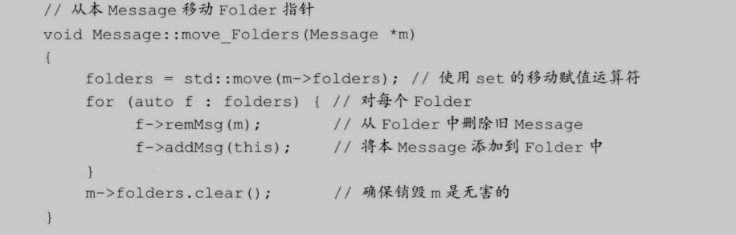

此函数首先移动folders集合. 通过调用move, 我们使用了set的移动赋值运算符而不是它的拷贝赋值运算符

==如果我们忽略了move调用, 代码仍能正常工作, 但带来了不必要的拷贝==

注意: 想set插入一个元素可能会抛出一个异常, 想容器添加元素的操作要求分配内存, 意味着可能会抛出一个bad_alloc异常

**==因此与我们的HasPtr和StrVec类的移动操作不同, Message的移动构造函数和移动赋值运算符可能会抛出异常, 因此我们未将它们标记为noexcept==**

==**函数最后对mfolders调用clear, 清空了m的set, 在执行了move之后, 知道m.folders仍然是有效的, 但不知道它包含什么内容, 由于Message的析构函数遍历folders, 我们希望能确定set是空的**==


Message的移动构造函数调用move来移动contents, 并默认初始化自己的folders成员:

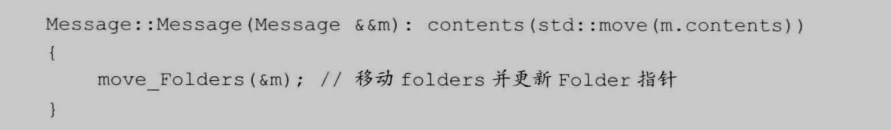


移动赋值运算符直接检查自赋值情况

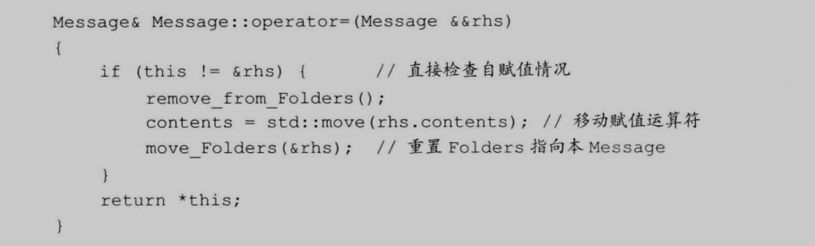

与任何赋值运算符一样, 移动赋值运算符必须销毁左侧运算对象的旧状态

> remove_fron_Folders() 用来将保存当前对象的folder中将当前对象删除


#### 移动迭代器

新标准库中定义了一种**移动迭代器**适配器

- 一个移动迭代器通过改变给定迭代器的解引用运算符的行为来适配此迭代器
- 一般来说, 一个迭代器的解引用返回一个指向元素的左值
- ==**与其他迭代器不同, 移动迭代器的解引用运算符生成一个右值引用**==


通过调用标准库的make_move_iterator函数将一个普通迭代器转换为一个移动迭代器

- 此函数接受一个迭代器参数, 返回一个移动迭代器


> StrVec的reallocate成员使用for循环来调用construct从旧内存将元素拷贝到新内存中, 使用uninitialized_copy来构造新分配的内存更简单, 但是它对元素进行拷贝操作, 标准库中并没有类似的函数将对象"移动"到未构造的内存中


原迭代器的所有其他操作在移动迭代器中都照常工作

由于移动迭代器支持正常的迭代器操作,  可以将一对移动迭代器传递给算法

特别是, 可以将移动迭代器传递给uninitialized_copy:

```C++
void StrVec::reallocate() {
    //auto newcapacity = size() ? 2 * size() : 1;
    //auto newdata = alloc.allocate(newcapacity);
    //auto dest = newdata;    
    //auto elem = elements;   

    //for (size_t cnt = 0; cnt != size(); ++cnt)
    //    alloc.construct(dest++, std::move(*elem++));
    //free();
    //elements = newdata;
    //first_free = dest;
    //cap = elements + newcapacity;

    auto newcapacity = size() ? 2 * size() : 1;
    auto first = alloc.allocate(newcapacity);
    auto last = uninitialized_copy(make_move_iterator(begin()), make_move_iterator(end()), first);
    free();
    elements = first;
    first = last;
    cap = elements + newcapacity;
}
```

1. uninitialized_copy对输入序列中的每个元素调用construct来将元素"拷贝到目的为止"

2. 此算法使用迭代器的解引用运算符从输入序列中提取元素

3. **==由于我们传递给它的是移动迭代器, 因此解引用运算符生成的是右值引用, 这意味着construct将使用移动构造函数来构造元素==**


#### 建议: 不要随意使用移动操作

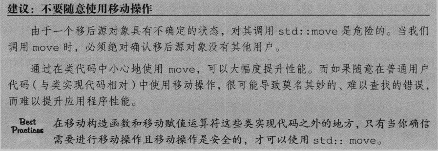


练习:

```C++
class HasPtr {
public:
    HasPtr() = default;
    HasPtr(HasPtr &&p) noexcept { }
    HasPtr& operator=(HasPtr rhs) { return *this; }
    HasPtr& operator=(HasPtr &&rhs) noexcept { return *this; }
};
HasPtr h1, h2, h3(std::move(h2));
h1 = std::move(h2);		// 错误, 二义性调用, std::move返回的值和HasPtr rhs还有HasPtr &&rhs都是同一个匹配的级别
```

> 另外, 如果注释掉移动赋值运算符, 那么h1 = std::move(h2)调用顺序是
>
> 1. std::move(h2)返回一个右值引用 
> 2. 用返回的右值调用移动构造函数构造一个临时的对象 
> 3. 用这个临时的对象调用拷贝赋值运算符给h1赋值
>
> 另外, 如果注释掉拷贝并交换赋值运算符, 调用顺序是:
>
> 1. 调用点的一个临时量绑定移动赋值运算符
> 2. 然后用这个临时量调用移动赋值运算符


#### 右值引用和成员函数

如果一个成员函数同时提供拷贝和移动版本, 也能受益

这种允许移动的成员函数通常使用与拷贝/移动构造函数和赋值运算符相同的参数模式

- 一个版本接受一个指向const的左值引用
- 第二个版本接受一个指向非const的右值引用


例子:


1. 可以将能转换为X类型的任何对象传递给第一个版本的push_back, 此版本从其参数拷贝数据
2. **==第二个版本, 只可以传递给它非const的右值, 此版本对于非const的右值是精确匹配的, 因此当我们传递一个可修改的右值, 编译器会选择运行这个版本, 此版本从其参数窃取( 接管 )数据==**


一般来说, 不需要为函数操作定义一个接受const X&&或是一个(普通的) X&参数的版本

- 当我们希望从实参"窃取"数据, 通常传递一个右值引用, 为了达到这个目的, 实参不能是const的( 后续会让它的资源处于可正常销毁的状态 )
- 从一个对象进行拷贝的操作不应该改变该对象, 因此通常不需要定义一个接受一个(普通)X&参数的版本


具体例子:

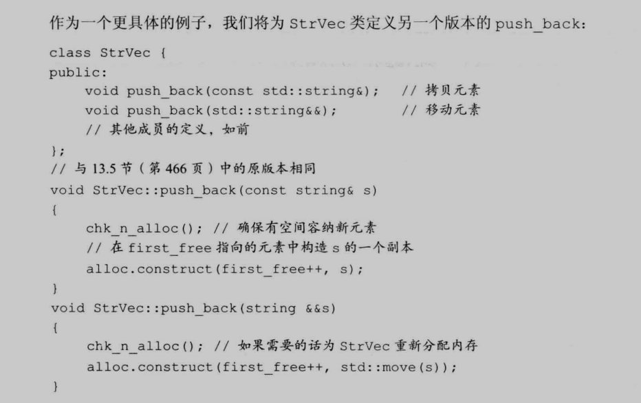

1. 两个成员几乎是相同的
2. 差别在于右值引用版本调用move来将其参数传递给construct
3. construct函数使用第二个和随后的实参的类型来确定使用哪个构造函数
4. **==由于move返回一个右值引用==**, 传递给construct的实参类型是string&&
5. 因此会使用string的移动构造函数来构造新元素


当我们调用push_back, 实参类型决定了新元素是拷贝还是移动到容器中:

```C++
StrVec vec;	// 空StrVec
string s = "sss";
vec.push_back(s);	// 调用push_back(const string &)
vec.push_back("done");	// 调用push_back(string&&) 
```

这些调用的差别在于实参是一个左值还是右值(**==从"done"创建的临时string==**)

- 用"done"调用string对应的构造函数构造一个临时的string对象, 是一个右值, 所以调用的push_back是strin&&版本的
- **==总的来说就是: 用另外一个类型(包括右值引用类型)的对象初始化/赋值, 会调用被初始化/赋值的对象的对应的构造函数来构造一个临时的对象, 然后再调用对应的构造函数/赋值运算符==**


```C++
class HasPtr {
public:
    HasPtr() = default;
    HasPtr(const HasPtr&) { }
    HasPtr(HasPtr &&p) noexcept { }
    HasPtr& operator=(HasPtr rhs) { return *this; }
    //HasPtr& operator=(HasPtr &&rhs) noexcept { return *this; }
};

HasPtr&& return_hasptr() {
    return HasPtr();
}
```


#### 右值和左值引用成员函数( ==引用限定符== )

通常我们在一个对象上调用成员函数, 而不管该对象是一个左值还是右值

例如:


我们在一个string右值上调用find成员,该string右值是通过连接两个string而得到的 ( 返回的是一个临时对象 )


==**此处我们队两个string的连接结果( 一个右值 ) 进行赋值**==


1. **==可以在自己的类中阻止向右值赋值, 这种情况下, 我们希望强制左侧运算对象( 即, this指向的对象 ) 是一个左值==**

2. **即:在参数列表后放置一个引用限定符**

3. ==**引用限定符可以是&或&&, 分别指出this可以指向一个左值或右值**==

4. ==**类似const限定符, 引用限定符只能用于(非 static) 成员函数, 且必须同时出现在函数的声明和定义中**==


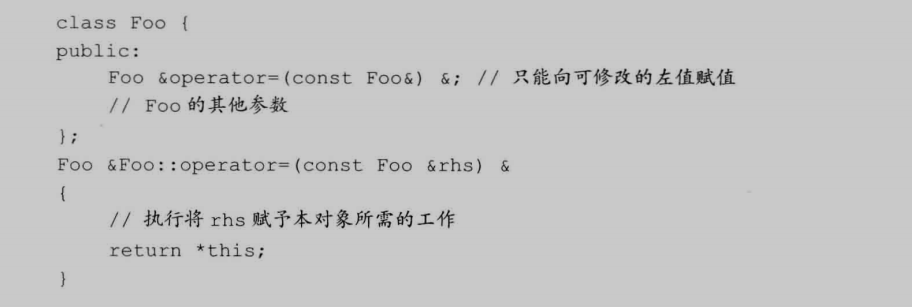


**==对于&限定的函数, 我们只能将她用于左值; 对于&&限定的函数, 我们只能将它用于右值:==**

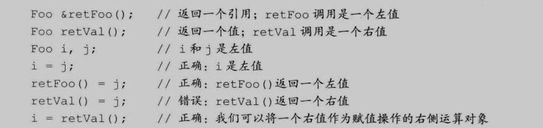

> 可以将一个右值作为赋值操作的右侧运算对象


**==一个函数可以同时用const和引用限定, 在此情况下, 引用限定符必须跟随在const限定符之后==**

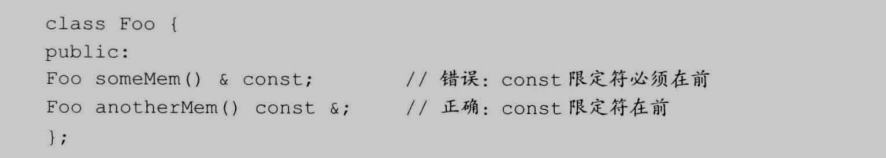


#### 重载和引用函数


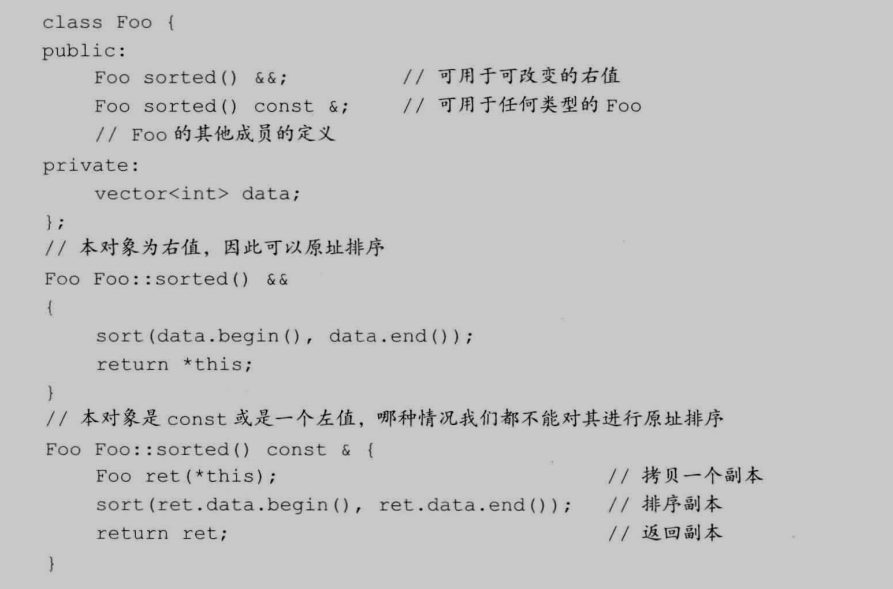


- **==我们可以综合引用限定符和const来区分一个成员函数的重载版本==**
    - 原址排序( 原地排序 )

- 当我们对一个右值执行sorted, 它可以安全地直接对data成员进行排序

- **==对象是一个右值, 意味着没有其他用户==**, 因此我们可以改变对象

- 当对一个const右值或一个左值执行sorted, 我们不能改变对象( **因为调用这个函数的必定是左值对象**)

- **编译器会根据调用sorted的对象的左值/右值属性来确定使用哪个sorted版本**

    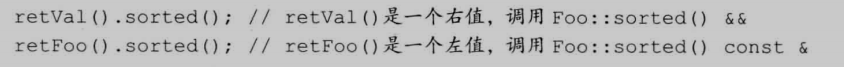

- **==如果我们定义两个或两个以上具有相同名字和相同参数列表的成员函数, 就必须对所有函数都加上引用限定符, 或者所有都不加==**

    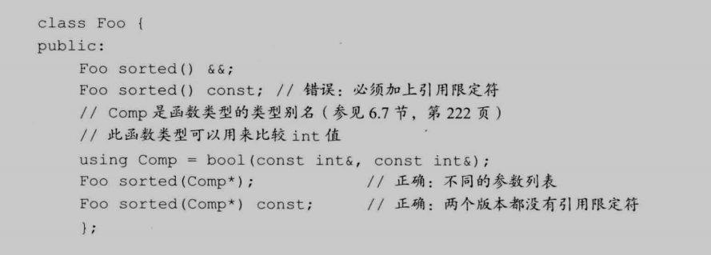

- **如果一个成员函数由引用限定符, 则具有相同参数列表的所有版本都必须有引用限定符**

