[TOC]


## 基本概念

1. 重载的运算符也是函数
2. 名字由**关键字operator**定义
3. ==除了重载函数调用运算符**operator()**之外, 其他重载运算符不能含有默认实参==
4. 如果一个运算符函数是成员函数, 则它的第一个参数绑定到隐式的this指针上
5. **==对于运算符函数, 它或者是类的成员, 或者至少含有一个类类型的参数==**
6. ==对于重载的运算符, 其优先级和结合律与对应的内置运算符保持一致==
7. +, -, *, /, 可以从参数数量推断是一元还是二元


### 表14.1: 运算符

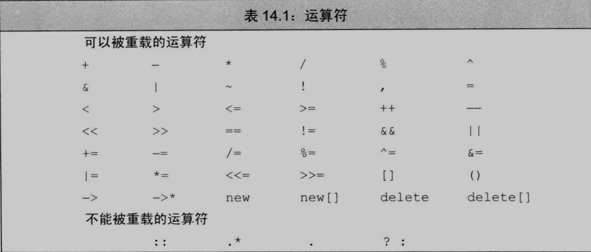


### 直接调用一个重载的函数

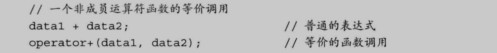


### 某些运算符不应该被重载

1. 重载的逻辑与, 逻辑或, 逗号的运算对象求值顺序规则无法保留下来
2. && 和 || 运算符的重载版本无法保留内置运算符的短路求值属性, 两个运算对象总是被求值
3. **==一般不重载逗号, 取地址, 逻辑与和逻辑或运算符==**


### 使用与内置类型一致的含义

1. 某些操作在逻辑上与运算符相关才适合定义成重载的运算符
2. 检查相等性定义operator==, 也应该定义operator!=
3. 如果类包含内在单序比较, 定义operator<, 如果有operator<, 也应该定义其他关系操作
4. 重载运算符返回类型通常与内置版本的返回类型兼容
    - 逻辑运算符和关系运算符返回bool
    - 算术运算符返回一个类类型的值
    - 赋值运算符和复合赋值运算符返回左侧运算对象的引用


### 赋值和复合赋值运算符

1. 这两运算符应该返回左侧运算对象的引用
2. +=运算符先执行+, 再执行=
3. 类含有算术运算符和位运算符, 最好提供对应的复合赋值运算符


### 选择作为成员还是非成员

**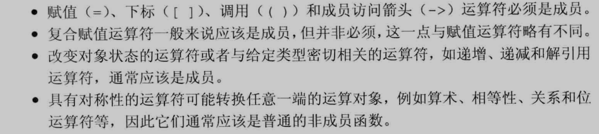**


**==当运算符定义为成员函数, 它的左侧运算对象必须是运算符所属类的一个对象==**

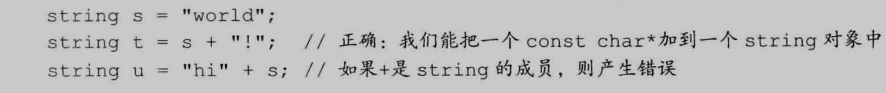

> s重载了+
>
> 但是"hi"是 const char *类型的, 没有重载+
>
> 建议+运算符定义为非成员函数


## 输入和输出运算符

1. 第一个形参是非常量ostream对象的引用
2. 第二个形参是常量的引用
3. operator<<一般要返回它的ostream形参
4. 输出运算符应该主要负责打印对象的内容而非控制格式, 尤其不会打印换行符, 令用户控制输出的细节
5. **==输入输出运算符必须是非成员函数==**
6. 一般声明为友元, 要读取非公有数据成员


例子:


### 重载输入运算符>>

1. 第一个形参是要读取流的引用
2. 第二个形参是将要读入到的非常量对象的引用
3. 返回某个给定流的引用
4. **==输入运算符必须处理输入可能失败的情况, 输出运算符不需要==**
5. 当读取操作发生错误, 输入运算符应该负责从错误中恢复


例子:

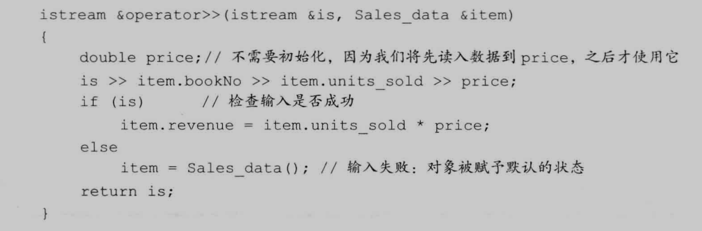

> 如果前面读取失败, 则price的值未定义, 则if判断走else分支, 让对象被赋予默认状态, 从错误中恢复


## 算术和关系运算符

1. 通常定义为非成员函数
2. 形参一般是常量引用
3. ==**返回两个运算对象结果, 这个结果位于局部变量之内, 操作完成之后返回该局部变量的副本作为结果**==
4. 如果定义算术运算符, 也应该定义对应的复合赋值运算符
5. **应该用复合赋值运算符定义算术运算符**


例子:

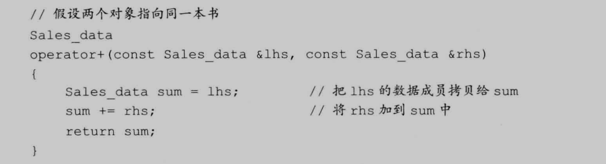


### 相等运算符

1. 只有当所有对应的成员都相等时才认为两个对象相等
2. 如果定义了operator==, 也应该定义operator!=
3. 相等运算符和不相等运算符中的一个应该把工作委托给另一个


例子:

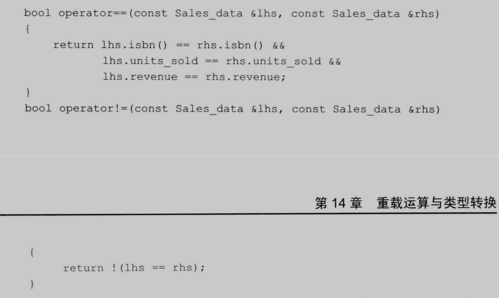


### 关系运算符

1. 因为关联容器和一些算法要用到小于运算符, 所以定义operator<会比较有用
2. 如果存在唯一一种逻辑可靠的<定义, 则考虑为这个类定义<运算符
3. 如果类同时包含==, 则仅当<的定义和 ==产生的结果一致才定义<运算符
    - ==要比较所有成员, 如果<仅仅比较一个成员, 那么当<返回false的时候, 应该说明两个对象相等, 但是还有两个数据成员没有比较, 所以不存在合理的<运算符定义


## 赋值运算符

1. **必须定义为成员函数**
2. 除了拷贝赋值和移动赋值, 还可以定义接受花括号内的元素列表作为参数的赋值
3. 赋值运算符要返回左侧运算对象的引用
4. **要处理自赋值还有要销毁对象释放旧内存空间的情况**
5. **和拷贝赋值移动赋值一样, 其他重载的赋值运算符必须释放当前内存空间, 再创建一片新空间**


例子:

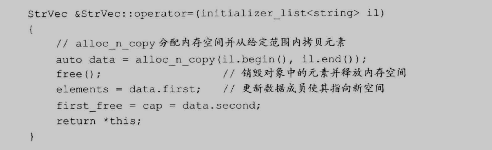

> 因为形参是initializer_list< string >, 确保il与this所指的不是同一个对象, 所以不需要检查处理自赋值 


### 复合赋值运算符

1. 建议定义为类的成员
2. 返回左侧运算对象的引用
3. 要处理自赋值和旧内存的释放


例子:

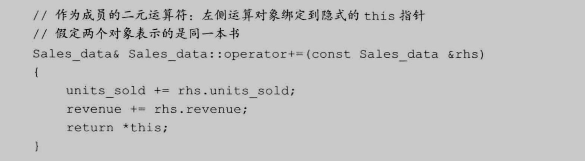


## 下标运算符

1. 必须是成员函数
2. 表示容器的类通常可以通过元素在容器中的位置访问元素, 这些类一般会定义下标运算符operator[]
3. 以所访问元素的引用作为返回值, 可以出现在赋值运算符的任意一端
4. 定义常量版本和非常量版本
    - 一个返回普通引用, 另一个是类的常量成员并且返回常量引用确保不会给返回的对象赋值


例子:

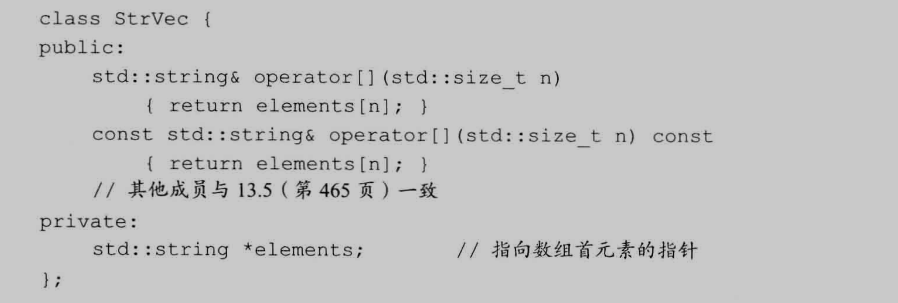

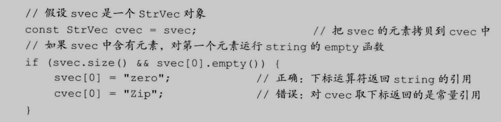

> 当StrVec是非常量, 我们可以给元素赋值
>
> 对常量对象取下标时候, 不能为其赋值


## 递增和递减运算符

1. 因为改变所操作对象的状态, 建议设定为成员函数
2. 应该同时定义前置和后置版本
3. 与内置版本一致, **前置运算符应该返回递增和递减后对象的引用**


### 定义前置递增/递减运算符


例子:

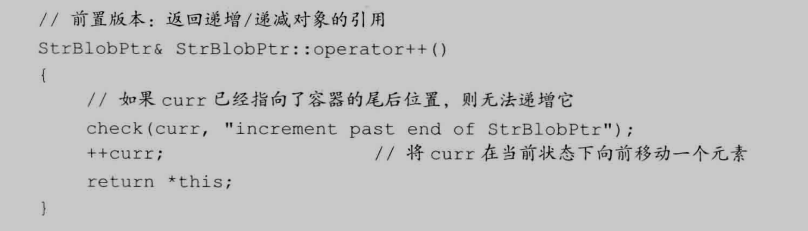

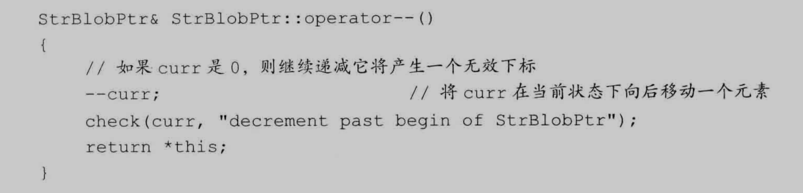


### 区分前置和后置运算符

1. **==后置版本接受一个额外的(不被使用)int类型的形参(因为不需要用到, 所以无需名字)==**
2. **与内置版本一致, 后置运算符应该返回对象的原值, 返回的形式是一个值而非引用**
3. 对于后置版本, 递增对象之前首先记录对象的状态
4. 使用重载的前置递增递减实现后置版本, 可以代码复用


例子:

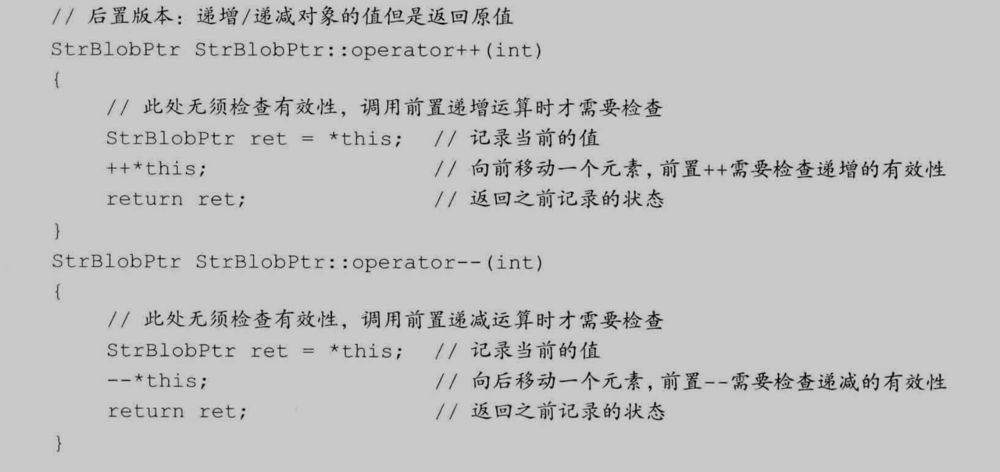


## ==成员访问运算符==

1. 箭头运算符必须是类的成员
2. 解引用运算符通常也是类的成员
3. **==箭头运算符不执行任何自己的操作, 而是调用解引用运算符并返回解引用结果元素的地址==**
4. 解引用和箭头通常都是const成员, 返回非常量的引用和指针


例子: 仔细看

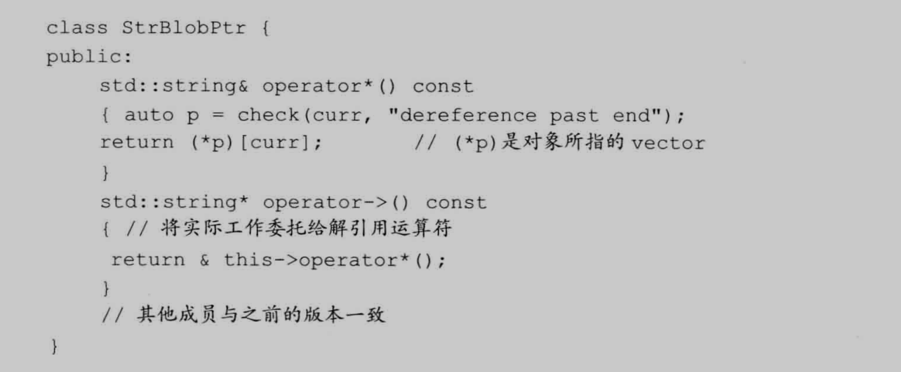


### 对箭头运算符返回值的限定(重载箭头运算符的机制)

1. 可以改变的是箭头从哪个对象中获取成员, 箭头获取成员这事实永远不变
2. **==重载的箭头运算符必须返回类的指针或者自定义了箭头运算符的某个类的对象==**


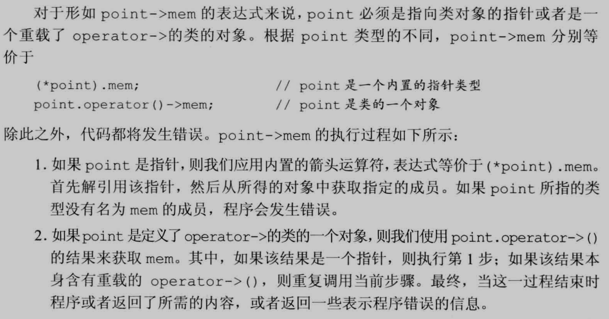


## 函数调用运算符

1. 重载了函数调用运算符的类也能存储状态, 比普通函数更灵活

2. **必须是成员函数**

3. 不同版本的调用运算符, 参数数量和类型上应该有所不同

4. **定义了调用运算符的类, 该类的对象称为函数对象, 因为行为像函数一样**

5. 函数对象常常用作泛型算法的实参

    ```C++
    for_each(vs.begin(), vs.end(), PrintString(cerr, '\n'));
    ```

    

### 含有状态的函数对象类

例子:

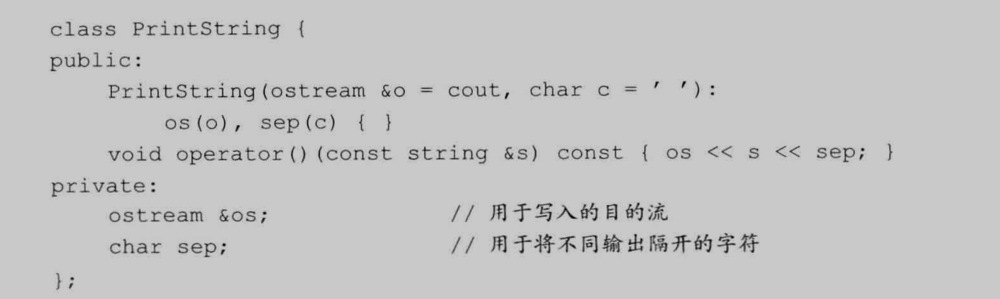

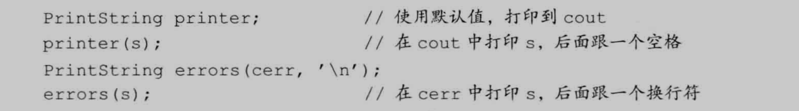


### lambda是函数对象

1. 编写的lambda, 编译器将该表达式翻译成一个未命名类的未命名对象
2. 在lambda表达式产生的类中含有一个重载的函数调用运算符
3. 默认lambda不能改变捕获的变量, 所以产生的类中的函数调用运算符是const成员函数
4. 如果lambda声明为可变(mutable)的, 则调用运算符就不是const的了


例子:

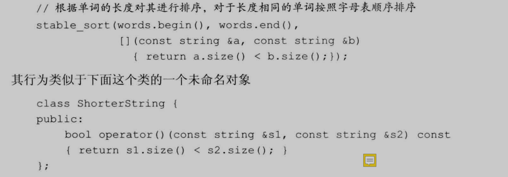


此时可以用ShorterString代替lambda:

```C++
stable_sort(words.begin(), words.end(), ShorterString());
```


### 表示lambda及相应捕获行为的类

1. 如果通过引用捕获, 有程序负责执行时对象确实存在, 因此编译器可以直接使用该引用并且无需再lambda产生的类中将其存储为数据成员
2. **==通过值捕获的变量被拷贝到lambda中, 这种lambda产生的类必须为每个值捕获的变量建立对应的数据成员, 同时创建构造函数, 令其使用捕获的变量的值来初始化数据成员==**
3. lambda表达式产生的类不含默认构造函数, 赋值运算符及默认析构函数; 是否含有默认的拷贝/移动构造函数通常要视捕获的数据成员类型而定


例子:

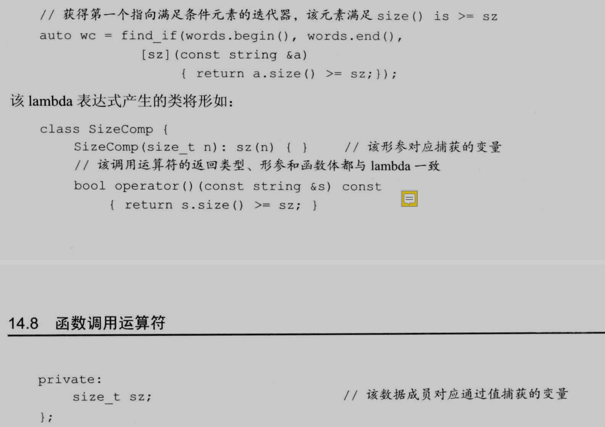


使用这个类必须提供实参:

```C++
auto wc = find_if(words.begin(), words.end(), SizeComp(sz));
```


### 标准库定义的函数对象

1. **==定义在functional头文件中==**

2. 表示运算符的函数对象类常用来替换算法中的默认运算符

    - 默认用operator<升序排序, 可以传入greater类型对象, 该类将产生一个调用运算符并负责执行待排序类型的大于运算符:

        ```C++
        // 传入一个临时的函数对象用于执行两个string对象的>比较运算
        sort(svec.begin(), svec.end(), greater<string>());
        ```

        sort不使用默认的<运算符, 而是调用给定的greater函数对象

3. **关联容器使用less<key_type>对元素排序**, 所以可以直接定义一个指针的set或者在map中使用指针作为关键值而无需直接声明less


例子:

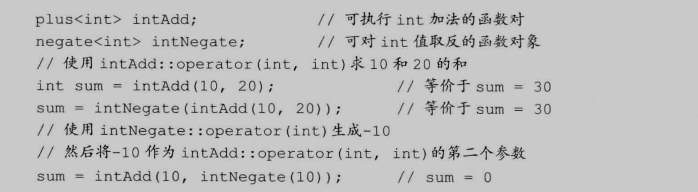


#### 表14.2: 标准库函数对象

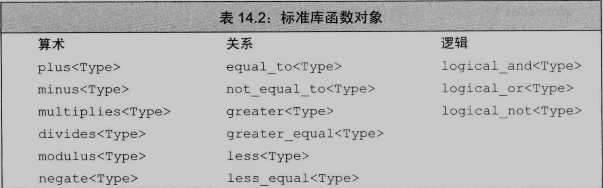


### 排列指针的vector

1. 可能希望通过比较指针的内存地址来sort指针的vector
    - 直接做会产生未定义的行为
    - 可以使用less函数对象来进行比较


例子:

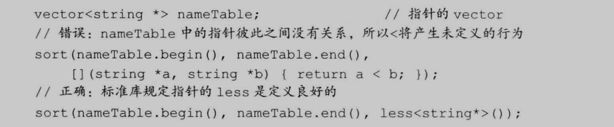


### 可调用对象与function

1. 可调用对象:
    1. 函数
    2. 函数指针
    3. lambda表达式
    4. bind创建的对象
    5. 重载函数调用运算符的类
2. 可调用对象也有类型:
    1. 每个lambda有它自己唯一的(未命名)类型
    2. 函数以及函数指针的类型由其返回值类型和实参类型决定
3. ==不同类型的可调用对象可能共享同一种**调用形式**: 调用形式指明了调用返回的类型以及传递给调用的实参类型, 一种调用形式对应一个函数类型==
    - 例子: int(int, int)


### 不同类型可能具有相同的调用形式

例子:

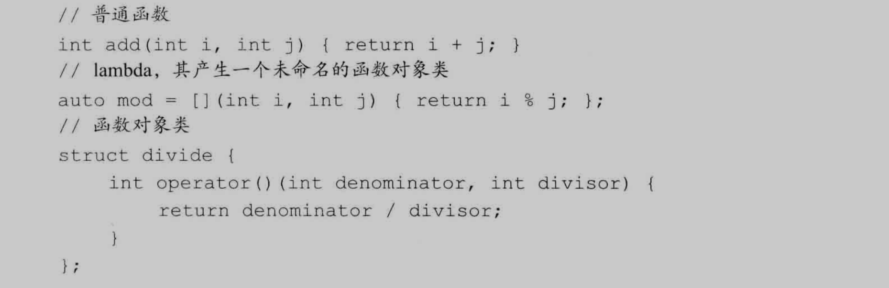

> 类型不同, 但是共享同一种调用形式: 都是int(int, int)


### 函数表

1. **函数表:** 可以做一个简易计算器
2. 可以通过map来实现


函数表错误例子：

```C++
map<string, int(*)(int, int)> binops;
// 正确： add是一个指向正确类型函数的指针
binops.insert({"+", add});	// {"+", add}是一个pair
```

但是不能将lambda表达式产生的对象或者函数对象存入值为函数指针的map

```C++
auto mod = [](int a, int b){ return a & b; };
binops.insert({"%", mod});
```


### 表14.3: 标准库function类型的操作


1. function是模板类, 需要提供额外信息, **该信息是指该function类型能够表示的对象的调用形式**

    ```C++
    function<int(int, int)>
    ```


使用例子:

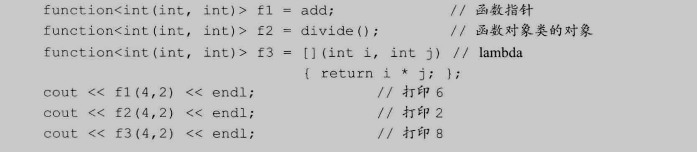


使用function重定义的函数表的例子:

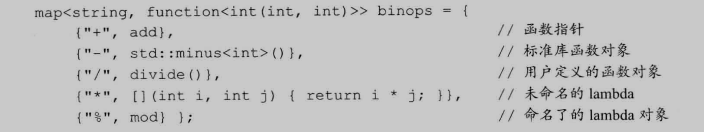

function重载了调用运算符

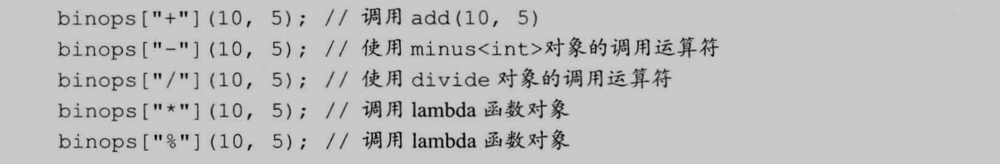

**虽然类型不同, 但是调用形式相同, 所以都可以存储在对应的function中**


### 重载的函数与function

1. 不能(直接)将重载函数的名字存入function类型的对象中
    1. 两个同名的函数, 不知道是哪个, 并不会自动匹配调用形式对的那个


错误例子:

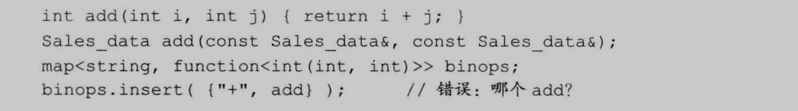


**解决方法1: 可以存储函数指针, 而非函数名字**

```C++
int (*fp)(int, int) = add;	// 指针所指的add是接受两个int的版本
binops.insert({ "+", fp});
```

**解决方法2: 使用lambda消除二义性**

```C++
binops.insert( {"+", [](int a, int b){ return a + b; } });
```


## 重载, 类型转换与运算符

1. **类型转换运算符**是类的一种特殊成员函数, 负责将一个类类型的值转换成其他类型, 一般形式为:
    - operator *type*() const;
2. **类型转换运算符可以面向任何类型(除了void之外)进行定义, 只要该类型能作为函数的返回值**
3. **如上, 因此不允许转换成数组或者函数类型,  但是允许转换成指针(包括数组指针以及函数指针)或者引用类型**
4. **一个类型转换函数必须是类的成员函数; 不能声明返回类型, 形参列表必须为空, 通常是const的**
5. **尽管类型转换函数不负责指定返回类型, 但实际上每个类型转换函数都会返回一个对应的类型**


### 定义含有类型转换运算符的类

1. 定义了向类类型的转换
2. 也定义了从类类型向其他类型的转换

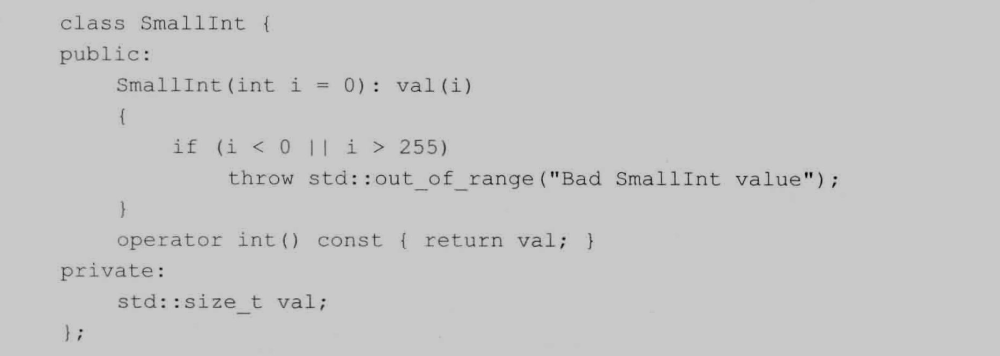

使用例子:

```C++
SmallInt si;
si = 3;	// 首先将4隐式转换成SmallInt, 然后调用SmallInt::operator=
si + 4;	// 首先将si隐式转换成int, 然后执行整数的加法

// 内置类型转换将double实参转换成int
si = 3.14;	// 调用SmallInt(int)构造函数
// SmallInt的类型转换运算符将si转换成int
si + 3.14;	// 内置类型转换将所得的int继续转换成double
```


### 类型转换运算符的意外结果

1. bool是算术类型, 所以类类型的对象转换成bool后就能被用在任何需要算术类型的上下文中


例子:

```C++
int i = 42;
cin << i; // 如果向bool的类型转换不是显式的, 则编译器看起来是合法的
```

istream没有定义<<, 应该错误, 但是istream的bool类型转换运算符将cin转换成bool, bool值会提升成int, 并用作内置左移运算符的左侧运算对象, 提升后的bool值(0 和 1) 最终会被左移42个位置, 和预期大相径庭


### 显式的类型转换函数

1. 定义显式的类型转换运算符可以防止上面情况的发生
1. **==当类型转换运算符是显式的, 只能通过显式的强制类型转换使用==**
1. **==向bool的类型转换通常用在条件部分, 因此operator bool一般定义成explicit的==**


例子:

```c++
class SmallInt {
public:
    // 编译器不会自动执行这一类型转换
    explicit operator int() const { return val; }
};
```

编译器不会将显式的类型转换运算符用于隐式类型转换

```C++
SmallInt si = 3;			// 正确: SmallInt的构造函数不是显式的
si + 3;						// 错误: 此处需要隐式的类型转换, 但类的运算符是显式的
static_cast<int>(si) + 3;	// 正确: 显式请求类型转换
```


**==如果表达式被用作条件,则编译器会将显式的类型转换自动应用于它表达式在下列位置, 显式类型转换会被隐式执行==**:

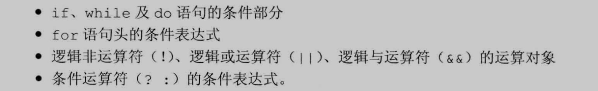


### 避免有二义性的类型转换

1. 如果类中包含一个和多个类型转换, 必须确保在类类型和目标类型之间只存在唯一一种转换方式, 否则将具有二义性


两种情况下可能产生多重转换路径:

1. 两个类提供相同的类型转换:
    - 当A类定义了一个接受B类对象的转换构造函数, 同时B类定义了一个转换目标是A类的类型转换运算符, 这就提供相同的类型转换, 具有二义性
    - **如果我们确实想执行上述的调用, 就不得不显式地调用类型转换运算符和转换构造函数**
    - 无法使用强制类型转换解决二义性问题, 因为强制类型转换本身也面临二义性

2. 类定义了多个与算术类型有关的转换规则:
    - 最好只定义最多一个与算术类型有关的转换规则


例子:

```C++
struct B;
struct A {
    A() = default;
    A(const B&);
};
struct B {
    operator A() const;
};

A f(const A&);

int main() {
    B b;
    A a = f(b);	// 二义性错误
    // 确实想执行, 只能使用显式的调用, 无法使用强制类型转换
    A a1 = f(b.operator A());
    A a2 = f(A(b));
}
```


### 二义性与转换目标为内置类型的多重类型转化

1. 如果类定义了一组类型转换, 他们的转换源(或者转换目标)类型本身可以通过其他类型转换联系在一起, 也会产生二义性
    -  特别是类中定义多个从算术类型转换为类, 和类转换为算术类型
2. 除了显式地向bool类型的转换之外, 应该尽量避免定义类型转换函数并尽可能限制那些"显然正确"的非显式构造函数


例子:

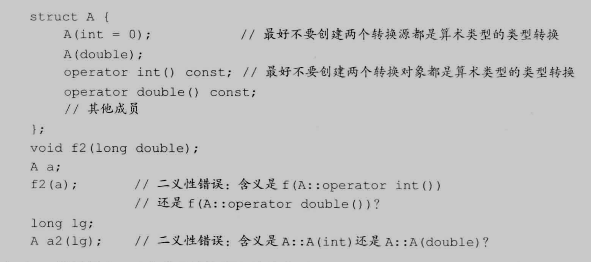

> 根本原因在于, 他们所需的标准类型转换级别一致

当使用用户定义的类型转换, 如果转换过程中包含标准类型转换, 则标准类型转换的级别决定编译器选择最佳匹配的过程:

- 例如: 类型提升大于类型转换

    ```C++
    short s = 42;
    // 把short提升成int优于把short转换成double
    A a3(s);	// 使用A::A(int)
    ```


### 重载函数与转换构造函数

1. 当不同类型的类定义了向同一个类型转换的转换构造函数, 二义性问题进一步提升


例子:

```C++
struct C {
    C(int);
};
struct D {
    D(int);
}
void mainp(const C&);
void mainp(const D&);
mainp(10);		// 二义性错误: 含义是mainp(C(10)), 还是mianp(D(10)), 因为10可以转换成C或者D
```

调用者可以显式地构造正确的类型从而消除二义性:

```
mainp(C(10));	// 调用mainp(const C&)
```

如果需要这种方式或者强制类型转换方式来改变实参类型, 说明程序设计不足


### 重载函数与用户定义的类型转换

1. **当调用重载函数, 如果两个(或多个)用户定义的类型转换都提供了可行匹配, 则这些转换一样好, 不考虑任何可能出现的标准类型转换**
2. 只有当重载函数能通过同一个类型转换函数得到匹配, 我们才会考虑其中出现的标准类型转换


例子:

```C++
struct C {
    C(int);
};
struct E {
    E(double);
};
void mainp2(const C&);
void mainp2(const E&);
int main() {
    // 二义性错误: 两个不同的用户定义的类型转换都能用在此处
	mainp2(10);	// 含义是mainp2(C(10)) 还是mianp2(E(double(10)))
}
```

因为调用函数所请求的用户定义的类型转换不止一个并且彼此不同, 所以调用具有二义性

即使其中一个调用需要额外的标准类型转而另一个调用能精确匹配, 编译器也会将调用标示为错误

**因为10, 可以转换成C或者E, 虽然C构造函数精确匹配, 但是也经过转换, 而E也要经过转换, 所以转换级别是一样的, 不考虑转换过程中的标准类型转换, 所以是二义性错误**


练习:

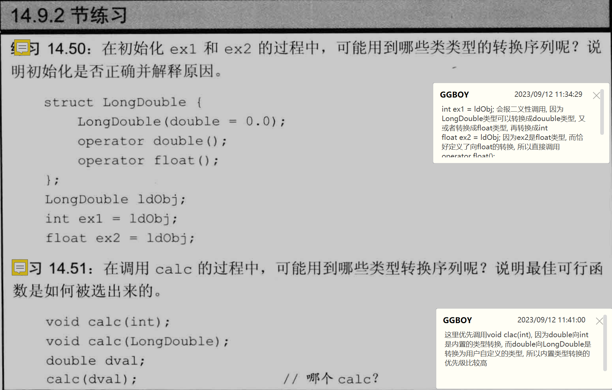

看出, 内置类型转换比向用户类型转换的优先级更高


### 函数匹配与重载运算符

1. 重载的运算符也是重载的函数
2. 通过函数匹配规则可以判定再给定表达式中到底应该使用内置运算符还是重载的运算符


如果a是一个类类型, 则表达式 a sym b可能是

```C++
a.operatorsym(b);	// a有一个operatorsym成员函数
operator(a, b);		// operatorsym是一个普通函数
```

- 当使用重载运算符作用于类类型的运算对象, 候选函数中包含该运算符的普通非成员版本和内置版本
- 如果左侧运算对象是类类型, 则定义在该类中的运算符的重载版本也在候选函数中
- 在表达式中使用重载的运算符, 无法判断正在使用的是成员函数还是非成员函数, 因此两者都在候选函数考虑范围

如果对同一个类提供转换目标是算术类型的类型转换, 又提供了重载的运算符, 则会遇到重载运算符与内置运算符的二义性


例子:

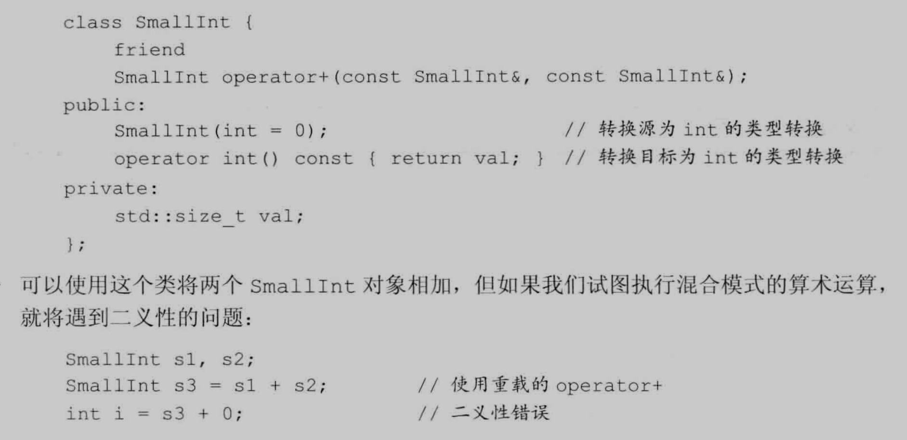
