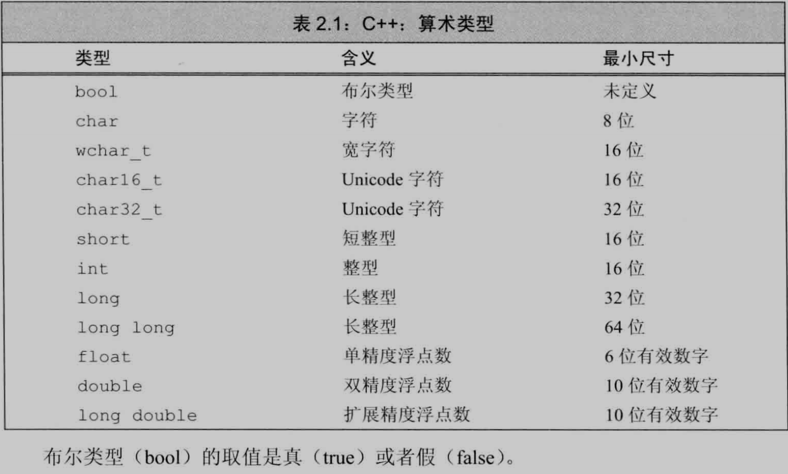
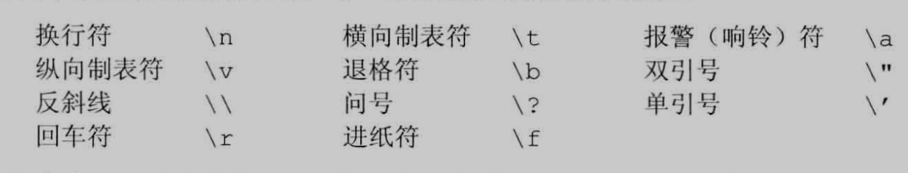
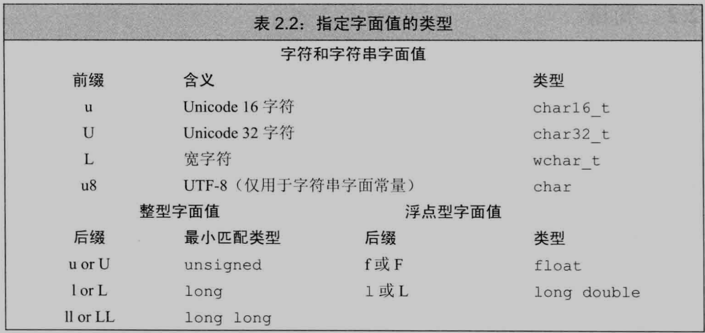
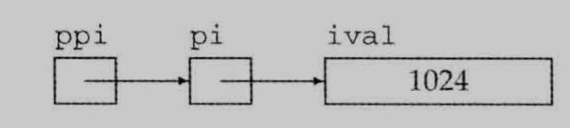

[TOC]


## 基本内置类型

算数类型分为: 整型(包括字符和布尔类型)和浮点型





### 带符号类型和无符号类型

除去布尔型和扩展的字符型, 其他**整型**可以划分为**带符号的(signed)**和**无符号的(unsigned)**两种:

1.   带符号类型可以表示整数, 负数, 0
2.   无符号类型仅能表示大于等于0的值

int , short, long , long long 都是带符号的, 在类型名前面添加unsigned得到无符号类型


当赋给无符号类型一个超出它表示范围的值, 结果是初始值对无符号类型表示数值总数取模后的余数

- 8比特大小的unsigned char 可以表示0 - 255, 总数是256, 则把-1赋给它就是, -1 % 256的余数, 结果255

当赋给带符号类型一个超出它表示范围的值, 结果是未定义的, 程序可能继续工作, 可能崩溃, 可能产生垃圾数据


### 如何选择类型

1.   数值不可能为负, 用unsigned
2.   数值超过int表示范围, 用long long
3.   算数表达式中不要使用char 和 bool, 可以用 signed char 或 unsigned char
4.   执行浮点数运算用double, 因为float是单精度, double是双精度, 事实上, 大多数机器上都是双精度比单精度快


### 类型转换

当程序的某处使用了一种类型而其实对象应该取另外一种类型, 程序会自动进行类型转换

```C++
bool b = 42;
int i = b;	// 1
i = 3.14;	// 3
double pi = i;	// 3.0

int c = 42;
if(c) c = 0;	
```

非0即真


**切勿混用带符号类型和无符号类型**: ==表达式中混用, 带符号类型会转换成无符号类型==, 可能得不到想要的结果


### 字面值常量

形如42的值被称为字面值常量, 一望而知


**整型和浮点型字面值**:

1.   以0开头的整数代表八进制, 如: 024
2.   以0x或0X开头的是十六进制, 如: 0x14
3.   浮点型字面值是一个double


十进制字面值的类型是int, 前提是当前这种类型要能容纳下当前的值( 四字节的int表示范围: -2147483648~2147483647, 超过这个最大范围的整数值是unsigned int 或 long, 再不行就是long long )

浮点型字面值可以用科学计数法表示, 指数部分用e或E标识


**字符和字符串字面值**

单引号括起来的一个字符是char型字面值

双引号括起来的零个或多个字符构成字符串型字面值

```C++
'a'				// 字符字面值
"Hello World"	// 字符串字面值
```

编译器在每个字符串结尾添加一个空字符( '\0' ), 所以字符串字面值实际长度比内容多1

字符串字面值的类型实际上是常量字符构成的数组


### 转义序列




**泛化转义序列**

形式:

1.   \x后紧跟1个或多个十六进制数字
2.   \后面紧跟1个, 2个, 3个八进制数字

数字部分表示字符对应的数值


#### 指定字面值的类型




## 变量

==**数据类型规定变量所占空间的大小和布局方式, 空间能存储的值的范围, 以及能参与的运算**==

==**变量提供一个具名的, 可供程序操作的存储空间, 每个变量都有数据类型, 决定所占空间的大小和布局方式, 空间能存储的值的范围, 以及能参与的运算**==

变量和对象一般可以互换使用


### 变量定义

```C++
int sum = 0, value, units_sold = 0;
Sales_item item;
std::string book("0-201-1234-x");
```


==**何为对象**:对象是指一块能存储数据并具有某种类型的内存空间==


-   **初始化:** 创建变量时赋予其一个初始值

-   **赋值:** 把对象当前的值擦除, 用新值替代


==**默认初始化**==(后面会多次接触的)

-   如果内置类型变量没有指定初值:

1.    定义于任何函数体之外的变量初始化为0(值初始化)
2.   定义在函数体内部的内置变量类型将不被初始化, 访问此类值引发错误

-   类的对象如果没有显式初始化, 则其值由类确定

**建议初始化每一个内置类型**


### 变量声明和定义的关系


-   **声明:**

    -   使得名字为程序所知, **一个文件如果想使用别处定义的名字必须包含对那个名字的声明**

    

-   **定义:**

    -   使得名字为程序所知
    -   负责创建与名字关联的实体
    -   申请存储空间, **可能**为变量赋一个初始值
    


仅声明变量使用关键字**extern**:

```C++
extern int i; 	// 声明
int j; 			// 定义
extern double pi = 3.14; 	// 定义
```

包含显式初始化即成定义

==函数体内部试图初始化一个extern标记的变量, 将引发错误==

==变量能且只能定义一次, 但是可以被声明多次==


### 标识符


1.   由字母, 数字, 下划线组成

2.   必须以字母或下划线开头

3.   长度没有限制

4.   对大小写敏感
5.   不能连续出现两个下划线
6.   不能下划线紧连大写字母开头
7.   定义在函数体之外的标识符不能以下划线开头


**变量命名规范**

-   见名知意

-   变量名使用小写字母

-   自定义类用大写字母开头

-   单词间应该有区分:

    -   ```C++
        student_loan
        studentLoan
        ```

    


### 名字的作用域

大多数作用域都以花括号分隔

同一个名字在不同的作用域中可能指向不同的实体

名字的有效区域始于名字的声明语句, 以声明语句所在的作用域末端为结束


1.   ==定义于所有花括号之外的名字拥有**全局作用域**, 一旦声明, 全局作用域内的名字整个程序的范围内都可使用==

2.   ==定义在花括号内的变量拥有**块作用域**, 出了花括号就无法访问==


-   外层作用域: 被包含的作用域
-   内层作用域:包含着别的作用域


==**内层作用域可以访问外层作用域的名字, 并且可以重新定义外层作用域已有的名字**==

**局部变量不宜和全局变量同名**


**可以使用 :: 名字 的方式访问全局变量**


## 引用

引用为对象起别名

将声明符写成&d, d是变量名

定义多个引用, 每个引用标识符必须以符号&开头

```C++
int ival = 1024, &yinyong = ival;
int &refVal = ival;
```

==**引用必须初始化**==

定义引用之后, 所有操作都是在与之绑定的对象上进行的

```C++
refVal = 2;	// ival = 2
```


所有引用的类型都要和与之绑定的对象严格匹配

引用只能绑定在对象上, 不能与字面值, 或表达式的计算结果绑定在一起

-   **==常量引用可以与常量对象, 非常量对象, 字面值, 表达式的计算结果绑定在一起==**


## 指针


指针是"指向"另外一种类型的复合类型


指针和引用的区别:

1.   指针本身就是对象, 允许对指针赋值和拷贝
2.   在指针的生命周期内可以先后指向不同的对象
3.   指针无需在定义时赋初值, 块作用域内定义的指针没有初始化也有不确定的值


形式: *d

```C++
int *ip1, *ip2;
double dp, *dp2;
```


获取对象的地址用**取地址符 (& ) **

```C++
int ival = 42;
int *p = &ival;
```


引用不是对象, 没有实际地址, 不能定义指向引用的指针

```C++
int & *p;	// 错误, 不能指向引用
```


==**所有指针的类型都要和它所指向的对象严格匹配**==

-   指向常量的指针可以指向非常量对象


使用**解引用符( * )**访问该对象

```C++
int ival = 42;
int *p = ival;
cout << *p;
```


### 空指针:不指向任何对象

```C++
int *p1 = nullptr;
int *p2 = 0;
int *p3 = NULL;
```

不允许把int变量直接赋给指针, 即使值等于0

```C++
int zero = 0;
int *pi = zero;	// 错误
```


**建议初始化所有指针:**

```C++
int *p = nullptr;
```


**赋值和指针**:

```C++
int i = 100;
int *p = nullptr;
p = &i;		// p 指向 i
*p = 200;	// i = 200
```


只要指针拥有合法值, 就可以用在条件表达式中


NULL是预处理变量不属于命名空间std, 可以直接使用预处理变量无需再前面加上std::


### void* 指针

void*可以存放任意对象的地址

```C++
double obj = 3.14, *pd = &opj;
void *pv = &pbj;
pv = pd;
```

>   可以搭配强制类型转换来使用


### 理解复合类型的声明

变量的定义包括一个基本数据类型和一组声明符

通一条语句中, 基本数据类型只有一个, 但是声明符形式可以不同

```C++
int i = 1024, *p = &i, &r = i;
```

>   类型修饰符只是声明符的一部分


## 多级指针

声明符中修饰符的个数并没有限制

通过*的个数区分指针的级别: **表示指向指针的指针, * * *表示指向指针的指针的指针, 以此类推:

```C++
int ival = 1024;
int *pi = &ival;
int **ppi = &pi;	// 指向一个int指针
```




### 指向指针的引用

**指针是对象, 存在对指针的引用:**

```C++
int *p = nullptr;
int *&r = p;	// r是一个引用, 被引用的类型是int*
```

对于复杂的指针或引用的声明语句, 可以从右向左阅读


## const限定符

常量, 不可以改变值的变量

==使用const将变量加以限定变常量:==

```C++
const int bufSzie = 512;
```

==**const对象必须初始化**==


### 默认状态下, const对象仅在文件内有效:

==编译器在把用到const对象的地方都替换成对应的值==

多个文件中出现同名的const变量, 是独立的变量

如果希望const变量被在文件之间共享, 对于const变量不管是声明还是定义都添加extern关键字, 只需定义一次

```C++
// file_1.cc 定义并初始化一个常量, 能被其他文件访问
extern const int bufSize = fcn();
// file_1.h 头文件, 和 file_1.cc的bufSize是同一个
extern const int bufSzie;
```


### const的引用


对常量的引用不能被用作修改它所绑定的对象:

```C++
const int ci = 1024;
const int &r1 = ci;	
r1 = 100; // 错误
int &r2 = ci;	// 错误
```


**初始化和对const的引用**

-   ==初始化常量引用允许用任意表达式作为初始值, 只要表达式结果能转换成引用的类型==
-   **==允许一个常量引用绑定非常量对象, 字面值, 表达式==**

```C++
int i = 42;
const int &r1 = i;
const int &r2 = 42;
const int &r3 = r1 * 2;
int &r4 = r1 * 2;		// 错误
```


**==初始化常量引用允许用任意表达式作为初始值, 只要表达式结果能转换成引用的类型==**

```C++
double dval = 3.14;
const int &ri = dval;
```


如果const引用绑定的对象的类型需要进行转换, 那么就会绑定到一个临时的对象

编译器把上述代码变成:

```c++
const int temp = dval;
const int &ri = temp;
```

**==临时对象就是当编译器需要一个空间来暂存表达式的求值结果临时创建的一个未命名对象==****


**常量引用仅对引用可参与的操作做出限定**:

```C++
int i = 42;
int &r1 = i;
const int &r2 = i;
r1 = 0;
r2 = 0;	// 错误
```


### 指针和const

存放常量对象的地址只能使用指向常量的指针

**指向常量的指针**不能用于改变所指对象的值


指针的类型必须与所指对象的类型一致, 例外:

1.   ==允许一个指向常量的指针指向一个非常量对象==

     ```C++
     const double pi = 3.14;
     double *ptr = &pi;	// error
     const double *cptr = &pi;
     *cptr = 42;				// error
     double dval = 3.14;
     ```

     

**所谓指向常量的指针和常量引用, 只是自以为是觉得自己指向了常量, 所以不能通过他们改变所指对象的值**


**const指针**

**常量指针**必须初始化

```C++
int errNumb =  0;
int *const curErr = &errNumb;
const double pi = 3.14;
const double *const pip = &pi;
```

>   常量指针只能指向一个对象, 但是指向的对象的值还是能通过该指针更改的


#### 顶层 cosnt 和 底层 const

-   顶层const: 表示指针本身是常量
-   底层const: 表示指针指向的对象是一个常量


指针可以是顶层const也可以是底层const:

```C++
const int *const p = nullptr;
```


**==当执行对象的拷贝操作, 拷入和拷出的对象必须具有相同的底层const资格, 或者两个对象的数据类型可以转换: 非常量可以转换成常量, 反之则不行:==**

```C++
int i = 0;
const int *p = &i;
int *p1 = p;		// 错误
int *p2 = nullptr;
p = p2; 			// 正确
```

>   非常量指针可以转换成常量指针, 反之则不行
>
>   把指向常量的指针1拷贝给指针2, 要求指针2也是指向常量的指针
>
>   指向非常量的指针可以拷贝给指向常量的指针, 反之则不行

对于指针和引用来说: 我指向的是const, 我要求你指向我指向的对象的时候也不能改变它的值, 所以你也要是一个const, 虽然我是底层const, 但是我指向非常量并不影响什么, 所以非常量可以转换为常量, 但是常量不能转换为非常量, 因为这样会出问题


#### constexpr 和 常量表达式


==**常量表达式**是指值不会改变并且在编译过程就能得到计算结果的表达式==

==字面值,  和**用常量表达式初始化**的const对象都是常量表达式==


```C++
const int max_files = 20;	// 是
int staff_size = 28; 		// 不是
```


==将变量声明为constexpr类型让编译器验证变量是否是常量表达式, 声明为constexpr的变量一定是常量, 必须用常量表达式初始化:==

```C++
constexpr int mf = 20;
```


### 字面值类型

字面值, 编译期间就知道结果的值, 一望而知

常量表达式的值在编译期间就要得到计算, 声明constexpr时用到的数据类型是就是字面值类型

-   算数类型, 引用, 指针都属于字面值类型

-   编译时候无法确定大小和位置的自定义类, IO库, string都不属于字面值类型


**constexpr指针**

-   初始值必须是nullptr或者0, 或者是拥有固定地址的对象
-   **==块作用域内的变量没有固定地址==**
    -   块作用域: 比如说函数体内就是

-   **==全局作用域内的变量拥有固定地址==**
    -   比如说main函数所在的作用域

-   constexpr仅对指针有效, 与指针所指对象无关
-   constexpr 加上const, 这样的指针也可以指向常量或非常量, 并且指针本身也是常量

```C++
const int i = 42;
constexpr const int *p = &i;
// ii定义在全局作用域内
const int ii = 100;
constexpr int *p1 = &ii;	// 错误, constexpr仅对指针有效, 如果要指向常量还要加上const
```


### 类型别名


-   **typedef**: 

    -   ```C++
        typedef double wages;
        typedef wages base, *p;
        ```

        

-   **using: **

    -   ```C++
        using SI = Sales_item;
        ```

        

​	

错误理解的例子:

```C++
typedef char* pstring;
const pstring cstr = 0;	// const char *cstr = 0;
const pstring *ps;		// const char** ps; 错误理解: const char *ps;
```


>   可以使用类型别名简化类型的名字


对类型别名错误理解的例子: 

```C++
const int i = 100;
using pint = int *;
pint p1 = nullptr; p1 = 0;
const pint p2 = nullptr; p2 = 0;    // p2是顶层const, 不能赋值
```

> 当指针类型定义成类型别名之后, 就相当于整体的一个基本类型, 所以const修饰的是变量本身, 而不是指针指向的对象


## auto 类型说明符


auto让编译器通过初始值来推算变量的类型, auto定义的变量必须有初始值:

```C++
auto item = 1 + 1;	// int
```

声明语句中所有变量的初始基本数据类型必须一样:

```C++
auto i = 0, *p = &i;	// 正确
auto sz = 0, pi = 3.14;	// 错误
```


==**auto 会忽略顶层const, 底层const会保留下来:**==

```c++
int i = 0;
const int ci = i, &cr = i;
auto b = ci;	// b 是int
auto c = cr;	// c 是int
auto d = &i;	// d 是int*
auto e = &ci;	// e 是 const int * 对常量对象取地址是一种底层const
```


如果希望推断出的auto类型是顶层cosnt需要明确指出:

```C++
const auto f = ci;
```


对变量取的地址就是指向该变量的指针

```C++
int i = 100;
auto p = &i; 	// p = int *
```


## decltype类型指示符


decltype可以:

-   从表达式推断出要定义的变量的类型, 不用该值初始化变量
-   分析表达式得到他的类型, 不实际计算表达式的值

```C++
decltype(f()) sum = x;	// sum 的类型就是函数f的返回类型
```


==**decltype返回变量的类型(包括顶层 const 和 引用在内)**==

```C++
const int ci = 0, &cj = ci;
decltype(ci) x = 0;			// x的类型是const int
decltype(cj) y = x;			// y的类型是const int&
decltype(cj) z;				// 错误, z是引用, 必须初始化
```


==decltype返回表达式结果对应的类型, 如果结果是引用, 则得到引用类型:==

```C++
int i = 42, *p = &i, &r = i;
decltype(r + 0) b;	// 为了不得到引用, 让他加0得到一个int类型的结果
decltype(*p) c;		// 错误, c是int&, 必须初始化
```

>   解引用操作的结果也是引用


**decltype((variable)), 双层括号的结果永远是引用**


**赋值表达式会产生引用类型, 引用的类型就是左值的类型: **

```C++
int a = 3, b = 4;
decltype(a) c = 100;	// c is int
decltype(b = a) d = a;	// d is int &	从结果上来看赋值表达式会产生引用类型(赋值运算符返回其左侧运算对象的引用)
```


## 自定义数据结构


自定义类

```C++
struct Name {
    int age;
    double money = 0;
	string ID;
    // ...
};
```


分号前面可以定义该类型的对象:

```C++
struct Name {} name, *name2;
```


-   类内部定义的名字必须唯一, 可以和类外部定义的重名

-   可以为数据成员提供**类内初始值**

-   创建对象时, 类内初始值用于初始化数据成员
    -   ==注意: 对象在被创建的时候数据成员才会被初始化, 所以数据成员是const和引用类型等必须初始化的数据也是在创建的时候初始化==

-   没有初始值的成员被默认初始化
-   **==类内初始值只能放在花括号里, 等号右边, 不能用圆括号==****


## 头文件


1.   ==为了让类在不同文件保持一致, 类一般定义在头文件里, 所在头文件的名字和类名一样==
2.   ==头文件通常包含那些只能定义一次的实体, 如类, const和constexpr变量==
3.   头文件一旦改变, 相关源文件必须重新编译获取更新过的声明
4.   标准库用< >, 自定义的用 " "


### 头文件保护符

预处理器是编译之前执行的一段程序

预处理功能#include:

-   当预处理看到#include标记就会用指定的头文件的内容代替#include 


预处理变量两种状态: 已定义和未定义

==预处理变量无视关于作用域的规则==

整个程序中的预处理变量包括头文件保护符必须唯一

基于头文件中类的名字来构建保护符的名字, 确保唯一性

预处理变量一般全部大写

包含头文件相当于把头文件里的内容复制粘贴到当前文件中


1.   **#define**指令把一个名字设定为预处理变量
2.   **#ifdef**当且仅当变量已定义时为真
3.   **#ifndef**当且仅当变量未定义时为真
4.   检查结果为真, 则执行后续操作直到遇到**#endif**


头文件使用保护符防止重复包含:

```C++
#ifndef NAME
#define NAME
// ......
#endif
```

>   习惯性加上就行
