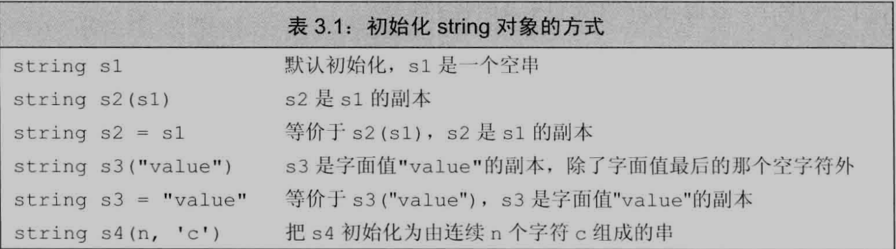
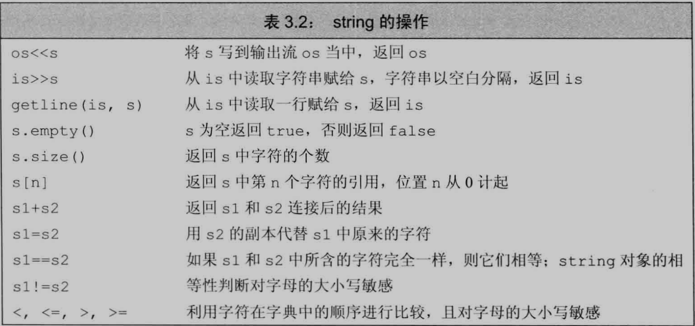
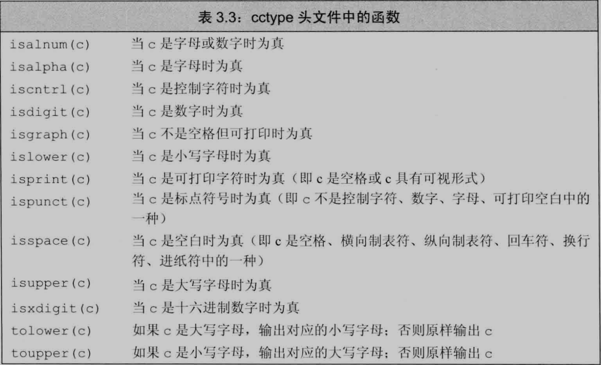
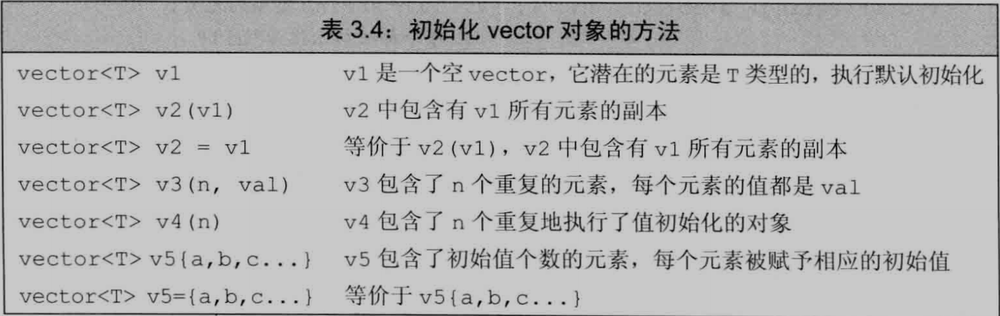
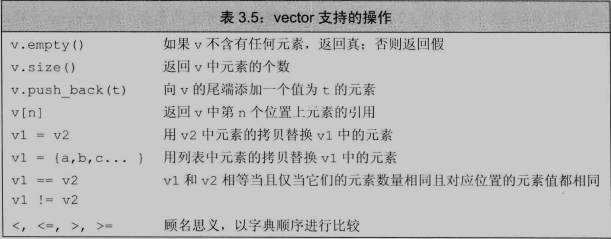
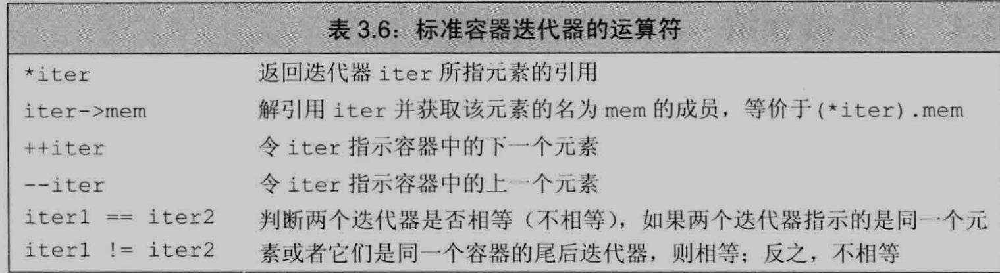
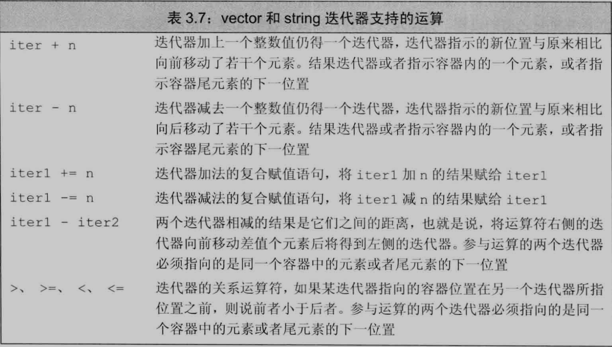
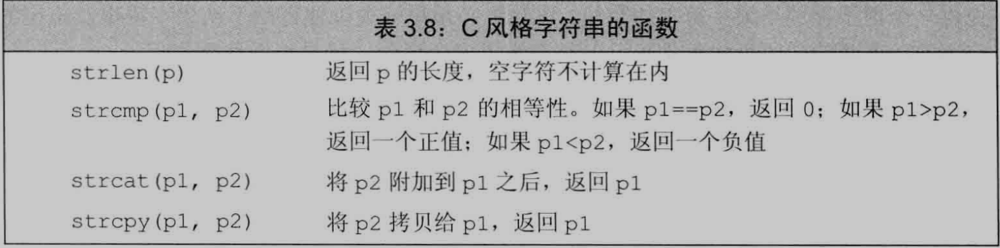

[TOC]


## 命名空间的using声明

域操作符( :: )的含义是: 编译器应从操作符左侧名字所示的作用域寻找右侧那个名字


使用using声明命名空间就无需专门的前缀:

```C++
using namespace::name;
// 使用name的时候, 从namespace找到他
```


每个名字需要独立的声明:

```C++
using std::cin;
using std::cout;
```


==**头文件不要包含using声明, 可能导致名字冲突**==


## 标准库类型string


**string表示可变长字符序列**

使用需要:

```C++
#include <string>
using std::string;
```


### 定义和初始化string对象





### 直接初始化和拷贝初始化

-   **直接初始化:**使用 = 号初始化一个变量, 编译器把等号右侧的初始值拷贝到新创建的对象中去
-   **拷贝初始化:**不使用等号, 执行直接初始化


回应之后的疑问, 初始化的时候使用 = 号调用的是转换构造函数还是先将不同类型的对象转换成左侧运算对象的类型再调用拷贝构造函数:

```C++
#include <iostream>
using namespace std;

class Student {
public:
    Student() = default;
    Student(int i) : id(i) { cout << "转换构造函数执行" << endl; }
    Student(const Student& s) : id(s.id) { cout << "拷贝构造函数执行" << endl; }
    int getId() { return id; }
private:
    int id =  0;
};

int main() {
    Student s;          // 调用默认构造函数
    Student s2 = 100;   // 看看是先将100转换成Studnet再调用拷贝构造函数, 还是直接调用转换构造函数
    					// 答案: 调用转换构造函数
    Student s3 = s2;    // 关键还是要看函数的匹配, 像这个, 一眼丁真, 就是调用拷贝构造函数
    return 0;
}
```

> 所以使用拷贝初始化( = )的方式, 并不都是调用拷贝构造函数
>
> 关键还是函数匹配, 选择最匹配的那一个


### string对象上的操作




1.   执行读取操作时, string对象会自动忽略开头的空白( 空格符, 换行符, 制表符 )  并从第一个真正的字符开始读起, 直到遇见下一处空白

2.   **getline可以保留输入时的空白符**, getline只要遇到换行符就结束读取操作并返回结果, 一开始就是换行符, 结果是个空string, 例子:

     ```C++
     string line;
     while (geline(cin, line)) {
         cout << line << endl;
     }
     ```

     >   getline得到的string对象不包含换行符

3.   **所有用于存放string类的size函数返回值的变量, 应该是string::size_type类型(无符号整数类型)**
4.   两个string对象长度不同, 较短string每个字符都能对上较长string, 则较短string小于较长string
5.   两个string某些位置不一致, 结果是stirng对象中第一对相异字符比较的结果


两个string对象相加得到一个新的string对象:

```C++
string s1 = "Hello, ", s2 = "world!";
string s3 = s1 + s2;
s1 += s2;		// 追加到s1后面
```


==在需要string对象的地方可以用 字符字面值, 字符串字面值代替==


string对象和以上两种字面值混在一条语句, 必须确保每个加法运算符两侧对象至少有一个是string:

```C++
string s4 = s1 + "Hello";
string s5 = "23412" + "asdfasdf"; // 错误
```


==**string和字符串字面值是不同的类型**==


### 处理string对象中的字符 


#### 范围for语句

形式:

```C++
for (变量 : 序列){
		循环体
} 
```

==每次迭代, 变量被初始化为序列的下一个元素值==


例子:

```C++
string str("some string");
for (auto c : str){
    cout << c << endl;
}
```


==如果要改变序列中非常量对象的值, 必须把循环变量定义称引用类型:==

```C++
string s("Hello World!");
for (auto &c : s) {
    c = toupper(c);
}
cout << s << endl;
```


#### 下标运算符


==**下标运算符( [] )** 接收的参数表示访问的字符的为止; 返回值是该位置上元素的引用==

>   string对象的下标必须大于等于0 而小于s.size()

只要下标运算符返回的对象不是常量, 就可以执行写入操作

下标的值叫做"下标"或"索引", 任何表达式只要它的值是一个整型值就能作为索引


**使用下标运算符迭代**:

```C++
string s = "Hello World";
for (decltype(s.size()) index = 0; index != s.size(); ++index) {
    cout << s[index];
}
```


**必须确保下标的值合法!**


## 标准库类型vector


==由vector生成的类型必须包含vector中元素的类型:==

```C++
vector<int> ivec;	// ivec的类型是vector<int>
```

组成vector的也能是vector:

```C++
vector<vector<int> ivec;
```


### 定义和初始化vector对象




两个vector对象的类型相同才能把其中一个vector的元素拷贝给另外一个vector:

```C++
cout << i << endl;

vector<int> ivec;
vector<double> dvec;
ivec = dvec;            // 错误


vector<int> ivec2;
ivec = ivec2;           // 正确
```


可以只提供元素数量, 省去初始化值, 此时会创建一个**值初始化**的元素初值, 赋给容器中所有元素

-   元素是内置类型, 如int, 元素初始值为0
-   元素是类类型, 如string, 元素有类默认初始化


==如果vector对象中元素的类型不支持默认初始化, 就必须提供元素的初始值==

>   没有默认构造函数的元素必须提供初始值


如果用的是圆括号, 可以说提供的值是用来构造vector对象

如果用的是花括号, 是我们想列表初始化vector对象

只有在无法执行列表初始化才会考虑其他初始化方式:

```C++
vector<string> v8{10, "hi"}; // 10个hi
```


### 向vector中添加元素


**push_back**:负责把一个值当成vector对象的尾元素"压到"vector对象的"尾端":

```C++
string word;
vector<string> text;
for (cin >> word) {
    text.push_back(word);
}
```

>   往空的vector中添加元素性能更好


可以用范围for遍历

==警告: 范围for语句体内不应该改变其所遍历序列的大小, 原因:预存了end()==


### 其他vector操作





**vector对象的类型总是包含着元素的类型:**

```C++
vector<int>::size_type	// 正确
vector::size_type		// 错误
```


相等性运算符和关系运算符与string的功能一致

**==只有当元素的值可比较, vector对象才能被比较:==**

```C++
vector<Sales_data> svec1;
vector<Sales_data> svec2;
svec1 == svec2;				// 错误, Sales_data没有定义自己的相等性运算符
```


vector也能使用下标, 类型实现相应的size_type类型 , 和前面string中介绍的一样, 例子:

```C++
vector<unsigned> scores(11, 0);
unsigned grade;
while (cin >> grade) {
    if(grade <= 100){
        ++scores[grade / 10];
    }
}
```

==**不能用下标添加元素, 只能对确知已存在的元素执行下标操作**==


## 迭代器介绍


所有标准库容器都支持迭代器, 少数才同时支持下标


使用begin和end成员获得迭代器:

-   begin: 返回指向首元素的迭代器
-   end: 返回指向尾元素后一个位置的迭代器( 尾后迭代器 )
-   **如果容器为空, begin和end返回同一个尾后迭代器**

```C++
auto b = v.begin(), e = v.end();
```


### 迭代器运算符




end返回的尾后迭代器不实际指示某个元素, 不能对其进行递增或解引用


**迭代器类型**

1.   iterator	能读写

     ```C++
     vector<int>::iterator it;
     string::iterator it2;
     ```

     

2.   const_iterator 认为指向的对象是一个常量

     ```C++
     vector<int>::const_iterator it3;
     string::const_iterator it4;
     ```

     


对象是常量, begin和end返回const_iterator

不是常量, 返回iterator

**cbegin 和 cend**只返回const_iterator


**箭头运算符**:

如果解引用迭代器获得的对象是类, 有可能进一步访问他的成员:

```C++
(*it).empty();
*it.empty();	// 错误
```

**箭头运算符( -> )**把解引用和成员访问操作结合:

```C++
it->mem; // 等价 (*it).mem
```


### 迭代器运算




==迭代器进行加减法, 结果还是一个迭代器==


获得vector对象中间位置的元素:

```C++
auto mid = vi.begin + vi.size() / 2;
```


==参与运算的两个迭代器必须合法而且指向的是同一个容器的元素(或尾元素的下一位置)==:

-   ==满足以上条件的两个迭代器相减就能得到两个迭代器的距离(距离值得是右侧的迭代器向前移动多少位置就能追上左侧的迭代器)==
-   上述运算的结果是difference_type的带符号整数型


**二分搜索**

```C++
auto beg = text.begin(), end = text.end();
auto mid = text.begin() + text.size() / 2;
while (mid != end && *mid != sought) {
   if(sought < *mid) {
       end = mid;
   }
   else{
        beg = mid + 1;
   }	
    mid = beg + (end - beg) / 2;	// 两个迭代器相减得到的是ptrdiff_t类型
}
```


## 数组


vector和数组的相同与不同:

1.   ==**数组也是存放类型相同的对象的容器, 需要通过其所在位置访问**==
2.   ==**数组大小固定, 不能随意添加元素,**==

如果不清楚元素个数, 使用vector


形式:

类型 	数组名	[  维度  ]

-   ==**维度说明数组中元素的个数, 必须大于0, 必须是常量表达式**==
-   **默认情况下, 数组元素被默认初始化**
-   ==**不允许使用auto关键字**==
-   **引用不是对象, 不存在引用的数组**


不声明维度, 编译器根据初始值计算:

```C++
const unsigned sz = 3;
int ia[] = {1, 2, 3};
```


指明维度, 不应该超过维度大小:

```C++
int ia[2] = {1, 2};		// yes
int ia[2] = {1, 2, 3}; 	// no
```


维度比初始值数量大, 剩余元素被初始化成默认值:

```C++
int ia[3] = {1};	// ia[1], ia[2] 等于0
```


### 字符数组的特殊性

1.   ==**可以用字符串字面值初始化字符数组**==

2.   ==**字符串字面值的结尾处还有一个空字符, 也会被拷贝到其他数组中**==

3.   ==**字符串字面值就是常量字符数组对象**==

     ```C++
     const char c[] = { '1', '2', '3', '4', '5', '6', '\0' };
     string str = c;
     cout << str << endl;
     ```

     


不要超过维度指定的大小:

```C++
char a1[] = {'c', '+', '+'};		// 没有空字符
char a2[] = {'c', '+', '+', '\0'};	// 显式添加
char a3[] = "c++";					// 自动添加
const char a4[6] = "Daniel";		// 错误
```


### 数组之间不允许拷贝和赋值

-   ==**不能将数组的内容拷贝给其他数组作为初始值**==

-   ==**不能用数组为其他数组赋值**==

```C++
int ia[] = {0, 1, 2};
int ia2[] = a;			// 错误
a2 = a;					// 错误


int a[] = { 1, 2, 3 };
int b[] = { 3, 2, 1 };
a = b;					// 错误
```


#### 理解复杂的数组声明

数组本身是对象, 允许定义数组的指针和数组的引用:

```C++
int *ptrs[10];	// 含有10个int*
int &refs[10];; // 错误, 不存在引用的数组
int (*Parray)[10] = &arr;	// 指向一个int[10]
int (&arrRef)[10] = arr;	// 引用一个int[10]
```

默认情况下, 类型修饰符从右向左依次绑定

对于数组, 由内向外阅读比从右向左好

对修饰符的类型没有限制:

```C++
int *(&array)[10] = ptrs;	// array引用一个int*[10]
```


### 访问数组元素

数组下标从0开始

==通常将数组下标定义为**size_t**类型(无符号类型)==

除了数组大小固定, 其他用法和vector基本类似

遍历数组最好是使用范围for语句

确保下标不要越界


### 指针和数组

对数组使用下标运算符得到该数组指定位置的元素

对数组元素使用取地址符得到指向该元素的指针:

```C++
string nums[] = {"one", "two"};
string *p = &nums[1];	// *p = two
```


==**数组类型的对象会转换成一个指向该数组首元素的指针**==

-   说是数组类型的对象其实还存在疑问, 只是这里方便理解

```C++
string *p2 = nums; 	// 等价于 p2 = &nums[0]
int ia[] = {0, 1, 2, 3, 4}
auto ia2(ia);	// int *
ia2 = 42; 	// 错误, ia2是一个指针
```


==使用decltype上述转换不会发生:==

```C++
decltype(nums) ia3 = {"one", "two"};
id3[1] = "haha";	// 正确
```

>   对于decltype来说, 类型只看表面, 不会进行转换


**数组指针也支持迭代器支持的运算**:

```C++
int arr[] = {1, 2, 3, 4};
int *p = arr;
++p;	// 指向 arr[1]
```

获取尾元素之后并不存在元素的地址:

```C++
int *e = &arr[4];
```


**标准库库函数begin和end**

```C++
int ia[] = {1, 2, 3, 4, 5, 6};
int *beg = begin(ia);
int *end = end(ia);
```

begin返回首元素的指针

end返回尾元素下一位置的指针


**指针运算**

**==指针加上后减去某整数值, 结果还是指针==**

新指针指向的元素比原指针前进或后退了该整数个位置

新指针应该指向同一数组的其他元素, 或尾元素下一位置


==两个指针相减的结果使他们之间的距离, 两个指针必须指向同一个数组中的元素:==

```C++
auto n = end(arr) = begin(arr);
```


两个指针指向同一个数组的元素, 或尾元素下一位置, 用关系运算符对其进行比较才有意义, 否则无意义


两个指针相减的结果类型是**ptrdiff_t**的标准库类型, 是带符号类型


**下标和指针**

**==对数组执行下标运算其实是对指向数组首元素的指针执行下标运算==**

```C++
int ia[] = {1, 2, 3, 4, 5};
int *p = ia;
i = *(p + 2);
```

**==只要指针指向的是数组中的元素或尾元素下一位置, 都可以执行下标运算==**

```C++
int *p = &ia[2];
int j = p[1];	// ia[1]表示的元素
int k = p[-2];	// ia[0]表示的元素
```


标准库类型限定使用的下标必须是无符号类型

内置的下标运算符的索引值不是无符号类型


**使用数组初始化vector对象**

```C++
int int_arr[] = {1, 2, 3, 4, 5};
vector<int> ivec(begin(int_arr), end(int_arr));
```


### C风格字符串




==传入此类函数的指针必须指向以空字符作为结束的数组:==

```C++
char ca[] = {'C', '+', '+'};
cout << strlen(ca) << endl;	// 错误
```


比较两个C风格字符串比较的是指针的, 需要使用strcmp才能真的比较


C风格字符串拼接要提供一个存放结果字符串的的数组, 必须足够大并且能容纳结果字符串和末尾空字符:

```C++
char ca1[] = {'1', '2'};
char ca2[] = {'3', '4'};
ca1 + ca2;	// 错误, 将两个指针相加, 没意义

string str;
strcpy(str, ca1);
strcat(str, " ");
strcat(str, ca2);
```

>   ==strcat只有在被追加的的数组里面有对象才能成功追加, 所以先用的strcpy==


**==任何出现字符串字面值的地方都可以用空字符结束的字符数组代替==**


==比较两个字符数组, 实际上比较的是指针而非对象本身==


字符串字面值不能代替字符数组


## 多维数组

多维数组是数组的数组


第一个维度表示数组本身大小, 第二个二度表示元素(数组)大小, 以此类推..:

```C++
int ia[3][4];
int arr[10][20][30];
```


对于二维数组: 第一个维度称为行, 第二个维度称为列


**多维数组的初始化**

```C++
int ia[3][4] = {
    {1, 2, 3, 4},
    {5, 6, 7, 8},
    {9, 10, 11, 12}
};
```

```C++
int ia[3][4] = {1, 2, 3, 4, 5, 6, 7, 8, 9, 10, 11, 12};
```


显式初始化每行首元素:

```C++
int ia[3][4] = {{2}, {1}, {8}};
```


显式初始化第一行:

```C++
int ix[3][4] = {0, 3, 6, 9};
```


如果表达式含有的下标运算符和数组的维度一样对, 该表达式的结果是给定类型的元素

如果表达式含有的下表运算符比数组的维度小, 则表达式的结果是给定索引的内层数组:

```C++
int ia[3][4] = {};
int (&row)[4] = ia[1];
```


二维数组遍历:

```C++
int ia[100][100] = {};
for (size_t i = 0; i != size(ia)) {
    for (size_t b = 0; b != size(ia[i]); ++b) {
        cout << ia[i][b] << endl;
    }
}
```


用范围for循环遍历:

```C++
for (auto &row : ia) {
    for (auto &col : row) {
        cout << col << endl;
    }
}
```

==为了避免数组被自动转换成指针, 必须把外层定义成引用, 这样就把引用绑定到数组第一个对象上了==

多维数组名转换来的指针实际上指向第一个内层数组

```C++
int ia[3][4];
int (*p)[4] = ia;
p = &ia[2];
```


还可以使用标准库begin和end遍历


可以使用auto或decltype省去写复杂类型的名字


再或者用类型别名简化多为数组的指针:

```C++
using int_array = int[4];	// 或 using int_array = int (*) [4];
typedef int int_array[4];	// 或 typedef int (*int_array)[4];
```

