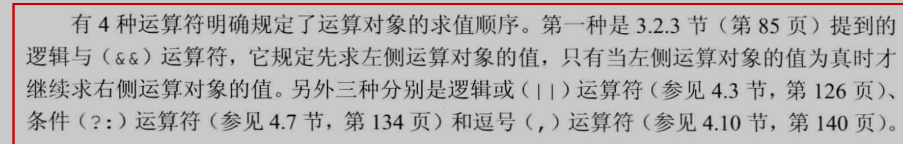
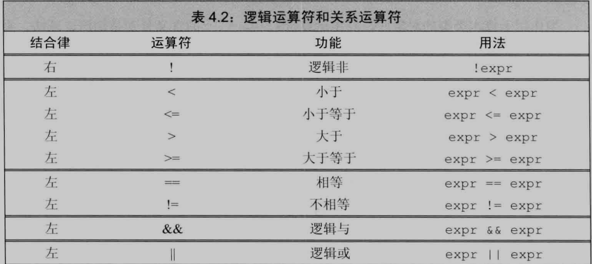
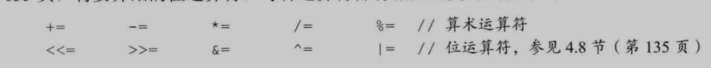
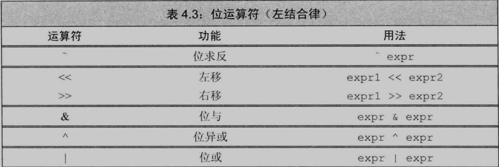
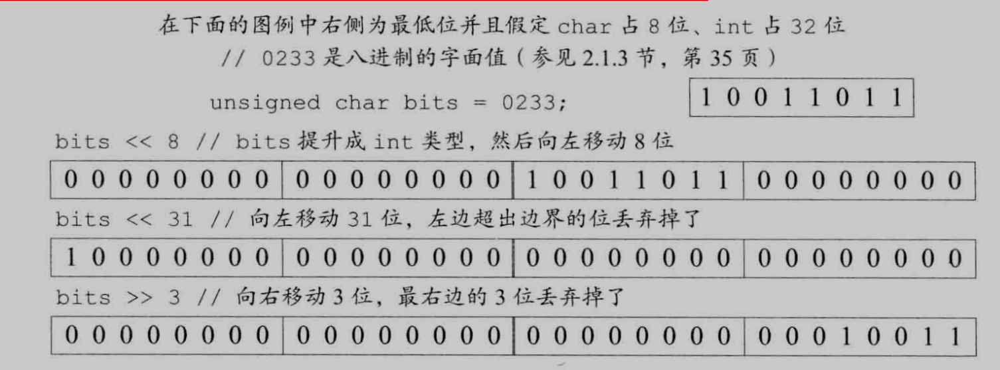
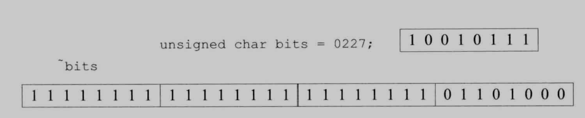
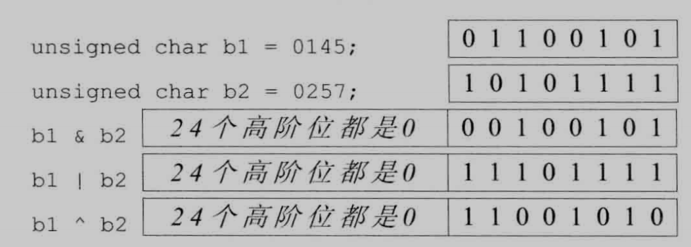
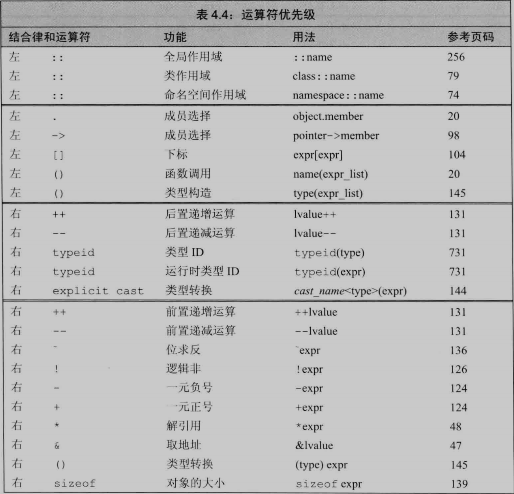
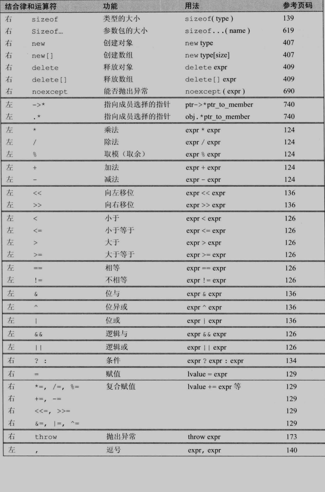

[TOC]


## 基础


表达式由一个或多个运算对象组成, 对表达式求值得到一个结果

字面值和变量是最简单的表达式, 其结果就是字面值和变量的值


-   一元运算符:作用于一个运算对象
-   二元运算符:作用于两个运算对象


1.   左值: 可以被赋值的对象
2.   右值:不可以赋值, 例子: 字面值, 常量, 常量对象

**当一个对象被用作右值, 用的是对象的值(内容);**

**当对象被用作左值, 用的是对象的身份(在内存中的位置)**


-   需要右值的地方用可以左值代替
-   需要左值的地方不能把右值当成左值(位置)使用
-   左值当成右值使用,使用的是该左值的内容(值)


**==小整数类型( bool char short )通常会被提升成较大的整数类型, 主要是int==**


如果表达式的求值结果是左值, decltype作用于该表达式(不是变量)得到一个引用类型, 取地址运算符生成右值:

```C++
int *p = nullptr;
decltype(*p); // int&
decltype(&p); // int**
```


复合表达式指的是含有两个或多个运算符的表达式

==可以使用括号将表达式的某个局部括起来使其得到优先运算==:

```C++
(*p).name;
int ia[10]{};
int last = *(ia + 4);
last = *ia + 4;
```


优先级相同, 组合规则由结合律确定

运算符的优先级相同,则按照从左向右的顺序组合运算对象

优先级规定运算对象的组合方式但是没说明运算对象按照什么顺序求值:

```C++
int i = f1() * f2();	// 两个函数优先执行, 但是不知道谁先谁后
```


==对于没有指定执行顺序的运算符, 如果表达式指向并修改了同一个对象, 将引发错误:==

```C++
int i = 0;
cout << i << " " << ++i << endl;	// 未定义的
```

<< 运算符没有明确规定合适以及如何对运算对象求值, 可能先执行++i, 也可能先求i的值


1.   拿不准就使用括号
2.   如果改变了某个运算对象的值, 在表达式其他地方不要使用这个运算对象





### 算数运算符


"溢出", 指变量的值超过了变量所能表示的范围


**==整数相除还是整数, 如果商有小数部分, 直接丢弃, 一律向0取整==**

```C++
int ival1 = 21 / 6; // ival1 是3
int ival2 = 21 / 7; // ival2 是3
```


% 取余运算符, 负责计算两个整数相除的余数, 该符号运算对象**必须是整数类型:**

算术运算符的运算对象和求值结果都是右值

==在表达式求值之前, **小整数类型的运算对象被提升成较大的整数 类型(int)**,  所有运算对象最终会转换成同一类型==


### 逻辑和关系运算符




### 逻辑运算符

1.   **逻辑运算符( && )**: 当且仅当两个运算对象都为真时结果为真;

     -   短路求值: 当且仅当左侧运算对象为真才对右侧运算对象求值

     

2.   **逻辑或运算符( || )**:只要两个运算对象中的一个为真, 结果就为真

     -   短路求值:当且仅当左侧运算对象为假才对右侧运算对象求值


3.   **逻辑非运算符( ! )**:将运算对象的值取反后返回:  !true == false;   !false == true;


### 关系运算符

比较运算对象大小关系并返回布尔值, 都满足做结合律


```C++
if (i < j < k); // 错误用法 拿着i 和 j比较的结果和 k比较
if (i < j && j < k);	// 正确用法:当i小于j并且j小于k时条件为真

if (val == true);	// 错误: 只有当val == 1条件才为真!
if (val);	// 正确
if (!val);	// 正确
```

进行比较运算,出了比较对象是布尔类型, 否则不要使用布尔字面值true和false作为字面值


### 赋值运算符

赋值运算符的左侧运算对象必须是一个可修改的左值

==**赋值运算的结果就是它的左侧运算对象**, 是一个左值, 结果类型就是左侧运算对象的类型==

**如果赋值运算符的左右两个运算对象类型不同, 则右侧运算对象转换成左侧运算对象的类型**


==赋值运算符满足**右结合律**==

```C++
int ival, jval;
ival = jval = 0;	 // jval = 0, ival = jval
```

右侧运算对象必须相同或能转换成左侧对象类型


==赋值运算符优先级较低, 通常加上括号使用:==

```C++
int i = get_value();
while (i != 42) {
    i = get_value();
}

// 改进
int i = 0;
while ((i = get_value()) != 42);
// 不加上括号就会把get_value的返回值和42进行相等性比较, 再把结果比而至赋值给i
```


#### 复合赋值运算符

```C++
int sum = 0;
sum += 100; // 等价于: sum = sum + 100 这种要求值两次, 
```



使用普通运算符要求值两次, 使用复合赋值运算符只要求值一次, 速度可以忽略不计


### 递增递减运算符

递增运算符( ++ )

递减运算符( -- )


前置版本: 先将运算对象加1 或减1, 然后将改变后的对象作为求值结果

-   将对象本身作为左值返回


==后置版本:将运算对象加1 或减1, 但是求值结果是运算对象改变之前那个值的副本==

-   将对象原始值的副本作为右值返回


```C++
int i = 0, j;
j = ++i;	// j = 1, i = 1
j = i++;	// j = 1, i = 2
```

除非必要, 否则不用后置版本


后置递增运算符优先级高于解引用运算符:

```C++
*pbeg++;
// 等价于
*(pbeg++)	//把pbeg的值加1, 然后返回pbeg的初始值的副本作为求值结果,解引用是对pbeg为增加前的值
```


如果一条子表达式改变了某个运算对象的值, 另一条子表达式又要使用该值, 运算对象的求值顺序很关键:

```C++
while (beg != s.end() && !isspace(*beg)) {
    *beg = toupper(*beg++);		// 该赋值语句未定义, 赋值运算符左右两端都用到了beg,并且右侧运算对象改变了beg的值
}
*beg = toupper(*beg);			// 如果先求左侧的值
*(beg + 1) = toupper(*beg);		// 如果先求右侧的值
```

>    = 号先执行右边, 但是没有规定求值顺序, 所以不知道先求值那个beg


### 成员访问运算符

点运算符和箭头运算符都可用于访问成员

表达式: **ptr -> mem** 等价于 **(*ptr).mem**

```C++
string s1 = "a string", *p = &s1;
auto n = s1.size();
n = (*p).size();
n = p->size();
```

解引用运算符优先级低于点运算符, 所以加括号

箭头运算符作用于指针对象, 结果是左值

点运算符:如果成员所属对象是左值, 结果是左值, 成员所属对象是右值, 结果是右值


### 条件运算符

**条件运算符( ? : )**形式如下:

cond ? expr1 : expr2;

cond是判断条件的表达式

==expr1和expr2是两个类型相同或可能转换为某个公共类型的表达式==

执行过程:求cond的值, 条件为真对expr1求值并返回该值, 否则对expr2求值并返回该值:

```C++
string finalgrade = (grade < 60) ? "fail" : "pass";
```

条件运算符的两个表达式都是左值或者能转换成同一种左值类型时, 运算结果是左值, 否则运算的结果是右值


==**允许在条件运算符内部嵌套另外一个条件运算符:**==

```C++
finalgrade = (grade > 90) ? "high pass" : (grade < 60) ? "fail" : "pass";
```

条件运算符满足右结合律, 运算对象一般按照从右向左的顺序结合, 上面先比较成绩是否小于60


**在输出表达式中使用条件运算符要把它用括号括起来**: 因为条件运算符优先级非常低

```C++
cout << (grade < 60 ? "fail" : "pass") << endl;
```


### 位运算符

位运算符作用于整数类型的运算对象,并把运算对象看成是二进制位的集合





==如果运算对象是"小整数"类型, 它的值会被自动提升成较大的整数类型==

强烈建议将位运算符用于处理无符号类型, 对于符号位没有如何处理的明确规定


### 移位运算符:

令左侧运算对象按照右侧运算对象的要求移动指定位数

将经过移动的(可能进行了提升)的左侧运算对象的拷贝作为求值结果

右侧运算对象一定不能为负, 并且值必须严格小于结果的位数, 否则产生未定义行为

二进制位或者 左移 << 右移 >> , 移出边界之外的位就被舍弃掉了





一次使用多个运算符, 适当加括号:

```C++
cout << 42 + 10;
cout << (10 < 42);
cout << 10 < 42;	// 错误, 试图比较cout和42
```


### 位求反运算符( ~ )  

将运算对象逐位取反后生成一个新值, 将1置为0, 将0置为1:



>   ==首先将bits提升成int类型, 增加24个高位0, 然后提升后的值逐位求反==


### 位于, 位或, 位异或运算符

三个运算符在两个运算对象上逐位执行相应的逻辑操作:




1.   **位于运算符( & )**: 如果两个对象的对应位置都是1, 则运算结果中该位为1, 否则为0
2.   **位或运算符( | )**: 如果两个运算对象对应位置至少一个为1, 则运算结果中该位为1, 否则为0
3.   **位异或运算符( ^ )**: 如果两个运算对象对应位置有且只有一个位1 ,则运算结果中该位为1, 否则为0


例子:

```C++
// 集合第27位表示该学生
unsigned long quiz1 = 0;            // 当做集合的位来用, 因为第27个学生通过, 所以至少需要32位来表示学生位数( 4 * 8 = 32, 3 * 8 = 24 )
quiz1 |= 1UL << 27;                 // 1UL 只有最右边的位是1, 将它左移27位, 所以第27位就是1, 进行或运算, 只要quiz1和1UL << 27的位有一个是1, 就能将quiz1第27位置换为1
quiz1 &= ~(1UL << 27);              // 检查发现该学生没通过考试, 需要一个只有第27位是1的数, 进行取反, 该位就是0, 其他位置就是1, 进行与运算, 将quiz1第27位置位0
bool result = quiz1 & (1UL << 27);  // 检查第27个学生是否通过考试
cout << result << endl;             // 结果为0, 该学生未通过考试

cout << bitset<32>(1UL << 27) << endl;
cout << bitset<32>(quiz1) << endl;
cout << bitset<32>(~(1UL << 27)) << endl;
```


一次使用多个运算符:

```C++
cout << 42 + 10;	// 输出求和结果
cout << (10 < 42);	// 输出比较结果
cout << 10 < 42;	// 输出10, 然后拿cout和42比较
```


### sizeof运算符

==**sizeof运算符返回一条表达式或一个类型名字所占的字节数**, 满足右结合律, 结果值是size_t类型的常量表达式==

格式:

```c++
sizeof(type)
sizeof expr
```

第二种形式: sizeof返回表达式结果类型的大小

sizeof不实际计算其运算对象的值:

```C++
Sales_data *p;	// 即使是无效指针也没影响
sizeof(p);	// 指针所占的空间大小
sizeof(*p)	// p所指类型的空间大小
```


==**对数组执行sizeof运算得到整个数组所占空间的大小, 并且不会把数组转换成指针来处理**==


**数组的大小除以单个元素的大小得到数组中元素的个数:**

```c++
constexpr size_t sz = sizeof(ia) / sizeof (*ia):
int arr2[sz]	// 正确, sizeof返回常量表达式
```


### 逗号运算符

逗号运算符有两个运算对象, 从左到右求值


-   ==**首先对左侧表达式求值, 然后将求值结果丢弃**==

-   ==**逗号运算符真正的结果是右侧表达式的值**==
-   如果右侧运算对象是左值, 结果也是左值


例子:

```C++
vector<int>::size_type cnt = ivec.size();
for (vector<int>::size_type ix = 0; ix != ivec.size(); ++ic, --cnt) {
    ivec[ix] = cnt;
}
```


## 类型转换

如果两种类型可以相互转换, 那么他们就是关联的

==**两个类型不同的值相加, 先根据类型转换规则将运算对象同一类型后再求值**==


如: 表达式中有证书类型运算对象也有浮点数型运算对象, 整型会转换成浮点型


隐式转换, 无需程序员介入:

```C++
int ival = 3.541 + 3;	// 3转换成double 成3.0, 然后运算, 赋值给ival之前转换成int
```


隐式类型转换:

-   ==比int类型小的整型值首先提升为较大的整数类型==, 一般提升成int

-   条件中, 非布尔值转换成布尔类型
-   初始化过程中, 初始值转换成变量的类型
-   赋值语句中, 右侧运算对象转换成左侧运算对象的类型
-   **==如果算术运算或关系运算的运算对象有多种类型, 需要转换成同一种类型==**
-   函数调用也会发生类型转换


### 算术转换

**算术转换**: 把一种类型转换成另一种类型

==运算符的运算对象将转换成最宽的类型: long doubole 和另外一个运算对象运算, 都会转换成long double==

==表达式中含有整数和浮点数, 整数转换成浮点数的类型==


==**整型提升:**负责把小整数类型提升成较大的整数类型==


### 强制类型转换

形式:

cast_name< type >(expression);


1.   **static_cast**

任何具有明确定义的类型转换, 只要不包含底层const, 都可以使用

```C++
double slope = static_cast<double> (j) / i;
```

使用static_cast找回存在于void*指针中的值:

```C++
void *p = &d;
double *dp = static_cast<double*>(p);
```

**强制转换的结果于原始的地址相等, 因此必须确保转换后得到的类型就是指针所指的类型, 否则产生未定义后果**


2.   **const_cast**

const_cast只能改变对象的底层const, 不能改变表达式的类型

```C++
const char *pc;
char *p = const_cast<char*> (pc);
```


2.   **reinterpret_cast**

reinterpret_cast通常为运算对象的位模式提供较低层次上的重新解释:

```C++
int *ip;
char *pc = reinterpret_cast<char*> (ip);	// 牢记pc所指的真实对象是int
string str(pc);	// 可能会导致异常
```


reinterpret_cast用于进行各种不同类型的指针之间、不同类型的引用之间以及指针和能容纳指针的整数类型之间的转换。转换时，执行的是逐个比特复制的操作。

这种转换提供了很强的灵活性，但转换的安全性只能由程序员的细心来保证了。例如，程序员执意要把一个 int* 指针、函数指针或其他类型的指针转换成 string* 类型的指针也是可以的，至于以后用转换后的指针调用 string 类的成员函数引发错误，程序员也只能自行承担查找错误的烦琐工作：（C++ 标准不允许将函数指针转换成对象指针，但有些编译器，如 Visual Studio 2010，则支持这种转换）。


2.   **dynamic_cast**


### C风格强制类型转换


type (expr);

(type) expr;

具有和命名的强制类型转换相似的行为

如果替换后不合法, 则于reinterpret_cast有类似功能:

```C++
char *pc = (char*)ip;	// ip是指向整数的指针
```


与命名的相比, 命名的更加清晰可见


### 运算符优先级表






