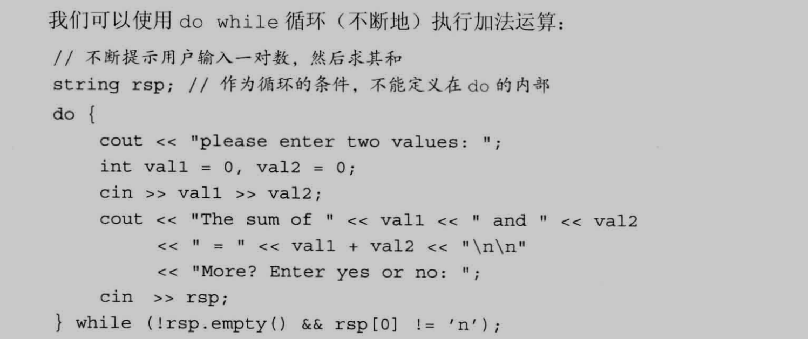
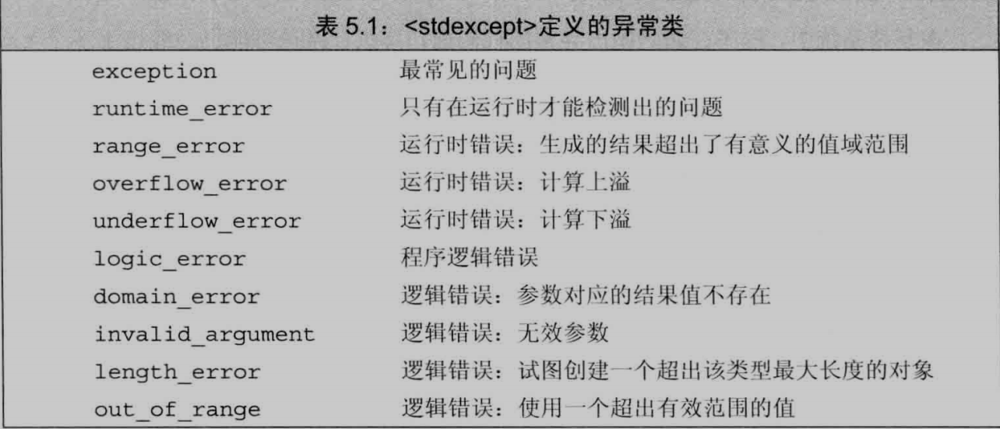

[TOC]


## 简单语句

一个表达式, 末尾加上分号就变成了**表达式语句**, 作用是执行表达式并丢弃结果

```C++
ival + 5;
cout << ival;
```


**空语句**: 只含有一个单独的分号

```C++
; // 空语句
while (cin >> s && s 1= sought);
```

>   使用空语句应该加上注释, 别漏写分号,也别多写


**复合语句**:指用花括号括起来的(可能为空)语句和声明的序列, 也叫做**块**

-   一个块就是一个作用域
-   块中的名字只能在块内部和嵌套在块的子块访问
-   名字在有限区域内可见, 该区域从改名字定义处开始, 到名字所在最内层块的结尾结束
-   块不以分号结束
-   语法上需要一条语句, 逻辑上要多条语句, 使用复合语句

```C++
while (val <= 10) {
    sum += val;
    ++val;
}
```


## 语句作用域

定义在控制结构中的变量只在相应语句内可见, 一旦语句结束, 变量就超出作用范围

```C++
while (int i = get_num());
i = 0; // 错误
```

需要访问控制变量, 定义在外部:

```C++
int i = get_num();
while (i);
i = 0;
```


## 条件语句

### if语句

形式1:

```C++
if (condition) 
    statmemt
```

形式2:

```C++
if (condition)
    statment1
else
    statment2
```

嵌套if语句:

```C++
if () {
    
}    
else if() {
    
}
else {
    
}
// ....
```


-   如果condition为真, 执行statment, 当statment执行完成, 继续执行if语句后面的其他语句

-   如果condition为假, 跳过statment, 对于简单if语句, 继续执行if语句后面其他语句; 对于if else语句, 执行statment2

    

**悬垂else**:else与离它最近的尚未匹配的if匹配

```C++
if () 
    if ();
else ;// 这个else和第二章的if匹配
```

==不要省略花括号,就能避免悬垂else:==

```C++
if () {
  	if () {
        
    }  
}else {
    
}
```


==不建议省略花括号, 特别是新手==


### switch 语句

基本形式:

```C++
switch(expr) {
        case: const_expr1
            // 内容
            break;
    	case: const_expr2
            // 内容
            break;
        case: const_expr3
            //  内容
            break;
        // .......
    default:
        ;
}
```


1.   括号里的表达式可以是初始化的变量声明, 如: switch(int i = 0)

2.   表达式的值转换成整数类型, 然后与每个case标签的值比较

3.   ==case关键和它对应的值被叫做**case标签**, case标签**必须是整型常量表达式**==
4.   任何两个case标签的值不能相同, 否则报错, default是特殊case标签


**case合并**

```C++
int i = 0;
switch () {
    case 1: case 2: case 3:	// 匹配到1 - 3的标签都会让cnt加1
        ++cnt;
        break;
    case 4:
        break;
    case 5:
        break;
        // ....
    default:
       	;
}
```

>   一般不省略break语句, 没写就加注释说明


如果没有任何一个case标签能匹配上switch表达式的值, 程序将执行紧跟在**default标签**后面的语句

>   不省略default, default后面没有语句就加上空语句块或空语句


==**同一个作用域内不允许跨过变量的初始化语句直接跳到该变量作用域内的另一个位置:**==

```C++
case true:
	string file_name;		// 错误: 控制流绕过一个隐式初始化的变量
	int jval = 0;			// 错误: 控制流绕过一个显式初始化的变量
	int jval;				// 正确: 因为jval没有初始化
case false:
	jval = next_num();
	if(file_name.empty())	// file_name在作用域内, 没有被初始化
```

>   从变量定义语句跳到变量作用域内是非法的

需要在case分支定义并初始化一个变量, 把变量定义在块内, 确保后面的所有case标签都在变量作用域之外:

```C++
case true:
{
    string file_name = get_file_name();
}
break;
case false:
	if (file_name.empty()) 	// 错误: file_name不在作用域内
```

>   像这样做, 就算跨过, 也只是跨过语句块, 而不是变量的定义


## 迭代语句

### while语句

只要条件为真, while语句就重复执行循环体

形式:

```C++
while (condition)
    statment
```

**条件部分可以是一个表达式或一个带初始化的变量声明**:while(int i = 0);

通常应该由条件本身或者是循环体设法改变表达式的值, 否则循环可能无法终止

需要在循环结束后访问循环控制变量, 则需要在while外部定义该变量

**==定义在while条件部分或者while循环体内的变量每次迭代都经理从创建到销毁的过程==**


### 传统for语句

形式:

```C++
for (初始化表达式; 条件表达式; 更新表达式)
    statment;
```


初始化表达式中可以定义多个对象, 只能有一条声明语句, 所有变量的基础类型必须相同:

```C++
for (int i = 0, sz = 100; i != sz; ++i, --sz);
```


可以省略for语句头中的初始化表达式、条件表达式、更新表达式中的任何一个(或者全部):

```C++
for (;;);	// 死循环
```

省略条件表达式的效果是在这个位置写了一个true, 会死循环


执行顺序:

1.   先执行初始化表达式, 且仅执行一次
2.   然后执行条件表达式, 如果为真, 执行第三步, 否则结束循环
3.   执行循环体
4.   执行更新表达式
5.   执行第二步


### 范围for语句

范围for语句可以遍历容器或其他序列的所有元素

语法形式:

```C++
for (变量 : 序列) 
    循环体
```

序列可以是:

1.   花括号括起来的初始值列表
2.   数组、vector、string等类型的对象(共同特点是拥有能返回迭代器的begin和end成员)


-   序列中的每个元素都必须能转换成定义的变量的类型(确保类型正确可以使用auto)

-   如果对序列中元素执行写操作, 循环变量必须声明成引用类型
-   每次迭代都会重新定义循环控制变量, 并将其初始化成序列中的下一个值, 然后才执行循环体


例子:

```C++
vector<int> v = {0, 1, 2, 3, 4, 5, 6, 7, 8, 9};
for (auto &r : v){
    r *= 2;
}
```

等价的传统for语句:

```C++
for (auto beg = v.begin(), end = v.end(); beg != end; ++beg) {
    auto &r = *beg;	// r必须是引用类型, 这样才能对元素执行写操作
    r *= 2;			// 将v中每个元素的值翻倍
}
```


**不要通过范围for语句增加序列的元素:**

-   **==在范围for语句中预存了end()的值, 一旦在序列中添加(删除)元素, end()的值就可能变得无效==**


### do while 语句

do while语句先执行循环体后检查条件, 循环至少1次

形式:

```C++
do
    statment;
while (condition);
```


==condition使用的变量必须定义在循环体之外==





## 跳转语句


### break语句

==该语句负责终止离他最近的while、do while、for或switch语句, 并从这些语句之后的第一条语句开始继续执行==

==break只能出现在迭代语句或者switch语句内部(包括嵌套在此类循环里的语句或块的内部), 作用范围仅限于最近的循环或switch==

例子:

```C++
string buf;
while (cin >> buf && !buf.empty()) {
    switch(buf[0]){
        case '-':
            for (auto it = buf.begin() + 1; it != buf.end(); ++it) {
                if (*it == ' ') break;	// 离开for循环
            }
            break;	// 离开switch
        case '+':
            //...
    }// 结束switch
}// 结束while
```

>   终止的是包含着break的循环体


### continue语句

continue语句终止离最近的循环中的当前迭代并立即开始下一次迭代

只能出现在for, while和do while循环内部, 或者嵌套在此类循环里的语句或块的内部


continue中断当前的迭代:

-   **对于while或者do while来说: 继续判断条件的值**
-   **对于传统for循环来说: 继续执行for语句头的expression(更新表达式)**
-   **对于范围for语句来说: 用序列中的下一个元素初始化循环控制变量**


例子:

```C++
string buf;
while (cin >> buf && !buf.empty()) {
    if (buf[0] != '_')
        continue;	// 跳过当前循环,接着读取下一个输入, 说明当前的输入是下划线开始
}
```


### goto语句

goto 语句的作用是从goto语句无条件跳转到同一函数内的另外一条语句

>   尽量不要使用


形式:

```C++
goto lable;
```

带标签语句形式:

```C++
lable: return; // 可以作为goto的目标
```

标签标示符独立于变量或其他标示符的名字, 因此可以和程序中其他实体同名

goto语句和控制权专项的那条带标签语句必须位于同一个函数


==goto语句也不能将程序的控制权从变量的作用域之外转移到作用域之内:==

```C++
goto end;
	int ix = 10;
end:
	ix = 42;
```


向后跳过一定执行的定义, 意味着系统将销毁该变量:

```C++
begin:
	int sz = get_size();
	if (sz <= 0){
        goto begin;
    }
```


## try语句块和异常处理


异常值的是存在于运行时的反常行为, 超出函数正常功能的范围

当程序的某部分检测到一个它无法处理的问题, 需要用到异常处理


异常处理包括:

-   **throw表达式**: 异常检测部分用throw表达式来表示遇到了无法处理的问题, 说throw**引发**了异常


-   **try语句块**: 异常处理部分使用try语句块处理异常, 以关键字try开始, 并以一个或多个**catch子句**结束, try抛出的异常会被catch处理, 所以catch也叫做**异常处理代码**


-   **异常类**: 用于在throw表示和相关的catch子句之间传递异常的具体信息


### throw表达式

例子:

```C++
// 抛出一个异常
throw runtime_error("哦! 我遇见一个大傻逼!");
```

==抛出异常将终止当前的函数, 并把控制权转移给能处理该异常的代码==

必须初始化runtime_error对象, 方式是给它提供一个string或C风格字符串


### try语句块

通用语法形式:

```C++
try {
    // 可能引发异常的代码
} catch(异常声明) {
    // 异常处理代码
} catch(异常声明) {
    // 异常处理代码
}	// ...
```


**==try语句块内声明的变量在块外部无法访问, 特别是在catch子句内也无法访问==**

如果抛出异常的函数没有用catch处理异常, 则由调用者处理异常, 如果调用者也不处理异常, 则调用者的调用者处理异常, 如果最终没有找到任何匹配的catch子句, 程序转到名为**terminate**的标准库函数, 执行该函数导致程序非正常退出


### 标准异常

-   exception头文件定义最通用的异常类, 它只报告异常的发生, 不提供额外信息
-   stdexcept头文件定义几种常用的异常类
-   new头文件定义了bad_alloc异常类型
-   type_info头文件定义了bad_cast异常类型





异常类型只定义一个名为what的成员函数, 没有任何参数, 返回值是一个指向C风格字符串的const char *

如果异常类有一个字符串初始值, 返回该字符串

无初始值的异常类, what返回的内容由编译器决定


例子:

```C++
int a = 0, b = 0;
cin >> a >> b;
try {
    if (b == 0) throw runtime_error("被除数不能是0");	// 可能抛出异常的代码
}catch (runtime_error err){							// 捕获到的异常
    cerr << err.what() << endl;
}
```

