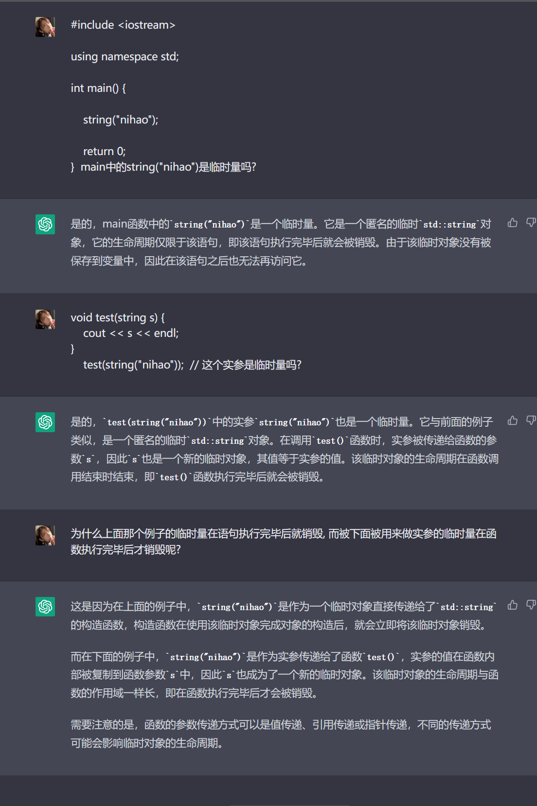
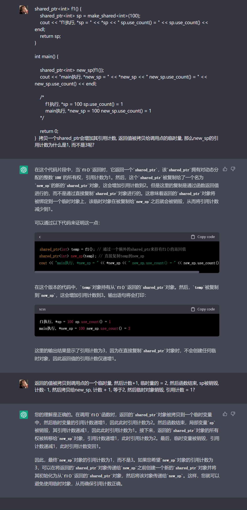
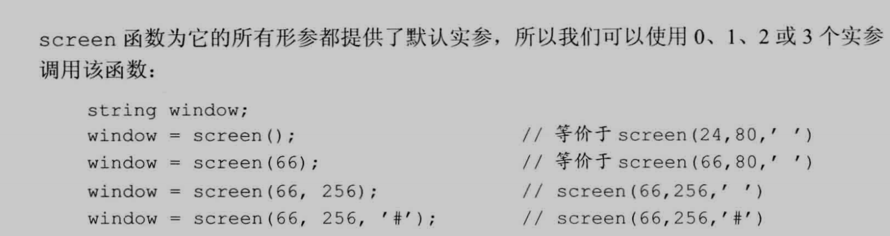

[TOC]


## 函数基础


函数定义包括以下部分:

-   返回类型
-   函数名
-   形式参数列表
-   函数体


例子:

```C++
int fact(int val){
    int ret = 1;
    while (val > 1)
        ret *= val--;
    return ret;
}
```


**函数调用**

函数调用完成两项工作:

1.   **用实参初始化函数对应的形参**(是初始化, 不是赋值, 如形参是const, 那么可以不提供值)
2.   将控制权转移给被调用函数, **主调函数**的执行被暂时中断, 被调函数开始执行


遇到 return 语句时函数结束执行过程, 完成两项工作:

1.   返回return 中的值(如果有的话)
2.   将控制权从被调函数转移回主调函数


**形参和实参**

实参是形参的初始值: 按照实参的顺序依次初始化形参

函数的调用规定实参数量应与形参数量一致


形参列表可以为空, 但是不能省略 ( ) :

```C++
void f1() {}
```


形参列表中的形参通常用逗号隔开, **每个形参都是含有一个声明符的声明,  即使两个形参的类型一样也要写出来:**

```C++
int f4(int v1, int v2) {}
```

>   函数最外层作用域的局部变量不能和形参同名


形参名是可选的, 无法使用未命名的形参, 即使如此, 调用此类函数也要传对应的形参:

```C++
int xx(int, int) {}
```


返回类型是void表示函数不返回任何值


### 局部对象


名字有作用域, 对象有生命周期:

-   名字的作用域时程序文本的一部分, 名字在其中可见
-   对象的生命周期是程序执行过程中该对象存在的一段时间


**局部变量**

-   形参和函数体内部定义的变量
-   仅在函数的作用域可见
-   会隐藏在外层作用域中同名的其他声明


**自动对象**

-   只存在于块执行期间的对象称为自动对象
-   当块执行结束, 块中创建的对象的值就变成未定义的


### 局部静态(static)对象

-   将局部变量定义成**static**类型获得

-   该对象一旦定义, **直到程序终止才被销毁**, 在此期间即使对象所在函数结束执行也不会对它有影响
-   ==每次函数调用时不会重新创建，而是保留上一次调用结束时的值==
-   如果局部静态变量没有初始值, 执行值初始化, 内置类型的局部静态变量初始化为0

```C++
int count_calls() {
    static int ctr = 0;
    return ++ctr;
}
int main () {
	int a = count_calls();	// a = 1
    int b = count_calls(); 	// b = 2;
    return 0;
}
```


### 函数声明

1.   函数的名字也必须在使用之前声明
2.   函数只能定义一次, 但可以声明多次
3.   如果函数不被用到, 可以只有声明, 没有定义
4.   ==函数声明无需函数体, 用一个分号替代即可==
5.   ==函数声明不包含函数体, 可以无需形参的名字==

```C++
void print(int);
void printf(int i);
```

==分离式编译: **在头文件中进行函数声明, 源文件中定义**==


1.   **==建议函数在头文件中声明, 在源文件中定义==**

     -   .h里声明, .cpp里面定义

     

2.   ==函数声明放在头文件, 确保同一函数的所有声明保持一致  (这样就不需要在每个使用到的文件都写一个该函数的声明)==

3.   如果想改变函数接口, 只需改变一条声明语句(不然每个.cpp都有一个声明, 都要改就很麻烦, 在头文件里面直接改)

4.   ==***含有函数声明的头文件应该包含到定义函数的源文件中***==


### 分离式编译

可以把程序分割到几个文件中去, 每个文件独立编译

==了解自己使用的编译器是如何支持分离式编译的==


## 参数传递


**形参初始化的机制和变量初始化一样**


**引用传递:**

==当形参是引用, 对应的实参被引用传递, 或者**传引用调用**==


**值传递:**

==实参的值被拷贝给形参, 形参和实参是两个相互独立的对象, 叫做值传递, 或者函数被**传值调用**==


### 传值参数(讲指针形参)


执行指针拷贝操作, 拷贝的是指针的值, 拷贝之后, 两个指针是不同的指针:

```C++
void reset(int *ip) {
    *ip = 0;
    ip = 0;
}
```

>   建议使用引用类型的形参代替指针


### 传引用参数(讲引用形参)


对于引用的操作实际上是作用在引用所引的对象上

**引用形参**:

```C++
void reset(int &i) {
    i = 0;
}
```


**使用引用避免拷贝**

1.   拷贝大的类类型对象或容器对象比较低效, 如较长的string
2.   ==有的类型不支持拷贝操作(IO类型在内), 只用引用形参访问该类型对象==
3.   ==**如果函数无需改变引用形参的值, 最好将其声明为常量引用**==
     1.   常量引用可以绑定表达式, 字面值, 常量, 非常量


```C++
bool isShorter(const string &s1, const string &s2) {
    return s1.size() < s2.size();
}
```


**使用引用返回额外信息**

让函数能返回两条记录

​	方法1. 定义一个新的数据类型, 让它包含两条记录

​	方法2. 给函数传一个额外的引用实参

```C++
string xx(const string &jilu1, string &jilu2) {
    jilu2 = "记录2";
    return jilu1;
}
```


### const形参和实参

**忽略形参的顶层const可能意想不到, 因为传给它常量对象还是非常量对象都行:**

```C++
void fcn(const int i) {}
void fcn(int i) {}			// 函数重定义
```

函数可以重载, 但是程序不知道应该调用哪一个


### 数组形参

不许拷贝数组

**使用数组对象通常会将其转换成指向数组首元素的指针**


形参可以写成类似数组的形式:

```C++
void print(const int*);
void print(const int[]);	// 意图作用于一个数组
void print(const int[10]);	// 期望数组含有多少元素, 实际传进来的不一定

int arr[10] = {};
int *p = arr;
int(*p1)[10] = &arr;
```

上面三个函数等价:

1.   每个函数的唯一形参是const  int*类型的
2.   编译器处理print函数的调用, 只检查传入的参数是否是const int*


**管理数组避免越界**:

1.   传递指向数组首元素和尾后元素的指针
2.   专门定义一个表示数组大小的形参
3.   数组本身包含一个结束标记, 如'\0', 用于char数组
4.   使用标准库函数begin和end


**数组引用形参**

```C++
f(int &arr[10]);		// 错误, 不存在引用的数组
f(int (&arr)[10]);		// 正确, arr是具有10个整数的数组的引用
```

>   数组的引用规定只能用于该类型的数组, 无法传递任意大小的数组
>
>   后续会介绍可以传递任意大小的数组的引用


**传递多维数组**

多维数组传递给函数, 传递的是指向数组首元素的指针:

```C++
void pirnt(int (*martix)[10], int rowSize){}
void print(int martix[][10], int rowSize]){}	// 等价定义
```

>   ==数组第二维度(以及后面所有维度)的大小都是数组类型的一部分, 不能省略==


**==数组的维度也是类型的一部分==**

```C++
int iarr[10][10] = {
    { 1, 2, 3 },
    { 3, 2, 1 }
};

int (*p)[10] = iarr;
// int (*p)[] = iarr; // 错误, 维度也是类型的一部分
```


### 含有可变形参的函数

1.   **intitializer_list**

实参数量未知但是全部实参的类型都相同, 可以使用**intitializer_list**类型的形参, 定义在同名**头文件**中:

该类型对象的元素永远是常量值

含有该类型形参的函数也可以同时拥有其他形参

向该类型形参传递值的序列, 放在花括号中:

```C++
void error_mag(intitializer_list<string> il){}
// 调用
error_mag({"nxx", "nxxxx23423"});	// 用初始值列表构造一个intialize_list<string>对象, 然后初始化
```


2.   **省略符形参**

**省略符形参( ... )**只能出现在形参列表的最后一个位置, 有以下两种形式:

```C++
void foo(pram_list, ...);
void foo(...);
```

>   省略符形参应该仅仅用于C和C++通用的类型
>
>   大多数类类型的对象在传递给省略符形参时都无法正确拷贝


## 返回类型和return语句

**return 语句终止当前正在执行的函数并将控制权返回到调用该函数的地方**

形式:

```C++
return;
return expression;
```


### 无返回值函数

返回void的函数可以没有return, 因为后面会隐式加上

void函数可以在中间位置使用return提前退出:

```C++
void swap(int &v1, int &v2){
    if (v1 == v2) return 0;	// 执行这里, 直接退出
    int tmp = v2;
	v2 = v1;
    v1 = tmp;
    // 此处无需显式的return语句
}
```

>   return还可以返回另一个返回void的函数


### 有返回值函数

只要函数的返回类型不是void, 必须返回一个值

编译器尽量确保只能通过一条有效的return语句退出:

```C++
bool xxx(int i, int b) {
    if (i > b) return true;
    for (;;) {
        return; // 错误, 没有返回值
    }
    // 可能尚未返回值就结束了函数执行
}
```

**==含有return语句的循环后面也应该有一条return语句==**


==**返回的值被用于初始化调用点的一个临时量, 该临时量就是函数调用的结果**==

-   C++ 中的临时变量是指在表达式求值过程中被创建的变量，它们的生命周期只存在于表达式求值的过程中，并在表达式求值结束后被立即销毁。
-   如果一个临时变量被绑定到一个常量引用或者右值引用上, 那么其生命周期会延长到绑定的引用的生命周期结束





### shared_ptr的拷贝控制




**不要返回局部对象的引用或指针**

函数完成, 所占用的存储空间也随之被释放掉, 局部变量的引用将指向不再有效的内存区域:

```C++
const string &manip(){
    string ret;
    if(!re.empty())
        return ret;			// 错误: 返回局部对象的引用
    else 
        return "Empty";		// 错误, "Empty"转换成const char *
}
```

>   个人推测: "Empty"之所被转换成局部临时string对象, 是因为字符串字面值是cont char *类型的对象


**返回类类型的函数和调用运算符**

返回指针, 引用, 类的对象, 可以对函数调用结果访问其成员

```C++
auto sz = shorterString(s1, s2).size();
```


**引用返回左值**

函数返回非常量引用的结果可以赋值:

```C++
string & get_string(string &s) {
    return s;
}
string name = "帅哥";
get_string(name) = "大帅哥";
```


**列表初始化返回值**

```C++
vector<string> process(){
   if (xxx) {
      return {} ;  // 返回空vector对象
   }
    return {"xxxxxxx", "asdfasdf", "12341234"};	// 返回列表初始化的vector对象
}
```


**主函数main的返回值**

1.   main如果没有返回值, 编译器隐式插入返回0的return
2.   返回0表示成功, 其他值表示失败, 非0只的具体含义由机器而定

用两个预处理变量表示成功和失败

```C++
int main() {
    if (some_failure) 
        return EXIT_FALLURE;	// 定义在cstdlib头文件中
    else
        return EXIT_SUCCESS;
}
```

>   预处理变量不能在前面加std::, 不能在using声明中出现


**递归**

函数调用自身, 不管直接还是间接, 都称为*递归函数*

```C++
int factorial(int val){
    if(val > 1)
        return factorial(val - 1) * val;
    return 1;
}
```

>    ==一定要有某条路径不包含递归调用(终止条件)==


### 返回数组指针

数组不能拷贝, 不能返回数组

能返回数组的指针或引用


**最直接: 使用类型别名**

```C++
typedef int arrT[10];	// typedef int (*arrT)[10]
using arrT = int[10];	// using arrT = int(*)[10]
arrT* func(int i);	// func返回一个指向10个整数的数组的指针
```


**声明返回数组指针的函数**

数组的维度也是数组类型的一部分

形式 : type (*函数名( 形参列表 ))  [ 维度 ]

```C++
int (*func(int i))[10];
```

>   ==函数名是标识符和形参列表组成的==

 

它是一个函数, 返回一个指针, 指针指向的是大小为10的数组, 数组的元素是int


**使用尾置返回类型**

任何函数的定义都能使用尾置返回

出现返回类型的地方放置auto:

```C++
auto func(int i) -> int(*)[10];
```


**使用decltype**

```C++
int odd[] = {1, 2, 3, 4, 5};
int evec[] = {7, 8, 9, 10, 11};
decltype(odd) *arrPtr(int i){
    return (i % 2) ? &odd : &even;
}
```

decltype得到的类型是int [5]

decltype不把数组类型对象转换成对应的指针, 结果还是数组


## 函数重载


**只重载相似的操作**

名字相同形参不同, 称为**函数重载**

==编译器根据传递的**实参类型和数量**调用同名不同形参的函数==, 

==对于重载函数, 应该在形参数量和形参类型上有所不同 只有返回类型不同不能算重载==


**定义函数重载**

```C++
void lookup(double i);
void lookup(int i);
bool lookup(double i, int i);
bool lookup(double, int);	// 函数重复声明, 错误
```

>   真正的函数名应该是包含标识符和形参列表, 而不只是标识符


==**一个拥有顶层const的形参无法和另一个没有顶层const的形参区分**:==

```C++
void lookup(int i);
void lookup(const int i);	// 错误, 重复声明
```


形参是指针或引用, 通过指向的是常量对象还是非常量对象区分:

```C++
void lookup(int &);
void lookup(const int &);
```

上述函数, 通过实参是否是常量对象调用对应函数

==实参是非常量对象, 优先调用非常量版本的函数==


**const和重载**:

使传入的引用变成常量引用, 调用另一个同名函数, 将常量引用转换成普通引用返回

```C++
string &shorterString(string &s1, string &s2) {
	auto &r = shorterString(const_cast<const string&>(s1), const_cast<const string&>(s2));	// 调用另一个函数(指向const的版本)
    return const_cast<string &>(r);
}
```


### 重载和作用域

-   ==**在内层作用域声明的名字,  将隐藏(访问不了)外层作用域中声明的同名名字**==

-   **在不同作用域无法重载函数名**:

```C++
string read();
void print(const string&);
void print(double);
void fooBar(int ival) {
    bool read = false;
    string s = read();	// 错误, read是布尔值
    void print(int);	// 隐藏了外层作用域的print
    print("value");		// 错误, 被隐藏
    print(ival);		// 正确
    print(3.14);		// 正确
}
```

>   编译器在当前作用域找到了需要的名字, 就忽略外层作用域同名实体, 然后就是检查函数调用是否有效
>
>   可以这样: ::xxx


## 特殊用途语言特性


### 默认实参

-   **==某个形参被赋予了默认值, 它后面所有形参都必须有默认值==**

-   函数调用时实参按其位置解析, 默认实参负责填补函数调用缺少的尾部实参

    ```C++
    using sz = int;
    string screen(sz ht = 24, sz wid = 80, char backgrnd = ' ');
    window = screen(,, '?');	// 错误, 只能省略尾部实参
    window = screen('?');		// 调用screen('?', 80, ' ')	char类型会被提升成int
    ```

>   char 类型字面值类型本质上也是数字, 而传递的时候会被提升为int类型, 但是, 如果有一个int, 一个char, 会优先选择char, 因为是精确匹配, 不用提升





-   ==给定的作用域中一个形参只能被赋予一次默认实参, 只能为没有默认值的形参添加默认实参, 右侧形参必须有默认值==

    ```C++
    string screen(sz, sz, char = '#');
    string screen(sz, sz, char = '*');	// 错误, 重复声明
    string screen(sz = 24, sz = 80, char);	// 正确
    ```

    >   在vs里面报错, 但是可以编译通过的

    

-   尽量让经常使用默认值的形参出现在后面

-   **==应该在函数声明中指定默认实参, 并将声明放在合适的头文件中==**

-   ==**局部变量不能作为默认实参**==, 表达式的类型能转换成形参需要的类型就能作为默认实参

    ```C++
    // 下面三个变量必须传在函数之外
    sz wd = 80;
    char def = ' ';
    sz ht();
    string screen(sz = ht(), sz = wd, char = def);
    string window = screen(); 	// 调用screen(ht(), 80, ' ')
    ```

    

    

-   ==用作默认实参的名字在函数声明所在的作用域内解析, 这些名字的求值过程发生在函数调用时:==

    ```C++
    void f2(){
        def = '*';			// 改变默认实参的值
        sz wd = 100;		// 隐藏了外层定义的wd, 没有改变默认值
        window = screen();	// 调用screen(ht(), 80, '*')
    }
    ```

    >   用的是函数声明时候的那个被用作默认值的对象


### 内联函数和constexpr函数


**内联函数可避免函数调用的开销**, 适用于规模小, 流程直接, 频繁调用的函数


在每个调用点上"内联地"展开, 假设shorterString是内联函数:

```C++
cout << shorterString(s1, s2) << endl;
// 编译过程中展开
cout << (s1.size() < s2.size() ? s1 : s2) << endl;
```


返回类型前加上关键字**inline**声明内联函数:

```C++
inline const string &shorterString(const string &s1, const string &s2) {
    return s1.size() <= s2.size() ? s1 : s2;
}
```

>   编译器可以无视inline函数的请求


**constexpr函数**是指能用于常量表达式的函数

条件:

-   ==函数的返回类型以及所有形参的类型都得是字面值类型(编译时就能得到大小和位置的值)==
    -   字面值类型是指**编译时就能得到结果的类型**，具体包括算术类型、引用和指针。

-   ==函数体中必须有且只有一条return语句==

```C++
constexpr int new_sz() {return 42;}
constexpr int foo = new_sz();			// 正确, new_sz是constexpr函数
```

执行该初始化任务时, 编译器把对constexpr函数的调用替换成其结果值, 为了在编译过程中随时展开, constexpr被隐式指定为内联函数


-   **const函数体内也可以包含其他语句, 只要这些语句在运行过程不执行任何操作, 例如空语句, 类型别名, using声明**

-   **constexpr函数不一定返回常量表达式, 例如, 传递的如果是变量, 不是常量, 就不一定返回常量表达式**

    ```C++
    constexpr size_t scale(size_t cnt) {return new_sz() * cnt;}
    ```

    当scale的实参是常量表达式, 返回值也是常量表达式, 否则不然:

    ```C++
    int arr[scale(2)];	// 正确
    int i = 2;
    int a2[scale(i)];	// 错误
    ```

-   ==**把内联函数和constexpr函数放头文件里**==

    -   ==inline函数和constexpr函数可以在程序中多次定义, 需要保证每个的定义都一致==
        -   在同一个.cpp文件内内联函数也不能重定义, 但是.cpp1里定义的内联函数, .cpp2里可以重定义该内联函数, 为了让内联函数执行的操作(函数体)都一样, 所以需要在头文件中定义
    -   编译器展开内联函数, 不仅要有函数声明, 还要函数定义


### 调试帮助


程序可以包含一些关于调试的代码, 但是这些代码只在开发程序时使用

程序编写完成准备发布, 屏蔽调试代码

需要用到两项预处理功能:**assert**和**NDEBUG**


**assert预处理宏**

-   包含在cassert头文件

-   预处理宏是一个预处理变量

-   assert宏用一个表达式作为条件

    ```C++
    assert(expr);
    ```

    执行过程:

    1.   对expr求值, 如果表达式为假 ( 即0 ), assert输出信息并终止程序的运行
    2.   如果表达式为真 ( 非0 ), assert什么也不做

-   预处理名字由预处理器而非编译器管理

-   可以直接使用预处理名字无须要提供using声明或用域操作符std::assert

-   预处理变量, 宏名字在程序内必须唯一, 不允许定义其他同名实体


assert宏常应该仅用于检查"不能发生"的条件(可能是因为要尽量避免检查的开销?):

```C++
assert(word.size() > 阈值);	// 如果 word.size() 小于或等于阈值, 就会返回false, 也就是0, 然后assert结束程序输出信息
```

>   不能替代真正的运行时逻辑检查和程序本身应该包含的错误检查


**NDEBUG预处理变量**

-   如果定义了NDEBUG则assert什么也不做

-   默认状态下没有定义NDEBUG, assert执行运行时检查

-   使用#define定义NDEBU, 可以关闭调试状态

    ```C++
    #define NDEBUG
    ```

-   定义NDEBUG能避免检查各种条件所需的运行时开销, 根本不会执行运行时检查


**使用NDEBUG编写条件调试代码**

```C++
void print(const int ia[], size_t size){
    #ifndef NDEBUG
    	cerr << __func__ << ": array size is " << size << endl;
    #endif
    //...
}
```


1.   **_ _ func _ _** 输出当前调试的函数的名字
2.   **_ _ FILE _ _**  存放文件名的整型字面值
3.   **_ _ LINE_ _**  存放当前行号的整型字面值
4.   **_ _ TIME _ _** 存放文件编译时间的字符串字面值
5.   **_ _ DATE _ _** 存放文件编译日期的字符串字面值


## 函数匹配


```C++
void f();
void f(int);
void f(int, int);
void f(double, double = 3.14);
f(5.6);	// 调用void f(double, double);
```


1.   确定**候选函数**: 

     特征

     -   与被调用的函数同名,
     -   在其声明调用点可见

      

2.   选出**可行函数**

     特征

     -   形参数量与本次调用的实参数量相等

         -   如果函数含有默认实参, 调用该函数时传入的实参数量可能少于实际使用的实参数量

             ```C++
             f(3.14);	// 调用 f(double, double = 3.14)
             ```

             

     -   每个实参的类型与对应的形参类型相同或实参和形参满足类型转换规则

     

3.   寻找最佳匹配(如果有的话)

     -   实参类型与形参类型越接近, 他们匹配的越好(精确匹配)


**含有多个形参的函数匹配**

对选出来的可行函数: 编译器依次检查每个实参以确定那个函数是最佳匹配, 如果有且只有一个函数满足下列条件, 则匹配成功:

-   该函数每个实参的匹配都不劣与其他可行函数需要的匹配(不劣于, 不代表优先于其它函数, 只满足这条有可能二义性调用)
-   并且至少有一个实参的匹配优于其他可行函数提供的匹配

如果没有函数脱颖而出, 编译器将报告**二义性调用**的信息


例子:

```C++
f(32, 2.56);	// void f(int, int); void f(double, double);		这就是二义性调用, 因为都有精确匹配和类型转换
```


虽然可以通过强制类型转换达到函数匹配, 但是不建议

调用重载函数应尽量避免强制类型转换, 如果在实际应用中确实需要强制类型转换, 则说明我们设计的形参集合不合理


### 实参类型转换

为了确定最佳匹配划分等级:

1.   精确匹配

     -   实参类型和形参类型相同
     -   实参从数组类型或函数类型转换成对应的指针类型
     -   向实参添加顶层const或从实参中删除顶层const(形参不管是顶层const,还是非常量, 都能接受顶层const或非顶层const)

     

2.   通过const转换实现的匹配

     1.   例如, 传非常量实参, 优先调用非常量版本, 即使非常量实参也能调用常量版本

3.   通过类型提升实现的匹配

4.   通过算数类型转换或指针转换实现的匹配

5.   通过类类型转换实现的匹配


小整数提升成int:

```C++
void ff(int);
void ff(short);
ff('a');		// 调用 ff(int);, 但是如果形参是char, 那么就和char精确匹配, 比类型提升优先级更高
```


所有算数类型转换的级别都一样:

```C++
void manip(long);
void manip(float);
manip(3,14);		// 错误, 二义性调用
```

>   ==字面值3.14的类型是double, 既能转换成long也能转换成float, 存在两种可能的算数类型转换, 调用具有二义性==


如果是常量引用实参和指向常量的指针形参, 编译器通过实参是否是常量决定选择函数:

```C++
Record lookup(Account&);
Record lookup(const Account&);
const Account a;
Account b;
lookup(a);	// 调用 Record lookup(const Account&); 
lookup(b);	// 调用 Record lookup(Account&);
```

>   非常量实参会优先调用非常量版本


## 函数指针


函数指针指向的是函数而非对象

==**函数的类型由它的返回类型和形参类型共同决定, 与函数名无关**==


声明指向函数的指针, 用指针替换函数名:

```C++
bool lengthCompare(const string &, const string &);
bool (*pf)(const string &, const string &);	// 未初始化
```

>   pf是一个指针, 右边是形参列表, 表示指向的是函数, 看左边, 该函数的返回类型是bool


把函数名作为一个值使用, 该函数自动转换成指针:

```C++
pf = lengthCompare;			// pf指向该函数
pf = &lengthCompare;		// 等价, 取地址符是可选的
```


能直接使用指向函数的指针调用该函数, 无须提前解引用:

```C++
bool b1 = pf("Hello", "goodbye");
bool b2 = (*pf)("Hello", "goodbye");
bool b3 = lengthCompare("Hello", "goodbye");
```


指向不同函数的指针之间没有转换规则, 可以给函数指针赋nullptr, 或者值为0的整型常量表达式, 表示指针没有指向任何一个函数

```C++
string::size_type sumLength(const string &, const string &);
bool cstringCompare(const char *, const char *);
pf = 0;					// 正确, 不指向任何函数
pf = sumLength;			// 错误, pf的类型是bool(*)(const string &, const string &), sumLengh的返回类型不匹配
pf = cstringCompare;	// 错误, 形参类型不匹配
pf = lengthCompare;		// 正确, 精确匹配
```


指针类型必须和重载函数中的某一个函数的类型精确匹配

```C++
void ff(int*);
void ff(unsigned int);
void (*pf1)(unsigned int) = ff;	// 正确
void (*pf2)(int) = ff;			// 错误, 没有这个函数
double (*pf3)(int*) = ff;		// 错误, 没有这个函数
```


**函数指针形参**

**不能定义函数类型的形参, 但是形参可以是指向函数的指针**

```C++
// 函数类型形参自动转换成指向函数的指针
void userBigger(bool pf(const string &, const string&));

// 等价声明, 显式将形参定义称指向函数的指针
void userBigger(bool (*pf)(const string &, const string&));
```

**可以直接把函数作为实参使用, 会自动转换成指针:**

```C++
userBigger(lengthCompare);
```


**使用类型别名简化函数指针类型:**

```C++
typedef bool Func(const string &, const string&);
typedef decltype(lengthCompare) Func2;

typedef bool(*FuncP)(const string &, const string &);
typedef decltype(lengthCompare) *FuncP2;
```

>   decltype不会将函数类型自动转换成指针类型, 结果还是函数类型, 需要加上*才能得到指针类型


**返回指向函数的指针**

不能返回一个函数, 但是能返回指向函数的指针


使用类型别名:

```C++
using F = int(int*, int);		// F是函数类型, 不是指针
using PF = int(*)(int*, int);	// PF是指针类型
```


和函数类型的形参不一样**, 返回类型不会自动转换成指针类型,** 必须显式将返回类型指定为指针:

```C++
PF f1(int);	// PF是指向函数的指针, f1返回指向函数的指针
F f1();		// 错误, 函数类型不能作为返回值
F *f1();	// 正确, 返回类型是int(*)(int*, int)
```

>   建议形参也显式定义成指针


麻烦的方法:

```C++
int (*f1(int))(int*, int);
```


使用尾置返回类型:

```C++
auto f1(int) -> int(*)(int*, int);
```


decltype返回函数类型

```C++
int xx(int*, int);
decltype(xx) * f1(int);
```

>   需要显式的加上*表明需要返回指针


例子:

```C++
#include <iostream>
#include <vector>
using namespace::std;

int f1(int, int);

int jia(int a, int b){
    return a + b;
}
int jian(int a, int b){
    return a - b;
}
int cheng(int a, int b){
    return a * b;
}
int chu(int a, int b){
    return a /  b;
}

void Comput(int a, int b, int(*p)(int, int)){
    cout << p(a, b) << endl;    // 指向的函数对象的类型相同, 但是执行的操作不同
}
int main() {

    vector<decltype(jia)*> ivec{jia, jian, cheng, chu};

    // ivec[0]是一个指向函数的指针, 无需解引用就能使用
    for (auto p : ivec) {
        Comput(100, 200, p);
    }

    return 0;
}
```


```C++
#include <iostream>
using namespace std;

int get_int(int i, int b = 100) {
    cout << "xxxxxxx" << endl;
    return 100;
}

int (*get_get_int(int(*get_int)(int, int)))(int, int) {
    cout << "xxxxasdfasdfasdf" << endl;
    return get_int;
}

int main() {

    // 函数指针
    int (*p)(int, int) = get_int;
    cout << p(100, 200) << endl;


    cout << get_get_int(get_int)(100, 200) << endl;

    return 0;
}
```


发现: 

函数指针指向带有默认实参的函数, 在使用该指针的时候, 不能忽略有默认实参的形参, 必须传入对应数量的实参

***\*默认参数只能使用函数声明时。当使用函数指针取其地址时，默认参数也是不可见的。\****
