[TOC]


# 定义抽象数据类型


1.   类的基本思想是**数据抽象**和**封装**
2.   数据抽象依赖于**接口**和**实现**分离的编程以及设计技术
3.   类的接口包括用户所能执行的操作
4.   类的实现则包括类的成员, 负责接口实现的函数体以及定义类所需的各种私有函数
5.   封装实现类的接口和实现的分离, 封装后的类隐藏了它的实现细节
6.   类的用户只能使用接口而无法访问实现部分


### 成员函数

-   成员函数的声明必须在类的内部
-   定义可以在类内部也可以在类外部
-   ==定义在类内部的函数是隐式的inline函数, 在类外部定义的不是inline的==


### this

成员函数通过一个名为this的额外隐式参数调用它的那个对象:

```C++
total.isbn();
```

编译器把total的地址传给isbn:

```C++
// 伪代码
Sales_data::isbn(&total)
```


1.   在成员函数内部可以直接调用该函数的对象的成员

     ​	isbn使用bookNo, 等价于this->bookNo

2.   任何自定义名为this的参数或变量都是非法的

3.   ==this的目的总是指向"当前"对象, =所以this是一个常量指针==


### const成员函数

1.   默认情况下, this的类型是指向类类型非常量版本的指针(不能把this绑定到常量对象上)

2.   常量对象上不允许定义非const成员函数

3.   把this设置为指向常量的指针有助于提高函数的灵活性

4.   ==参数列表后面的const表示this是一个指向常量的指针==

     ```C++
     void Sales_data::isbn() const {}
     ```

5.   ==常量对象, 常量对象的引用或指针都只能调用常量成员函数==


### 类作用域和成员函数

-    类本身就是作用域

-   **==编译器首先编译成员的声明==**

-   然后才轮到函数体

-   ==**所以成员函数体可以随意使用类中的其他成员无需再以成员出现顺序**==


### 类外部定义成员函数


1.   类外部定义成员函数, 成员函数的定义必须与它的声明匹配

2.   类外部定义的成员的名字必须包含它所属的类名

3.   ==使用作用域运算符说明剩下代码在类的作用域内==


例子:

```C++
struct xx {
   double hs() const {}
};

// 类外部定义
double xx::hs() const {  return 3.14; }
```


### 返回this对象的函数

例子:

```C++
Sales_data & Sales_data::combine(/*隐式参数: Sales_data *const this;*/) {
    return *this;
}
```

>   解引用获得当前对象的引用,  返回的是total的引用


### 定义类相关的成员函数

-   辅助函数, 如add, read, print, 这些函数定义的操作从概念上来说属于类的接口的组成部分, 不属于类本身
    -   例如, 定义一个人的类, 但是人的类没有"打印", "投影"等这种不属于人类的操作, 但是人类会用这些操作, 也就是说, "概念上属于人类"

-   ==如果函数在概念上属于类但是不定义在类中, 一般与类声明 ( 非定义 ) 在同一个头文件中==

-   **本节小知识点: IO类属于不能拷贝的类型, 只能通过引用来传递**
-   ==默认情况下,拷贝类的对象其实拷贝的是对象的数据成员==


### 构造函数

1.   ==构造函数用来**初始化**类对象的数据成员, 只要类的对象被创建, 构造函数就会执行==
2.   构造函数的名字和类名相同
3.   没有返回类型
4.   可以包含多个构造函数, 和重载差不多
5.   **构造函数不能声明成const的**


```C++
clss xx {
    xx() = default;
    xx(int i) : y(i) {}
        // ....
};
```


### 合成的默认构造函数

```C++
Sales_data total, trans;	// 没有提供初始值
```

-   类通过合成默认构造函数控制默认初始化过程
-   ==默认构造函数无需任何实参==
-   ==当类没有声明任何构造函数, 编译器才会自动生成合成默认构造函数==
-   合成默认构造函数规则:
    -   如果存在类内初始值, 用它来初始化成员
    -   否则, 默认初始化
-   类内包含内置类型或复合类型的成员, 数据成员全有类内初始值才适合使用合成的默认构造函数
-   ==类中包含类类型成员, 且这个成员没有默认构造函数, 编译器无法初始化该成员==
    -   对于这样的类, 必须自定义默认构造函数

-   如果定义了其他构造函数, 那么也要手动提供一个默认构造函数


可以再参数列表后面写上**= default**要求编译器生成默认构造函数

```C++
 xx() = default;
```

可以在类内部定义或外部定义


-   ==**类外部定义的函数是非inline的**==
-   ==**类内部定义的是隐式inline的**==


### 构造函数初始值列表

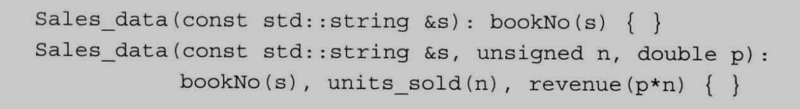

>   当某个数据成员被构造函数初始值列表忽略, 将以合成默认构造函数相同方式隐式初始化

>   ==**这是初始化, 不是赋值, 正如之前所学, 一个const必须要有初始值, 如果类内没有提供初始值, 那么必须通过构造函数初始值列表来提供初始值**==


### 类外部定义构造函数

```C++
Sales_data::Sales_data (std::istream &is) {
    read(is, *this);
}
```

-   类外部定义构造函数要指明属于哪个类
-   ==构造函数初始值列表是空的, 但是执行了构造函数体, 所以对象仍被初始化==
-   **==没有出现在构造函数初始值列表中的成员通过相应的类内初始值初始化或默认初始化==**


# 访问控制与封装


>   想象一下, 一台计算机, 有USB接口, 可以通过这个接口插入u盘从而使用u盘, 又或者用这个接口把别的计算机接入这个计算机, 操作这个计算机, 使用的时候只关注这个接口合不合适, 不关心计算机内部的是怎么运作的, 或是含有什么部件(封装)
>
>   用户只需要知道这个接口怎么用, 不需要知道含有接口的对象是怎么实现的
>
>   又或者这个计算机(类实现的对象)提供接口, 我们用键盘插进去, 就可以操作这个计算机
>
>   总的来说, 接口就是提供给用户使用的


使用**访问说明符**加强类的封装性

-   定义在**public**说明符之后的成员在**整个程序可被访问,** public成员定义类的接口
-   定义在**private**说明符之后的成员可以被类的成员函数访问, 但是不能被使用该类的代码访问, private部分封装了(隐藏了)类的实现细节


-   ==**作为接口的一部分, 构造函数和部分成员函数紧跟在public之后**==
-   ==**数据成员和作为实现部分的函数在private之后**==
-   一个类可以包含0个或多个访问说明符
-   每个说明符指定接下来成员的访问级别
-   有效范围直到下一个说明符或达到类的结尾


关键字**class**和**struct**的唯一区别就是: struct默认是public, class默认是private


### 友元


1.   ====**用关键字friend声明一个类或者函数可以令其访问该类的非公有成员**====

2.   **友元声明只能出现在类定义的内部, 出现的具体位置不限**

3.   友元不是类的成员也不受它所在区域访问控制级别的约束

4.   一般来说, 最好在类定义的开始或结束前的位置集中声明友元
5.   ==**友元声明仅仅指定了访问权限, 如果希望类能调用某个函数, 还需要在友元声明之外专门对函数进一次声明**==
6.   ==为了让友元对类的用户可见, 通常把友元的声明和类本身放置在同一个头文件==
     -   如下面代码中: read print add都提供了独立的声明(除了类内部的声明之外)


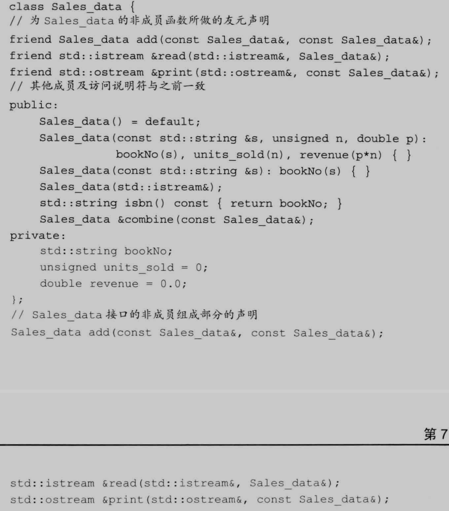


#### 封装的益处

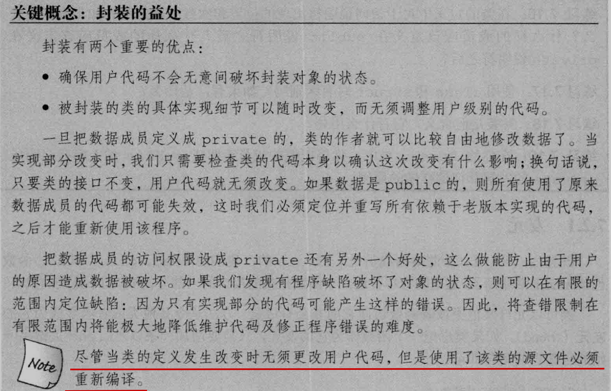

>   面向对象的思想很重要


## 类的其他特性: 类成员在探


-   由类定义的的类型名字和其他成员一样存在访问限制, 可以是public或private

-   使用类型别名可以隐藏细节, 用户不知道用的是string存放数据
-   可以等价的使用using
-   ==用来定义类型的成员必须先定义后使用, 所以类型成员要在类开始地方==
    -   定义类型的成员也是一种声明, 编译器先编译声明, 用到定义类型的声明的声明, 所以必须出现在所有声明之前


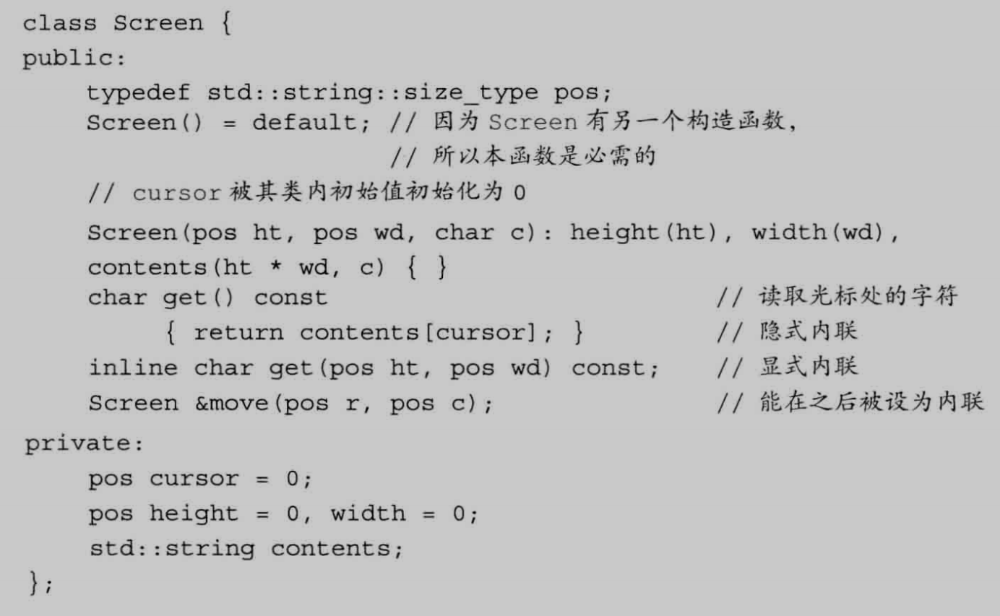

>   提供构造函数后编译器不提供默认构造函数, 我们自己定义
>
>   如果某个数据成员不存在类内初始值, 就要用构造函数值列表显式初始化


-   规模较小的函数适合被声明称inline内联函数

-   ==**定义在类内部的成员是自动inline的**==

-   **inline可以出现在函数的声明或定义**

-   **只在类外部定义的地方说明inline**

    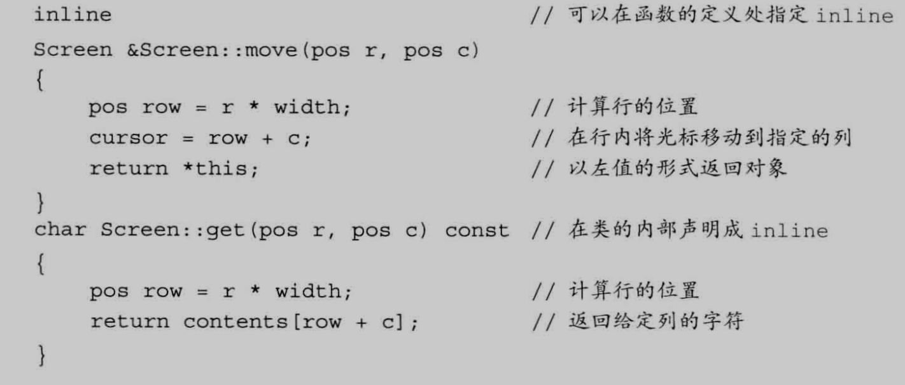


## 可变数据成员(mutable)


==一个**可变数据成员**永远不会是const, 即使它是const对象的成员, cosnt成员函数也可以改变一个可变成员的值==

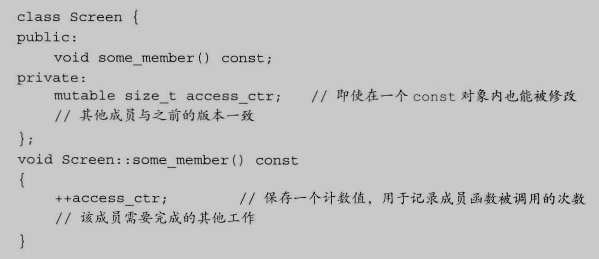

>   常量对象的成员, 也是常量
>
>   const对象的成员也是const的, 但是mutable成员不是
>
>   这里的this是指向常量对象的常量指针, 如果access_ctr不是mutable, 那么这是错误的, 


### 类数据成员的初始值

希望某个类总有一个默认初始化的成员, 就是提供类内初始值


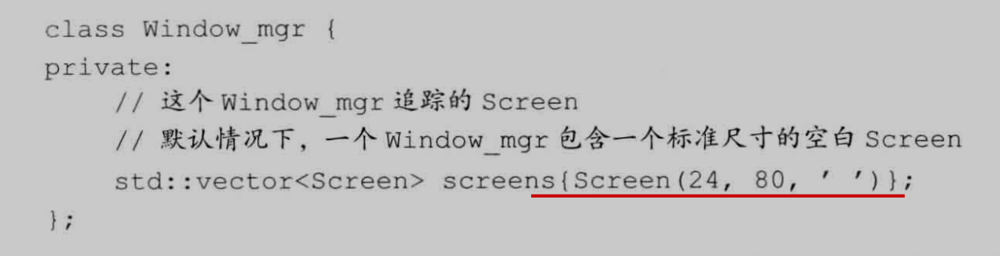


==**类内初始值必须使用 = 的初始化形式, 或者使用花括号括起来的直接初始化形式, 不能用直接初始化**==


### 返回*this的成员函数


```C++
move返回的是引用类型*this

myScreen.move(4, 0).set('#');
```

如果返回的不是引用类型, 那就是当前对象的一个拷贝, 拷贝到调用该函数的点上, 复制给这个临时对象, 因为要对同一个对象修改, 所以返回类型需要是引用


==一个const成员函数如果以引用形式返回*this, 那么它的返回类型是常量引用==

>   const Type * const this;
>
>   解引用上面的this得到一个常量引用


### const和重载

==通过区分成员函数是否是const, 可以对其进行重载==

1.   常量对象只能调用const成员函数
2.   非常量对象能调用常量版本或非常量版本


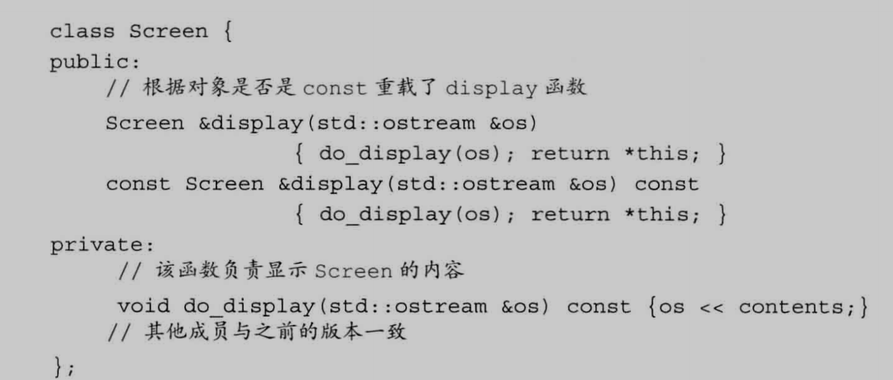


-   **==重点!!!!! 当一个成员调用另外一个成员, this指针在其中隐式传递==** 

    -   非常量成员函数可以调用常量成员函数或非常量成员函数
    -   常量成员函数因为指向常量的指针不能转换成指向非常量的指针, 所以不能调用非常量成员函数

    ```C++
    // 伪代码
    class xx{
        void get_one(xx *const this;) { get_two(this); get_three(this); }	// 正确
       	void get_two(const xx * const this) const { get_three(this); }		// 错误
    	void get_three(xx *const this) {}
    };
    ```

    >   因为编译器先编译成员的声明, 所以使用的时候无需在意定义的顺序
    >
    >   就这条结论来说, 常量成员函数时不能调用非常量成员函数的, 因为this在其中隐式传递, 而非常量指针可以转换成常量指针, 常量指针不能转换成非常量指针

    

-   **对象是否是常量决定了调用常量版本或非常量版本**


### 类类型

1.   类名不同, 即使成员一样, 也不是同一个类型

2.   可以把类名作为类型名使用, 从而指向类类型

3.   还可以把类名跟在关键字class或struct后面

     ```C++
     Sales_data item1;
     class Sales_data item1;
     ```

4.   可以仅仅声明类:

     ```C++
     class Screen;
     ```

     1.   这种叫做**前向声明**

     2.   类在声明之后定义之前是一个**不完全类型**, 知道是类, 但是不知道有什么成员

     3.   ==**可以定义指向不完全类型的指针或引用, 也可以声明(不能定义)以不完全类型作为参数或者返回类型的函数**==**

          ```C++
          class Link_Screen{
              Screen window;
              Link_screen *next;
              Link_screen *prev;
          };
          ```

          >   ==**因为不完全类型不知道有什么成员, 所以不能在类内部定义该类类型的对象**==
          
          


### 友元再探

1.   可以把函数定为友元, 也可以把其他类定为友元

2.   **==友元函数能定义在类的内部, 是隐式内联的==**
3.   **==如果一个类指定了友元类, 友元类的成员函数可以访问此类包括非公有成员在内的所有成员==**
4.   友元关系不存在传递性, 类的友元的友元不是该类的友元


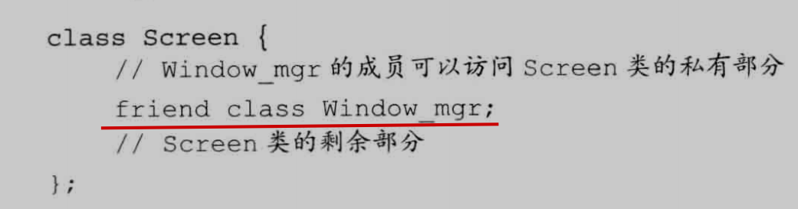


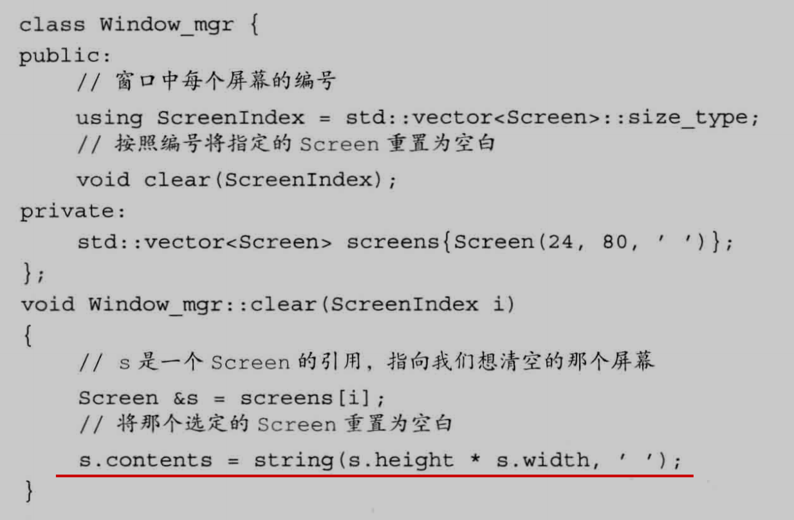


>   类体内不能使用直接初始化, 只能使用花括号初始值列表或者 = 号初始化
>
>   上面红线是用的 = 号初始化


5.   **==当把一个成员函数声明成友元, 必须明确指出该成员函数属于哪个类==**


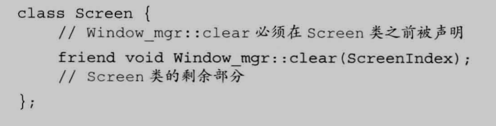


6.   要想令某个成员函数作为友元, 必须组织程序的结构以满足声明和定义的彼此依赖关系
     -   总的来说就是==**先声明, 后定义**==
     -   clear要使用Screen, 所以先声明clear, 然后使用Screen成员的声明之前要声明Screen
     -   因为要的是用, 所以Screen定义, 让clear用, 把clear声明成友元
     -   最后定义clear, 它才能使用Screen的成员

>   如果两个类之间, 在函数或数据成员都要互相使用对方的对象, 应该怎么做?


7.   **如果一个类想把一组重载函数声明成友元, 必须分别声明:**


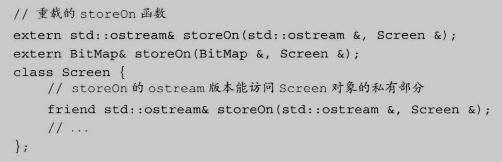


8.   ==**类和它的成员函数的声明不是必须在他们的友元声明之前**==, 友元声明仅仅指定了友元能否访问非公有成员, 没有让这个函数为整个程序所知
9.   **==在类的内部定义友元函数, 也必须在类的外部提供相应的声明使得函数可见==**


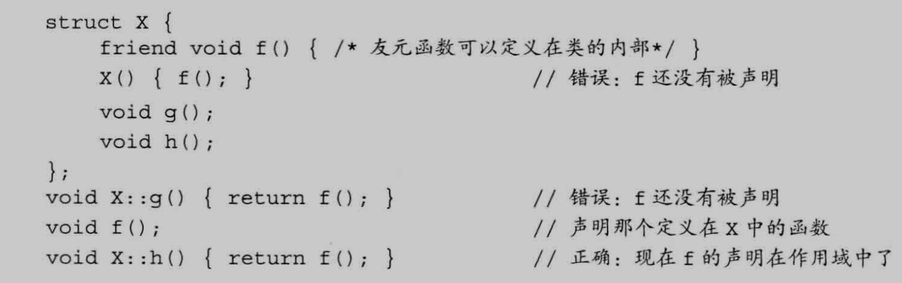


# 类的作用域


1.   类的作用域外, 普通数据和函数成员只能由对象, 引用, 或指针使用成员访问运算符访问

2.   ==**对于类型名则使用作用域运算符访问**==


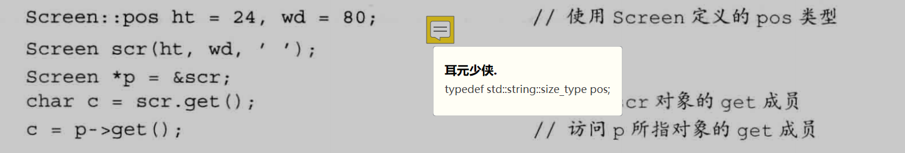


3.   **类外部定义成员函数或构造函数必须提供类名和函数名**

4.   ==一旦遇到类名, 定义的剩余部就在类的作用域内了, **剩余部分包括参数列表和函数体**==


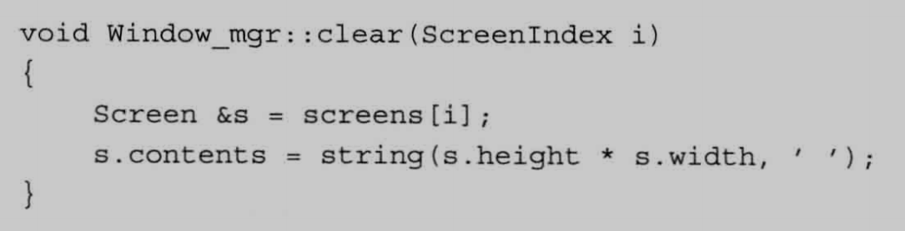


5.   ==**如果返回类型是某个类里面的类型名, 则返回类型必须指明它是哪个类的成员**==


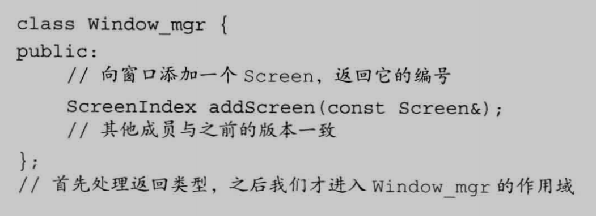

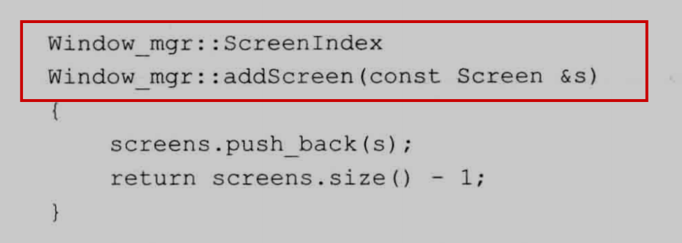


### 名字查找和类的作用域


名字查找(寻找与名字最匹配的声明的过程):

-   在名字所在的块中查找其声明语句, 只考虑名字使用之前的声明
-   如果没找到, 继续查找外层作用域
-   如果最终没找到, 程序报错


类的定义分两步处理:

-   首先编译成员的声明
-   直到类全部可见后才编译函数体

**==因为成员函数体直到整个类可见后才会被处理, 所以能使用类中定义的任何名字==**

-   例如:  1函数定义在2函数之前, 也能直接使用2函数


**==声明中使用的名字, 包括返回类型和参数列表使用的名字, 都必须在使用前确保可见==**


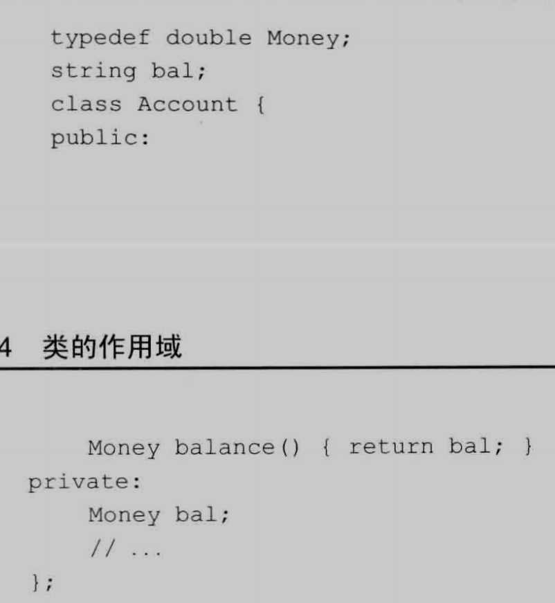

>   因为使用的时候查找其声明语句, 而编译的时候先编译类的成员的声明, 使用的时候先类内查找, 查找到了声明为Money类型的bal, 所以返回的是Meoey类型的bal


==**如果成员使用了外层作用域中的某个名字, 并且该名字代表一种类型, 则类不能在之后重新定义该名字**==

所以类型名的定义通常在类的开始处


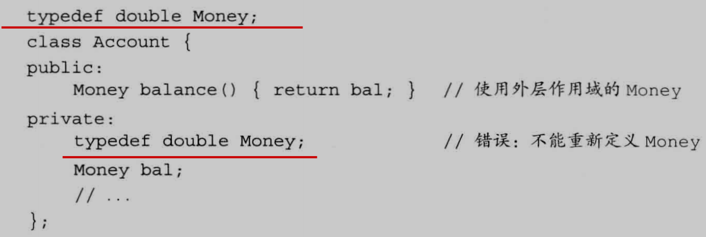


成员函数中使用的名字按照如下方式解析:

-   在成员函数体内查找该名字的声明, 只考虑函数使用之前出现的声明
-   如果在成员函数内没找到, 在类内继续查找, 这时类的所有成员都被考虑
-   如果类内也没找到该名字的声明, 在成员函数定义之前的作用域内继续查找

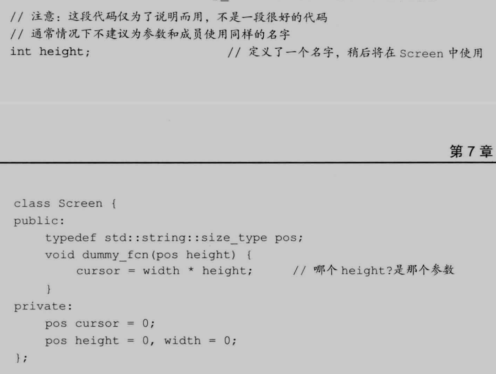


笼统的说, 其实就是**==就近原则==**


==**绕开上面查找规则, 将代码变为:**==


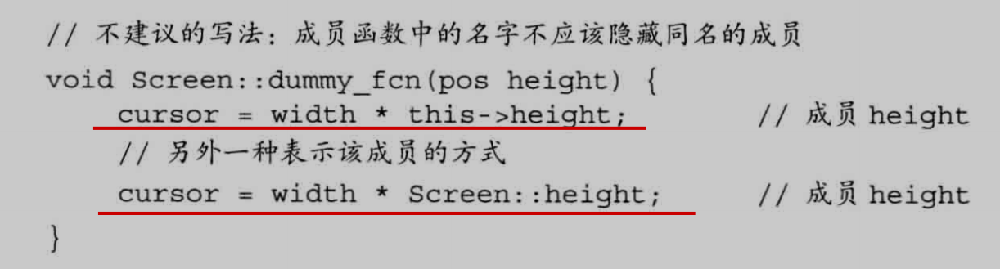


>   最好的方式是给参数起另外的名字


**如果需要外层作用域的名字, 就显式使用作用域运算符:**


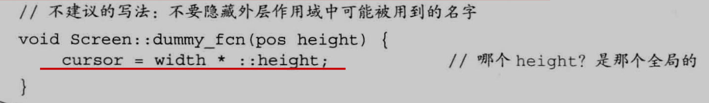


**==成员函数名字查找第三步要考虑类定义之前的全局作用域, 还要考虑函数定义之前的全局作用域的中的声明==**


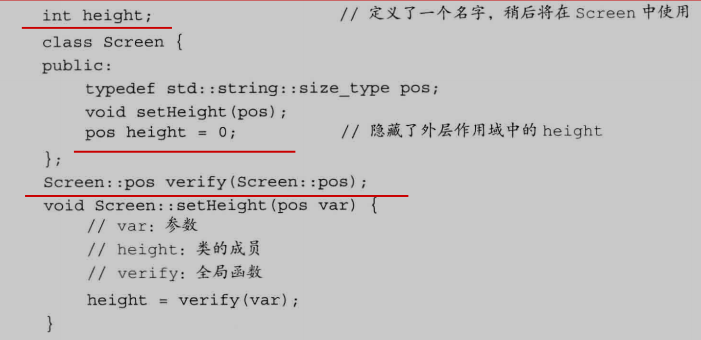


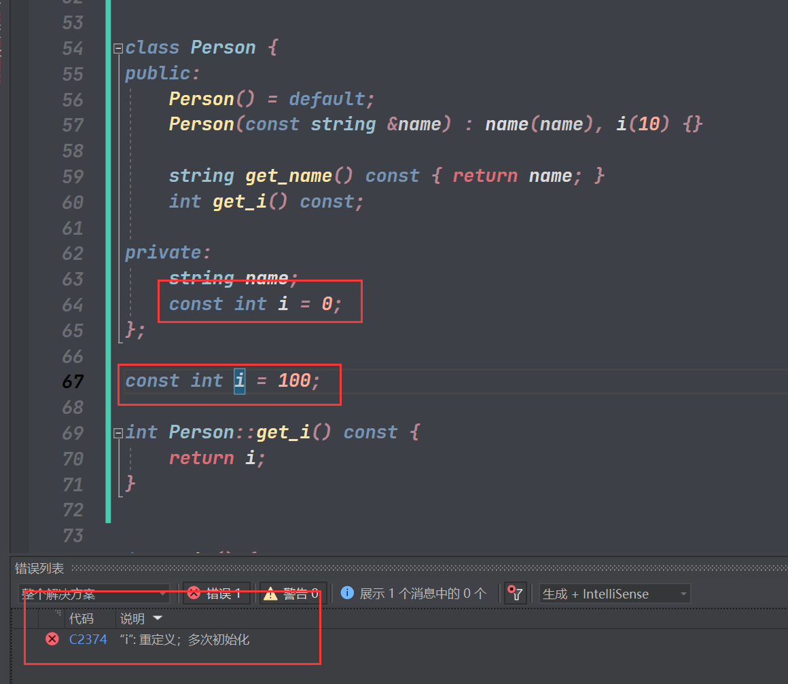

>   因为从Person::开始, 剩余部分就在Person作用域内了, 这时候有两个i都能用, 所以就是重定义了


# 构造函数再探


1.   应该在定义变量时就进行初始化, 而非先定义, 再赋值

2.   **如果没有早构造函数初始值列表中显式初始化成员, 则该成员在构造函数体之前执行默认初始化**

     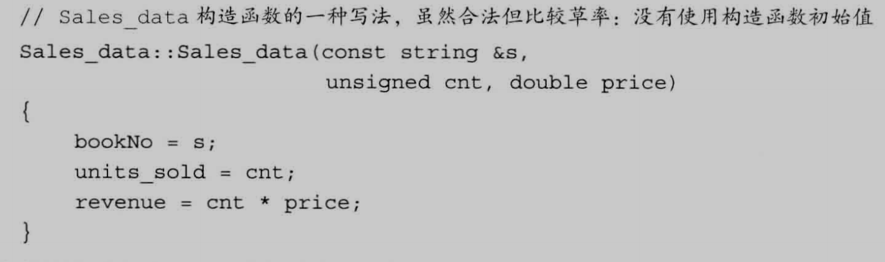


3.   ==**如果成员是const,  引用,  或者属于某种未提供默认构造函数的类类型, 必须通过构造函数初始值列表为这些成员提供初值**==

     -   建议习惯使用构造函数初始值列表

     

     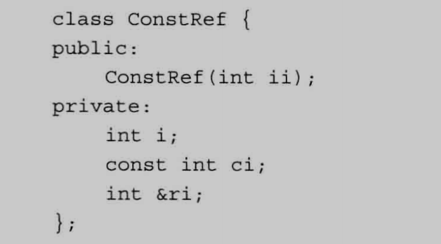

     

     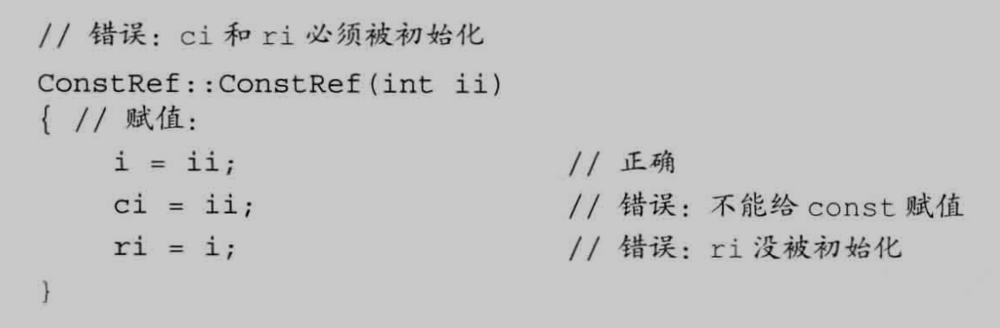

     


#### 成员初始化顺序

成员的初始化顺序于类定义中的出现顺序一致, 第一个成员被初始化, 然后第二个, 以此类推

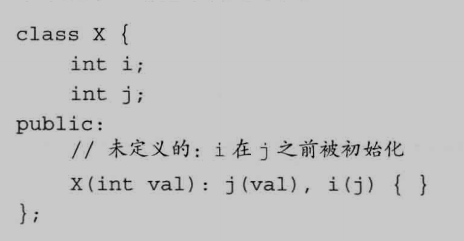


>   令构造函数初始值的顺序和成员声明顺序一致


### 默认实参和构造函数


==**如果一个构造函数为所有参数都提供了默认实参, 则它实际上也定义了默认构造函数**==


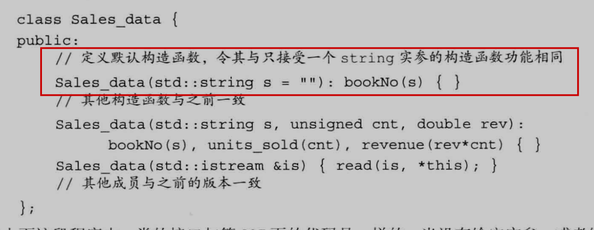


**==类的某些数据成员缺少默认构造函数==**

==如果定义了其他构造函数, 也手动提供一个默认构造函数==

定义了其他构造函数, 那么这个类就没有默认构造函数了, 要手动定义


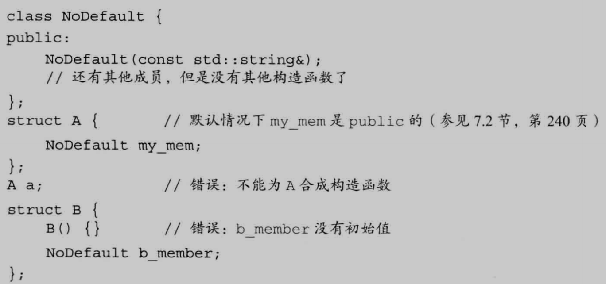


#### 使用默认构造函数


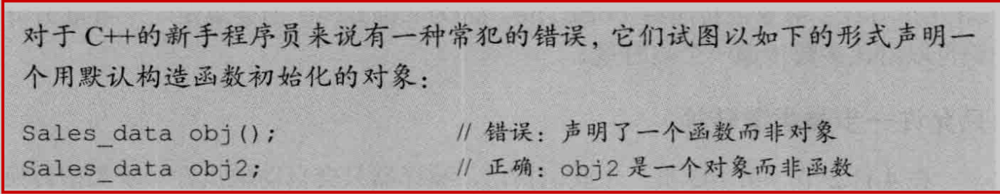


### 委托构造函数


==一个委托构造函数使用它所属的类的其他构造函数执行它自己的初始化过程==


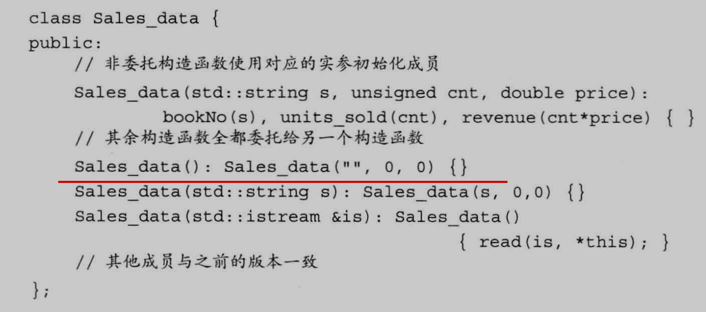


==**当一个构造函数委托给另一个构造函数, 受委托的构造函数的初始值列表和函数体被依次执行, 执行完才交还控制权给委托者的函数体**==


## 隐式的类类型转换(含有关键字explicit)


==如果构造函数只接受一个实参, 则它实际上定义了转换为此类类型的隐式转换机制, 叫做**转换构造函数**==

-   隐式的用该实参来调用转换构造函数构造一个临时的类类型对象
-   explicit关键字作用域构造函数, 该构造函数只能显式调用, 不能隐式调用


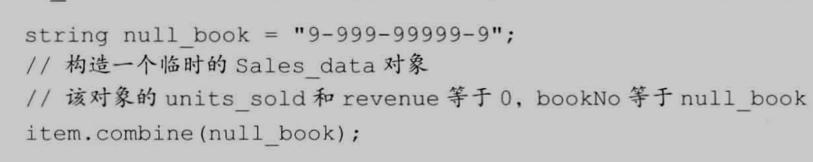


>   item是Sales_data类型的对象, 有个构造函数只接受一个string
>
>   ==**null_book被用来构造一个临时Sales_data对象, 然后作为实参传递给combine**==, 简单说就是string转换成了Sales_data
>
>   如果没有加explicit, 甚至可以这样做:
>
>   ```C++
>   string s = "da shuai bi";
>   Sales_data item = s;		// 拷贝初始化, 先用s创建一个临时的Sales_data对象, 然后拷贝给item, 之前说过的: 如果 = 号左右两边类型不同, 则 = 号右边的类型转换成 = 号左边的类型
>   ```
>
>   .
>
>   .
>
>   例子:
>
>   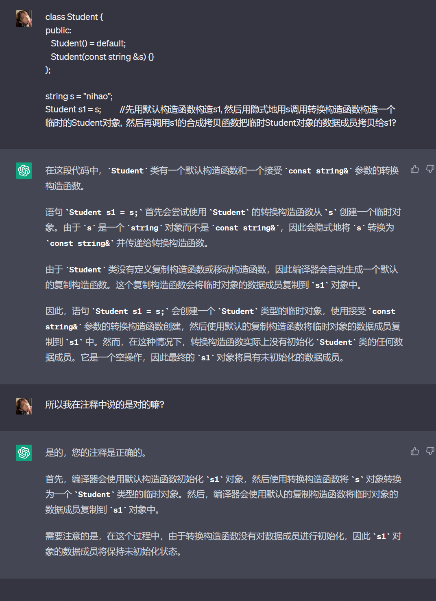


==**因为combine的参数是常量引用, 所以可以给参数传递一个临时量**==	


==编译器只允许一步类类型转换==

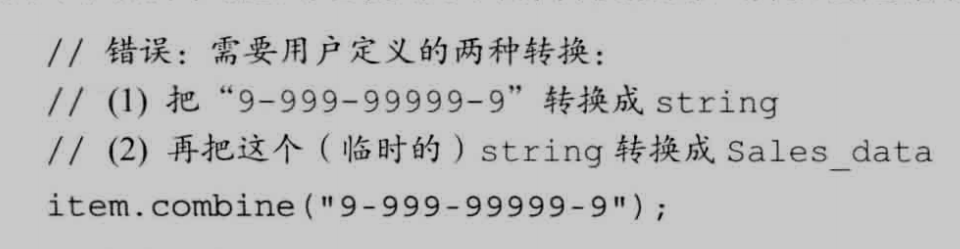

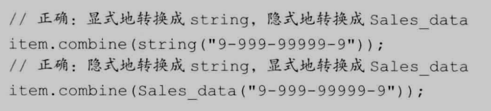


==**因为这种方式会用给定的值创建一个临时量, 用完就会丢弃的对象, 所以可能会有些东西是不想要的**==

-   临时对象在创建语句执行完毕之后立即销毁
-   返回值的内容:但并不是所有返回值都会创建临时变量，只有当没有将返回值赋值给其它变量时，临时变量才会创建。这种临时变量的生命周期很短，当表达式完成后，它就会被销毁了。

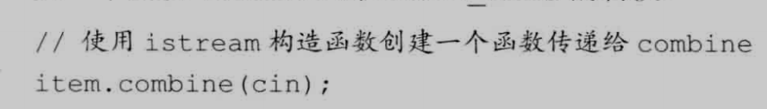

>   **用cin调用Sales_data的构造函数构造一个临时对象, 然后把值加到item中, 初始化完成随后就丢弃**


==在要求隐式转换的程序上下文, 通过将构造函数声明为**explicit**加以阻止:==

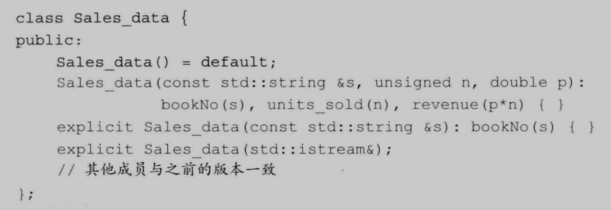


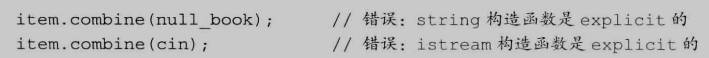

>   这里的并没有用实参构造一个临时量, 而是直接传递给了对应的构造函数的形参


1.   关键字explicit只对一个实参的构造函数有效
2.   **==只能在类内声明构造函数时使用explicit关键字, 在类外部定义不应重复==**

3.   ==**explicit构造函数只能用于直接初始化**==(拷贝形式的初始化会产生隐式转换, 即: 把 = 号右侧的对象先转换为 = 号左侧的对象然后再把右边的对象赋值给左边对象)

==发生隐式转换的一种情况是当我们执行拷贝形式的初始化 ( 使用 = 会把右侧的对象转换为左侧对象的类型), 就只能使用直接初始化而不能使用explicit构造函数==

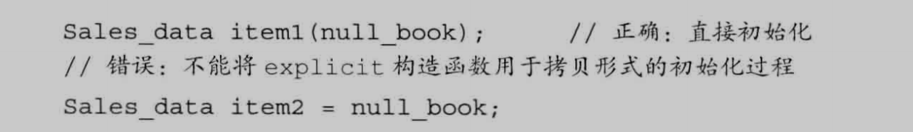

>   null_book会被用来构造一个临时的Sales_data对象, 然后临时对象被赋值给item2


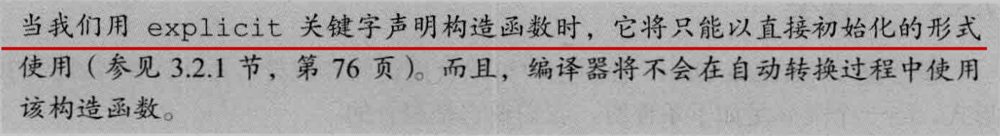


==**就算被explicit加以阻止, 但是还是能用强制转换**==

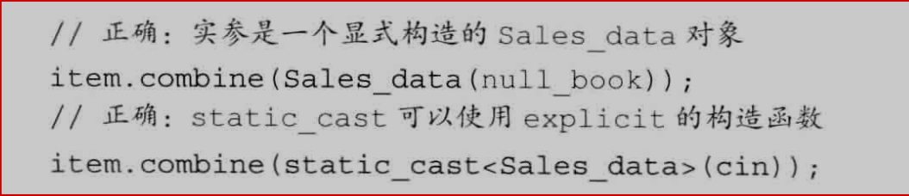


### 聚合类


当类满足以下条件, 就是聚合的

-   所有成员都是public
-   没有定义任何构造函数
-   没有类内初始值
-   没有基类, 没有virtual函数


例子:

```C++
struct Data {
    int ival;
    string s;
};
```


==可以提供一个花括号括起来的成员初始值列表初始化聚合类的数据成员==

```C++
Data val1 = {0, "Annd"};
```

>   初始值的顺序必须和声明的一致


如果初始值列表中的元素个数少于类的成员数量, 则靠后的成员被值初始化

初始值列表的元素个数不能超过类的成员数量


### 字面值常量类

-   除了算术类型, 引用和指针外, 某些类也是字面值类型
-   字面值类型的类可能含有constexpr函数

-   **数据成员都是字面值类型的==聚合类是字面值常量类==**
-   满足以下要求也是字面值常量类
    -   数据成员都必须是字面值类型
    -   类必须至少包含一个constexpr构造函数
    -   内置类型成员的类内初始值必须是一条常量表达式
    -   成员是某种类类型, 初始值必须使用成员自己的constexpr构造函数
    -   类必须使用析构函数的默认定义, 该成员负责销毁类的对象


构造函数不能是const的, 但是字面值常量类的构造函数可以是constexpr

-   constexpr构造函数可以声明成 = default或者删除函数的形式
-   constexpr构造函数体一般是空的
-   constexpr构造函数必须初始化所有数据成员, 初始值或者使用constexpr构造函数或者是一条常量表达式
-   constexpr构造函数用于生成constexpr对象以及constexpr函数的参数或返回类型


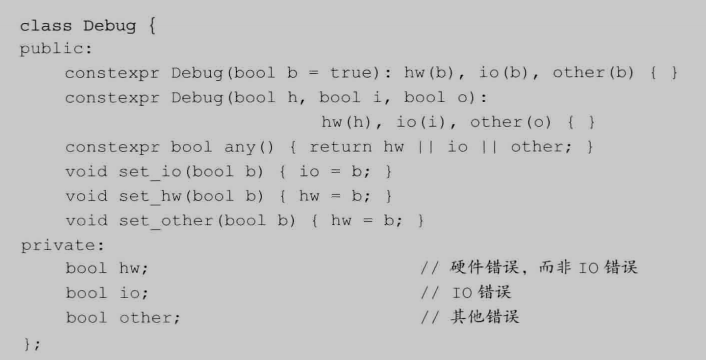


# 类的静态成员


在成员的声明之前加上关键字**static**使得其与类关联在一起


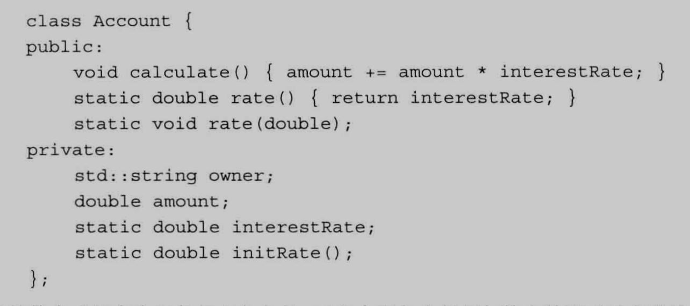

>   ==可以把static成员理解为共同特征==


1.   类的静态成员存在于任何对象之外, 对象中不包含任何与静态数据成员有关的数据

2.   ==静态成员函数不和任何对象绑定在一起, 不包含this指针==

3.   ==静态成员函数不能声明成const的==

4.   不能在static函数体内使用this

     1.   所以static函数体内不能直接使用数据成员, 但是能使用static成员
     2.   也不能解引用this等操作

5.   **使用作用域运算符直接访问静态成员:**

     ```C++
     double r;
     r = Account::rate();
     ```

     

6.   **仍然可以用类的对象, 引用或指针来访问静态成员:**

     ```C++
     Account ac1;
     Account *ac2 = &ac1;
     r = ac1.rate();
     r = ac2->rate();
     ```


7.   **成员函数不用通过作用域运算符就能直接使用静态成员:**

     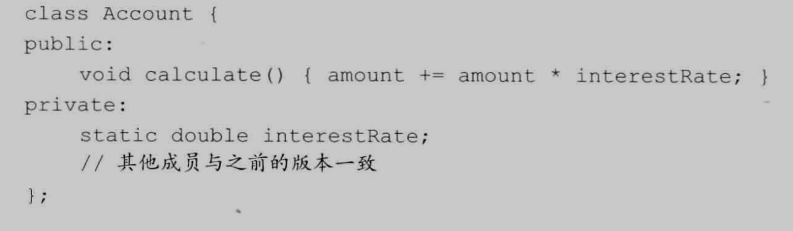


8.   可以在类的内部或外部定义静态成员函数

9.   **==类外部定义成原函数不能重复static关键字, static只能出现在类内部的声明语句==**

     ```C++
     void Account::rate(double newRate) {
         interstRate = newRate;
     }
     ```


10.   ==**一般不在类的内部初始化静态成员, 必须在类的外部定义和初始化每个静态成员**==

      ```C++
      double Account::interstRate = initRate();
      ```

11.   静态数据成员定义在所有函数之外, 因此被定义, 就一直存在于程序的整个生命周期中

12.   **要想确保对象只定义一次, 最好的办法是把静态数据成员和其他非内联函数的定义放在同一个文件中**

13.   ==**静态数据成员可以是不完全类型, 可以是它所属的类类型, 普通成员只能是所属类的指针或引用**==

      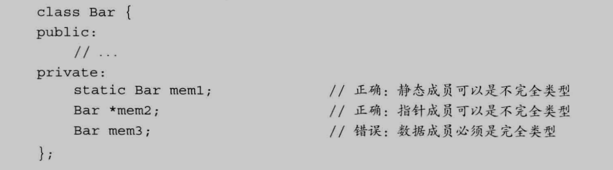


14.   **静态成员可以作为默认实参,  普通成员不行**

      1.   数据成员不能作为成员函数默认实参是因为: 对象是在构造的时候才初始化的, 即使给定了类内初始值, 类内初始值也是在构造的时候才被用来初始化数据成员的, 所以, 数据成员不能作为默认实参, 因为这时候, 数据成员并没有真正的值!
      
      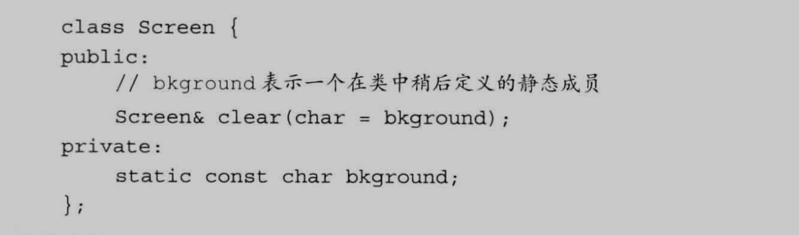


15.   **非静态成员不能作为默认实参, 因为它的值本身就属于对象的一部分**
      1.   非静态成员在调用对象的构造函数的时候才真正有值, 所以在真正构造完一个对象之前非静态成员是没有值的


通常类的静态成员不在类的内部初始化, 但是

1.   ==可以为静态成员提供const整数类型的类内初始值, 静态成员必须是字面值常量类型的constexpr==
2.   初始值必须是常量表达式
3.   如果某个静态成员的应用场景仅限于编译器可以替换它的值的情况, 则一个初始化的const或constexpr static不需要分别定义
4.   如果要用于值不能替换的场景, 则该成员必须有一条定义语句, 之后就能替换了
     1.   在类内定义, 则值只能在类内替换, 在类外定义, 则类外用到该值的也可以被替换为该值

5.   ==常量静态数据成员在类内部被初始化, 也应该在类的外部定义一下该成员, 记住不能重复static关键字==


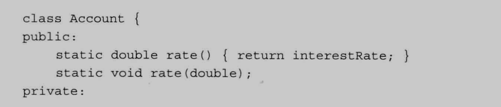

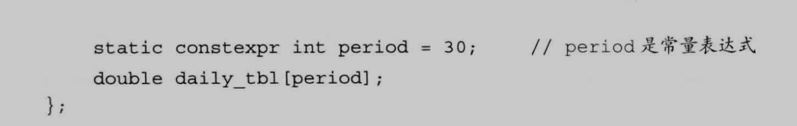

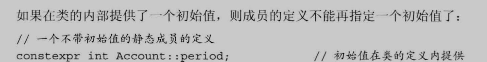


