[TOC]


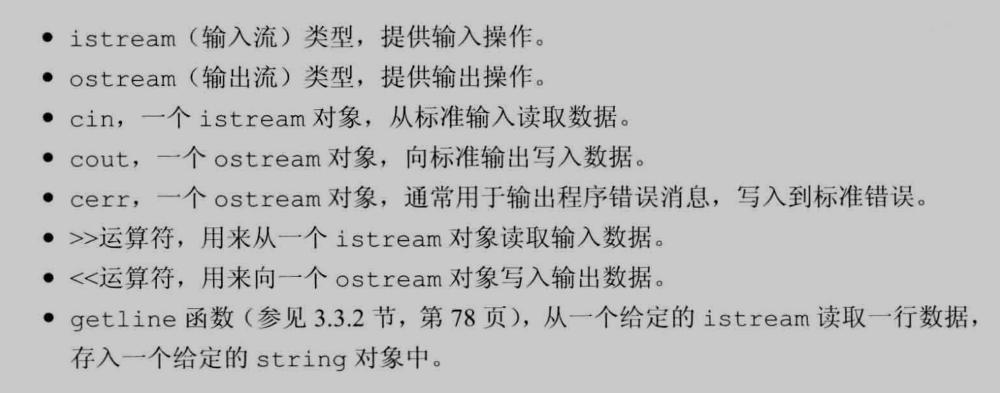


# IO 类


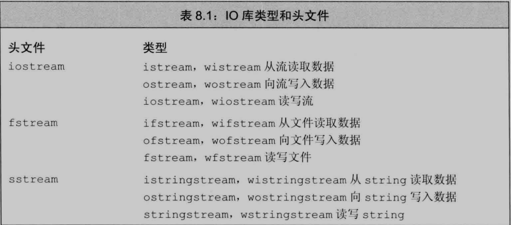

>   宽字符版本的类型和函数的名字以一个w开始, wcin, wcout分别对应cin, cout的宽字符版对象


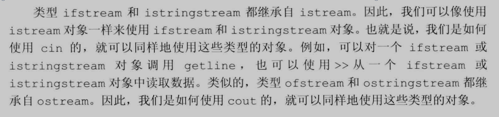


**继承机制**: 我们可以声明一个特定的类继承另一个类, 通常可以将一个派生类(继承类)对象当做其基类(所继承的类)对象来使用

>   把别人女儿当成她妈妈用


#### IO对象不能拷贝或赋值


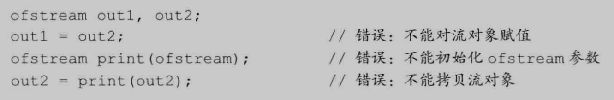


1.   不能将形参或返回类型设置为流类型
2.   进行IO操作的函数以引用方式传递和返回流
3.   传递和返回的引用不能是const的


#### 条件状态和流的操作

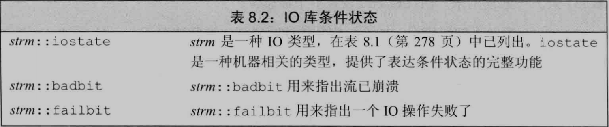

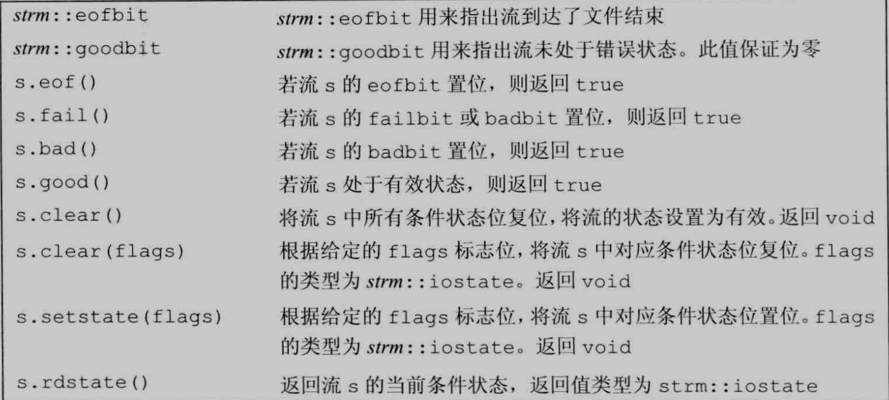


```C++
int ival;
cin >> ival;	// 输入"bool"会导致cin进入错误状态
```


1.   一个流一旦发生错误, 其上后续的IO操作都会失败, 无错状态才能读写数据

2.   确定流的状态, 把它当条件用

     ```C++
     while(cin >> word)
     ```

     

1.   **badbit**: 系统级错误, 一旦被置位, 流就无法使用
2.   **failbit**: 如果被置位, 如期望读取数值缺读出字符等错误, 是可以修正的, 流还能用
3.   **eofbit**: 如果到达文件末尾, eofbit和failbit都会被置位
4.   **goodbit** : 值为0, 表示流未发生错误, 如果前面三个任意一个被置位, 则检测流的条件会失败


标准库定义了一组函数来查询这些标志位的状态, 均在上面图片中

实际上, 将流当做条件使用的代码等价于!fial()


clear不接受参数的版本清除(复位)所有错误标志位, 执行clear()后, 调用good会返回true

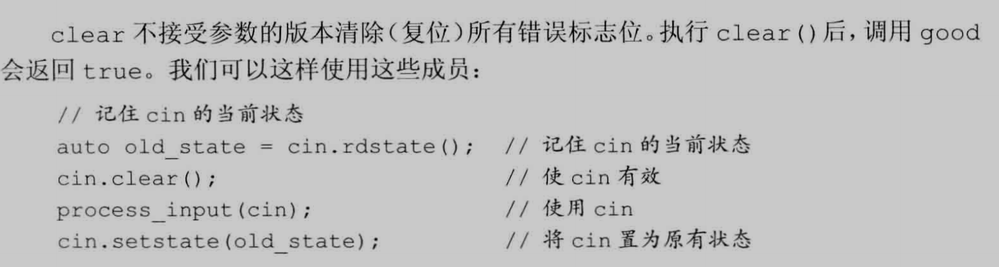


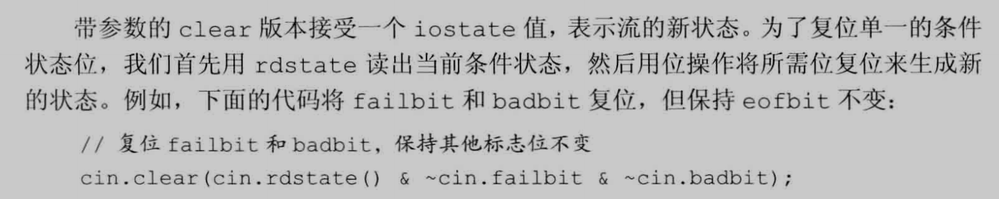

>   复位, 就是全部变成0, 举例:
>
>   cin.rdstate() =  111
>
>   cin.failbit    =    001 求反得到 110
>
>   cin.badbit   =  010  求反得到 101
>
>   最后               =  100


**复位例子:**

0100 badbit

0010 failbit 求反得到: 1101

-   >   0100
    >
    >      &
    >
    >   1101
    >
    >   结果 =  0100

0001 eofbit 求反得到: 1110

-   >   0100
    >
    >   ​	&
    >
    >   1110
    >
    >   结果 = 0100

0000 goodbit

0000 rdstate


**==输入Ctrl + Z之后流的状态goodbit会被置位, 需要用clear清空状态==**


作业:

```C++
istream& get_is(istream& is) {
    int v = 0;
    while (is >> v, !is.eof()) {				// 检查流是否到文件末尾, 没到末尾返回false
        if (is.bad()) {							// 检查流是否崩溃, 系统级错误, 不可恢复
            throw runtime_error("IO流错误");
        }
        if (is.fail()) {						// 检查期望输入的是否有误, 可恢复错误
            cerr << "数据错误, 请重试" << endl;
            is.clear();                         // 让流有效
            is.ignore(100, '\n');
            continue;
        }
        cout << v << endl;
    }
    return is;
}
```


#### 管理输出缓冲

每个输出流都管理一个缓冲区, 用来保存程序读写的数据

```C++
os << "NI TM DE";
```

>   可能会立即打印, 也有可能保存在缓冲区, 等满了或者强制刷新缓冲区再打印


导致缓冲刷新(数据真正写入到设备或文件)的**一些**原因:

1.   程序正常结束
2.   缓冲区满
3.   用操纵符endl显式刷新缓冲区
4.   每个输出操作后, 用操纵符**unitbuf**设置流的内部状态, 清空缓冲区, 默认cerr是设置unitbuf的, 所以cerr的内容是立即刷新
5.   一个输入流被关联到一个输出流时, 任何试图从输入流读取数据的操作都会先刷新关联的输出流
     1.   例如: 默认情况下cin和cerr关联到cout
     2.   因此读cin或写cerr都会导致cout的缓冲区被刷新


**如果程序崩溃, 输出缓冲区不会被刷新**\


#### 操纵符刷新缓冲区

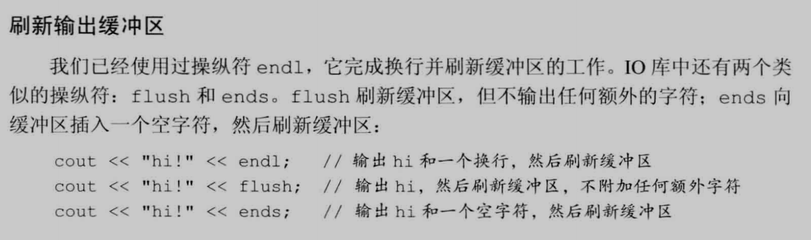


#### unitbuf操纵符刷新缓冲区

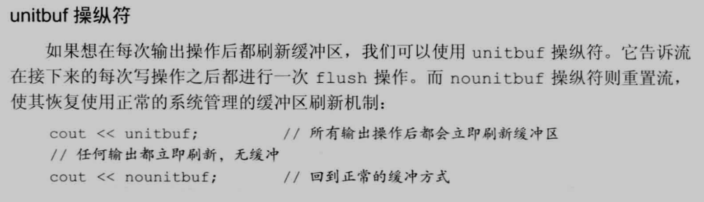


#### 关联输入和输出流

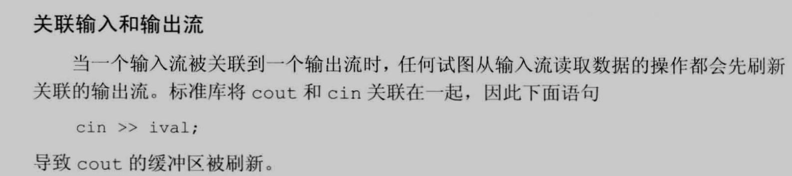


**tie**

第一版本不带参数, 如果本对象当前关联到一个输出流, 则返回的就是指向这个流的指针, 未关联到流, 返回空指针

第二版本接受一个指向ostream的指针, 将自己关联到ostream, 即: x.tie(&o)将流x关联到输出流o

每个流最多关联到一个流, 多个流可以同时关联到同一个ostream


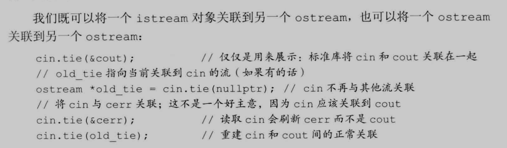


# 文件输入输出


**==头文件 :  fstream==**


**ifstream:** 	从一个给定文件读取数据

**ofstream:**	向一个给定文件写入数据

**fstream:**	可以读写给定文件


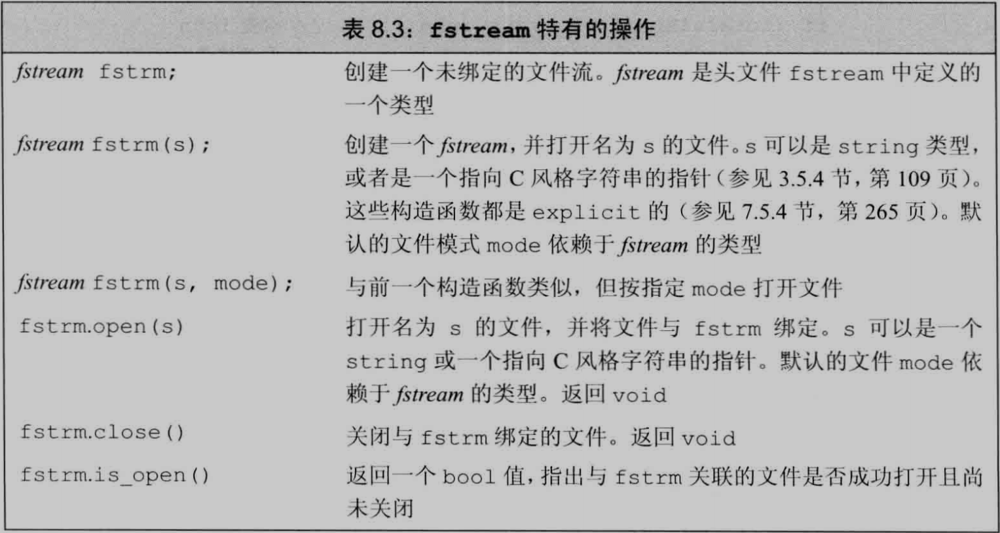


#### 使用文件流对象

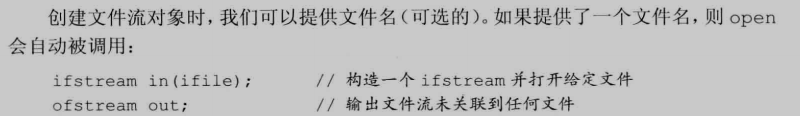


因为可以用继承类代替被继承类, 所以iostream类型引用或指针参数的函数可以用用对应的fstream或sstream类型来调用

>   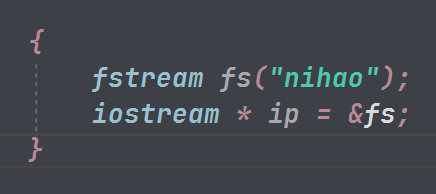


如果定义了一个文件流对象, 可以随后调用open将它和文件关联起来;

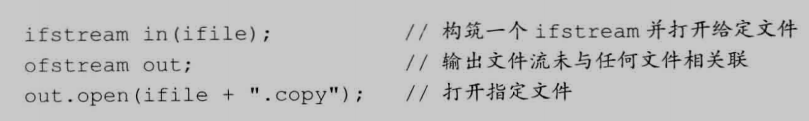

如果调用open失败, failbit会被置位, 所以进行检测是好习惯:  if(out)


==**文件流用完就要关闭, 否则与对应文件一直保持关联 , 对已经打开的文件流调用open会导致failbit置位, 后续文件流操作会失败**==


如果open成功, open设置流的状态让good() 为true

>   goodbit: 值为0表示流未出现错误


#### 自动构造和析构

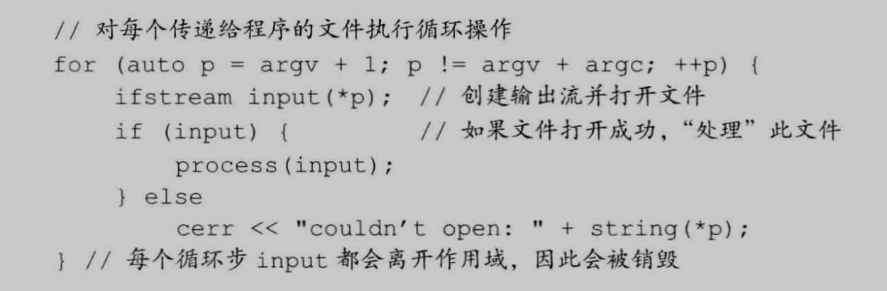

>   ==**当一个fstream对象离开其作用域(被销毁), 与之关联的文件会自动关闭(自动调用close)==**


### 文件模式

==每个流都有一个关联的**文件模式**用来指出如何使用文件==

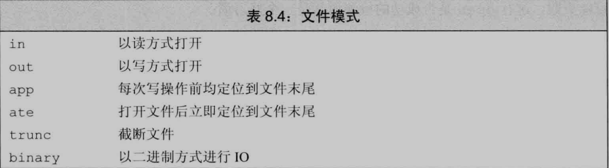


==默认情况下, 即使没有指定trunc,以out模式打开的文件也会被截断, **为了保留以out模式默认打开的文件的内容, 必须同时指定app模式, 这样数据追加就会写到文件末尾**, 否则重新打开该文件进行写入, 会覆盖之前的内容从头开始==


-   ifstream关联的文件默认以in模式打开

-   ofstream关联的文件默认以out模式打开

-   fstream关联的文件默认以in和out模式打开


**以out模式打开文件会丢弃已有数据**

**默认下, 当我们打开一个ofstream, 文件的内容会被丢弃, 阻止ofstream清空给定文件内容就要同时指定app模式或in模式**

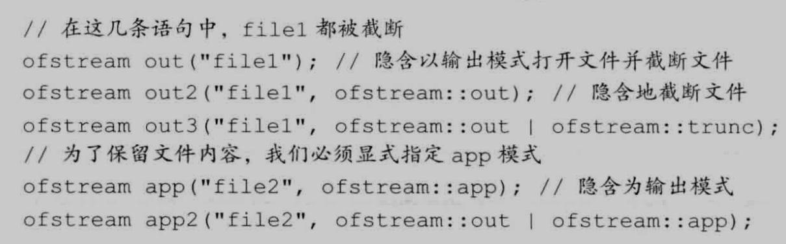


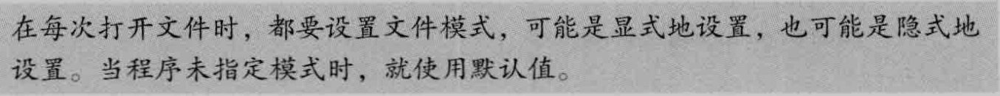


作业

```C++
void set_file(const string &file_name) {
    ofstream os(file_name + ".txt", ofstream::app);
    string str;
    cout << "输入内容:";
    while (getline(cin, str)) {
        if (os.bad()) {
            throw runtime_error("IO流错误");
        }
        if (os.fail()) {
            cerr << "文件名错误或不存在该文件, 请检查" << endl;
            os.clear();
        }
        os << str << '\n';
    }
    
    os.close();
}
```


# string流


==**头文件:  sstream**==


**istringstream:** 从string读取数据

**ostringstream:**	向string写入数据

**stringstream:**	能读写string


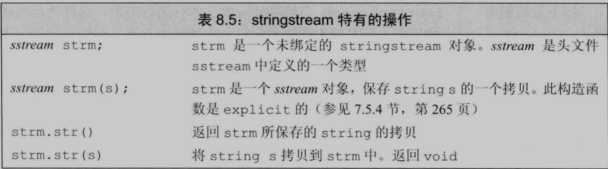


-   ==当某些工作是对整行文本进行处理, 其他工作是处理行内的单个单词, 可以用**istringstream**==
    -   可以从读入的行中按从左到右的顺序获取单个string( 空格隔开 ) 


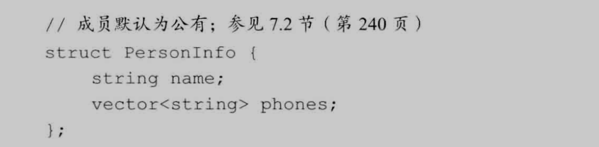

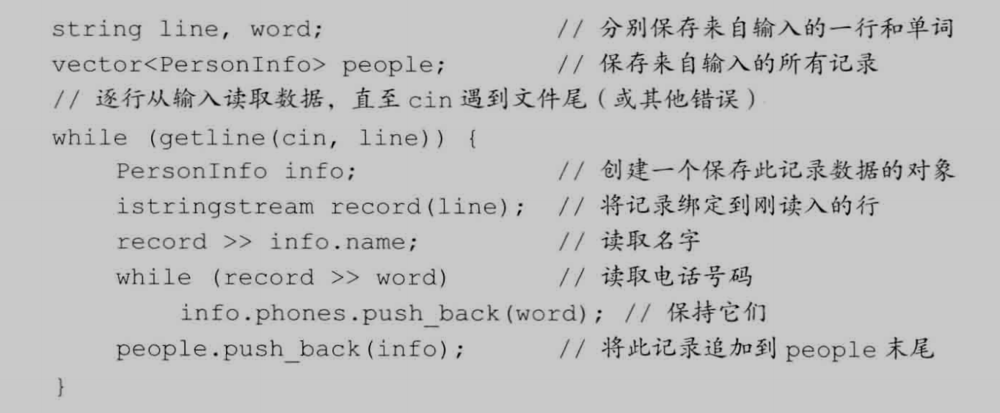


### 使用ostringstream


当我们逐步构造输出, 希望最后一起打印, ostringstream很有用

把所有正确的电话存入一个ostringstream, 然后统一输出


**什么是格式化的字符串, 什么是数的字符串?**
