[TOC]

## 顺序容器类型

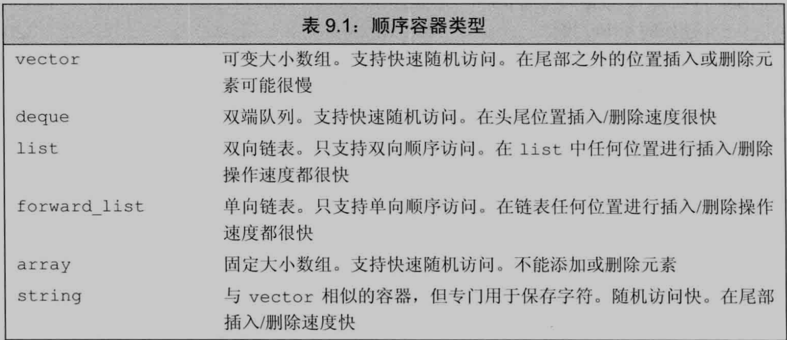

### 容器选择基本原则:

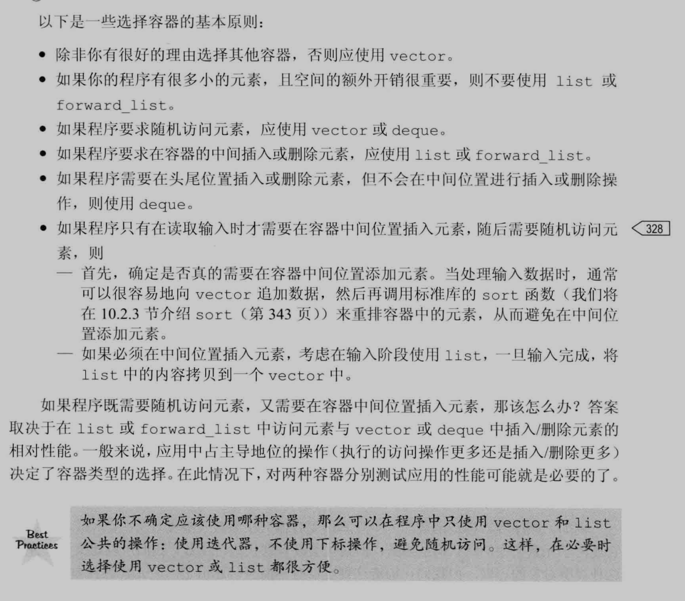

**每个容器都定义在一个头文件中, 文件名与类型名相同**

**容器都是模板类, 必须提供额外信息来生成特定的容器类型**

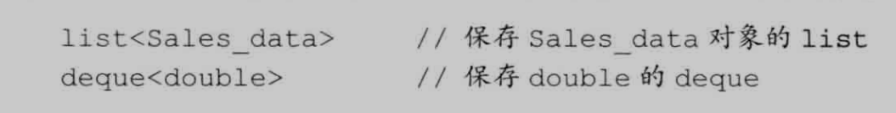

**当某些类没有默认构造函数, 必须手动初始化这些类:**

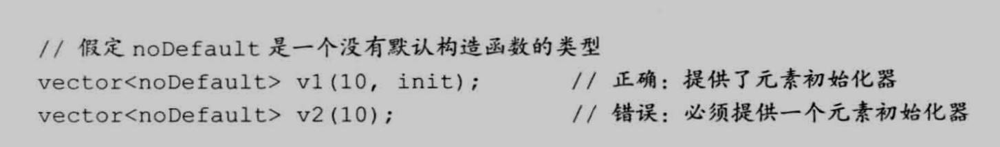

### 容器操作

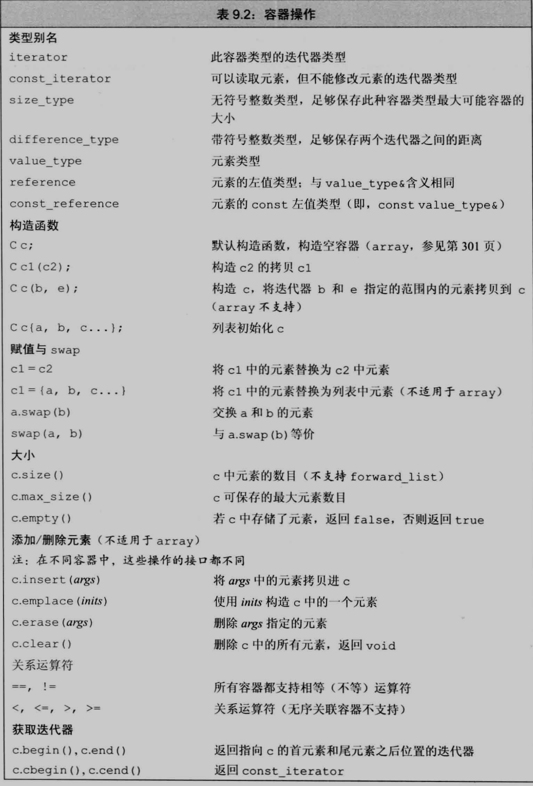

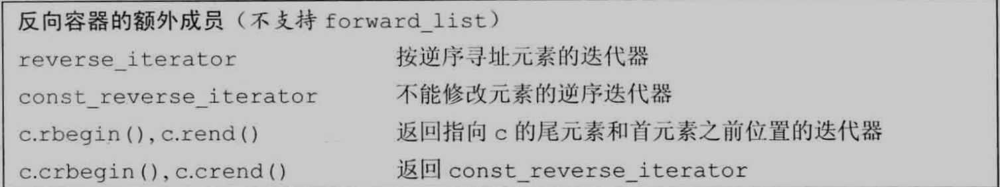

### 迭代器

**迭代器范围:**

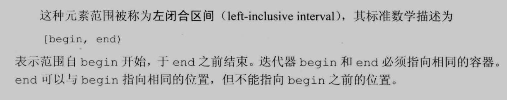

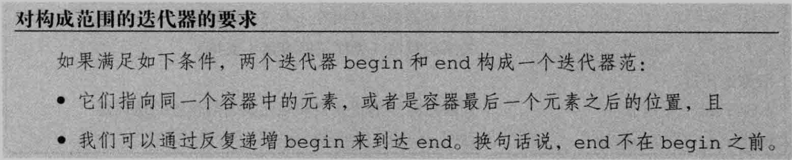

### 容器类型成员

-   反向迭代器: 对一个反向迭代器进行++操作, 会得到上一个元素

-   如果需要元素的类型, 可以使用容器的 **value_type**

-   如果需要元素类型的引用, 可以用 **reference** 或 **const_reference**

    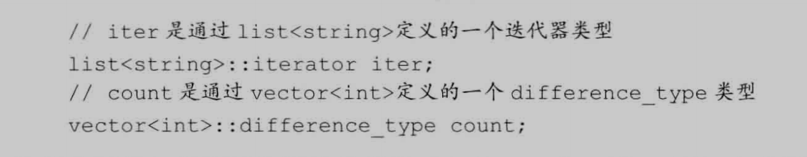

### begin 和 end 成员

-   带r的版本返回反向迭代器
-   带c开头的版本则返回const迭代器

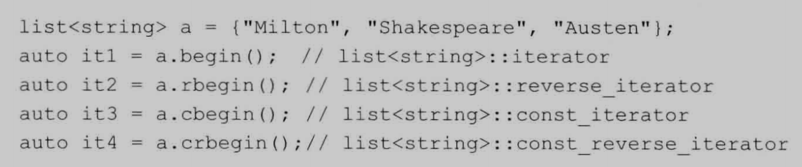

>   常量对象不能调用不是c开头的版本
>
>   不是c开头的版本根据指向的对象是否是常量返回常量版本的迭代器或非常量版本迭代器
>
>   c开头的一定返回指向常量的迭代器

==**const vector< int > v2**==

-   内容不能修改, 添加, 删除元素以及修改元素值都不允许

### 容器定义和初始化

出了array之外, 其他容器的默认构造函数都会创建一个指定类型的空容器, 都可以接受指定容器大小和元素初值的参数

**C是容器类型**

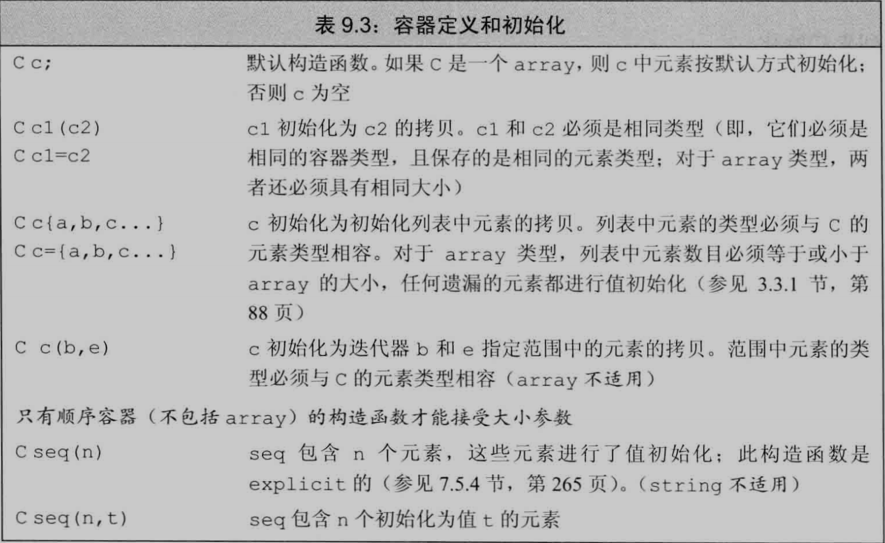

-   **创建一个容器为另一个容器的拷贝, 两个容器的类型和元素类型必须匹配**

-   **当传递迭代器参数拷贝返回, 不要求容器类型相同, 元素类型只要能转换成初始化容器的类型就行**

    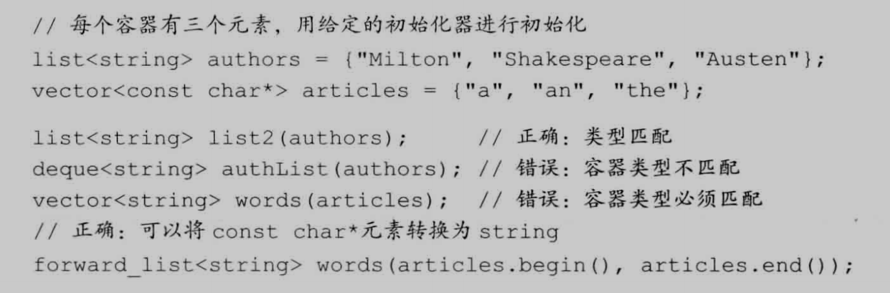

>   const char *可以替代字符串字面值, 字符串字面值不能代替const char *

**两个迭代器表示一个范围, 可以拷贝到从begin开始到end之前的元素:**

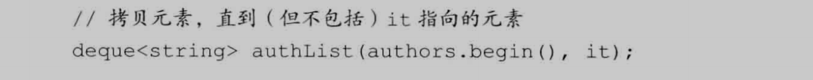

**可以对容器进行列表初始化**

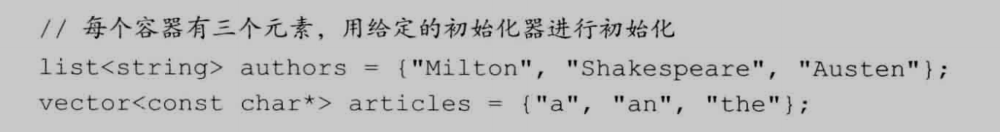

>   容器包含与初始值一样多的元素

**与顺序容器大小相关的构造函数**

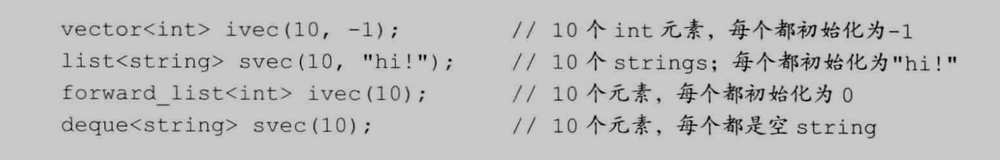

>   如果元素类型没有默认构造函数, 必须指定显式的元素初始值
>
>   关联容器不支持大小参数

### 标准库array

==**定义一个array, 指定元素类型, 还要指定元素大小, 大小也是类型的一部分:**==

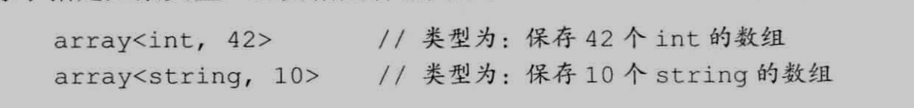

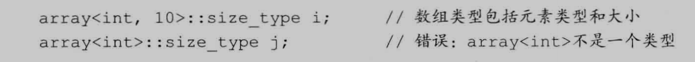

**如果元素类型是类类型, 且没有提供默认构造函数, 必须手动初始化**

==**array可以进行拷贝和对象赋值**==

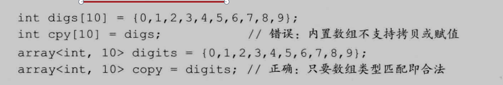

**array不允许用花括号赋值( 初始化可以 )**

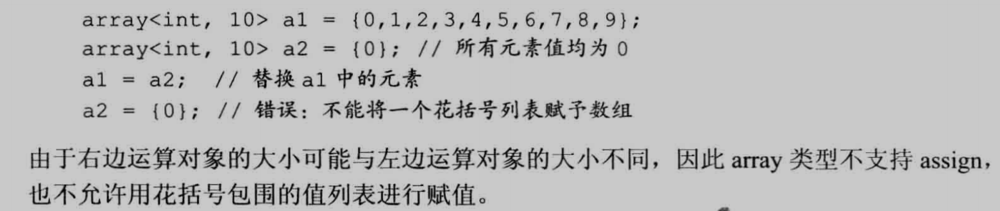

### 赋值和swap

赋值运算符将其左边容器的全部替换为右边容器中元素的拷贝:

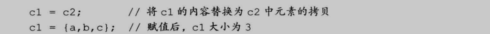

>   可能会改变大小

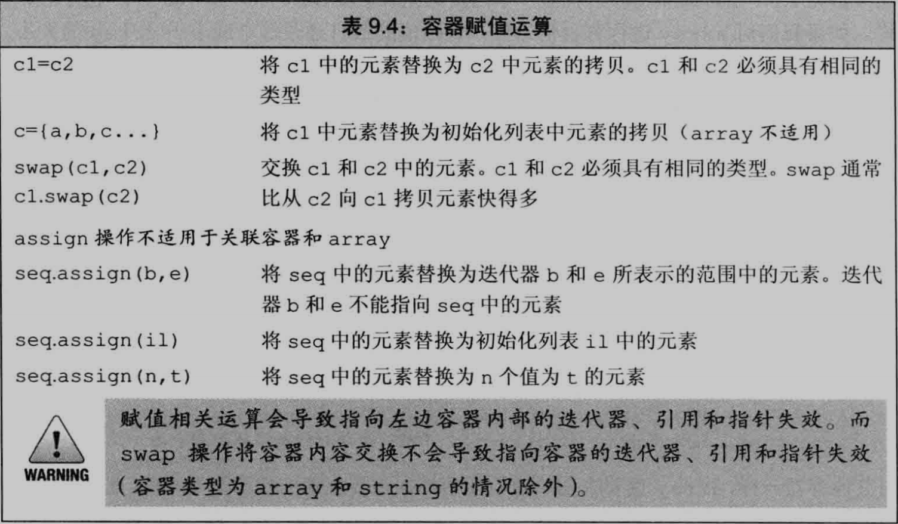

asssign操作用参数所指定的元素的拷贝替换左边容器中的所有元素:

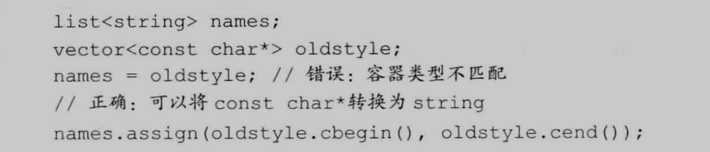

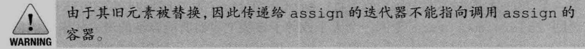

>   ** 	**

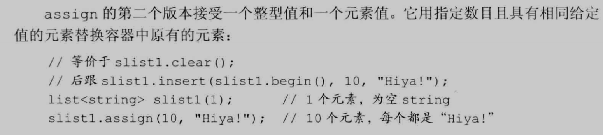

**使用swap**

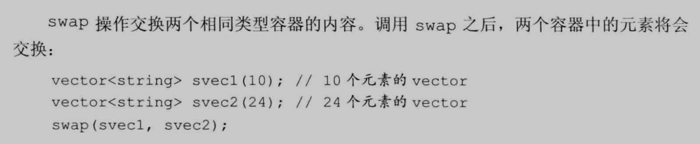

>   ==**元素本身并未交换, swap只是交换了来两个容器的内部数据结构**==
>
>   ==**元素不会移动意味着, 除了string外, 指向容器的迭代器,引用, 指针在swap操作之后都不会失效, 仍然指向swap操作之前所指向的那些元素, 但是swap之后, 这些元素在不同的容器了**==
>
>   ==对一个string调用swap会导致迭代器等失效==

### 关系运算符

-   **==关系运算符左右两边的对象必须是相同类型的容器, 并且必须保存想同类型的元素==**

-   **==比较两个容器实际上是进行元素的逐对比较**==

    

    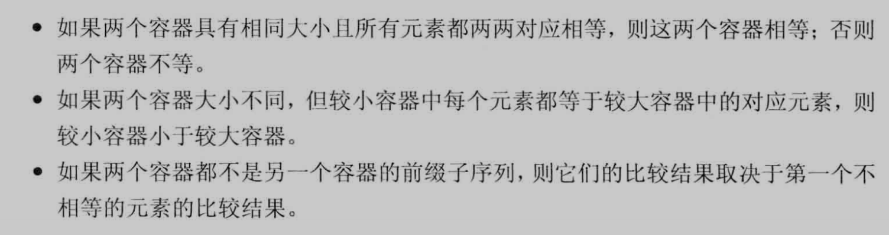

-   **==只有当其元素类型也定义了相应的比较运算符, 才能用关系运算符比较两个容器==**

    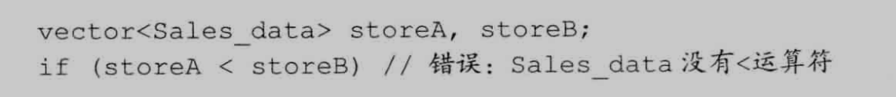

# 顺序容器操作

### 向顺序容器添加元素

array不支持增删

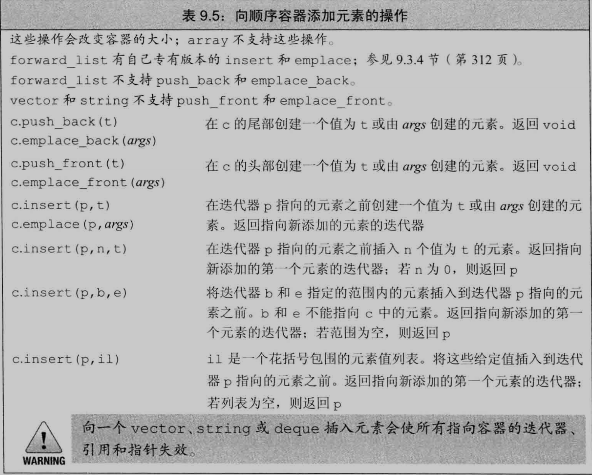

-   在vector或string的尾部之外的任何位置, 或是deque的首尾之外的任何位置添加元素都要移动元素
-   ==**向一个vector或string添加元素可能引起整个对象存储空间的重新分配, 重新分配一个对象的存储空间需要分配新的内存, 并将元素从旧的空间移动到新的空间**==

-   push_back: 将一个元素追加到一个vector的尾部
    -   对push_back的调用在container尾部创建一个新的元素, 将container的size增大1, 该元素的值为word的拷贝

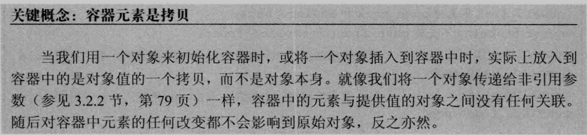

**关于insert**

-   某些容器不支持push_front, 但是可以用insert插入到头部

-   可以用花括号初始值列表

    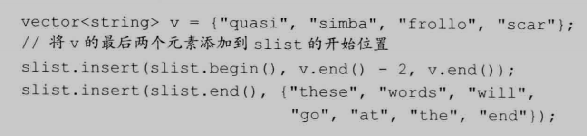

-   ==**接受元素个数或范围的insert版本返回指向第一个新加入元素的迭代器**==

-   如果范围为空, 不出入任何元素, insert操作回想第一个参数返回

**使用insert的返回值**

-   使用insert的返回值在容器中一个特定位置反复插入元素

    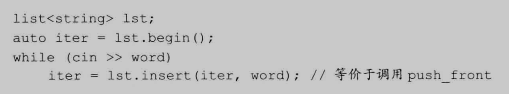

**使用emplace**

-   接受一个迭代器的emplace返回新添加的第一个元素的迭代器

-   调用emplace成员函数, 将参数传递给元素类型的构造函数, emplace成员使用这些参数在容器管理的内存空间中直接构造元素

    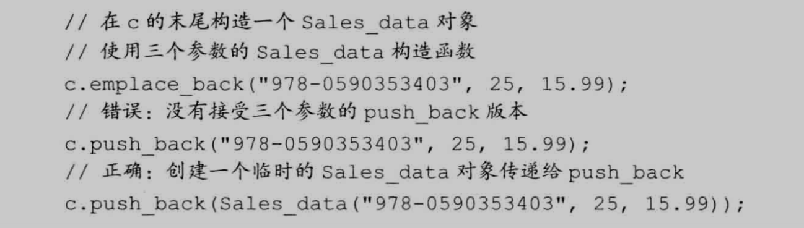

>   emplace_back会在容器管理的内存空间中直接创建对象
>
>   push_back会创建一个局部临时对象, 将其压入容器中

-   **emplace函数在容器中直接构造元素, 传递给emplace函数的参数必须于元素类型的构造函数匹配**

push_back和emplace的区别:

-   ​	emplace_back() 和 push_back() 的区别，就在于底层实现的机制不同。push_back() 向容器尾部添加元素时，首先会创建这个元素，然后再将这个元素拷贝或者移动到容器中（如果是拷贝的话，事后会自行销毁先前创建的这个元素）；而 emplace_back() 在实现时，则是直接在容器尾部创建这个元素，省去了拷贝或移动元素的过程。

### 访问元素

-   如果容器中没有元素, 访问操作的结果是未定义的

-   front和back分别返回首元素和尾元素的引用:

    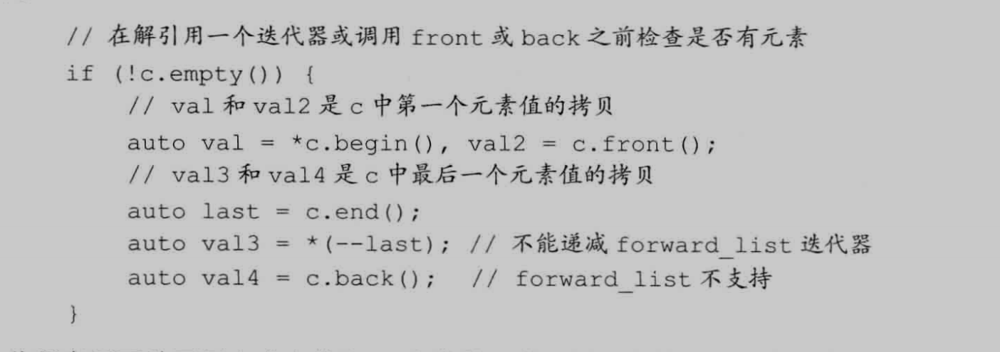

-   迭代器end指向的是容器尾元素之后的不存在元素, 为了获取尾元素, 必须首先递减此迭代器

### 在顺序容器中访问元素的操作

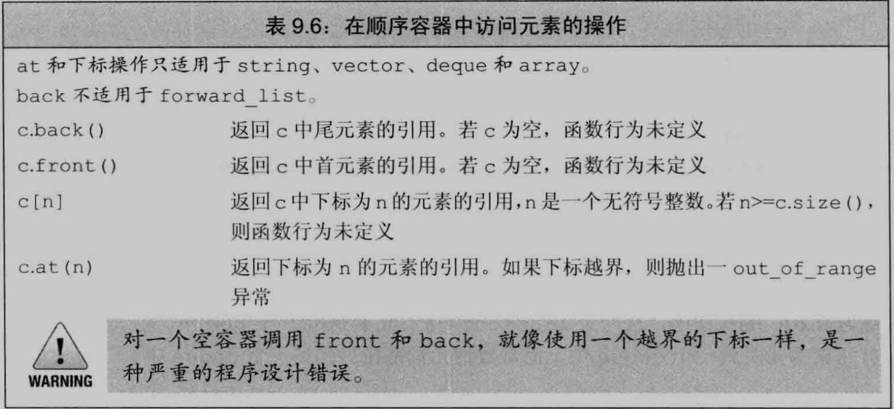

1.   访问元素的成员函数返回的都是引用, 如果是const对象, 返回const的引用, 否则返回普通引用

2.   **==使用下标必须保证合法, 可以使用at成员函数, 如果下标越界, 抛出一个out_of_range异常==**

     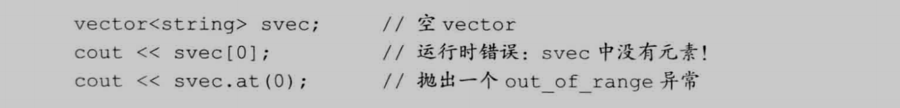

### 顺序容器的删除操作

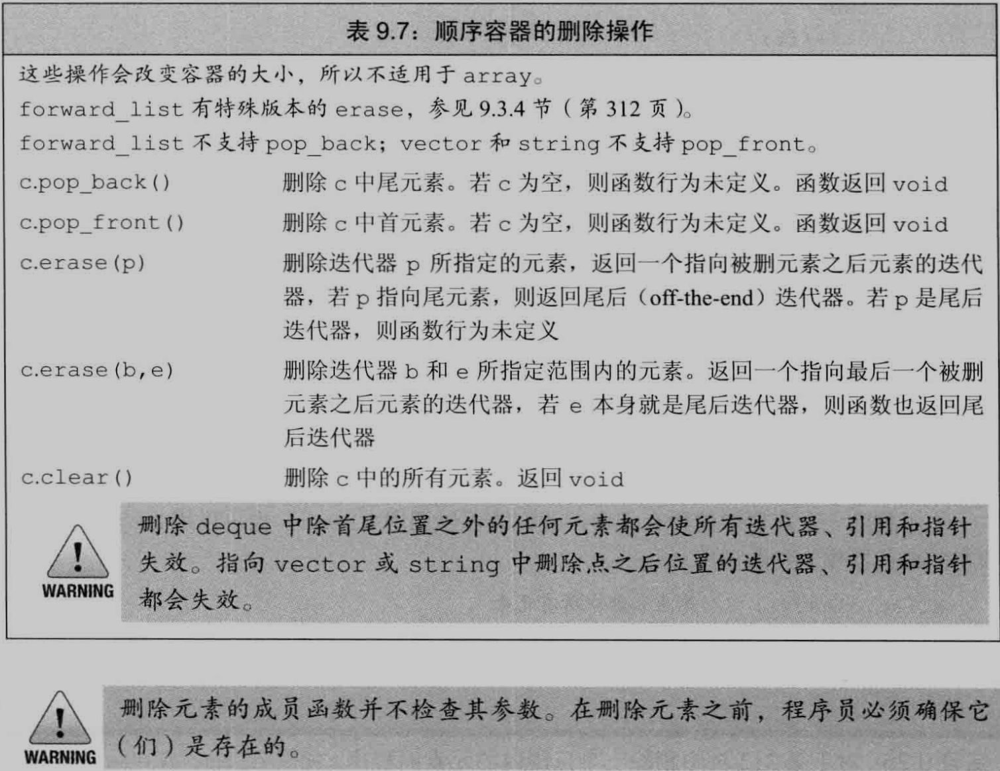

**erase例子**

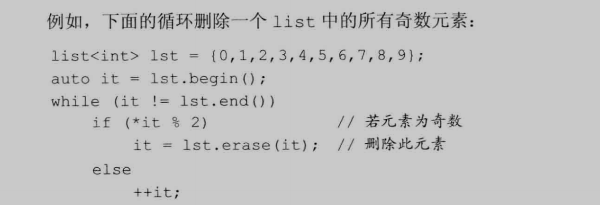

>   因为erase会指向最后一个被删元素之后位置, 所以这里只有不用删才会对it进行自增

### forward_list操作

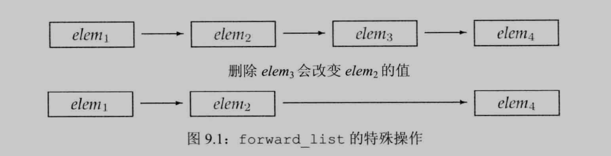

-   在forward_list中添加或删除元素的操作是通过改变给定元素之后的元素来完成的

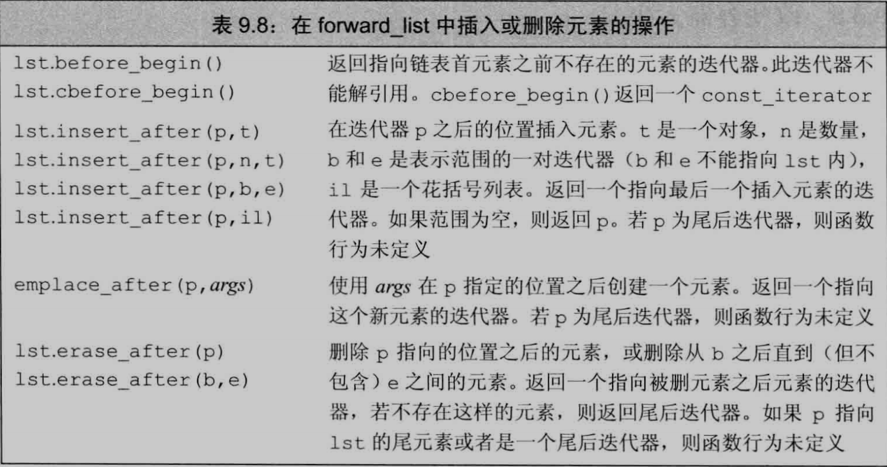

-   **当在forward_list中添加或删除元素, 必须关注两个迭代器, 一个指向我们要处理的元素, 另一个指向其前驱**

    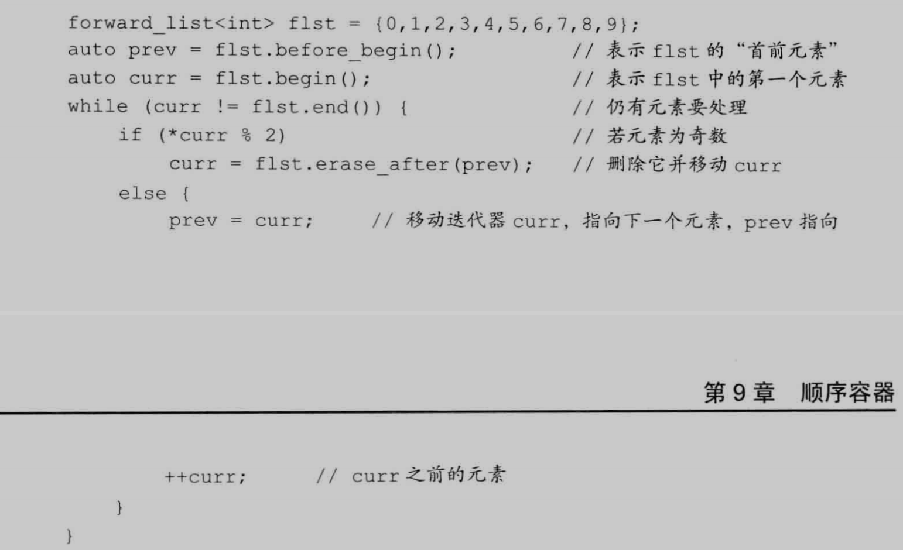

### 改变容器大小

可以用resize增大/缩小容器

-   如果当前大小大于所要求的大小, 容器后面的元素被删除
-   如果当前大小小于新大小, 会将新元素添加到容器后面

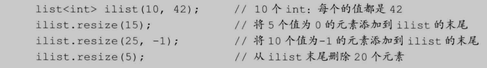

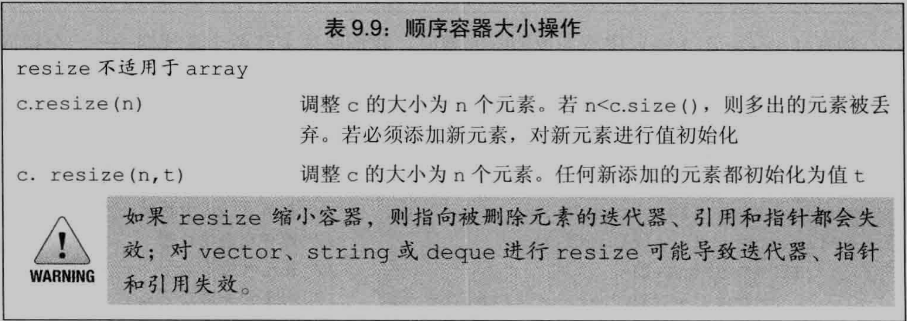

### 容器操作可能使迭代器失效

-   **必须保证每次改变容器的操作之后都正确地重新定位迭代器, 这个建议对vector, string和deque尤为重要**

-   增删vector/string, 或deque首元素之外任何位置的元素, end返回的迭代器会失效, 增删的循环中必须反复调用end

    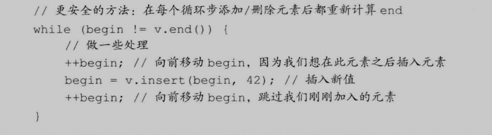

**编写改变容器的循环程序:**

# vector对象是如何增长的

vector和string:

-   因为元素必须连续存储, 容器必须分配新的内存空间来保存已有元素和新元素, 将已有元素从旧位置移动到新空间中, 然后添加新元素, 释放旧存储空间
-   如果每添加一个新元素, vecotr就这样执行一次, 性能特别慢
-   不得不获取新的内存空间, vector和string的实现通常会分配比新的空间需求更大的内存空间, 用来保存更多的新元素

### 容器大小管理操作

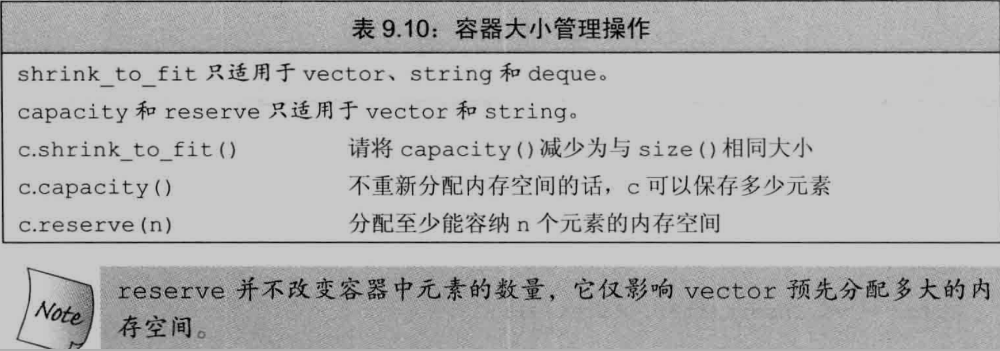

**capacity和size**

-   容器的size是指它已经保存的元素的数目
-   capacity则是在不分配新的内存空间的前提下它最多可以保存多少元素
-   只有在迫不得已时才可以分配新的内存空间, 如: 大小超过预分配空间

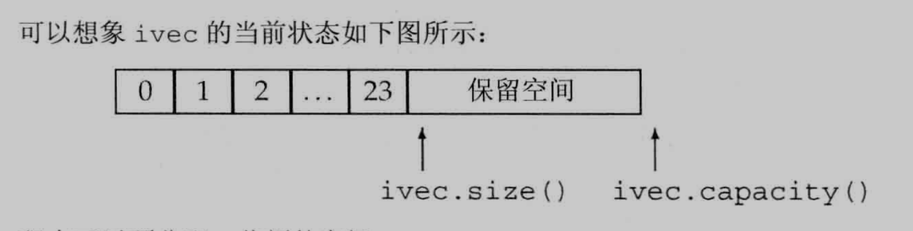

## 额外的string操作

### 构造string的其他方法

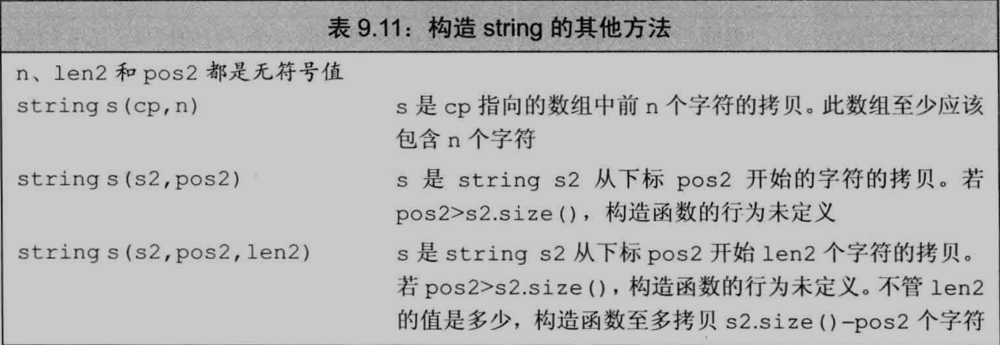

>   ==**这些构造函数接受一个string或一个const char*参数**==

-   用const char*创建string, 指针指向的数组必须以空字符串结尾, 否则必须传递一个计数值

**substr**

-   substr操作返回一个string, 是原始string的一部分或全部的拷贝

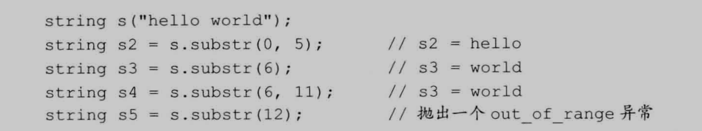

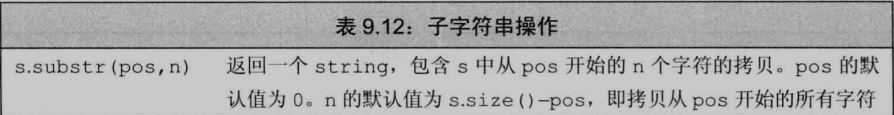

### 改变string的其他方法

新字符来自于另一个string, 来自于一个字符指针  (  指向的字符数组  ), 来自于一个包括花括号包围的字符列表, 或者是一个字符和一个计数值

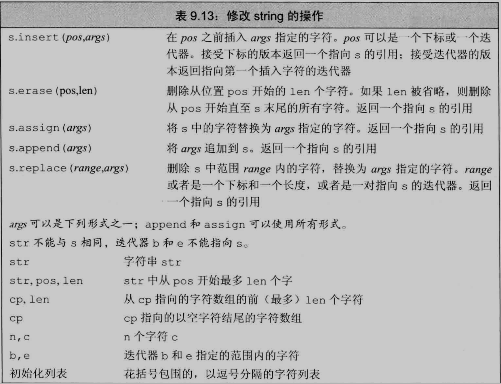

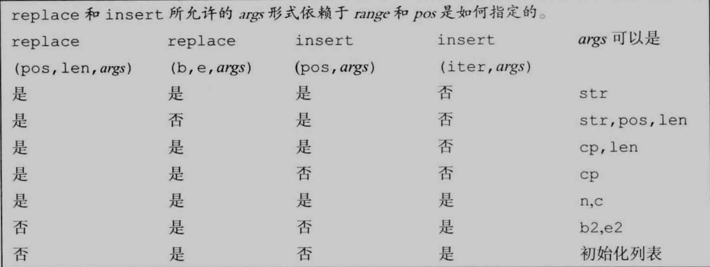

### string搜索操作

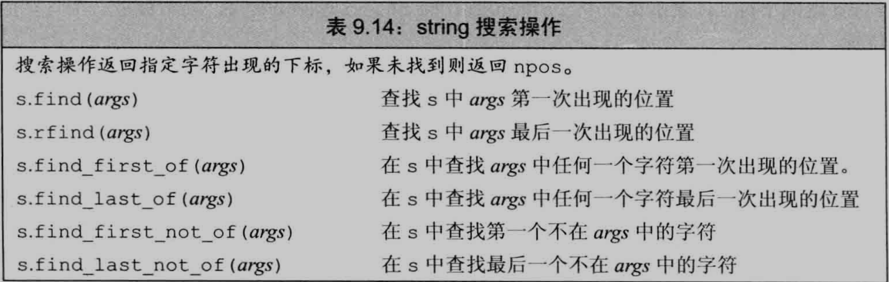

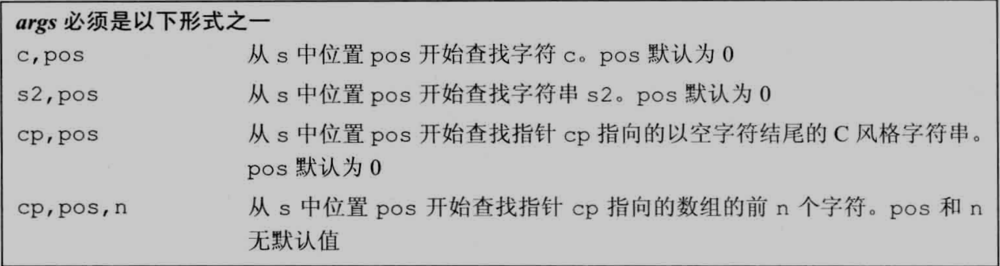

**在字符串中循环查找子字符串出现的位置**

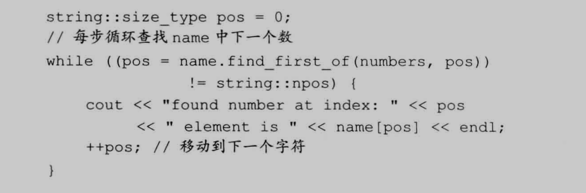

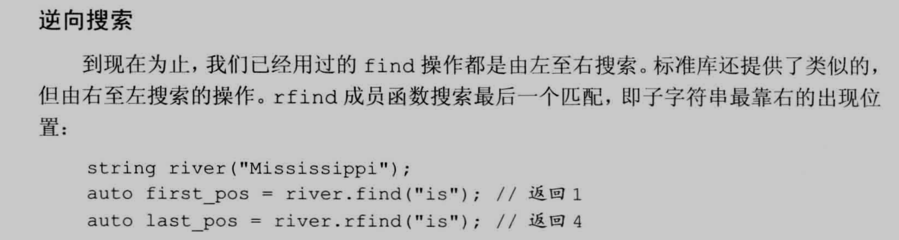

-   ==**每个搜索操作都返回一个string::size_type值, 表示匹配发生位置的下标**==
-   ==**如果搜索失败, 返回一个名为string::npos的static成员**==
-   ==**npos是 const string::size_type类型, 初始值为 -1, 是unsigned类型**==

### compare函数

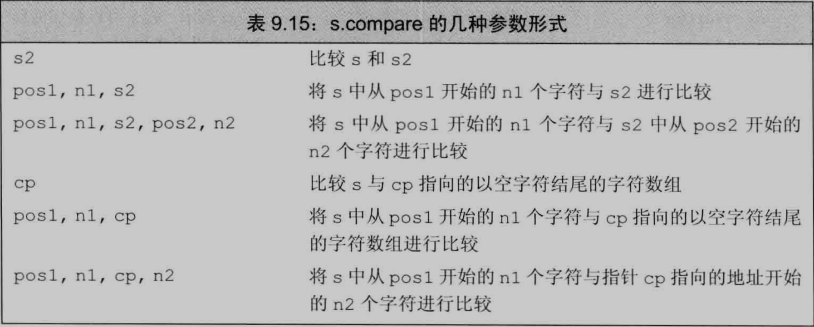

### 数值转换

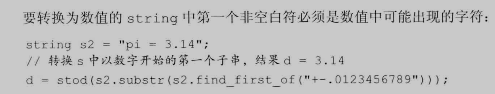

>   在一个含有非数值的string里面找出数值
>
>   找到第一个数值, 然后返回下标给substr, 然后stod转换成浮点值

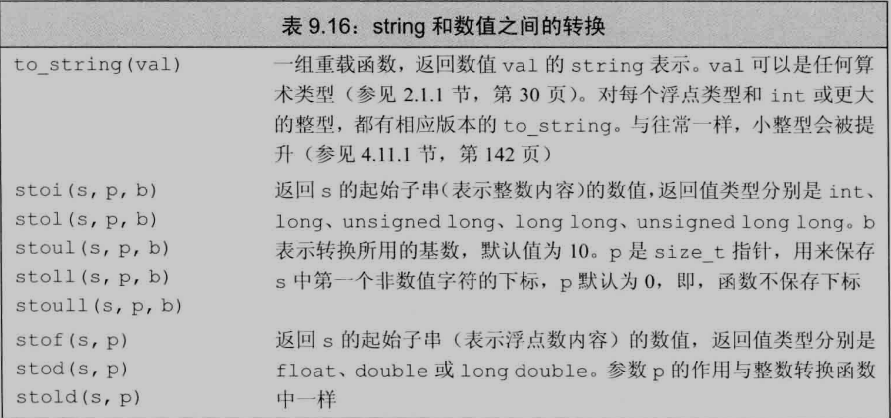

# 容器适配器

**定义在stack头文件中**

-   一个适配是一种机制, 能使某种事物的行为看起来像另外一种事物一样

-   一个适配器接受一种已有的容器类型, 使其行为看起来像一种不同的类型
    -   例如: stack适配器接受一个顺序容器(array和forward_list除外) 并且使其操作起来像一个stack一样
-   除了array和forward_list外, 顺序容器都能用stack适配器

### 定义适配器

-   默认情况下, stack和queue是基于deque实现的
-   priority_queue是在vector实现的

### stack

栈: 先进后出, 栈顶部的元素先出去, 最先进去的元素在最底部

**空stack**: deq是一个deque< int >

**用命名的顺序容器作为第二个类型参数来重载默认容器类型:**

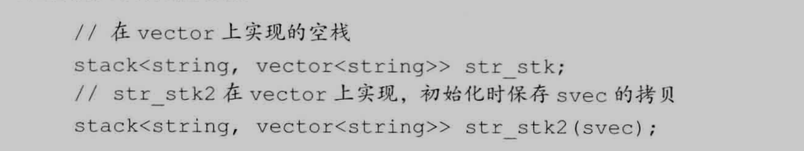

### 使用stack

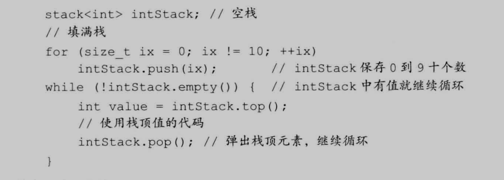

>   只能使用适配器的操作, 不能使用底层容器类型的操作

### 栈操作

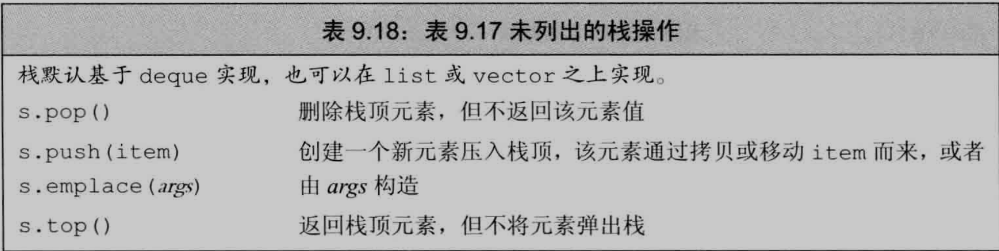

### 队列适配器

queue和priority_queue适配器定义在queue头文件中

-   ==**queue队列: 先进先出**==

-   priority_queue允许我们为队列中的元素建立优先级, 新加入的元素会排在所有优先级比它低的已有元素之前
    -   进入队列的对象被放置在队尾, 离开队列的对象从队首删除

-   默认情况下, 标准库在元素类型上使用<运算符来确定相对优先级

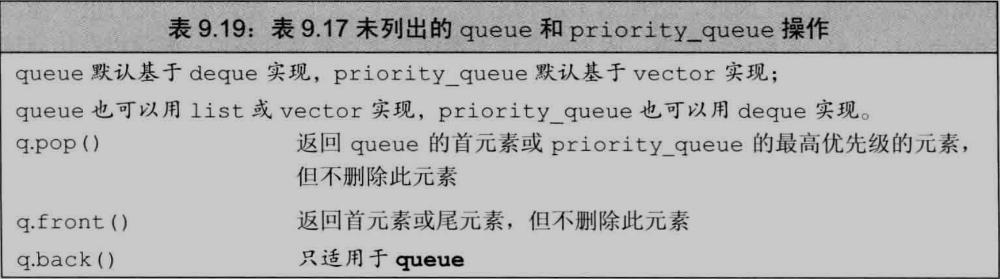

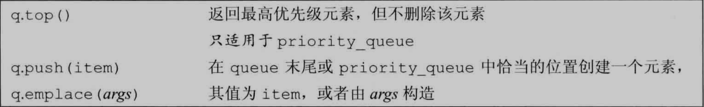

